# 第七章　图形推理之常考规律

## 第一节　图形推理复习与考试建议

**图推考场思维：**图推容易陷入自己世界不自知，时间悄然流逝，再转眼，"别的模块没时间啦！"。

所以，**花生老师建议实战中图推要分两至三次来做**，以10道图推为例，在做判断模块时，先花3～4分钟把3～5道简单题搞定，在判断模块做完时，再回头花个2～3分钟看看剩余图推，再剩余的图推题目交给涂卡时再看，那时候经常会有"灵光乍现"，即使没看出来，也没有遗憾，也不会耽误速度。

**图推练习思维：**平时练习图推，可花十分钟做十道题，如果有没看出来的图形，先别急着看答案，而是把这个题拍个照或印在脑子中，白天没事时想一想，如果突然"灵光乍现"，印象会极其深刻；图推的练习不建议占用大块时间，可以利用好碎片化时间，**花生老师微博和公众号有每日图推练习**，可平时练习使用。

**图推整体思维：**

**题干找共性，选项找差异，整体判方向，细节猜心思。**

## 第二节　定性分析（屈臣氏整风）

**[一、考点介绍]**

**①屈------曲直性**

**"屈"指的是曲直性，题干中出现曲线图形时可考虑**

**【细化考点一】曲直性之有无曲线**

**示例：**

**【细化考点二】曲直性之全曲、全直、曲直**

**示例：**

**[【细化考点三】曲线数量（详见定量分析）]**

**[【细化考点四】曲线（圆）与直线关系：相切相交相离（详见圆提示）]**

**【例题】**

**例题1（2023重庆事业单位）**

[把下面6个图形分为两类，使每一类图形都有各自的共同特征或规律分类正确的一项是：]

A[．]①②④，③⑤⑥ B[．]①⑤⑥，②③④

C[．]①②③，④⑤⑥ D[．]①④⑥，②③⑤

**例题2（2021江苏）**

[从所给的四个选项中，选择最合适的一个填入问号处，使之呈现一定的规律性：]

**②[臣------对称性]**

**["臣"指的是对称性，题干中出现明显对称图形时可考虑]**

[常考：轴对称图形、中心对称图形、既是轴对称又是中心对称图形]

[常见轴对称图形：、、、]

[常见中心对称图形：Z、S、N、]

[常见既是轴对称又是中心对称的图形：H、I、O]

【细化考点一】对称性质：中心对称、轴对称、既是中心对称又是轴对称图形

**示例：**

【细化考点二】对称轴方向（详见四大类之对称类）；

【细化考点三】对称轴数量（详见四大类之对称类）；

【细化考点四】对称轴过点过线过面（详见四大类之对称类）；

【细化考点五】多条对称轴位置关系（详见四大类之对称类）；

【细化考点六】图形整体对称（详见四大类之对称类）；

【例题】

例题3（2020深圳）

[从所给的四个选项中，选择最合适的一个填入问号处，使之呈现一定的规律性：]

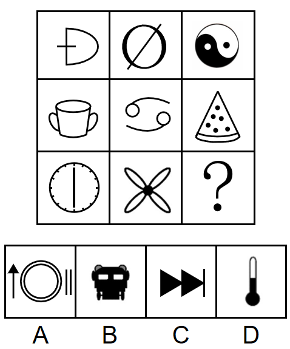

例题4（2019天津选调）

[从所给的四个选项中，选择最合适的一个填入问号处，使之呈现一定的规律性：]

例题5（2023江苏）

[从所给的四个选项中，选择最合适的一个填入问号处，使之呈现一定的规律性：]

**[③氏------相同相似]**

【细化考点一】各图形间均存在同一元素

示例：

【细化考点二】各图形内部存在相同元素或内外元素相似（详见分割图类）

示例：

**【细化考点三】相邻图形有相同相似元素（元素前后传递）**

示例：

【例题】

例题6（2023福建事业单位）

[从所给的四个选项中，选择最合适的一个填入问号处，使之呈现一定的规律性：]

例题7（2024浙江事业单位）

[从所给的四个选项中，选择最合适的一个填入问号处，使之呈现一定的规律性：]

**例题8（2019国考）**

[把下面的六个图形分为两类，使每一类图形都有各自的共同特征或规律，分类正确的一项是：]

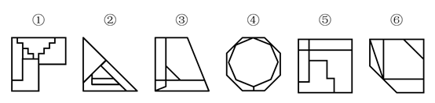

A[．]①③④，②⑤⑥ B[．]①②⑥，③④⑤

C[．]①③⑤，②④⑥ D[．]①④⑥，②③⑤

例题9（2017上海）

[从所给的四个选项中，选择最合适的一个填入问号处，使之呈现一定的规律性：]

例题10（2023广东）

[从所给的四个选项中，选择最合适的一个填入问号处，使之呈现一定的规律性：]

**[④整------整体部分]**

**"整"指的是整体和部分，图形凌乱且相离，可考虑整体部分**

**【细化考点一】整体图形与多部分图形**

示例：

**【细化考点二】各个图形的部分数**

示例：

【例题】

例题11（2015河南）

[从所给的四个选项中，选择最合适的一个填入问号处，使之呈现一定的规律性：]

例题12（2022江苏）

[从所给的四个选项中，选择最合适的一个填入问号处，使之呈现一定的规律性：]

**[⑤风------封闭开放]**

**"风"指的是封闭开放性，出现简笔画或图形凌乱，可观察封闭空间**

**【细化考点一】是否存在封闭空间**

示例：

**【细化考点二】全封闭、半封闭、全开放性质判断**

示例：

**【细化考点三】封闭空间数量**

示例：

**【例题】**

**例题13（2020深圳）**

[把下面的六个图形分为两类，使每一类图形都有各自的共同特征或规律，分类正确的一项是：]

A[．]①②⑥，③④⑤ B．①③④，②⑤⑥

C．①③⑤，②④⑥ D．①②④，③⑤⑥

**例题14（2024山东）**

[把下面的六个图形分为两类，使每一类图形都有各自的共同特征或规律，分类正确的一项是：]

A．①②③，④⑤⑥ B．①②④，③⑤⑥

C．①②⑥，③④⑤ D．①③④，②⑤⑥

**[⑥奇偶性]**

**"奇偶"指的是图形可数出某种元素的数量，并存在奇数、偶数分类的规律**

**【例题】**

**例题15（2024黑龙江）**

[从所给的四个选项中，选择最合适的一个填入问号处，使之呈现一定的规律性：]

**例题16（2023广州事业单位）**

[把下面的六个图形分为两类，使每一类图形都有各自的共同特征或规律，分类正确的一项是：]

A．①③⑤，②④⑥ B．①④⑥，②③⑤

C．①②④，③⑤⑥ D．①②⑥，③④⑤

**[二、定性分析考点总结]**

+:-----------------------:+:------------------------------------:+:------------------------------------------------------------------------------------------------------------------------------------------------------------------------------:+
| **定性分析（屈臣氏整风）**                                                                                                                                                                                                                      |
+-------------------------+--------------------------------------+--------------------------------------------------------------------------------------------------------------------------------------------------------------------------------+
| **知识点**              | **细化**                             | **示例**                                                                                                                                                                       |
+-------------------------+--------------------------------------+--------------------------------------------------------------------------------------------------------------------------------------------------------------------------------+
| **屈**                  | 有无曲线                             |                                                                                                |
|                         |                                      |                                                                                                                                                                                |
| **---**                 |                                      |                                                                                                                                                                                |
|                         |                                      |                                                                                                                                                                                |
| **曲直性**              |                                      |                                                                                                                                                                                |
|                         +--------------------------------------+--------------------------------------------------------------------------------------------------------------------------------------------------------------------------------+
|                         | 全曲、全直、曲直                     |                                                                                      |
|                         +--------------------------------------+--------------------------------------------------------------------------------------------------------------------------------------------------------------------------------+
|                         | 曲线数量                             |                                                                                                    |
|                         +--------------------------------------+--------------------------------------------------------------------------------------------------------------------------------------------------------------------------------+
|                         | 曲线（圆）与直线关系：               |                                                                                     |
|                         |                                      |                                                                                                                                                                                |
|                         | 相切相交相离                         |                                                                                                                                                                                |
+-------------------------+--------------------------------------+--------------------------------------------------------------------------------------------------------------------------------------------------------------------------------+
| **臣**                  | 对称性质                             | {width="0.6319444444444444in"                        |
|                         |                                      | height="0.6180555555555556in"}                                                                   |
| **---**                 |                                      |                                                                                                                                                                                |
|                         |                                      |                                                                                                                                                                                |
| **对称性**              |                                      |                                                                                                                                                                                |
|                         +--------------------------------------+--------------------------------------------------------------------------------------------------------------------------------------------------------------------------------+
|                         | 对称轴方向                           | {width="0.6736111111111112in"                        |
|                         |                                      | height="0.6458333333333334in"}                                                      |
|                         +--------------------------------------+--------------------------------------------------------------------------------------------------------------------------------------------------------------------------------+
|                         | 对称轴数量                           | {width="0.6576388888888889in"                        |
|                         |                                      | height="0.6729166666666667in"}                                                                  |
|                         +--------------------------------------+--------------------------------------------------------------------------------------------------------------------------------------------------------------------------------+
|                         | 对称轴过点过线过面                   |                                            |
|                         +--------------------------------------+--------------------------------------------------------------------------------------------------------------------------------------------------------------------------------+
|                         | 多条对称轴位置关系                   | {width="0.4895833333333333in"                       |
|                         |                                      | height="0.4895833333333333in"}                                                      |
|                         +--------------------------------------+--------------------------------------------------------------------------------------------------------------------------------------------------------------------------------+
|                         | 图形整体对称                         |                                                    |
+-------------------------+--------------------------------------+--------------------------------------------------------------------------------------------------------------------------------------------------------------------------------+
| **氏**                  | 各图形间                             |                                                             |
|                         |                                      |                                                                                                                                                                                |
| **---**                 | 均存在同一元素                       |                                                                                                                                                                                |
|                         |                                      |                                                                                                                                                                                |
| **相同**                |                                      |                                                                                                                                                                                |
|                         |                                      |                                                                                                                                                                                |
| **相似**                |                                      |                                                                                                                                                                                |
|                         +--------------------------------------+--------------------------------------------------------------------------------------------------------------------------------------------------------------------------------+
|                         | 各图形内部存在相同元素或内外元素相似 | {width="2.5590277777777777in" |
|                         |                                      | height="0.4798611111111111in"}                                                                                                                                                 |
|                         +--------------------------------------+--------------------------------------------------------------------------------------------------------------------------------------------------------------------------------+
|                         | 相邻图形有相同相似元素               |                                                                      |
+-------------------------+--------------------------------------+--------------------------------------------------------------------------------------------------------------------------------------------------------------------------------+
| **整**                  | 整体图形与                           |                                                                                     |
|                         |                                      |                                                                                                                                                                                |
| **---**                 | 多部分图形                           |                                                                                                                                                                                |
|                         |                                      |                                                                                                                                                                                |
| **整体**                |                                      |                                                                                                                                                                                |
|                         |                                      |                                                                                                                                                                                |
| **部分**                |                                      |                                                                                                                                                                                |
|                         +--------------------------------------+--------------------------------------------------------------------------------------------------------------------------------------------------------------------------------+
|                         | 各个图形的部分数                     |                                                      |
+-------------------------+--------------------------------------+--------------------------------------------------------------------------------------------------------------------------------------------------------------------------------+
| **风**                  | 是否存在封闭空间                     |                                                                                     |
|                         |                                      |                                                                                                                                                                                |
| **---**                 |                                      |                                                                                                                                                                                |
|                         |                                      |                                                                                                                                                                                |
| **封闭**                |                                      |                                                                                                                                                                                |
|                         |                                      |                                                                                                                                                                                |
| **开放**                |                                      |                                                                                                                                                                                |
|                         +--------------------------------------+--------------------------------------------------------------------------------------------------------------------------------------------------------------------------------+
|                         | 全封闭、半封闭、                     |                                                                                     |
|                         |                                      |                                                                                                                                                                                |
|                         | 全开放性质判断                       |                                                                                                                                                                                |
|                         +--------------------------------------+--------------------------------------------------------------------------------------------------------------------------------------------------------------------------------+
|                         | 封闭空间数量                         |                                            |
+-------------------------+--------------------------------------+--------------------------------------------------------------------------------------------------------------------------------------------------------------------------------+

## 第三节　定量分析（点线面角素）

**[一、基础考点]**

**①点**

**"点"指的是交点，包括曲直、十字、圈内、圈外交点等；**

**图形线多、交叉多、存在与圆或弧之间的交点（需注意相切相交），考虑点数量；**

**近两年也有针对"图形拐点类"进行考察。**

【细化考点一】曲直交点

示例：

> {width="3.5430555555555556in"
> height="0.7013888888888888in"}
>
> {width="3.5430555555555556in"
> height="0.7618055555555555in"}

【细化考点二】十字交点

示例：

【细化考点三】切点

示例：

> {width="4.330555555555556in"
> height="0.8333333333333334in"}

【细化考点四】内部交点

示例：

> {width="2.3625in"
> height="2.2840277777777778in"}

【细化考点五】外框交点

示例：

> {width="3.895138888888889in"
> height="0.9229166666666667in"}

【细化考点六】拐点处特征

示例：

> {width="2.3625in"
> height="1.6784722222222221in"}

【例题】

例题17（2021甘肃）

[把下面的六个图形分为两类，使每一类图形都有各自的共同特征或规律，分类正确的一项是：]

> {width="2.3625in"
> height="0.9659722222222222in"}{width="2.3625in"
> height="1.0631944444444446in"}

A．①③④，②⑤⑥ B．①③⑤，②④⑥

C．①②⑥，③④⑤ D．①④⑥，②③⑤

例题18（2023宁夏）

[从所给的四个选项中，选择最合适的一个填入问号处，使之呈现一定的规律性：]

> {width="3.9368055555555554in"
> height="1.8458333333333334in"}

例题19（2023内蒙古事业单位）

[从所给的四个选项中，选择最合适的一个填入问号处，使之呈现一定的规律性：]

例题20（2018北京）

[从所给的四个选项中，选择最合适的一个填入问号处，使之呈现一定的规律性：]

**例题21（2023浙江）**

[从所给的四个选项中，选择最合适的一个填入问号处，使之呈现一定的规律性：]

**②线**

"线"指的是某种线的数量，包括直线、曲线、笔画数、连接处线段、对称轴等，存在规整多边形或圆弧等曲线时可考虑

【细化考点一】直线数

**[示例：]**

【细化考点二】曲线数

**[示例：]**

[　][　]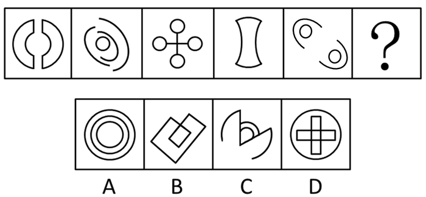[　]

**[【细化考点三】横竖线数量]**

**[示例：]**

[]
[]

【细化考点四】笔画数（详见六提示之一笔画）

**[示例：]**

【细化考点五】内外数量和差（详见六提示之数量加减）

**[示例：]**

【细化考点六】点发射射线数

**[示例：]**

**[【例题】]**

**例题22（2023广东事业单位）**

[从所给的四个选项中，选择最合适的一个填入问号处，使之呈现一定的规律性：]

例题23（2022湖北选调）

[从所给的四个选项中，选择最合适的一个填入问号处，使之呈现一定的规律性：]

**[例题24（2022四川事业单位）]**

[从所给的四个选项中，选择最合适的一个填入问号处，使之呈现一定的规律性：]

例题25（2019江苏）

[从所给的四个选项中，选择最合适的一个填入问号处，使之呈现一定的规律性：]

例题26（2023深圳）

[从所给的四个选项中，选择最合适的一个填入问号处，使之呈现一定的规律性：]

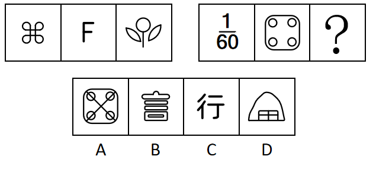

例题27（2022广东）

[从所给的四个选项中，选择最合适的一个填入问号处，使之呈现一定的规律性：]

例题28（2022四川）

[从所给的四个选项中，选择最合适的一个填入问号处，使之呈现一定的规律性：]

例题29（2025天津）

把下面的六个图形分成两类，使每一类图形都有各自的共同特征或规律，分类正确的一项是：

A．①②③，④⑤⑥ B．①⑤⑥，②③④

C．①③⑤，②④⑥ D．①④⑤，②③⑥

**③面**

"面"指的是封闭空间数（注意特殊形状，比如三角形）、面积，存在很多封闭空间时可考虑

**【细化考点一】封闭空间数**

示例：

**【细化考点二】相同面数量**

示例：

**【细化考点三】面的面积**

示例：

**[【例题】]**

例题30（2024四川事业单位）

[从所给的四个选项中，选择最合适的一个填入问号处，使之呈现一定的规律性：]

例题31（2024山东）

[从所给的四个选项中，选择最合适的一个填入问号处，使之呈现一定的规律性：]

例题32（2024国考）

[从所给的四个选项中，选择最合适的一个填入问号处，使之呈现一定的规律性：]

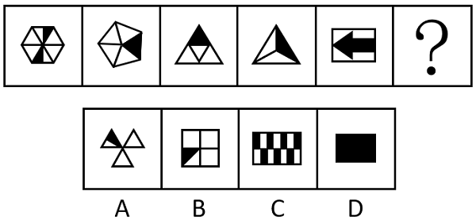

例题33（2020新疆）

[把下面的六个图形分为两类，使每一类图形都有各自的共同特征或规律，分类正确的一项是：]

A．①④⑤，②③⑥ B．①⑤⑥，②③④

C．①③⑤，②④⑥ D．①④⑥，②③⑤

**④角**

**"角"可能考察角的数量，比如：直角或者锐角的数量。**

【细化考点一】直角（详见六提示之直角提示）

示例：

【细化考点二】锐角、钝角

示例：

【例题】

例题34（2017河南）

[从所给的四个选项中，选择最合适的一个填入问号处，使之呈现一定的规律性：]

例题35（2020山东）

[从所给的四个选项中，选择最合适的一个填入问号处，使之呈现一定的规律性：]

例题36（2017事业单位联考）

[把下面的六个图形分为两类，使每一类图形都有各自的共同特征或规律，分类正确的一项是：]

A．①②③，④⑤⑥ B．①⑤⑥，②③④

C．①④⑥，②③⑤ D．①③⑥，②④⑤

**例题37（2018广州）**

[从所给的四个选项中，选择最合适的一个填入问号处，使之呈现一定的规律性：]

**⑤素**

**"素"多考察元素种类和数量、也可能考察元素换算和遍历**

【细化考点一】元素种类

示例：

【细化考点二】元素个数

示例：

**【细化考点三】元素换算**

示例：

**【细化考点四】元素遍历，每种元素均出现相同次数或各位置均出现相同次数**

示例：

【**例题**】

例题38（2020上海事业单位）

[从所给的四个选项中，选择最合适的一个填入问号处，使之呈现一定的规律性：]

例题39（2021河南事业单位）

[从所给的四个选项中，选择最合适的一个填入问号处，使之呈现一定的规律性：]

例题40（2023江西）

[把下面的六个图形分为两类，使每一类图形都有各自的共同特征或规律，分类正确的一项是：]

A．①②④，③⑤⑥ B．①③⑥，②④⑤

C．①④⑤，②③⑥ D．①⑤⑥，②③④

例题41（2022江苏事业单位）

[从所给的四个选项中，选择最合适的一个填入问号处，使之呈现一定的规律性：]

例题42（2022辽宁事业单位）

[从所给的四个选项中，选择最合适的一个填入问号处，使之呈现一定的规律性：]

**例题43（2021新疆）**

[从所给的四个选项中，选择最合适的一个填入问号处，使之呈现一定的规律性：]

**[二、定量分析考点总结]**

+:-----------------------:+:-----------------------:+:------------------------------------------------------------------------------------------------------------------------------------------:+
| **定量分析（点线面角素）**                                                                                                                                                                     |
+-------------------------+-------------------------+--------------------------------------------------------------------------------------------------------------------------------------------+
| **知识点**              | **细化**                | **示例**                                                                                                                                   |
+-------------------------+-------------------------+--------------------------------------------------------------------------------------------------------------------------------------------+
| **点**                  | 曲直交点                |                             |
|                         +-------------------------+--------------------------------------------------------------------------------------------------------------------------------------------+
|                         | 十字交点                |                |
|                         +-------------------------+--------------------------------------------------------------------------------------------------------------------------------------------+
|                         | 切点                    |                |
|                         +-------------------------+--------------------------------------------------------------------------------------------------------------------------------------------+
|                         | 内部交点                |                |
|                         +-------------------------+--------------------------------------------------------------------------------------------------------------------------------------------+
|                         | 外框交点                |                 |
|                         +-------------------------+--------------------------------------------------------------------------------------------------------------------------------------------+
|                         | 拐点处特征              |                                          |
+-------------------------+-------------------------+--------------------------------------------------------------------------------------------------------------------------------------------+
| **线**                  | 直线数                  |                                                |
|                         +-------------------------+--------------------------------------------------------------------------------------------------------------------------------------------+
|                         | 曲线数                  | {width="0.5340277777777778in"                                                                        |
|                         |                         | height="0.53125in"}{width="0.5263888888888889in"                                                     |
|                         |                         | height="0.5236111111111111in"}             |
|                         +-------------------------+--------------------------------------------------------------------------------------------------------------------------------------------+
|                         | 横竖线数量              | {width="0.5319444444444444in"                                                                |
|                         |                         | height="0.4423611111111111in"}{width="0.48819444444444443in"                                                |
|                         |                         | height="0.44375in"}                    |
|                         +-------------------------+--------------------------------------------------------------------------------------------------------------------------------------------+
|                         | 笔画数                  | {width="0.4513888888888889in"                                                               |
|                         |                         | height="0.46041666666666664in"}{width="0.45069444444444445in"                                       |
|                         |                         | height="0.4326388888888889in"}{width="0.41805555555555557in"                                |
|                         |                         | height="0.3909722222222222in"}{width="0.40555555555555556in"                                |
|                         |                         | height="0.4361111111111111in"}{width="0.35in" |
|                         |                         | height="0.40347222222222223in"}                          |
|                         +-------------------------+--------------------------------------------------------------------------------------------------------------------------------------------+
|                         | 内外数量和差            |                                                 |
|                         +-------------------------+--------------------------------------------------------------------------------------------------------------------------------------------+
|                         | 点发射射线数            |                                            |
+-------------------------+-------------------------+--------------------------------------------------------------------------------------------------------------------------------------------+
| **面**                  | 封闭空间数              |                                                 |
|                         +-------------------------+--------------------------------------------------------------------------------------------------------------------------------------------+
|                         | 相同面数量              |                 |
|                         +-------------------------+--------------------------------------------------------------------------------------------------------------------------------------------+
|                         | 面的面积                |                                                 |
+-------------------------+-------------------------+--------------------------------------------------------------------------------------------------------------------------------------------+
| **角**                  | 直角                    | {width="0.5270833333333333in"                                                                              |
|                         |                         | height="0.48125in"}{width="0.5756944444444444in"                                                           |
|                         |                         | height="0.48125in"}                                       |
|                         +-------------------------+--------------------------------------------------------------------------------------------------------------------------------------------+
|                         | 锐角、钝角              |                                                 |
+-------------------------+-------------------------+--------------------------------------------------------------------------------------------------------------------------------------------+
| **素**                  | 元素种类                |                                                            |
|                         +-------------------------+--------------------------------------------------------------------------------------------------------------------------------------------+
|                         | 元素个数                |                                                           |
|                         +-------------------------+--------------------------------------------------------------------------------------------------------------------------------------------+
|                         | 元素换算                |                                        |
|                         +-------------------------+--------------------------------------------------------------------------------------------------------------------------------------------+
|                         | 元素遍历                |                                         |
+-------------------------+-------------------------+--------------------------------------------------------------------------------------------------------------------------------------------+

## 第四节　位置分析（直接想位移）

此类考法较易识别，图形样式多相同或相似，但位置出现变化，可能是对位置关系的考察。

**[一、基本考点]**

**①直------垂直平行**

**"直"指的是垂直平行关系，出现相似三角形、四边形时也需要考虑平行线组数**

**【细化考点一】垂直平行关系**

**示例：**

**【细化考点二】平行线组数（详见六提示之平行线组数）**

**示例：**

【例题】

**[例题44（2019湖北事业单位）]**

[从所给的四个选项中，选择最合适的一个填入问号处，使之呈现一定的规律性：]

例题45（2024浙江）

[把下面的六个图形分为两类，使每一类图形都有各自的共同特征或规律，分类正确的一项是：]

A．①④⑤，②③⑥ B．①②⑥，③④⑤

C．①⑤⑥，②③④ D．①③④，②⑤⑥

**②接------连接方式**

**"接"指的是连接方式（点连接、线连接），也需要考虑连接处的线段数，题干中存在简笔画时可考虑**

【细化考点一】点连接、线连接（详见六提示之连接）

示例：

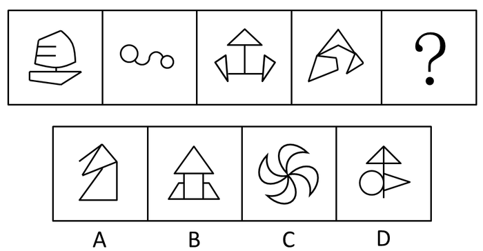

【细化考点二】连接处特征

【细化考点三】连接处线段数

示例：

【例题】

例题46（2021内蒙古）

[把下面的六个图形分为两类，使每一类图形都有各自的共同特征或规律，分类正确的一项是：]

A．①③⑥，②④⑤ B．①②⑤，③④⑥

C．①⑤⑥，②③④ D．①③⑤，②④⑥

例题47（2018国考）

[把下面的六个图形分为两类，使每一类图形都有各自的共同特征或规律，分类正确的一项是：]

A．①②⑥，③④⑤ B．①③④，②⑤⑥

C．①④⑤，②③⑥ D．①④⑥，②③⑤

例题48（2020国考）

[把下面的六个图形分为两类，使每一类图形都有各自的共同特征或规律，分类正确的一项是：]

A．①④⑥，②③⑤ B．①③⑤，②④⑥

C．①②⑥，③④⑤ D．①③④，②⑤⑥

例题49（2017重庆选调）

[从所给的四个选项中，选择最合适的一个填入问号处，使之呈现一定的规律性：]

**③想------方向**

"想"指的是方向，可考虑对称轴方向、首尾线段方向等

【细化考点一】对称轴方向

**示例：**

【细化考点二】折线的首尾线段方向（平行垂直、同向反向）

**示例：**

【细化考点三】某条特征线或某种连线的方向

**示例：**

【例题】

例题50（2024事业单位联考）

[从所给的四个选项中，选择最合适的一个填入问号处，使之呈现一定的规律性：]

例题51（2023江苏）

[从所给的四个选项中，选择最合适的一个填入问号处，使之呈现一定的规律性：]

例题52（2019河北）

[把下面的六个图形分为两类，使每一类图形都有各自的共同特征或规律，分类正确的一项是：]

A．①②④，③⑤⑥ B．①④⑤，②③⑥

C．①③④，②⑤⑥ D．①②⑥，③④⑤

例题53（2023福建事业单位）

[把下面的六个图形分为两类，使每一类图形都有各自的共同特征或规律，分类正确的一项是：]

A．①④⑤，②③⑥ B．①②③，④⑤⑥

C．①②⑥，③④⑤ D．①③⑥，②④⑤

**④位------位置关系**

"位"指的是位置，在有指示图形（黑点、小圆等）时可考虑

【细化考点一】指示点

示例：

【细化考点二】相对位置

示例：

【例题】

例题54（2012国考）

[把下面的六个图形分为两类，使每一类图形都有各自的共同特征或规律，分类正确的一项是：]

A．①②⑥，③④⑤ B．①③⑤，②④⑥

C．①②④，③⑤⑥ D．①③④，②⑤⑥

例题55（2024江苏）

[从所给的四个选项中，选择最合适的一个填入问号处，使之呈现一定的规律性：]

例题56（2023深圳）

[从所给的四个选项中，选择最合适的一个填入问号处，使之呈现一定的规律性：]

**[例题57（2024广东事业单位）]**

[从所给的四个选项中，选择最合适的一个填入问号处，使之呈现一定的规律性：]

**⑤移------移动**

"移"指的是移动，平移、循环、内外圈移动、翻转、旋转等

【细化考点一】上下、左右、圆周移动，步数可能不变或递增

示例：

【细化考点二】内外圈双移动

示例：

【细化考点三】旋转、翻转

示例：

【细化考点四】图形重合后，去同存异或去异存同，或者黑白块/点运算，可能会和翻转、旋转结合考察

示例：

【例题】

例题58（2023福建事业单位）

[从所给的四个选项中，选择最合适的一个填入问号处，使之呈现一定的规律性：]

例题59（2024天津事业单位）

[从所给的四个选项中，选择最合适的一个填入问号处，使之呈现一定的规律性：]

例题60（2022广东）

[从所给的四个选项中，选择最合适的一个填入问号处，使之呈现一定的规律性：]

例题61（2022国考）

[从所给的四个选项中，选择最合适的一个填入问号处，使之呈现一定的规律性：]

例题62（2021广东）

[从所给的四个选项中，选择最合适的一个填入问号处，使之呈现一定的规律性：]

**[例题63（2020北京）]**

[从所给的四个选项中，选择最合适的一个填入问号处，使之呈现一定的规律性：]

**[例题64（2024广东）]**

[从所给的四个选项中，选择最合适的一个填入问号处，使之呈现一定的规律性：]

**[例题65（2018江苏）]**

[从所给的四个选项中，选择最合适的一个填入问号处，使之呈现一定的规律性：]

**[二、位置分析考点总结]**

+:-----------------------:+:--------------------------:+:--------------------------------------------------------------------------------------------------------:+
| **位置分析（直接想位移）**                                                                                                                                      |
+-------------------------+----------------------------+----------------------------------------------------------------------------------------------------------+
| **知识点**              | **细化**                   | **示例**                                                                                                 |
+-------------------------+----------------------------+----------------------------------------------------------------------------------------------------------+
| **直**                  | 垂直平行关系               |                             |
|                         |                            |                                                                                                          |
| **---**                 |                            |                                                                                                          |
|                         |                            |                                                                                                          |
| **垂直平行**            |                            |                                                                                                          |
|                         +----------------------------+----------------------------------------------------------------------------------------------------------+
|                         | 平行线组数                 |              |
+-------------------------+----------------------------+----------------------------------------------------------------------------------------------------------+
| **接**                  | 点连接、线连接             |       |
|                         |                            |                                                                                                          |
| **---**                 |                            |                                                                                                          |
|                         |                            |                                                                                                          |
| **连接方式**            |                            |                                                                                                          |
|                         +----------------------------+----------------------------------------------------------------------------------------------------------+
|                         | 连接处特征                 | {width="2.5590277777777777in" |
|                         |                            | height="0.5680555555555555in"}                                                                           |
|                         +----------------------------+----------------------------------------------------------------------------------------------------------+
|                         | 连接处线段数               |              |
+-------------------------+----------------------------+----------------------------------------------------------------------------------------------------------+
| **想**                  | 对称轴方向                 |             |
|                         |                            |                                                                                                          |
| **---**                 |                            |                                                                                                          |
|                         |                            |                                                                                                          |
| **方向**                |                            |                                                                                                          |
|                         +----------------------------+----------------------------------------------------------------------------------------------------------+
|                         | 折线的首尾线段方向         | {width="0.39375in"                                                       |
|                         |                            | height="0.39375in"}{width="0.39375in"                                    |
|                         | （平行垂直、同向反向）     | height="0.39375in"}{width="0.3784722222222222in"                         |
|                         |                            | height="0.39375in"}{width="0.4083333333333333in"                         |
|                         |                            | height="0.39375in"}{width="0.4in"                                        |
|                         |                            | height="0.39375in"}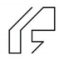    |
|                         +----------------------------+----------------------------------------------------------------------------------------------------------+
|                         | 某条特征线或某种连线的方向 | {width="1.9708333333333334in"        |
|                         |                            | height="0.81875in"}                                                                                      |
+-------------------------+----------------------------+----------------------------------------------------------------------------------------------------------+
| **位**                  | 指示点                     | {width="2.5590277777777777in" |
|                         |                            | height="0.5118055555555555in"}                                                                           |
| **---**                 |                            |                                                                                                          |
|                         |                            |                                                                                                          |
| **位置关系**            |                            |                                                                                                          |
|                         +----------------------------+----------------------------------------------------------------------------------------------------------+
|                         | 相对位置                   |       |
+-------------------------+----------------------------+----------------------------------------------------------------------------------------------------------+
| **移**                  | 上下、左右、圆周移动，     | {width="2.5590277777777777in"             |
|                         |                            | height="0.5166666666666667in"}                                                                           |
| **---**                 | 步数可能不变或递增         |                                                                                                          |
|                         |                            |                                                                                                          |
| **移动**                |                            |                                                                                                          |
|                         +----------------------------+----------------------------------------------------------------------------------------------------------+
|                         | 内外圈双移动               | {width="2.5590277777777777in"             |
|                         |                            | height="0.7055555555555556in"}                                                                           |
|                         +----------------------------+----------------------------------------------------------------------------------------------------------+
|                         | 旋转、翻转                 | {width="2.5590277777777777in"             |
|                         |                            | height="0.575in"}                                                                                        |
|                         +----------------------------+----------------------------------------------------------------------------------------------------------+
|                         | 图形重合后，               | {width="1.6965277777777779in"             |
|                         |                            | height="1.6784722222222221in"}                                                                           |
|                         | 去同存异或去异存同；       |                                                                                                          |
|                         |                            |                                                                                                          |
|                         | 或者黑白块/点运算，        |                                                                                                          |
|                         |                            |                                                                                                          |
|                         | 可能会和翻转、旋转结合考察 |                                                                                                          |
+-------------------------+----------------------------+----------------------------------------------------------------------------------------------------------+

# [第八章　图形推理之常见类型与提示]

## [第一节　四大类之对称图类]

**[一、对称类之性质]**

**[主要考察图形是否为对称图形，包括中心对称和轴对称；]**

**[中心对称提示图形：Z、S、风车、太极、平行四边形等。]**

**[例题1（2022重庆选调）]**

[从所给的四个选项中，选择最合适的一个填入问号处，使之呈现一定的规律性：]

**[例题2（2024四川事业单位）]**

[从所给的四个选项中，选择最合适的一个填入问号处，使之呈现一定的规律性：]

**[二、对称类之数量]**

**[主要考察对称轴数量的变化。]**

-------------------------------------------------------------------- -------------------------------------------------------------------- ------------------------------------------------------------------- --------------------------------------------------------------------

   {width="0.6576388888888889in"   {width="2.3569444444444443in"   {width="1.492361111111111in"                                          height="0.5902777777777778in"}                                      height="0.5902777777777778in"}                                       height="0.5902777777777778in"}

                         **[3条对称轴]**                                               **[4条对称轴]**                                              **[5条对称轴]**                                               **[6条对称轴]**

-------------------------------------------------------------------- -------------------------------------------------------------------- ------------------------------------------------------------------- --------------------------------------------------------------------

**[例题3（2020浙江）]**

[把下面的六个图形分为两类，使每一类图形都有各自的共同特征或规律，分类正确的一项是：]

[A．①②③，④⑤⑥ B．①②⑤，③④⑥]

[C．①②④，③⑤⑥ D．①④⑤，②③⑥]

**[例题4（2019黑龙江）]**

[从所给的四个选项中，选择最合适的一个填入问号处，使之呈现一定的规律性：]

**[三、对称类之方向]**

**[考查方向时图形以轴对称图形为主，一般只有一条对称轴。]**

[例题5（2019江苏）]

[从所给的四个选项中，选择最合适的一个填入问号处，使之呈现一定的规律性：]

**[四、对称类之过点过线过面]**

**[对称轴经过原图形上交点、线段、封闭空间。]**

**[例题6（2023国考）]**

[把下面的六个图形分为两类，使每一类图形都有各自的共同特征或规律，分类正确的一项是：]

[A．①③⑥，②④⑤ B．①③⑤，②④⑥]

[C．①②⑥，③④⑤ D．①⑤⑥，②③④]

**[例题7（2021事业单位联考）]**

[把下面的六个图形分为两类，使每一类图形都有各自的共同特征或规律，分类正确的一项是：]

[A．①⑤⑥，②③④ B．①③④，②⑤⑥]

[C．①②⑥，③④⑤ D．①②④，③⑤⑥]

**[五、对称类之位置关系]**

**[若图形由两个或以上轴对称图形组成，可考虑两条对称轴之间的平行、垂直等关系。]**

**[例题8（2024福建事业单位）]**

[从所给的四个选项中，选择最合适的一个填入问号处，使之呈现一定的规律性：]

**[例题9（2019山东选调）]**

[把下面的六个图形分为两类，使每一类图形都有各自的共同特征或规律，分类正确的一项是：]

[A．①③④，②⑤⑥ B．①③⑤，②④⑥]

[C．①②⑥，③④⑤ D．①④⑥，②③⑤]

**[六、对称类之整体对称]**

**[填入选项后，图形呈整体对称样式。]**

[例题10（2023辽宁）]

[从所给的四个选项中，选择最合适的一个填入问号处，使之呈现一定的规律性：]

## [第二节　四大类之背景图类]

**[一、"三大哥"之移动]**

**[背景图中所有图形轮廓相同且元素数量基本一致且元素数量远小于轮廓格子数量，可以优先考虑背景图中的移动。]**

**[注：内外圈同时移动、六边形斜线移动是近年考察的热点和难点。]**

**[例题11（2021黑龙江紧缺）]**

[从所给的四个选项中，选择最合适的一个填入问号处，使之呈现一定的规律性：]

**[例题12（2024广东事业单位）]**

[从所给的四个选项中，选择最合适的一个填入问号处，使之呈现一定的规律性：]

**[例题13（2023广东事业单位）]**

[从所给的四个选项中，选择最合适的一个填入问号处，使之呈现一定的规律性：]

**[二、三大哥之叠加]**

**[背景图中图形轮廓相同且元素数量不一致（参差不齐），并且已知图形为"3×3"或"3＋3"排列时，可优先考虑叠加。]**

**[例题14（2023事业单位联考）]**

[从所给的四个选项中，选择最合适的一个填入问号处，使之呈现一定的规律性：]

**[三、三大哥之部分数]**

**[图形特征：背景图中黑点呈顶格状，接到外框上，有一种切断的感觉，可考虑部分数。]**

**[例题15（2022国考）]**

[从所给的四个选项中，选择最合适的一个填入问号处，使之呈现一定的规律性：]

**[例题16（2024甘肃）]**

[从所给的四个选项中，选择最合适的一个填入问号处，使之呈现一定的规律性：]

**[四、六小弟之"笔"]**

**[图形特征：黑点或白点连成线条状。]**

**[例题17（2021国考）]**

[把下面的六个图形分为两类，使每一类图形都有各自的共同特征或规律，分类正确的一项是：]

[A．①③④，②⑤⑥ B．①③⑤，②④⑥]

[C．①②⑥，③④⑤ D．①④⑥，②③⑤]

**[例题18（2019上海）]**

[下列选项中，与所给图形规律相同的是：]

**[五、六小弟之"面"]**

**["面"是指面积（也可能考察周长）。]**

**[图形特征：会有清晰的一个图形轮廓。]**

**[例题19（2024四川）]**

[把下面的六个图形分为两类，使每一类图形都有各自的共同特征或规律，分类正确的一项是：]

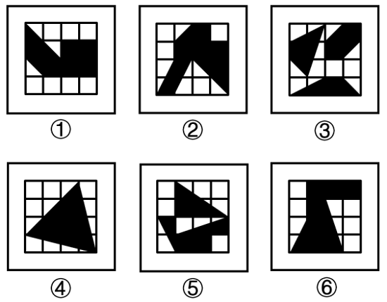

[A．①②⑥，③④⑤ B．①③④，②⑤⑥]

[C．①③⑤，②④⑥ D．①④⑤，②③⑥]

**[例题20（2022四川）]**

[把下面的六个图形分为两类，使每一类图形都有各自的共同特征或规律，分类正确的一项是：]

[A．①②④，③⑤⑥ B．①②⑥，③④⑤]

[C．①③⑥，②④⑤ D．①④⑥，②③⑤]

**[六、六小弟之"连"]**

**["连"是指连接方式。]**

**[题型特征：阴影位置存在点连接或线连接。]**

**[例题21（2021江苏）]**

[从所给的四个选项中，选择最合适的一个填入问号处，使之呈现一定的规律性：]

**[七、六小弟之"报"]**

**["报"是指抱团。]**

**[题型特征：图形比较杂乱分散，小黑块几个几个聚在一起。]**

**[例题22（2017山东）]**

[从所给的四个选项中，选择最合适的一个填入问号处，使之呈现一定的规律性：]

**[八、六小弟之"对"]**

**["对"是指对称。]**

**[图形特征：所有图形黑格或白格分布规则。]**

**[例题23（2021国考）]**

[从所给的四个选项中，选择最合适的一个填入问号处，使之呈现一定的规律性：]

**[例题24（2024江苏）]**

[从所给的四个选项中，选择最合适的一个填入问号处，使之呈现一定的规律性：]

**[九、六小弟之"滴"]**

**["滴"是指递推。]**

**[图形特征：所有图形每行（列）均有阴影且相邻图形相似，图形行列很多，一般在5×5以上。]**

**[例题25（2022浙江事业单位）]**

[从所给的四个选项中，选择最合适的一个填入问号处，使之呈现一定的规律性：]

**[例题26（2019青海法院）]**

[从所给的四个选项中，选择最合适的一个填入问号处，使之呈现一定的规律性：]

**[例题27（2022浙江）]**

[从所给的四个选项中，选择最合适的一个填入问号处，使之呈现一定的规律性：]

**[例题28（2022四川）]**

[从所给的四个选项中，选择最合适的一个填入问号处，使之呈现一定的规律性：]

## [第三节　四大类之分割图类]

**[一、分割图类之连接方式]**

**[图形特征：图形中有一部分被标记，且与其他封闭空间连接。]**

**[例题29（2024国考）]**

[把下面的六个图形分为两类，使每一类图形都有各自的共同特征或规律，分类正确的一项是：]

[A．①②⑥，③④⑤ B．①③④，②⑤⑥]

[C．①③⑥，②④⑤ D．①③⑤，②④⑥]

**[例题30（2023国考）]**

[从所给的四个选项中，选择最合适的一个填入问号处，使之呈现一定的规律性：]

**[二、分割图类之大小]**

**[图形特征：被分割的各部分有明显的最大或最小图形。]**

**[例题31（2022国考）]**

[从所给的四个选项中，选择最合适的一个填入问号处，使之呈现一定的规律性：]

**[三、分割图类之三不沾]**

**[图形特征：中间图形与外部轮廓无公共点和公共边。]**

**[例题32（2024浙江选调）]**

[把下面的六个图形分为两类，使每一类图形都有各自的共同特征或规律，分类正确的一项是：]

[A．①②③，④⑤⑥ B．①②④，③⑤⑥]

[C．①③⑤，②④⑥ D．①④⑥，②③⑤]

**[例题33（2019甘肃）]**

[把下面的六个图形分为两类，使每一类图形都有各自的共同特征或规律，分类正确的一项是：]

[A．①②③，④⑤⑥ B．①②⑤，③④⑥]

[C．①②④，③⑤⑥ D．①③⑤，②④⑥]

**[四、分割图类之边数]**

**[图形特征：最大面、最小面、外部轮廓为规整的多边形，例如三角形、四边形、五边形等。]**

**[例题34（2022天津）]**

[从所给的四个选项中，选择最合适的一个填入问号处，使之呈现一定的规律性：]

**[例题35（2022浙江事业单位）]**

[从所给的四个选项中，选择最合适的一个填入问号处，使之呈现一定的规律性：]

**[例题36（2019北京）]**

[从所给的四个选项中，选择最合适的一个填入问号处，使之呈现一定的规律性：]

**[五、分割图类之对称]**

**[图形特征：最大面、最小面或其他特殊空间为对称图形。]**

**[例题37（2024甘肃）]**

[把下面的六个图形分为两类，使每一类图形都有各自的共同特征或规律，分类正确的一项是：]

[A．①③④，②⑤⑥ B．①③⑤，②④⑥]

[C．①⑤⑥，②③④ D．①④⑥，②③⑤]

**[例题38（2021事业单位联考）]**

[把下面的六个图形分为两类，使每一类图形都有各自的共同特征或规律，分类正确的一项是：]

[A．①②④，③⑤⑥ B．①③⑥，②④⑤]

[C．①②③，④⑤⑥ D．①④⑤，②③⑥]

**[六、分割图类之相似]**

**[图形特征：内部存在相同相似图形或内部与外部图形相似。]**

**[例题39（2020浙江事业单位）]**

[把下面的六个图形分为两类，使每一类图形都有各自的共同特征或规律，分类正确的一项是：]

[A．①③④，②⑤⑥ B．①③⑤，②④⑥]

[C．①②⑥，③④⑤ D．①④⑥，②③⑤]

**[例题40（2022北京）]**

[从所给的四个选项中，选择最合适的一个填入问号处，使之呈现一定的规律性：]

## [第四节　四大类之汉字类]

**[一、汉字之文字结构]**

**[例题41（2012江西）]**

[从所给的四个选项中，选择最合适的一个填入问号处，使之呈现一定的规律性：]

**[例题42（2020广东）]**

[从所给的四个选项中，选择最合适的一个填入问号处，使之呈现一定的规律性：]

**[二、汉字之笔画数、第一笔]**

**[例题43（2022贵州事业单位）]**

[从所给的四个选项中，选择最合适的一个填入问号处，使之呈现一定的规律性：]

**[例题44（2016青海选调）]**

[从所给的四个选项中，选择最合适的一个填入问号处，使之呈现一定的规律性：]

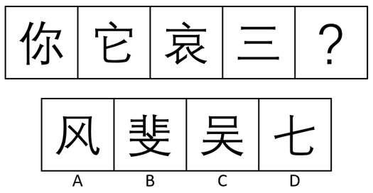

**[例题45（2020重庆选调）]**

[从所给的四个选项中，选择最合适的一个填入问号处，使之呈现一定的规律性：]

**[三、汉字之偏旁部首/部分]**

**[例题46]**

[从所给的四个选项中，选择最合适的一个填入问号处，使之呈现一定的规律性：]

------------- ------------- ------------- -- ------------- ------------- -------------

   [檀]   [香]   [复]      [赢]   [赛]   [？]

------------- ------------- ------------- -- ------------- ------------- -------------

----------------- ----------------- ----------------- -----------------

     [康]       [徽]       [嬴]       [质]
    
     [A]        [B]        [C]        [D]

----------------- ----------------- ----------------- -----------------

**[例题47（2024深圳）]**

[从所给的四个选项中，选择最合适的一个填入问号处，使之呈现一定的规律性：]

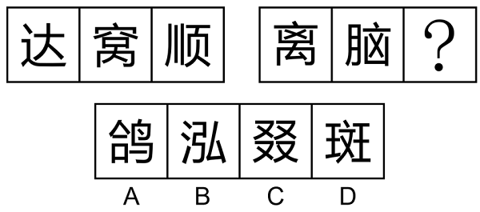

**[四、汉字之拼音]**

**[例题48（2019天津事业单位）]**

[从所给的四个选项中，选择最合适的一个填入问号处，使之呈现一定的规律性：]

------------- ------------- ------------- -- ------------- ------------- -------------

   [巴]   [参]   [？]      [卡]   [蓝]   [芒]

------------- ------------- ------------- -- ------------- ------------- -------------

----------------- ----------------- ----------------- -----------------

     [当]       [刀]       [大]       [分]
    
     [A]        [B]        [C]        [D]

----------------- ----------------- ----------------- -----------------

**[例题49（2019湖北事业单位）]**

[从所给的四个选项中，选择最合适的一个填入问号处，使之呈现一定的规律性：]

**[五、汉字之空间数量、部分数、横竖撇捺数量]**

**[例题50（2023辽宁）]**

[把下面的六个图形分为两类，使每一类图形都有各自的共同特征或规律，分类正确的一项是：]

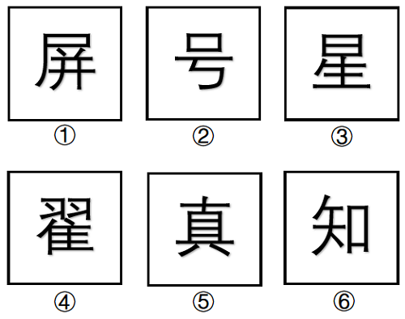

[A．①②⑥，③④⑤ B．①③④，②⑤⑥]

[C．①③⑥，②④⑤ D．①④⑤，②③⑥]

**[例题51（2024深圳事业单位）]**

[从所给的四个选项中，选择最合适的一个填入问号处，使之呈现一定的规律性：]

**[例题52（2024山东）]**

[从所给的四个选项中，选择最合适的一个填入问号处，使之呈现一定的规律性：]

**[六、汉字（或英文）之曲直性]**

**[例题53（2012深圳）]**

[从所给的四个选项中，选择最合适的一个填入问号处，使之呈现一定的规律性：]

**[例题54（2021河北）]**

[从所给的四个选项中，选择最合适的一个填入问号处，使之呈现一定的规律性：]

**[例题55（2020深圳）]**

[从所给的四个选项中，选择最合适的一个填入问号处，使之呈现一定的规律性：]

## [第五节　四大类考点总结]

+:-----------------------:+:-----------------------:+:------------------------------------------------------------------------------------------------------------------------------:+
| **四大类**                                                                                                                                                                         |
+-------------------------+-------------------------+--------------------------------------------------------------------------------------------------------------------------------+
| **知识点**              | **细化**                | **示例**                                                                                                                       |
+-------------------------+-------------------------+--------------------------------------------------------------------------------------------------------------------------------+
| **对称图类**            | 性质                    | Z、S、、{width="0.45694444444444443in"                                                     |
|                         |                         | height="0.45694444444444443in"}、{width="0.3993055555555556in"                             |
|                         |                         | height="0.3993055555555556in"}                                                                                                 |
|                         +-------------------------+--------------------------------------------------------------------------------------------------------------------------------+
|                         | 数量                    |                                               |
|                         +-------------------------+--------------------------------------------------------------------------------------------------------------------------------+
|                         | 方向                    |                                    |
|                         +-------------------------+--------------------------------------------------------------------------------------------------------------------------------+
|                         | 过点过线过面            |            |
|                         +-------------------------+--------------------------------------------------------------------------------------------------------------------------------+
|                         | 位置关系                | {width="3.1645833333333333in"                               |
|                         |                         | height="0.5145833333333333in"}                                                                                                 |
|                         +-------------------------+--------------------------------------------------------------------------------------------------------------------------------+
|                         | 整体对称                |     |
+-------------------------+-------------------------+--------------------------------------------------------------------------------------------------------------------------------+
| **背景图类**            | "三大哥"之移动          |                                     |
|                         +-------------------------+--------------------------------------------------------------------------------------------------------------------------------+
|                         | "三大哥"之叠加          |                                                |
|                         +-------------------------+--------------------------------------------------------------------------------------------------------------------------------+
|                         | "三大哥"之部分数        |                                   |
|                         +-------------------------+--------------------------------------------------------------------------------------------------------------------------------+
|                         | "笔"                    |                                           |
|                         +-------------------------+--------------------------------------------------------------------------------------------------------------------------------+
|                         | "面"                    | {width="1.5902777777777777in"                               |
|                         |                         | height="0.5979166666666667in"}{width="1.5902777777777777in" |
|                         |                         | height="0.6083333333333333in"}                                                                                                 |
|                         +-------------------------+--------------------------------------------------------------------------------------------------------------------------------+
|                         | "连"                    | {width="2.622916666666667in"                                |
|                         |                         | height="0.49722222222222223in"}                                                                                                |
|                         +-------------------------+--------------------------------------------------------------------------------------------------------------------------------+
|                         | "报"                    |                       |
|                         +-------------------------+--------------------------------------------------------------------------------------------------------------------------------+
|                         | "对"                    |                             |
|                         +-------------------------+--------------------------------------------------------------------------------------------------------------------------------+
|                         | "滴"                    |           |
+-------------------------+-------------------------+--------------------------------------------------------------------------------------------------------------------------------+
| **分割图类**            | 连接方式                |                                    |
|                         +-------------------------+--------------------------------------------------------------------------------------------------------------------------------+
|                         | 大小                    |                                     |
|                         +-------------------------+--------------------------------------------------------------------------------------------------------------------------------+
|                         | 三不沾                  |                                    |
|                         +-------------------------+--------------------------------------------------------------------------------------------------------------------------------+
|                         | 边数                    |                             |
|                         +-------------------------+--------------------------------------------------------------------------------------------------------------------------------+
|                         | 对称                    |                               |
|                         +-------------------------+--------------------------------------------------------------------------------------------------------------------------------+
|                         | 相似                    |                                     |
+-------------------------+-------------------------+--------------------------------------------------------------------------------------------------------------------------------+
| **汉字类**              | 文字结构                |                             |
|                         +-------------------------+--------------------------------------------------------------------------------------------------------------------------------+
|                         | 笔画数、第一笔          |    |
|                         |                         +--------------------------------------------------------------------------------------------------------------------------------+
|                         |                         |    |
|                         +-------------------------+--------------------------------------------------------------------------------------------------------------------------------+
|                         | 偏旁部首/部分           |                                          |
|                         +-------------------------+--------------------------------------------------------------------------------------------------------------------------------+
|                         | 拼音                    |                                    |
|                         +-------------------------+--------------------------------------------------------------------------------------------------------------------------------+
|                         | 空间数量、部分数、      | {width="1.2270833333333333in"                                                           |
|                         |                         | height="0.46111111111111114in"}{width="1.2270833333333333in"                            |
|                         | 横竖撇捺数量            | height="0.46597222222222223in"}                                                                                                |
|                         |                         +--------------------------------------------------------------------------------------------------------------------------------+
|                         |                         |    |
|                         |                         +--------------------------------------------------------------------------------------------------------------------------------+
|                         |                         |                      |
+-------------------------+-------------------------+--------------------------------------------------------------------------------------------------------------------------------+
|                         | 曲直性                  |                                               |
+-------------------------+-------------------------+--------------------------------------------------------------------------------------------------------------------------------+

## [第六节　六提示之"平圆一接直角减"]

**[一、六提示之平行组数]**

**[提示点：两个相同或相似三角形、轮廓自带平行线、N字型、Z字型、工字型、H字型]**

**[例题56（2024江苏）]**

[从所给的四个选项中，选择最合适的一个填入问号处，使之呈现一定的规律性：]

**[例题57（2020浙江）]**

[从所给的四个选项中，选择最合适的一个填入问号处，使之呈现一定的规律性：]

**[例题58（2023广东事业单位）]**

[把下面的六个图形分为两类，使每一类图形都有各自的共同特征或规律，分类正确的一项是：]

[A．①②⑤，③④⑥ B．①③④，②⑤⑥]

[C．①④⑥，②③⑤ D．①②④，③⑤⑥]

**[二、六提示之圆提示]**

**[提示点：各个图形均存在"圆（或曲线）"，常见考点为圆内或圆上的交点数量、圆内空间数、直线与圆的相交相切相离、包围和半包围等。]**

**[例题59（2021国考）]**

[从所给的四个选项中，选择最合适的一个填入问号处，使之呈现一定的规律性：]

**[例题60（2018国考）]**

[从所给的四个选项中，选择最合适的一个填入问号处，使之呈现一定的规律性：]

**[例题61（2021山东）]**

[从所给的四个选项中，选择最合适的一个填入问号处，使之呈现一定的规律性：]

**[例题62（2023深圳）]**

[从所给的四个选项中，选择最合适的一个填入问号处，使之呈现一定的规律性：]

**[例题63（2022事业单位联考）]**

[把下面的六个图形分为两类，使每一类图形都有各自的共同特征或规律，分类正确的一项是：]

[A．①③④，②⑤⑥ B．①③⑤，②④⑥]

[C．①②⑥，③④⑤ D．①④⑥，②③⑤]

**[三、六提示之笔画数]**

[**提示点：**为出头、T点、分离、特殊字符（田、日、☆、奥迪车标等），一笔画可用"吹捏"判断，也可数奇点（发射奇数条射线的点、奇点数0或2为一笔画，否则笔画数为奇点数的一半）。]

**[吹捏法原理：]**

[**捏（简化图形）**------将图形中独立的单区域空间去掉，直至没有空间为止，剩下线条几笔画，原图即为几笔画]

[**吹（修正图形）**------在不改变连接关系前提下，图形外轮廓或内部空间可修正形状，线条可修正长短和方向。]

**[例题64（2021新疆）]**

[把下面的六个图形分为两类，使每一类图形都有各自的共同特征或规律，分类正确的一项是：]

[A．①③④，②⑤⑥ B．①③⑤，②④⑥]

[C．①②⑥，③④⑤ D．①④⑥，②③⑤]

**[例题65（2024甘肃事业单位）]**

[从所给的四个选项中，选择最合适的一个填入问号处，使之呈现一定的规律性：]

**[例题66（2024青海）]**

[把下面的六个图形分为两类，使每一类图形都有各自的共同特征或规律，分类正确的一项是：]

[A．①④⑥，②③⑤ B．①②③，④⑤⑥]

[C．①⑤⑥，②③④ D．①②⑥，③④⑤]

**[例题67（2023吉林）]**

[把下面的六个图形分为两类，使每一类图形都有各自的共同特征或规律，分类正确的一项是：]

[A．①③⑤，②④⑥ B．①②③，④⑤⑥]

[C．①④⑤，②③⑥ D．①②⑤，③④⑥]

**[四、六提示之连接方式]**

**[提示点：简笔画图形，例如树叶、蜡烛等。]**

**[例题68（2022浙江）]**

[把下面的六个图形分为两类，使每一类图形都有各自的共同特征或规律，分类正确的一项是：]

[A．①②③，④⑤⑥ B．①③⑤，②④⑥]

[C．①②⑤，③④⑥ D．①④⑤，②③⑥]

**[例题69（2023事业单位联考）]**

[把下面的六个图形分为两类，使每一类图形都有各自的共同特征或规律，分类正确的一项是：]

[A．①②⑥，③④⑤ B．①③④，②⑤⑥]

[C．①③⑥，②④⑤ D．①④⑥，②③⑤]

**[五、六提示之直角数]**

**[提示点：垂线、直角三角形、电话卡（修正图形）、矩形等。]**

**[例题70（2018新疆）]**

[从所给的四个选项中，选择最合适的一个填入问号处，使之呈现一定的规律性：]

**[例题71（2021江苏）]**

[从所给的四个选项中，选择最合适的一个填入问号处，使之呈现一定的规律性：]

**[例题72（2019黑龙江紧缺）]**

[把下面的六个图形分为两类，使每一类图形都有各自的共同特征或规律，分类正确的一项是：]

[A．①②③，④⑤⑥ B．①③④，②⑤⑥]

[C．①③⑤，②④⑥ D．①②⑥，③④⑤]

**[例题73（2021内蒙古）]**

[从所给的四个选项中，选择最合适的一个填入问号处，使之呈现一定的规律性：]

**[六、六提示之数量加减]**

**[提示点：规整的外部轮廓，多为多边形；只有两种元素组成；存在"十"可考虑横竖线的数量关系。多考察外部线条与内部点、线、面之和差。]**

**[例题74（2017广州）]**

[从所给的四个选项中，选择最合适的一个填入问号处，使之呈现一定的规律性：]

**[例题75（2019河北事业单位）]**

[从所给的四个选项中，选择最合适的一个填入问号处，使之呈现一定的规律性：]

**[例题76（2021四川）]**

[从所给的四个选项中，选择最合适的一个填入问号处，使之呈现一定的规律性：]

**[例题77（2018辽宁）]**

[从所给的四个选项中，选择最合适的一个填入问号处，使之呈现一定的规律性：]

**[例题78（2023国考）]**

[把下面的六个图形分为两类，使每一类图形都有各自的共同特征或规律，分类正确的一项是：]

[A．①②⑤，③④⑥ B．①②④，③⑤⑥]

[C．①④⑤，②③⑥ D．①③⑤，②④⑥]

**[例题79（2022事业单位联考）]**

[从所给的四个选项中，选择最合适的一个填入问号处，使之呈现一定的规律性：]

**[例题80（2022江苏）]**

[从所给的四个选项中，选择最合适的一个填入问号处，使之呈现一定的规律性：]

## [第七节　六提示考点总结]

+:-----------------------:+:------------------------------------------------------------------------:+:-------------------------------------------------------------------:+
| **六提示**                                                                                                                                                               |
+-------------------------+--------------------------------------------------------------------------+---------------------------------------------------------------------+
| **知识点**              | **提示点**                                                               | **示例**                                                            |
+-------------------------+--------------------------------------------------------------------------+---------------------------------------------------------------------+
| **平行组数**            | 两个相同或相似三角形                                                     | {width="2.782638888888889in"        |
|                         |                                                                          | height="0.49375in"}                                                 |
|                         | 轮廓自带平行线                                                           |                                                                     |
|                         |                                                                          |                                                                     |
|                         | N字型、Z字型、工字型、H字型                                              |                                                                     |
+-------------------------+--------------------------------------------------------------------------+---------------------------------------------------------------------+
| **圆提示**              | 提示：                                                                   | {width="2.75625in"          |
|                         |                                                                          | height="0.5472222222222223in"}                                      |
|                         | 各个图形均存在"圆（或曲线）"                                             |                                                                     |
|                         |                                                                          |                                                                     |
|                         | 考点：                                                                   |                                                                     |
|                         |                                                                          |                                                                     |
|                         | 圆内或圆上的交点数量、圆内空间数、直线与圆的相交相切相离、包围和半包围等 |                                                                     |
+-------------------------+--------------------------------------------------------------------------+---------------------------------------------------------------------+
| **笔画数**              | 出头、T点、分离、特殊字符                                                | {width="2.9in"          |
|                         |                                                                          | height="0.5527777777777778in"}                                      |
|                         | （田、日、☆、奥迪车标等）                                                |                                                                     |
+-------------------------+--------------------------------------------------------------------------+---------------------------------------------------------------------+
| **连接方式**            | 简笔画图形，例如树叶、蜡烛                                               | {width="2.870833333333333in" |
|                         |                                                                          | height="0.5368055555555555in"}                                      |
+-------------------------+--------------------------------------------------------------------------+---------------------------------------------------------------------+
| **直角数**              | 垂线、直角三角形、                                                       | {width="0.4388888888888889in"   |
|                         |                                                                          | height="0.4388888888888889in"}                                      |
|                         | 电话卡（修正图形）、矩形                                                 |                                                                     |
+-------------------------+--------------------------------------------------------------------------+---------------------------------------------------------------------+
| **数量加减**            | 规整的外部轮廓，多为多边形；                                             | {width="2.7631944444444443in"       |
|                         |                                                                          | height="0.5854166666666667in"}                                      |
|                         | 只有两种元素组成；                                                       |                                                                     |
|                         |                                                                          |                                                                     |
|                         | 存在"十"可考虑横竖线的数量关系；                                         |                                                                     |
|                         |                                                                          |                                                                     |
|                         | 多考察外部线条与内部点、线、面之和差                                     |                                                                     |
+-------------------------+--------------------------------------------------------------------------+---------------------------------------------------------------------+

[\
]

# [第九章　图形推理之立体图形]

## [第一节　立体展开图]

**[一、六面体类]**

**[①理论知识]**

**1**

**2**

**3**

**4**

**5**

**6**

**母图**

[**点**连接面（5-2　3-6）：可绕公共点旋转]

[**线**连接面（2-3　4-6）：保持公共边不变]

[**对立**面（1-3　2-4　5-6）：永远不存在连接关系]

**变种1**

[**点**连接面（1-3　4-6）：可绕公共点旋转]

[**线**连接面（2-3　4-5）：保持公共边不变]

[**对立**面（1-4　2-5　3-6）：永远不存在连接关系]

**变种2**

[**点**连接面（3-56）：可绕公共点旋转]

[**线**连接面（1-2　3-4　5-6）：保持公共边不变]

[**对立**面（1-3　4-6　2-5）：永远不存在连接关系]

**[②解题三板斧]**

[1．可通过对立面关系，排除不符合对立面条件的选项。]

[如，某选项中，应为对立面的两个面居然相邻，可迅速排除]

[2．处理母图时，可将1直接平移至4的右侧（反之亦可），且5、6均可随着1、4一起平移。]

[如，]

[]

[等价于]

[3．若5、6为中心对称图形，则可直接平移两格（若非中心对称图形，则需旋转180°）。]

[如，]

[] []

[等价于]

**[例题1（2020重庆选调）]**

[左边给定的是纸盒的外表面，下列哪一项能由它折叠而成：]

**[例题2（2021新疆）]**

[左边给定的是纸盒的外表面展开图，下列哪项能由它折叠而成：]

**[例题3（2025事业单位联考）]**

[左边给定的是纸盒的外表面展开图，下列哪项能由它折叠而成：]

**[例题4（2022江苏）]**

[左边给定的是多面体的外表面，右边哪一项能由它折叠而成：]

**[例题5（2024江苏）]**

[左边给定的是多面体的外表面，右边哪一项能由它折叠而成：]

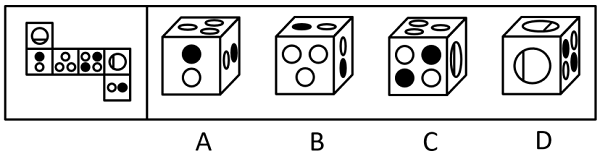

**[例题6（2020天津事业单位）]**

[下面选项中，哪个图形可以由左面纸板折叠而成：]

**[例题7（2024江苏）]**

[左边给定的是纸盒的外表面，右边哪一项是由它折叠而成：]

**[例题8（2020河南事业单位）]**

[左边给定的是纸盒的外表面展开图，右边哪一项能由它折叠而成：]

**[例题9（2021四川）]**

[左图为所给正方体纸盒的外表面展开图，问哪一项可以由其折叠而成：]

**[例题10（2020国考）]**

[下图为给定的多面体及其外表面展开图，问字母A、B、C、D和数字1、2、3、4代表的棱的对应关系为：]

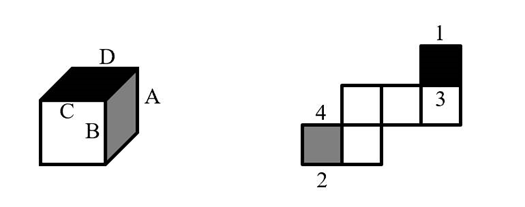

[A．1-D，2-A，3-C，4-B B．1-C，2-A，3-D，4-B]

[C．1-D，2-B，3-C，4-A D．1-C，2-B，3-D，4-A]

**[例题11（2025国考）]**

[以下除哪项外，都是同一正方体纸盒的外表面展开图：]

**[例题12（2025湖北选调）]**

[以下除哪项外，都是同一正方体纸盒的外表面展开图：]

**[二、四面体]**

**[①理论知识]**

1

2

3

4

1

2

3

4

[可沿三角形顶点]

[进行旋转，]

[变型为]

1

2

3

4

2

3

4

1

[1、4可以直接]

[平移到另一边，]

[变型为]

**[解题方式：关注两连接面的公共边，注意公共边的顶点和底点。]**

**[例题13（2020广西事业单位）]**

[左边给定的是纸盒的外表面，下列哪一项能由它折叠而成：]

**[例题14（2021事业单位联考）]**

[左边给定的是纸盒外表面的展开图，右边哪一项能由它折叠而成：]

**[例题15（2024事业单位联考）]**

[左图为给定四面体的外表面展开图，以下哪项可以由它折叠而成：]

## [第二节　立体截面图]

**[一、理论知识]**

**[①长方体截面]**

[**可截出来的图形：**锐角三角形、梯形、平行四边形（包括长方形、正方形）、非正五边形、六边形。]

**[②圆柱截面]**

**[可截出来的图形]**[**：**正圆形、椭圆形、椭圆形的部分（不可截出正圆形的部分）、长方形（是否能截出正方形取决于圆柱体的高与直径之比）。]

**[③圆锥截面]**

[**可截出来的图形：**圆形、等腰三角形、椭圆形、椭圆形的部分（不可截出正圆形的部分）。]

**[二、解题方法]**

[一般可截出简单、规整的图形，"缺失"的部分一般也是规整图形。]

**[例题16（2023内蒙古事业单位）]**

[左图为给定的立体图形（边长为L），将其从任一位置剖开，则右边各项中不可能是该立体图形的截面形状：]

**[例题17（2023浙江）]**

[左图为给定的多面体，将其从任一面剖开，哪项不可能是该多面体的截面：]

**[例题18（2022国考）]**

[左图是给定的空心立体图形，将其从任一面剖开，右边哪项可能是该立体图形的截面：]

**[例题19（2023国考）]**

[下图是给定的立体图形（大圆柱内的虚线部分为挖空部分），将其从任一面剖开，下面哪一项不可能是该立体图形的截面：]

**[例题20（2022浙江）]**

[下面的三棱台如图所示，从中挖掉一个圆柱体，然后从任一面剖开，哪一项不可能是该三棱台的截面：]

**[例题21（2024山西）]**

[将一个正方体从中间挖去一个圆柱，得到如左图所示的新立体图形，从任意面剖开，右边哪一项不可能是该立体图形的截面？]

**[例题22（2024甘肃）]**

[下图为15个白色和5个灰色正方体组合而成的多面体，将其经A、B、C三个顶点切开后，正确的截面是：]

**[例题23（2024国考）]**

[左图为13个白色正方体和5个灰色正方体组合而成的多面体，现用经A、B、C三个顶点的平面对该多面体进行切割，正确的截面是：]

## [第三节　立体视图]

[立体视图可按方向分为：主视图、后视图、左视图、右视图、俯视图（从上看）、仰视图（从下看）]

[视图由轮廓+内部线条组成]

[**轮廓：**立体视图的外轮廓]

[**内部：**不平滑的"棱"产生的实线线条]

**[例题24（2022四川）]**

[上图是给定的多面体，下边哪一项可能是该多面体的视图：]

**[例题25（2024江苏）]**

[下列立体图形，其视图不可能是所给四个选项中的哪一项：]

**[例题26（2024黑龙江）]**

[从所给的四个选项中，选择最合适的一个填入问号处，使之呈现一定的规律性：]

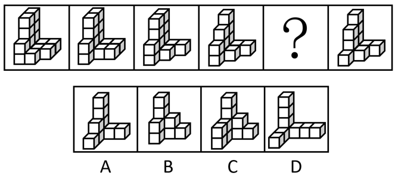

## [第四节　立体拼合]

[立体拼合题，一般出现的图形都是由小立方体堆叠成的。通常需要从四个选项中选出能够和题干中出现的部分图形拼合成整体图形的选项。]

**[例题27（2023国考）]**

[左图为等大的3个灰色正方体和15个白色正方体组合成的多面体，其可以切割为①、②和③三个小多面体，问③代表的多面体可能是：]

**[例题28（2023广西）]**

[左边的立体图形是由①、②和③组成的，下列哪项可以填入问号处：]

**[例题29（2021国考）]**

[下图为同样大小的正方体堆叠而成的多面体正视图和后视图。该多面体可拆分为①、②和③共三个多面体的组合，问下列哪一项能填入问号处：]

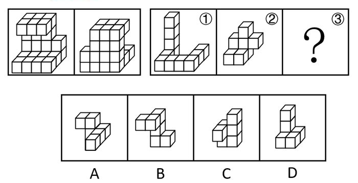

**[例题30（2024国考）]**

[下列图形中，左图为相同大小的15个白色和3个灰色正方体组合而成的多面体，其可以由①、②和③三个多面体组合而成，哪一项能填入问号处：]

**[例题31（2024国考）]**

[左图为15个白色正方体和3个灰色正方体组合而成的多面体，其可以由①、②和③三个多面体组合而成。请问哪项能填入问号处：]

# [图形推理刷题　第1刷]

> [1．从所给的四个选项中，选择最合适的一个填入问号处，使之呈现一定的规律性：]

> 2．[从所给的四个选项中，选择最合适的一个填入问号处，使之呈现一定的规律性：]

> 3．根据给定的纸盒外表面展开图，由其折叠而成的纸盒的俯视图是：

> [4．从所给的四个选项中，选择最合适的一个填入问号处，使之呈现一定的规律性：]

> 5．[从所给的四个选项中，选择最合适的一个填入问号处，使之呈现一定的规律性：]

> [6．把下面的六个图形分为两类，使每一类图形都有各自的共同特征或规律，分类正确的一项是：]

[A．①②③，④⑤⑥ B．①⑤⑥，②③④]

[C．①③⑤，②④⑥ D．①④⑥，②③⑤]

> 7．将下面的图形折叠后，将获得的图形是：

> [8.把下面的六个图形分为两类，使每一类图形都有各自的共同特征或规律，分类正确的一项是：]

[A．①③④，②⑤⑥ B．①②⑤，③④⑥]

[C．①③⑤，②④⑥ D．①⑤⑥，②③④]

> 9．[从所给的四个选项中，选择最合适的一个填入问号处，使之呈现一定的规律性：]

[10．从所给的四个选项中，选择最合适的一个填入问号处，使之呈现一定的规律性：]

11．[从所给的四个选项中，选择最合适的一个填入问号处，使之呈现一定的规律性：]

[12．从所给的四个选项中，选择最合适的一个填入问号处，使之呈现一定的规律性：]

[13．从所给的四个选项中，选择最合适的一个填入问号处，使之呈现一定的规律性：]

[14．从所给的四个选项中，选择最合适的一个填入问号处，使之呈现一定的规律性：]

[15．以下为4个由若干棱长为1的正方体拼成的多面体，将它们在3×3×4空间内进行拼接，**不可能**拼成以下四个选项中的哪一个多面体：]

# [图形推理刷题　第2刷]

> [1．从所给的四个选项中，选择最合适的一个填入问号处，使之呈现一定的规律性：]

> [2．如图，将一长方形纸片按所示步骤折叠裁剪再展开，所得图案是：]

> [3．从所给的四个选项中，选择最合适的一个填入问号处，使之呈现一定的规律性：]

> [4．从所给的四个选项中，选择最合适的一个填入问号处，使之呈现一定的规律性：]

> [5．从所给的四个选项中，选择最合适的一个填入问号处，使之呈现一定的规律性：]

> [6．下图为17个同样大小的白色实心正方体和10个同样大小的灰色实心正方体堆叠而成的大正方体，将其从任一面剖开，以下哪个不可能是该正方体的截面？]

> [7．从所给的四个选项中，选择最合适的一个填入问号处，使之呈现一定的规律性：]

> [8．从所给的四个选项中，选择最合适的一个填入问号处，使之呈现一定的规律性：]

> [9．从所给的四个选项中，选择最合适的一个填入问号处，使之呈现一定的规律性：]

[10．从所给的四个选项中，选择最合适的一个填入问号处，使之呈现一定的规律性：]

[11．从所给的四个选项中，选择最合适的一个填入问号处，使之呈现一定的规律性：]

[12．从所给的四个选项中，选择最合适的一个填入问号处，使之呈现一定的规律性：]

[13．把下面的六个图形分为两类，使每一类图形都有各自的共同特征或规律，分类正确的一项是：]

[A．①③④，②⑤⑥ B．①③⑤，②④⑥]

[C．①②⑥，③④⑤ D．①④⑥，②③⑤]

[14．下面立体图形由正方体与三棱锥组成，其中三棱锥的一个面与正方体上面相垂直，从任意角度将该立体图形剖开，下列选项不可能是该立体图形截面的是：]

[15．从所给的四个选项中，选择最合适的一个填入问号处，使之呈现一定的规律性：]

[\
]

