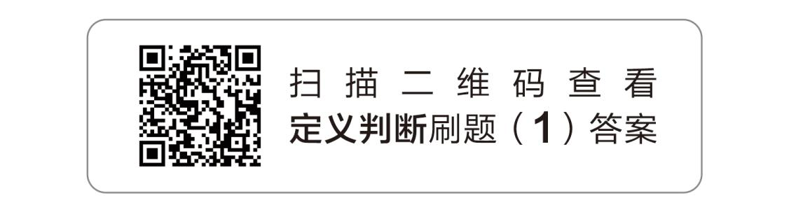

# [第十章　定义判断]

## [第一节　整体概述]

[**总体做题思想：**定义判断更重理解，要站在一定高度上把握，可联系生活中的人或事或某种现象，试着猜测其现实所指；]

[切记定义判断不是"连连看"，找出一堆关键要素一一对应，这样做的结果就是"只见树木不见森林"。]

**[那到底什么是关键信息？]**

[好多同学容易忽略的**"被定义词"，才是最关键信息**，试想，此定义有好多特征和要素，为什么选取其中一或两词作为其"名"，无其他原因，只因"名"里有最重要特征。]

[后续解释，是为了让我们更好理解被定义词，读题的过程，可看作是寻找被定义词中特征对应的过程，**需特别关注的有主体、对象、特殊要求、中心语（此类信息在被定义词中往往无法包含）**。]

**[什么是定义题目最大的坑？]**

[**属于、不属于**一定分清，养成良好读题习惯，不属于题目的错误选项都是"例子"，可以借用例子理解定义；]

**[其他需注意的点：]**

[**多定义或多情况定义**要注意找一一对应，正确选项有时会完美对应定义结构。]

## [第二节　单定义]

**[一、偏正短语式]**

**[例题1（2023国考）]**

[体验式采访是指直接投入到所要报道的新闻事件中去体验生活，以获得新闻报道所需要的素材，以及对新闻事件的认识。]

[根据上述定义，下列**不属于**体验式采访的是：]

[A．某报社要求年轻记者沉入生活，了解基层，以改变写官话、说套话的文风]

[B．某作家为了解包身工的悲惨遭遇，深入到工厂中，写出报告文学《包身工》]

[C．某记者为了解传销组织的真面目，打入到传销组织内部，揭示传销组织的骗局]

[D．某电视台推出专栏《体验三百六十行》，派记者体验各职业一周并进行系列报道]

**[例题2（2023河北事业单位）]**

[体育赛事赞助是指企业以现金、实物、服务、技术、人力资源等方式支持体育赛事，并由此获得商业回报的行为，体现的是体育赛事组委会和体育赛事赞助商之间对等互换以谋求各自利益的关系。]

[根据上述定义，以下属于体育赛事赞助的是：]

[A．腾讯与CBA合作推出带有企鹅标志的篮球比赛装备]

[B．长城无偿提供给广州亚运会用于接送运动员的哈佛越野车]

[C．北京冬奥村为各国运动员提供免费理发与中医理疗服务]

[D．双星给中国乒乓球队免费提供运动员个人专属球拍定制服务]

**[例题3（2019国考）]**

[诉前财产保全是指利害关系人因情况紧急，若不立即申请财产保全将会使其合法权益受到难以弥补的损害，起诉前向人民法院申请，由人民法院采取的一种财产保全措施。]

[根据上述定义，下列**不属于**诉前财产保全的是：]

> [A．工厂甲向信用社乙贷款500万元，甲无法按期归还。乙随即起诉，审理期间得知甲已将设备转卖，遂请求法院查封甲正在出售的大楼]
>
> [B．甲与乙签订购销合同，甲给乙200万元预付款后，发现乙有欺诈行为，无力履行合同，遂请求人民法院冻结200万元预付款]
>
> [C．银行甲与公司乙签订协议，甲向乙提供5000万元贷款，分3期还清，第一笔到期时乙无力归还，甲向法院申请查封乙的财产]
>
> [D．甲欠乙10万元，乙多次找甲还钱未果，得知甲有一辆轿车，乙向法院申请将甲的轿车予以查封，再将甲告上法庭]

**[例题4（2021北京）]**

[无感审批是指通过智能技术强化身份认证、智能授权、自动填表等功能，企业群众无需出示证件、无需填写表单，"不知不觉"就拿到审批文件，实现"无感"审批、"省心"办事。]

[根据上述定义，以下属于无感审批的是：]

> [A．某市旅游管理部门通过人脸识别等网络技术，实现了网上实名制购买全市公园门票。游客无需出示证件，可以直接出示购票二维码入园]
>
> [B．某建设单位登录省投资在线监管平台，填写单位代码后，系统自动生成企业基本信息和申请表格，随后完成在线审核，获得建筑许可]
>
> [C．某市提高政府办事效率，对企业或个人办理业务，只需要到综合服务大厅询问工作人员，工作人员会帮忙核对材料，帮助他们方便快捷地完成相关手续]
>
> [D．某保险公司提供网上业务办理和查询功能，客户登录公众号并通过人脸识别后，可完成查询、续费、转款等功能，无需出示证件、无需填写表单]

**[例题5（2023甘肃）]**

[档案管理是指档案馆（室）以维护档案的真实、完整、准确、安全，便于社会和其他各方面利用为原则，对档案进行收集、整理、保管、鉴定、统计并提供利用的各种业务工作。按管理门类分为文书档案管理和专业档案管理；按档案载体形式分为传统档案管理和电子档案管理。]

[根据上述定义，下列属于档案管理的是：]

[A．甲档案馆近期向社会开放经济、教育、科技、文化类档案查询]

[B．乙知识网站从1999年开始向用户提供有偿资料查阅和下载服务]

[C．丙资料库收录了从1995年至今的100多个社科专题全文复印资料]

[D．丁单位的档案室决定建立档案工作责任制，依法健全档案管理制度]

**[例题6（2017河南选调）]**

[隐性饥饿，是指机体由于营养不平衡或者缺乏某种维生素及人体必需矿物质，同时又存在其他营养成分过度摄入，从而产生隐蔽性营养需求的饥饿症状。]

[根据上述定义，下列属于隐性饥饿的是：]

> [A．陈大爷下定决心节食，他最近以青菜和苹果代替主食，不沾油荤，终于有一天因饥饿难耐晕倒在地]
>
> [B．小白为了获得健美身材，坚持每日六餐，每餐分量很少，分别含有主食、蔬果、蛋奶等，但同时高强度的健身训练还是让他浑身酸痛、疲惫不堪]
>
> [C．王大爷因为肠胃虚弱，以清粥热汤作为主要饮食养生，不常吃大鱼大肉和生冷瓜果，后来因饮食缺少蛋白质和维他命而导致记忆力减退]
>
> [D．小李喜欢高盐、高糖分、高热量的垃圾食品，对医生的劝说无动于衷，在数年后的体检中发现自己存在高血糖、高血脂、高血压等问题]

**[例题7（2011吉林）]**

[群体规范是群体所确立的表明在特定环境中群体成员的行为准则和标准，可分为描述性规范和指令性规范两种。描述性规范表明人们在特定情境下应该做的，它简单地告诉人们，哪些行为是有效的和适合的。指令性规范详细说明在特定情境下，什么是人们必须做的，以及什么是被人们赞同或者是反对的行为。]

[根据上述定义，下列各项中属于描述性规范的是：]

[A．节约用水标语 B．实验室守则]

[C．安全生产标准 D．人生规划]

**[二、主体、对象、特殊要求、中心语]**

**[例题8（2024江苏）]**

[代际责任：指在不超出自身能力的前提下，相邻两代人的一方向另一方主动提供经济帮扶、生活照顾、健康保障、精神抚慰等各种支持的行为。]

[下列**不属于**代际责任的是：]

> [A．苏女士把父母接到身边后，忙乎了一个多月，带着父母熟悉小区健身器材，到社区老年活动中心打牌下棋，在公园找人聊天，终于帮他们重新找到了"组织"]
>
> [B．邵先生和妻子一直在城里忙于打拼，女儿正在读小学。每到寒暑假，邵先生的父母都会专程赶到城里，把孙女接回农村老家痛痛快快地玩上整个假期]
>
> [C．罗奶奶像无数为孩子婚事发愁的长辈一样，每到周末就去附近公园的相亲角浏览展板上的照片、简历，觉得合适的就记下基本情况、电话号码。虽然快三十岁的孙女根本不着急，她却一直乐此不疲]
>
> [D．毛先生喜欢第一时间把遇到的趣事分享到家族微信群，却很少得到期待的回应，一怒之下退了群。后来，儿子又把他请回，还邀约了几位有同样爱好的长辈，群里逐渐热闹起来，他也时不时点赞或评论几句]

**[例题9（2022浙江）]**

[回应性监管是指政府通过制度设计，采用多样化的监管手段和策略对市场主体和社会组织进行动态化、智能化、差别化的监管。回应性监管强调监管主体的多元化，除政府以外，企业、社会组织，乃至被监管对象都是监管主体；在监管策略上，采取差异化、阶梯化的监管方式，即政府首先鼓励自我监管，难以奏效时才采取更为严厉的强化型自我监管直至命令控制型监管。]

[根据上述定义，下列选项**没有**体现回应性监管的是：]

[A．某地主管部门因食品安全问题突击整顿涉事企业]

[B．瑞典立法要求工作场所必须建立安全环保的内控体系]

[C．英国成立企业、工会代表组成的大健康监管委员会]

[D．聘请专业的第三方机构对企业安全生产状况进行评估]

**[例题10（2024四川事业单位）]**

[认知计算是指机器通过与人的自然语言交流及不断学习从而帮助人们做到更多的系统。认知计算试图解决生物系统中的不精确、不确定和部分真实的问题，以实现不同程度的感知、记忆、学习、语言、思维和问题解决等过程。]

[根据上述定义，下列**不符合**认知计算的是：]

> [A．甲公司通过开发一套认知系统来提高销售产量，这套系统使用了机器学习来对顾客进行分类并且指导销售员工对不同顾客销售哪种产品]
>
> [B．乙平台是一套基于云的解决方案，它能够辨识网络外部防御的异常行为，之后识别出恶意软件的侵害或数据损失，协助行为分析和异常探测工作]
>
> [C．丙公司推出的智能机器人，可以与人类正常沟通，可以在银行、餐饮、零售、酒店、医疗等领域为人类提供智能的信息化服务]
>
> [D．丁国"脑科学时代计划"把建立认知、运动、行为和思想的计算原理列为重点研究领域]

**[例题11（2022四川）]**

[人力资本投资是指体现在劳动者身上的，用来提高人的生产能力从而提高人在劳动力市场上的收益能力的初始性投资。]

[根据上述定义，下列**不属于**人力资本投资的是：]

[A．某大学资助教师参加教学技能提升培训班的费用]

[B．某公司为员工添置了一批健身器材所花费的投资]

[C．父母在小张大学暑假期间为其支付的驾校培训费用]

[D．某食品加工企业为购买专利而支付的知识产权转让费]

**[例题12（2024四川三支一扶）]**

[最大最小准则的基本特点是，决策者总是担心最终结果会于已不利。于是为了保险，在选择方案时只希望自己可能遇到的最坏结果比采用其他方案可能遇到的最坏结果都要好些。]

[下列表格提供了某公司家用电器的4种经营方式、不同市场状态下的收益值。]

--------------------------- ----------------- ----------------- -----------------

[经营方式市场状态]    [畅销]     [一般]     [滞销]

          [甲]            [10]       [8]        [5]
    
          [乙]            [13]       [9]       [﹣2]
    
          [丙]            [11]       [7]        [4]
    
          [丁]            [15]       [6]       [﹣1]

--------------------------- ----------------- ----------------- -----------------

[根据上述准则，该公司应选择的经营方式是：]

[A．甲 B．乙]

[C．丙 D．丁]

**[例题13（2023内蒙古事业单位）]**

[蜈蚣平均多达40只脚，但却能够步履协调、正常行走。当别的小动物问蜈蚣是怎么做到用这么多脚走路时，蜈蚣也开始好奇地观察起自己平时怎么走路，结果它的脚反而开始纠缠在一起。这便是蜈蚣效应，即对事物有超过平常的关心，反而导致在处理问题时方寸大乱。]

[根据上述定义，下列**没有**体现蜈蚣效应的是：]

[A．把不成问题的事当作问题就会酿成大问题]

[B．无欲则刚，关心则乱]

[C．排除干扰，把精力放到正事和要事上，做到"抓大放小"]

[D．只有当你认定消极事件为"不幸"时，该事件才真正成为"不幸事件"]

**[例题14（2020浙江事业单位）]**

生物燃料泛指由生物质组成或萃取的固体、液体或气体燃料，可以替代由石油、核能等传统燃料，这些新兴的燃料是可再生燃料。

> [根据上述定义，下列**不属于**生物燃料的是：]

[A．使用甘蔗生产的乙醇燃料 B．以花生油为燃料驱动汽车]

[C．可用于生产生质燃料的桐油树 D．利用玉米制造酒精]

## [第三节　多定义]

**[例题15（2019北京事业单位）]**

[互补品是指两种商品之间存在某种消费依存关系，即一种商品的消费必须与另一种商品的消费相配套。互补品一般可以分为两类：普通互补品，指两种商品之间没有固定的同时使用的比例；完全互补品，指两种商品之间必须按照固定不变的比例同时被使用。]

[根据上述定义，下列选项正确的是：]

[A．数码相机和胶卷属于完全互补品 B．薯条和汉堡属于普通互补品]

[C．毛笔和墨汁属于普通互补品 D．眼镜框和眼镜属于普通互补品]

**[例题16（2022事业单位联考）]**

[单播是单点对单点数据传输；组播是单点对特定多点数据传输，发出一份数据包，特定的多点同时接收；广播是单点对非特定多点传输，发出一份数据包，非特定多点同时接收。]

[根据以上定义，下列选项中利用了组播技术的是：]

[A．观看付费电视频道节目 B．双人视频通话]

[C．收听电台节目 D．通过视频APP点播电视剧]

**[例题17（2021国考）]**

[统计数据分为定性数据与定量数据。定性数据包括分类数据和顺序数据。分类数据是指只能归于某一类别的非数字型数据，它是对事物进行分类的结果，用文字表述；顺序数据是指归于某一有序类别的非数字型数据。定量数据是指表现为具体数字观测值的数据。]

[①按城市规模可将城市分为特大城市、大城市、中等城市和小城市；]

[②婚姻状况：1-未婚，2-已婚，3-离异，4-丧偶；]

[③A地到B地的距离为200公里，到C地为320公里，到D地为100公里；]

[④某医院建筑面积37.5万平方米，开放床位3182个，临床医生687人。]

[根据上述定义，关于以上4组数据的说法正确的是：]

[A．②④都是分类数据 B．②③④都是定量数据]

[C．①②都是顺序数据 D．仅②是分类数据]

**[例题18（2023湖北事业单位）]**

[悲观是对人、事、物产生消极的看法。悲观可以分成以下几类：气质性悲观，是指人们在对未来的看法上，长期倾向于期待坏的结果；归因性悲观，是指在一件事情发生后对它进行解释时，总会采取内在的、稳定的负面归因；防御性悲观，是指人们会在事件发生前，将期待降到比较低的水平，想象出最坏的可能。]

[根据上述定义，下列体现了防御性悲观的是：]

> [A．小李天生就是个多愁善感的人，无论是工作还是生活，他都觉得一切总是会向不好的方向发展]
>
> [B．领导任命小张为部门负责人，小张认为自己能力尚不足，对自己能否胜任这一岗位表示担忧]
>
> [C．单位年度评优中没有被评为先进，他认为是自己的一个重大工作失误导致的]
>
> [D．销售人员小陈业绩特别好，在讲述工作经验时，他表示无论如何都要做好本职工作，不要太在意客户的态度，这样的想法支持他勇敢向前]

**[例题19（2022国考）]**

[总量指标动态数列是将反映某种社会经济现象的一系列总量指标按时间先后顺序排列形成的数列，可分为两类：]

[（1）时期数列：每个指标都表示社会经济现象在一定时期内发展过程的总量，各指标值可以相加，指标数值的大小与时期长短有直接关系；]

[（2）时点数列：每个指标都表示社会经济现象在某一时点（时刻）上的数量，各指标值不能相加，指标数值大小和"时点间隔"长短没有直接关系，每个指标通常都是定期（间断）登记取得的。]

[根据上述定义，下列属于时点数列的是：]

[A．2016～2020年某市税收情况]

----------------------- ----------------- ----------------- ----------------- ----------------- -----------------

       [年份]       [2016年]   [2017年]   [2018年]   [2019年]   [2020年]

[税收（亿元）]    [1530]     [1950]     [2390]     [3025]     [3650]

----------------------- ----------------- ----------------- ----------------- ----------------- -----------------

[B．2017～2020年某公司员工人数情况]

----------------------------- ----------------- ----------------- ----------------- -----------------

          [年份]          [2017年]   [2018年]   [2019年]   [2020年]

[年末员工人数（人）]    [4459]     [4925]     [5012]     [5347]

----------------------------- ----------------- ----------------- ----------------- -----------------

[C．2021年1～5月某地区城镇私营单位就业人员月均工资]

------------------------- --------------- --------------- --------------- --------------- ---------------

        [月份]        [1月]    [2月]    [3月]    [4月]    [5月]

[平均工资（元）]   [3530]   [3600]   [4150]   [3920]   [4300]

------------------------- --------------- --------------- --------------- --------------- ---------------

[D．2020年某地区各季度电动汽车生产产量]

----------------------- ------------------- ------------------- ------------------- -------------------

       [季度]       [第一季度]   [第二季度]   [第三季度]   [第四季度]

[产量（万辆）]     [160]        [182]        [205]        [217]

----------------------- ------------------- ------------------- ------------------- -------------------

## [第四节　专业性定义题]

**[一、法律相关]**

**[例题20（2017上事业单位）]**

[包庇罪是指明知是犯罪的人而为其提供隐藏处所、财物，或者帮助其逃匿，或者作假证明包庇的行为。但事前通谋的，以共同犯罪论处。]

[根据上述定义，下列可能构成包庇罪的是：]

> [A．李某与黄某等人商定，由黄某等人抢劫金店，由李某负责藏匿抢劫所得赃物，黄某等人抢劫得手后，李某将赃物藏于自家的仓库内]
>
> [B．张某盗窃了博物馆的一幅名画，将其藏于床下，被母亲发现，母亲询问张某，得知为盗窃所得，遂将该幅名画烧毁]
>
> [C．赵某被王某绑架，公安机关迅速侦破此案并成功解救赵某。后赵某收受王某亲属20万元，推翻了之前对王某不利的陈述，谎称是自愿和王某走的]
>
> [D．侯某是涉嫌杀人罪的犯罪嫌疑人于某的辩护律师，为获得高额的代理费用，侯某伪造大量证据，成功帮助于某脱罪]

**[例题21（2021下四川）]**

[共同犯罪是指二人以上共同故意犯罪，共同故意犯罪要求共犯人知道共犯的内容及社会意义，并希望结果的发生，并且共犯人主观上要有共同犯罪意思联络，知道自己不是孤立的在犯罪，而是和他人一起共同犯罪。]

[根据上述定义，下列案件**不属于**共同犯罪的是：]

> [A．李某和杨某系夫妻，与邻居黄某因为排水问题发生纠纷，继而发生口角，黄某被李某殴打。黄某受伤倒地后杨某未实施救助，与李某快速离开了现场。经鉴定，黄某受重伤]
>
> [B．周某和陈某对刘某怀恨在心，二人商议杀死刘某，于是二人非法购买了枪支，准备第二天杀死刘某。但是陈某感到害怕，于当天晚上告知刘某杀人计划，并和刘某一起到公安机关报案]
>
> [C．张某和王某两人互不认识。一天深夜，张某进入一家超市偷东西时，碰到王某也在该超市偷东西，两人相视而笑。之后，张某和王某一起将偷取的东西变卖，分别获利2.2万元和1.3万元]
>
> [D．谢某和丁某共谋盗窃汽车，谢某将开车所需的钥匙交给丁某。后来，谢某后悔，让丁某归还钥匙。丁某请求谢某让他配置---把钥匙之后再归还，谢某同意。随后丁某利用自己配置的钥匙盗窃了汽车]

**[二、医学相关]**

**[例题22（2017辽宁公安）]**

[焦虑性神经官能症是以广泛性焦虑症（慢性焦虑症）和发作性惊恐状态（急性焦虑症）为主要临床表现，是一种无根据的惊慌和紧张或其紧张惊恐程度与现实情况很不相称，心理上体验为泛化的、无固定目标的担心惊恐，生理上伴有警觉增高的躯体症状。]

> [根据上述定义，下列属于焦虑性神经官能症的是：]
>
> [A．上高三的小李平时上课表现得非常正常，但是遇到老师提问他时就紧张的说不出话来，即使自己会的问题也回答不出来]
>
> [B．老李被查出来患有肿瘤，一想到自己可能不久于人世，老李就非常的惊恐]
>
> [C．最近某市发生了几起入室盗窃杀人案，一天晚上小丽老公加班没有回来，小丽整晚都非常担心，几乎没睡觉]
>
> [D．小孙最近刚失恋，她每天把自己关在家里，伤心欲绝，痛苦不已]

**[例题23（2024山东）]**

[睡眠-觉醒节律紊乱，也称昼夜节律睡眠-觉醒障碍，指个体的睡眠与其现实要求或大部分人所遵循的节律不符的觉醒紊乱。]

[根据上述定义，下列**不属于**睡眠-觉醒节律紊乱的是：]

[A．小张入睡时间在凌晨2～6点，不能在正常时间起床]

[B．老李睡眠时间比正常人早，经常在傍晚就感到困倦]

[C．小王因次日要参加重要考试，当晚久久不能入睡]

[D．老赵因居住环境拥挤嘈杂，晚上常处于时睡时醒状态]

**[三、经济、科学等]**

**[例题24（2021江苏）]**

[科学预测：指基于已掌握的规律，通过科学分析和预测，对未来可能发生的现象，作出允许质疑及检测的推测。]

[下列属于科学预测的是：]

> [A．旅行团导游提醒大巴司机：明天是周末，出城的车子太多，路上很可能出现严重的拥堵现象，要想按时到达目的地，至少得提前半小时出发]
>
> [B．某地发生了一起刑事案件，警察迅速对犯罪现场进行仔细勘查，根据收集到的信息材料，很快确定并抓获了犯罪嫌疑人，仅用了3小时就破了案]
>
> [C．电视台的天气预报节目中，播报员都会例行性地对未来十天的天气变化情况进行简要预报，有时还会请气象专家对天气变化原因作出分析]
>
> [D．老胡刚拿到体检报告，发现有几个指标不正常，极为紧张，忙去找医生，医生看过体检报告后告诉他："超标情况不严重，注意休息，很快就会恢复正常"]

**[例题25（2019国考）]**

[定律假说是对一类事物或现象的性质或发生原因作出推测性解释,得出一个可能具有普遍性意义的规律性命题,从而试图建立、发展或补充科学理论。]

[根据上述定义,下列属于定律假说的是：]

[A．老师向学生们解释潮汐现象产生的原因是海水在引力作用下出现的周期性运动]

[B．某单位仓库被盗,由于未发现破坏性进入的痕迹,侦查人员认为内部人员作案的可能性极大]

[C．牛顿根据苹果掉落现象发现了万有引力定律]

[D．有研究人员提出,由基因导致的疾病可能都是由于基因突变引起的]

**[例题26（2022辽宁事业单位）]**

[教育调查是指在没有预定因子、不施行控制的条件下，对现有教育方面的有关客观事实所进行的观察和分析。其目的在于了解教育已有成果，总结经验，发现问题；研究教育理论，探索教育规律；预测教育发展趋向，为制定教育方针、政策提供事实依据。]

[根据上述定义，下列**不属于**教育调查的是：]

[A．使用问卷了解某市所有中学高三学生的学习心理现状]

[B．分析近三年某地区职业教育经费投入与职业教育发展趋势]

[C．摸底测验后，统计本校九年级有望升入重点高中的学生人数]

[D．根据某农村地区基础教育的相关案例，探究存在的问题及解决途径]

**[例题27（2022事业单位联考）]**

[滞后现象指的是解释变量对被解释变量的影响不可能即时完成，在这一过程中通常存在时间滞后，也就是说，解释变量需要通过一段时间才能完全作用于被解释变量。]

> [根据上述定义，以下选项属于滞后现象的是：]
>
> [A．稀软的混凝土均匀地铺设到公路路面之后，经过一夜时间，第二天早晨就基本凝固了]
>
> [B．在一盆干燥的葛根中倒入一杯水，开始时，盆中有很多水，一段时间后，盆中的水就被葛根吸收了]
>
> [C．某国为了刺激经济，为小微企业发放了无息贷款，6个月后，该国物价出现了一定程度的上涨]
>
> [D．某地发生洪灾，由于次生灾害、交通损毁、通讯不畅等因素的影响，救援物资未能及时发放到灾民手中]

## [第五节　常用技巧]

**[一、造句法]**

**[例题28（2023事业单位联考）]**

[R关系的非对称性指的是存在论域中的元素（或对象）x、y，xRy并且yRx都成立；也存在论域中的元素（或对象）m、n，mRn成立但是nRm不成立。]

[根据上述定义，以下哪项中的关系具有非对称性：]

[A．以所有人作为论域的亲戚关系 B．以所有人作为论域的抚养关系]

[C．以所有人作为论域的祖孙关系 D．以所有人作为论域的尊重关系]

**[例题29（2024黑龙江公安）]**

[关系具有确定性性质是指对于某一关系R，如果对于特定论域中三个对象a、b、c而言，当对象a与对象b之间具有R关系。并且对象a与对象c之间也具有R关系时，则b＝c。]

[根据上述定义，下列关系具有确定性性质的是：]

[A．数与数之间的倒数关系 B．国与国之间的联盟关系]

[C．集合与集合之间的包含关系 D．事物与事物之间的因果关系]

**[例题30（2025浙江）]**

[汉语中有一类名词连名词的复合词，其词素组合顺序为，前一个词素是被修饰、被限定的成分，后一个词素是修饰、限定成分，称为"正偏式"名-名复合词。]

[根据上述定义，下列属于"正偏式"名-名复合词的是：]

[A．火舌 B．布衣]

[C．兄弟 D．车速]

**[二、根据"与众不同"确定答案]**

**[例题31（2023江西）]**

[商业效用原则是商事实践中发展出来的一项交易惯例，市场主体提供的商品、服务以及其他标的物应当能够发挥基本的功能作用，如果欠缺必要的使用条件或者辅助设施导致其交易目的落空的，应当予以补足。最佳效用原则是指通过配置组合，使得资源能够最大程度地发挥效能，提高利用效率。]

[根据上述定义，下列选项最能体现商业效用原则的是：]

[A．开发商销售商品房赠送车位 B．商家促销"买桌子送椅子"]

[C．出售的地下酒窖附带出入通道 D．购买家电享受"三包服务"]

**[例题32（2019山西事业单位）]**

[美国著名心理学家麦克利兰于1973年提出著名的素质冰山模型，将个体素质划分为表面的"冰山以上部分"和深藏的"冰山以下部分"，其中，"冰山以上部分"是人的外在表现，是容易了解与测量的部分，可以通过培训来改变和发展。而"冰山以下部分"是人内在的、难以测量的部分。它们不大容易通过外界的影响而得到改变，但却对人的行为与表现起着关键性作用。]

[根据上述定义，下列对某人的描述属于"冰山以上部分"的是：]

[A．小张在车祸中失去双臂，但是他没有就此消沉，而是积极乐观的面对困境]

[B．小费作为公司新开发项目的团队成员，他非常注重与其他团队成员的合作]

[C．小李追求卓越、挑战自己的品质，使他取得了一个又一个丰硕的成果]

[D．中文系毕业生小王，拥有丰富的文学知识]

**[例题33（2020河南事业单位）]**

[发散思维是一种从不同的方向、途径和多种角度去设想、探求更多答案，最终使问题获得圆满解决的思维。]

[根据上述定义，下列**不属于**发散思维的是：]

[A．作家为了提高写作水平进行一事多写]

[B．研究人员提出多种解决问题的设想]

[C．学生从多种解题方法中筛选出一种最佳解法]

[D．教师设想多种教学改革方案]

**[例题34（2020辽宁事业单位）]**

[定性研究方法是根据社会现象或事物具有的属性和在运动中的矛盾变化，从事物的内在规定性来研究事物的一种方法或角度。他以普遍承认的公理、一套演绎逻辑和大量的历史事实为分析基础，从事物的矛盾性出发，描述、阐释所研究的事物。]

[根据上述定义，下列运用了定性研究方法的是：]

[A．通过抽样调查了解特定人口总体中精神病出现的频率]

[B．通过问卷调查了解某中学参加校外培训班的学生比例]

[C．通过大数据统计得出某年度国内游和出境游的旅客人数]

[D．通过访谈法了解人们对共享单车的使用和管理现状的满意度]

**[例题35（2022天津）]**

[无方向性假设指变量间有一定的关系但不能预测关系的性质。如果没有理论依据，或者在文献资料和实践观察中没有证据来推测变量关系，研究者只能形成无方向性的假设。方向性假设预测了两个或两个以上变量间的关系及关系的性质。]

> [根据上述定义，下列属于方向性假设的是：]
>
> [A．在空间思维能力上男女生有差异]
>
> [B．学龄儿童的低社会交往能力与母亲高的抑郁分值有关]
>
> [C．老人自我评价的自理能力与性别、社会文化背景有关系]
>
> [D．大学教师的职业发展机会与成就感降低之间呈现显著相关关系]

**[三、根据"新旧"确定答案]**

**[例题36（2023浙江事业单位）]**

[按运营主体分类，电子商务模式可分为传统电商模式和内容电商模式。传统电商模式是指消费者在全品类电商平台上通过搜索、浏览、比价等操作来购买所需的商品。内容电商模式是指平台通过传播优质内容吸引对内容感兴趣的人群，进而引导其购买内容相关的商品。]

[根据上述定义，下列**不涉及**内容电商模式的是：]

[A．甲平台邀请多位明星为其代言，并投放了线上广告，吸引了大批粉丝购买该平台的商品]

[B．主打体育新闻的乙平台是体育爱好者们的聚集地，平台售卖的球鞋、球衣等商品销量不俗]

[C．丙平台是专为职场女性打造的社交平台，该平台自营的化妆品深受各年龄层女性用户喜爱]

[D．某主播在丁平台为扶贫食品直播带货，质朴不失幽默的风格大受好评，商品很快便销售一空]

**[例题37（2022国考）]**

[刑事科学技术是公安、司法机关依照刑事诉讼法的规定，应用现代科学技术的成果，收集、检验和鉴定与犯罪活动有关的物证，为侦查、起诉、审判工作提供线索和证据的专门技术。]

[根据上述定义，下列**没有**体现刑事科学技术的是：]

[A．通过核对公司台账、采购合同等文件资料，确定犯罪嫌疑人行贿的具体数额]

[B．交通肇事伤亡案件中，根据车辆损毁情况推断车辆的接触点、行驶方向及事故成因]

[C．应用声谱仪对手机录音与犯罪嫌疑人的语音进行声学特征分析，作出是否为同一人的判断]

[D．对警犬识别出来的可疑物进行成分鉴定，判断嫌疑人所携带的物品是否为违禁品]

**[例题38（2023国考）]**

[预判设计是一种能够引导用户、缩短用户行为路径的有效设计手段。它可以根据用户的行为或用户所在的场景，让功能"主动找到"用户，并让用户与之产生自然的交互，为用户提供更好的使用体验，本质就是为用户多想一步，让用户使用起来尽量简单。]

[根据上述定义，下列**不属于**预判设计的是：]

[A．某购物软件，根据用户输入的搜索关键词，将商品按与关键词的相关性排列]

[B．某翻译软件，用户第一次点击播放，语音速度正常；再次点击，语音速度变慢]

[C．某外卖软件，当用户对店家给出差评，系统自动勾选"将评价设为匿名评价"]

[D．某购物软件，所选商品缺货时，出现"找相似"按钮，点击可看到同款、相似商品]

**[例题39（2022福建事业单位）]**

[新零售模式即企业通过运用大数据、人工智能等先进技术手段，对商品的生产、流通与销售过程进行全面升级改造，进而重塑业态结构与生态圈，实现线上线下的融合、消费的跨界融合。新零售模式的变革将有效推动消费供给侧改革，实现商品的基础效率提升，促进消费升级，创造更多的商业机会。]

[根据上述定义，下列**不属于**新零售模式的是：]

[A．小张在一家无人超市，自主通过人脸识别技术成功付款购物]

[B．小李通过手机地图定位，到离自己最近的咖啡店喝咖啡]

[C．小王在线上下单购买衣服，下班后到离家最近的门店提货]

[D．小林在某商场体验完烘焙教室后，扫码购买了烘焙炉具]

[\
]
# [定义判断刷题　第1刷]

> 1．矩阵对策是指处于利益竞争的两个关系主体，各自可选的策略有限，且在一局对策中双方得失和为零的现象，即要不成功、要不失败。对策中，一方真正成功的措施应该是，针对对方所采取的行动相应地制定有利于自己的应对策略，各方选择的策略必定是自己对对方策略预测的最佳反应。

根据上述定义，下列属于矩阵对策的是：

A．丈夫要去踢球，妻子要去看电影，儿子要去游乐园，最后三人去郊游

B．劳资双方进行薪资谈判，经过反复的讨价还价，最终双方都作出让步

C．齐王和田忌按原条件重新赛马，并约定每局比赛须用同等级的马参赛

D．在进入奥运女子排球决赛后，某国家队重新安排队员阵容和出场顺序

> 2．概念的内涵是指概念所反映的事物具有的本质属性（或特有属性），它是从质的方面反映概念的。概念的外延是指具有概念所反映的本质属性（或特有属性）的那些事物，它是从量的方面反映概念的。内涵和外延的反变关系是指具有属种关系的概念之间所具有的一种相互联系、相互制约的关系。一个概念的外延越大，它的内涵越少；一个概念外延越小，它的内涵越多。反之，一个概念的内涵越多，它的外延越小；一个概念内涵越少，它的外延越大。

根据上述定义，下列哪组概念体现了概念内涵与外延的反变关系：

A．司法机关，最高审判机关，最高人民法院

B．水杯，热水杯，大号热水杯

C．中国，新疆，乌鲁木齐

D．中国人，文学家，鲁迅

> 3．词的同一性是指同一个词形可以表示不同的意义，但这些不同的意义之间存在着内在联系的现象。

根据上述定义，下列划线的词**不属于**词的同一性现象的是：

A．他的态度很**[端正]{.underline}**　大家要**[端正]{.underline}**态度

B．他是我们的**[领导]{.underline}**　在D的**[领导]{.underline}**下奋勇前进

C．这个人**[仪表]{.underline}**堂堂　在重要场合要注意**[仪表]{.underline}**

D．这是一门**[科学]{.underline}**　处理问题的方法很**[科学]{.underline}**

> 4．总成本领先战略是指企业应建立起高效、规模化的生产设施，严格控制成本、管理费用及研发、服务、推销、广告等方面的成本费用。差异化战略是指将公司提供的产品或服务差异化，树立起一些全产业范围中具有独特性的东西，如设计名牌形象、保持技术、性能特点等。专一化战略是指主攻某个特殊的顾客群、某产品线的一个细分区段或某一地区市场，公司或者通过满足特殊对象的需要而实现了差异化，或者在为这一对象服务时实现了低成本，或者二者兼得。

根据上述定义，下列**没有反映**上述三种战略的是：

A．某公司一直致力于为大型建筑物提供中央空调系统，并形成了自己的产业链

B．某日用品公司根据市场需求，设计了六款定位不同的洗发水品牌，实现了在洗发水行业骄人的战绩

C．某航空公司一直严格控制人员数量，优化资源配置，用较少的费用实现了丰厚的利润

D．某软件公司通过为某知名公司开发手机应用软件，成为该公司最重要的软件供应商

> 5．反馈是控制论的基本概念，指将系统的输出返回到输入端并以某种方式改变输入，进而影响系统功能的过程。可以分为正反馈和负反馈。前者使输出起到与输入相似的作用，使系统震荡，可以放大控制作用；后者使输出起到与输入相反的作用，系统趋于稳定。

[根据上述定义，下列判断**不正确**的是：]

> [A．天气炎热，人体体温上升，导致汗液增多，汗液带走热量，体温恢复。这是负反馈]
>
> [B．小明此次考试成绩不理想，回家后父母对其批评指责，导致其自尊心受挫，之后成绩更差。这是正反馈]
>
> [C．室内气温上升，超过空调设定温度，制冷机开始工作，室内温度下降，再次达到设定温度。这是负反馈]
>
> [D．正常分娩过程中，子宫收缩导致胎儿头部下降并牵张子宫颈，子宫颈受牵张进一步加强子宫收缩，如此反复，直至胎儿娩出。这是负反馈]
>
> [6]．定义：1、非特异性免疫：又称天然免疫或固有免疫，指机体先天具有的正常的生理防御功能，对各种不同的病原微生物和异物的入侵都能做出相应的免疫应答；2、繁殖力：表示动物生殖机能的强弱和生育后代的能力，亦称生殖力；3、自制力：指人们能够自觉地控制自己的情绪和行动。

[典型]例证：

（1）旅鼠一胎可产九崽，一年多胎；

（2）猪瘟在猪群中传播很快，但和人类无缘；

（3）小红[坚持]写完作业再去看动画片。

上述典型[例证]与定义存在对应关系的数目为多少个：

[A．0 B．1]

[C．2 D．3]

> 7．行政许可，是指在法律一般禁止的情况下，行政主体根据行政相对方的申请，经依法审查，通过颁发许可证、执照等形式，赋予或确认行政相对方从事某种活动的法律资格或法律权利的一种具体行政行为。

根据上述定义，下列**不属于**行政许可的是：

> A．小张从医学院本科毕业之后，参加卫生部医师资格考试，获得医师资格证书之后开始行医
>
> B．临近春节，小李向安全生产监督管理局申请生产经营烟花爆竹并获得批准
>
> C．伦理审查委员会在详细查阅王教授进行人体试验的研究计划之后，认为符合伦理规范，批准该项研究

D．国家工商总局在对某进口企业的资质实行了审核之后，给予其进口认证

> 8．"模棱两不可"是违反普通逻辑基本规律排中律要求所犯的逻辑错误。排中律要求，在同一时间、同一关系下，对同一对象做出的具有矛盾关系或下反对关系的命题，不能都加以否定。如果都加以否定，就会犯"模棱两不可"的错误。

根据上述定义，下列犯了"模棱两不可"**错误**的是：

> [A．并非有人去考试了，也并非没人去考试]
>
> [B．不能任何人的话都相信，也不能任何人的话都不信]
>
> [C．不是所有人都看电视直播了，也不是所有人都没看电视直播]
>
> [D．讨论某甲是否有罪时，起初有人说：不能说某甲是有罪的；随着调查的深入，又有人说：也不能说某甲就没有罪]
>
> [9．点染，是指用具体的事物、景物将所要点明的情感、道理渲染、烘托出来，使其更具体、更形象的一种修辞方式。其中，"点"即点明所要抒写的情感、道理；"染"即渲染、烘托，是对"点"的说明、铺陈。因此，"点"与"染"紧密相连、相辅相依。]

[根据上述定义，以下运用了点染的是：]

[A．黑云压城城欲摧，甲光向日金鳞开。角声满天秋色里，塞上燕脂凝夜紫]

[B．千里澄江似练，翠峰如簇。归帆去棹残阳里，背西风，酒旗斜矗]

[C．毕竟西湖六月中，风光不与四时同。接天莲叶无穷碧，映日荷花别样红]

[D．千万恨，恨极在天涯。山月不知心里事，水风空落眼前花，摇曳碧云斜]

[10．划分是按某一种标准，把一个外延较大的概念（属概念）分为若干个外延较小的概念（种概念）的逻辑方法，所划分出来的每个种概念都具有属概念的属性。分类是划分的特殊形式，是根据事物的本质属性所进行的划分。]

[根据上述定义，下列属于分类的是：]

[A．"人"分为"高个子"和"矮个子"]

[B．"大树"分为"树冠""树干"和"树根"]

[C．"一天"分为"上午""中午"和"下午"]

[D．"直线运动"分为"匀速直线运动"和"变速直线运动"]

[11]．①重组性迁移是指重新组合原有经验系统中的某些构成要素或成分，调整各成分之间的关系或建立新的联系的认知方式；

> ②具体迁移是指经验系统中的要素和结构没有变化，把经验要素重新组合形成的认知方式。

典型例证：

（1）"石"和"旁"组成"磅"字

（2）"未"和"末"两个字的构型很相似

（3）"上、下、左、右"都是象形字

下列对上述典型例证与定义的关系判断正确的是：

A．例证（1）（2）与定义①相关，例证（3）与定义②相关

B．例证（1）与定义②相关，例证（2）与定义①相关，例证（3）与定义①②都无关

C．例证（1）（3）与定义①相关，例证（2）与定义②相关

D．例证（1）与定义①相关，例证（2）（3）与定义②相关

12．碳汇是指通过各种措施吸收大气中的二氧化碳，从而减少温室气体在大气中浓度的过程、活动或机制。

根据上述定义，下列**不属于**碳汇范畴的是：

A．森林保护 B．退耕还草

C．绿色出行 D．中耕松土

# [定义判断刷题　第2刷]

> 1．在新一代信息技术形成的网络生命空间中，数字平台生态系统提供的社会化工具减少了组织创建的成本，极大地激发了社会个体创建组织的积极性，形成了虚拟世界中组织进化的新现象。大型数字平台生态系统所提供的社会化工具帮助现实社会中的个体打造了众多的数字组织，这些数字组织可以称之为社会化数字组织。
>
> 根据上述定义，下列属于社会化数字组织的是：
>
> A．某地利用微博建立了网络红色文化学习社区宣传红军长征精神
>
> B．志愿者小李在短视频APP中组建助农协会帮助农户直播销售农产品
>
> C．某外卖平台响应国家号召积极吸纳来自偏远地区进城务工人员，帮助他们实现再就业
>
> D．登山爱好者老刘发现某社交媒体在信息交流方面十分便捷，便邀请同城登山爱好者到该社交媒体上交流登山体验
>
> 2．[色素色是指有机色素通过选择性地吸收、反射和投射特定频率的光线后直观呈现出的颜色。结构色又称物理色，是指通过可见光与物质物理上的微观结构（如物体表面或表层的纹、刻点、沟缝或颗粒等）发生相互作用，这些大量的微观有序结构对不同波长的光散射、衍射或干涉后产生的各种颜色。]

[根据上述定义，下列颜色属于色素色的是：]

[A．用激光束刻录的光盘上的彩色花纹]

[B．蝴蝶翅膀上的鳞片呈现出五颜六色]

[C．阳光下肥皂泡泡呈现缤纷的虹彩色]

[D．用乌饭树叶捣汁煮出的糯米饭呈现黑色]

> 3[．]发现不均衡套利是指通过发现和利用市场上的资源供给和需求不一致进行调配导致的盈利机会获利。
>
> 根据上述定义，下列**不属于**发现不均衡套利的是：
>
> A．孔子的门生子贡在曹国与鲁国之间通过贱买贵卖来获利
>
> B．小王预见来年橄榄必然大获丰收，便买断了当地所有的榨油机，第二年高价出租获得巨额财富
>
> C．F汽车公司针对当时汽车价格昂贵、普通居民消费不起的状况，推出了价廉物美的T型车，迅速进入普通家庭
>
> D．20世纪80年代，中国农村出现大量富余劳动力，而工业产品又极为缺乏。因此将富余的农村劳动力组织起来生产工业产品，可以获利
>
> [4．游戏是自主自由，使幼儿获得愉快满足，非功利性的行为的总称。规则游戏是按照认知发展所作出的一种]游戏[分类，是指两个以上的游戏者在一起按照预先规定的规则进行的，具有竞赛性质的游戏活动。根据社会行为发展分类，游戏又可以分为单独游戏（各玩各的，游戏内容不同）、平行游戏（各玩各的，游戏内容相同）、合作游戏（和同伴玩，有目标或分工）、联合游戏（和同伴玩，没有目标或分工）。]

[根据上述定义，下列既属于规则游戏又属于合作游戏的是：]

[A．三个幼儿一起玩过家家，分别扮演爸爸、妈妈和孩子，说好不能打架]

[B．幼儿甲和幼儿乙一起下棋，说好谁赢了谁会得到一颗糖果作为奖励]

[C．幼儿甲在玩拼图，幼儿乙也拿来拼图玩，不久后两个孩子开始暗自比拼谁拼得快]

[D．幼儿甲和幼儿乙作为搭档一起参加儿童拉丁舞比赛，在比赛中获得了冠军]

> [5．故意]教唆[并引起他人实施符合构成要件的违法行为的，是教唆犯，强化他人实施特定犯罪决意，或者是提供建议使他人更容易实施犯罪的，是无形帮助犯。]
>
> [根据上述定义，下列说法正确的是：]
>
> [A．甲准备了刀片，准备在公交车上实施盗窃，乙向甲提议说到高档小区实施入室盗窃，能够获得更多的财物，甲听从乙的建议，则乙的行为属于教唆犯]
>
> [B．甲报复上司李某，多次在李下班路伏击未果，乙得知后将李的准确行踪告知甲，致使甲将李某打成重伤，则乙的行为属于无形帮助犯]
>
> [C．甲认为临近超市抢了自己生意，欲砸烂其门窗，乙提议说不如直接放火烧毁，这样其损失更大，甲于是着手实施了放火行为，则乙的行为属于是无形帮助犯]
>
> [D．甲欲生产假冒伪劣药品，但因害怕受到处罚迟迟不敢着手，乙得知后告诉甲造假行为获利大，且很难被发现，甲于是着手实施了造假行为，则甲的行为属于教唆犯]
>
> [6．锚定效应又称为沉锚效应，是一个心理学名词，指的是人们在对某人某事做出判断时，易受第一印象或第一信息支配，就像沉入海底的锚一样把人们的思想固定在某处。]
>
> [下列例子中，应用了锚定效应的是：]
>
> [A．小东在考试前一直害怕会不及格，最终他真的考试不及格]
>
> [B．小佳看到办公室的同事都在使用护腰垫，他也买了一个护腰垫]

[C．小黄计划在发年终奖金时购买一款游戏机，年终时公司没发奖金，小黄还是购买了那款游戏机]

[D．爸爸在教育不肯吃苹果的儿子时，不问他要不要吃苹果，而是问他要苹果切块还是苹果泥]

> [7．家庭病床服务，是指对需要连续治疗，但因本人生活不能自理或行动不便，到医疗机构就诊确有困难，需要医护人员上门服务的患者，在其家中或长期居住场所设病床，由指定医护人员定期查床、治疗、护理的一种医疗卫生服务形式。服务对象应是行动不便、诊断明确、病情稳定、适合在家庭进行检查、治疗和护理的患者。]

[根据上述定义，下列**不适合**选择家庭病床服务的患者是：]

[A．在家中无人照顾的慢性肾衰竭患者]

[B．长期卧床，适合在家庭进行检查的老年患者]

[C．处于脑血管意外瘫痪康复期，被家人悉心照料的患者]

[D．患有冠心病，但病情稳定的残疾老年患者]

> 8．融资性租赁是指出租人根据承租人对出卖人（供货商）的选择，向出卖人购买租赁物，提供给承租人使用，承租人支付租金的一种租赁方式。经营性租赁是指出租人将自己经营的租赁资产进行反复出租给不同承租人使用，由承租人支付租金，直至资产报废或淘汰为止的一种租赁方式。

根据上述定义，下列哪项**不属于**融资性租赁：

A．某医院引进核磁共振设备，经设备供应商推荐，与租赁公司甲签订合同，医院支付部分保证金，并在租赁期内按月向甲支付租金

B．甲公司向某远洋运输公司租赁配备有操作人员的船舶，约定在租期内听候甲公司调遣，不论是否经营，均按天支付租赁费用

C．甲公司与乙公司签订了冲压设备租赁合同，约定乙公司向甲公司指定的丙公司订购该设备，甲公司按期支付租金

D．甲企业为增加资金流动性，将价值6000万元的设备转让给租赁公司，再以3年3600万元的价格回租

> 9．结构性失业是指由于经济结构、体制、增长方式等的变动，使劳动力在包括技能、经验、工种、知识、年龄、性别、主观意愿、地区等方面的供给结构与需求结构不相一致而导致的失业。

下列**不属于**结构性失业情况的是：

> A．某电子工艺厂的产品因长期滞销而被迫转产，职工小李因没有合适的岗位而另谋生路
>
> B．农民小王乘农闲之机进城务工，但一时还找不到工作
>
> C．小张去年大学毕业，一心想留在大城市工作，但高不成低不就，无奈之下又继续学习准备报考硕士研究生
>
> D．小陈在某公司工作了两年，感觉没有继续发展的空间，今年辞去了工作，打算另谋高就

10．近因原则是保险人对于承保范围的保险事故作为最直接的、最接近的原因引起的损失，承担保险责任，而对于承保范围以外的原因造成的损失不负赔偿责任。按照该原则，承担责任并不取决于时间上或空间上的接近，而是取决于导致保险标的损失的风险事故是否在承保范围内，如果存在多个原因导致损失，其中最直接、最有效、起决定作用的原因，以及不可避免会产生事故作用的原因就是近因。

下列**不属于**近因原则的是：

> A．张某夜间打猎不慎摔伤，在等待救援时受凉感冒引发肺炎导致死亡，其死亡原因是摔伤
>
> B．王某的保险车辆遇暴雨浸泡汽缸进水，他强行启动车辆时发动机受损，受损原因是暴雨
>
> C．暴风雨致电线杆倒塌，电线短路引发火花引燃仓库，库存商品燃烧殆尽，损失原因是暴风雨
>
> D．船舶进水，所载皮革进水腐烂，腐烂恶臭致邻舱的烟草变质，烟草受损原因是船舶进水

[11．反应性相倚沟通是指沟通双方都以对方的行为作为自己行动的依据，做出相应的反应，而并不按照原来的计划进行沟通。]

[根据上述定义，下列属于反应性相倚沟通的是：]

[A．人与人之间的吵架 B．电视台播音员和观众之间的沟通]

[C．主持人按照事先准备好的问题问嘉宾 D．领导向下属传达工作任务]

12．回溯推理是根据因果联系和充分条件假言命题的逻辑性质，从已知后件（结果）推溯其前件（原因）的非演绎推理。

根据上述定义，下列属于回溯推理的是：

A．在其他条件基本相同的情况下，只有推广小麦优良品种，小麦才会增产。某地小麦增产，原因是推广了小麦优良品种

B．某盗窃案件现场勘查发现门窗完好，没有撬砸痕迹。根据经验推断，如果是内部人员作案，可不破坏门窗；如果内外部人员勾结作案，可不破坏门窗。由此推之，此案可能是内部人员或内外部人员勾结作案

C．若长期居住在嘈杂环境、身体素质差、情绪易激动，会导致非病理性神经衰弱症。李大爷患了非病理性神经衰弱症，可推知此人不一定长期居住在嘈杂环境里

D．在台湾发现了全身长白毛的猴子后，有人推断说，与台湾自然条件、生活环境相类似的西双版纳地区也会有这种白色的猴子

