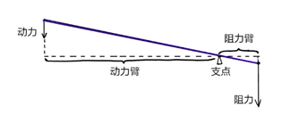
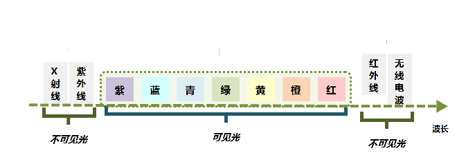
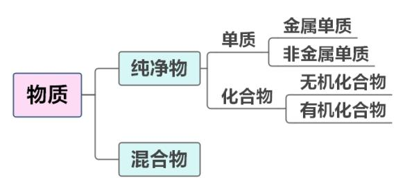

# 第一篇　文史常识

## **第一章　历史常识**

**[一、中国古代史]{.mark}**

（一）史前时代

1.旧石器时期

+:----------------------:+:------------------:+:--------------------------:+:-----------------------------------------------------------------------------------------------------------------------------------------------------------------+
|                        | 时间               | 地点                       | 其他                                                                                                                                                             |
+------------------------+--------------------+----------------------------+------------------------------------------------------------------------------------------------------------------------------------------------------------------+
| [元]{.underline}谋人   | 距今170万年        | 云南元谋县                 | 我国境内已知的**最早[人]{.underline}类**。他们已经会制造工具和知道用火。**（猿人）**                                                                             |
+------------------------+--------------------+----------------------------+------------------------------------------------------------------------------------------------------------------------------------------------------------------+
| [北京]{.underline}人   | 距今约70万～20万年 | 北京房山区周口店龙骨山     | 已经会**使用天然[火]{.underline}**，还会**保存[火]{.underline}种**，会制造石器**（北京火）**                                                                     |
+------------------------+--------------------+----------------------------+------------------------------------------------------------------------------------------------------------------------------------------------------------------+
| [山顶]{.underline}洞人 | 距今约3万年        | 北京周口店龙骨山顶部的洞穴 | 使用**打制[石]{.underline}器**，但已经掌握了磨光和钻孔技术，制造出了中国缝制工艺史上的**第一枚[骨]{.underline}针**，有爱美观念，已会**[人]{.underline}工取火**。 |
|                        |                    |                            |                                                                                                                                                                  |
|                        |                    |                            | **（山顶人尸骨）**                                                                                                                                               |
+------------------------+--------------------+----------------------------+------------------------------------------------------------------------------------------------------------------------------------------------------------------+

2.新石器时期

+:--------------------------:+:--------------------------:+:--------------------------------------:+:-------------------------------------------------------------------------------------------------------------------------------------------------------------------+
|                            | 时间                       | 地点                                   | 特点                                                                                                                                                               |
+----------------------------+----------------------------+----------------------------------------+--------------------------------------------------------------------------------------------------------------------------------------------------------------------+
| 河姆[渡]{.underline}文化   | 距今七千年至五千年         | **长[江]{.underline}流域**下游以南地区 | 开始种植水稻，**中国是世界上最早掌握栽培[水]{.underline}稻技术的国家**。**骨耜**是河姆渡人从事水稻种植的主要生产工具。**（渡江水）**                               |
+----------------------------+----------------------------+----------------------------------------+--------------------------------------------------------------------------------------------------------------------------------------------------------------------+
| [红]{.underline}山文化     | 距今五六千年前             | 内蒙古中南部至东北西部一带             | 发现了**彩陶**和精美的**玉雕，**如**玉猪[龙]{.underline}（红龙）**                                                                                                 |
+----------------------------+----------------------------+----------------------------------------+--------------------------------------------------------------------------------------------------------------------------------------------------------------------+
| [仰]{.underline}韶文化     | 公元前5000年至公元前3000年 | **黄河中游**地区                       | 生产工具以磨制石器为主，作物为**粟和黍**。我国是世界上**最早[种]{.underline}植[粟]{.underline}的国家**。**半[坡]{.underline}遗址**是仰韶文化的代表（母系氏族公社） |
|                            |                            |                                        |                                                                                                                                                                    |
|                            |                            |                                        | **（阳坡种栗）**                                                                                                                                                   |
+----------------------------+----------------------------+----------------------------------------+--------------------------------------------------------------------------------------------------------------------------------------------------------------------+
| 大汶[口]{.underline}遗址   | 距今约四五千年             | 山东省泰安市大汶口镇                   | 大汶口文化时期陶器开始有了黑陶和白陶，开始养蚕缫丝。我国是**最早发明[养蚕]{.underline}和[丝织]{.underline}**的国家。**（养蚕织丝糊口）**                           |
|                            |                            |                                        |                                                                                                                                                                    |
| （**父系氏族**公社初期）   |                            |                                        |                                                                                                                                                                    |
+----------------------------+----------------------------+----------------------------------------+--------------------------------------------------------------------------------------------------------------------------------------------------------------------+
| [龙]{.underline}山文化遗址 | 距今约4600年至4000年       | 山东章丘县龙山镇。                     | 出土了很多黑陶和其他器物，故龙山文化也称为**"[黑]{.underline}陶文化"（黑龙）**                                                                                     |
+----------------------------+----------------------------+----------------------------------------+--------------------------------------------------------------------------------------------------------------------------------------------------------------------+

3.炎帝、黄帝与尧、舜、禹

**炎黄子孙**："炎"指炎帝，"黄"指黄帝。炎黄二帝为中华文化的**人文始祖**。

**涿鹿之战：炎帝部落和黄帝部落**联合与东方的**蚩尤部落**大战于涿鹿之野，蚩尤战败被杀，史称**"涿鹿之战"**。涿鹿之战对于古代华夏族由**野蛮时代**向**文明时代**的转变产生过重大的影响。

**禅让制：**尧舜禹时期，部落联盟实行各部落首领推选部落联盟首领的制度。这种制度被称为"禅让制"。

**大禹治水：**大禹从鲧治水的失败中汲取教训，改变了"堵"的办法，对洪水进行疏导，长年在外与民众一起奋战，置个人利益于不顾，**"三过家门而不入"**。

（二）先秦时期

1.夏

**奴隶制的开始**：约公元前21世纪，禹的儿子启继承了王位，"公天下"变成了"家天下"，**世袭制**代替了禅让制，建立了我国历史上**第一个奴隶制国家**。

**二里头文化：河南偃师二里头村**陆续发现了一批宫殿遗址，其地域和距今年代正和史籍上记载的**夏朝**相符。这一文化代表被称为**"二里头文化"**。

**少康中兴：**少康在有虞氏的帮助下，击败东夷族有穷氏，夏朝复国，史称**"少康中兴"**。少康中兴是中国历史上**首个出现以"中兴"二字命名**的时代。

**鸣条之战：**夏**桀**在位期间不理朝政，整日享乐，商汤联合各方讨伐，最终在鸣条击败夏桀，鸣条之战后，商汤在亳（今商丘一带）称王，**夏朝灭亡**，夏桀逃至南巢被杀。

2.商

**商朝建立：**夏朝末年，商汤起兵，推翻夏朝，建立商朝，定都**亳城（今商丘）**。

**盘庚迁殷：**盘庚继位前，商的都城从最开始的亳，一共迁移了五次。公元前1298年，商王盘庚把都城迁到**殷（今河南安阳）**，商朝从此稳定下来。

**牧野之战：周文王姬昌**，在众方国的帮助下举兵伐纣，后期文王崩，其子**周武王**继续率军伐纣，最终两军决战于牧野，纣王军队纷纷倒戈投向周朝，周武王攻进朝歌，商朝灭亡，史称**"牧野之战"**。

3.西周

**西周建立：周武王**建立周朝，定都于镐，又称"镐京"，史称"西周"。

**西周灭亡：**周幽王宠爱褒姒，废原太子宜臼及其母申后，改立褒姒子伯服为太子。宜臼逃到母家申侯处，幽王讨伐申侯，申侯就联合缯（即曾）、犬戎共同伐周。犬戎杀幽王、伯服于骊山之下，公元前771年，西周灭亡。

4.春秋战国

**平王东迁：**平王在即位后第二年（公元前770年），在郑、秦、晋等诸侯的护卫下，将国都迁至**洛邑（今河南洛阳）**，开始了东周的历史。

**春秋五霸**：齐桓公**（尊王攘夷）**、宋襄公、晋文公**（城濮之战、退避三舍）**、秦穆公**（秦晋之好）**、楚庄王（**问鼎中原、一鸣惊人）**，史称"春秋五霸"。

**吴越之争：**吴越之争是指历史上春秋末期吴越两国互相征伐的一段时期。最终越王勾践带领越国击败吴国，成为春秋时期最后一位霸主。（**卧薪尝胆**）

**春秋战国分水岭：**三家分晋、田氏代齐。

**战国七雄：**齐、楚、燕、韩、赵、魏、秦。

**商鞅变法：秦孝公**任用商鞅变法。变法主要内容：**废井田，开阡陌，承认土地私有；奖励军功，按功授爵；建立县制；奖励耕织，禁止弃农经商**。（徙木立信）

**主要战役：**桂陵之战**（围魏救赵）**、马陵之战**（增兵减灶）**、长平之战**（纸上谈兵）**。

5.先秦时期主要制度

**西周四大制度：**分封制、宗法制、井田制、礼乐制。

**初税亩：**初税亩是**鲁国**在宣公十五年（公元前594年）实行的按亩征税的田赋制度，它是**承认土地私有合法化**的开始。

6.先秦时期的社会经济

**农业：**春秋战国时期，人们开始使用**铁农具和牛耕**并将其逐渐推广。

**青铜器：后母戊鼎（司母戊鼎）**出土于**河南安阳**，是商王祖庚或祖甲为祭祀其母戊所制，是商周时期青铜文化的代表作，现藏于中国国家博物馆，是世界迄今出土**最大最重的青铜器**，享有**"镇国之宝"**的美誉。

**水利工程：**春秋时楚相孙叔敖修**芍陂**；韩国水工**‌郑国**‌为秦国设计**郑国渠**。

**都江堰：**战国秦国蜀守李冰修**都江堰**，立下**"川西第一奇功"**，都江堰是**世界最古老的水利工程**，它使成都平原变成**"水旱从人，不知饥馑"，**有**"天府之国"**美称。

（三）秦汉

1.秦

**秦朝建立：**从公元前230年到公元前221年，秦王嬴政陆续灭掉六国**（韩、赵、魏、楚、燕、齐）**，建立起我国历史上**第一个统一的中央集权的封建国家**------秦朝，定都**咸阳**。

**秦朝加强统治**：

政治：皇帝制度、**三公九卿制（三公：丞相、太尉、御史大夫）**、**郡县制**。

军事：秦始皇派蒙恬**北击匈奴**，修筑长城。

思想：焚书坑儒。

经济：统一**度量衡**、**货币（圆形方孔钱）、文字（小篆）**；统一车轨，修建驰道。

**陈胜吴广起义：**公元前209年，陈胜、吴广在大泽乡起义，提出**"王侯将相宁有种乎"**的口号，**"伐无道，诛暴秦"**。陈胜、吴广起义是**中国历史上第一次大规模的农民战争**。

**巨鹿之战：**秦末大起义中，项羽率领数万楚军，同秦军主力在巨鹿（今河北平乡）进行的一场重大决战性战役，项羽**破釜沉舟**，大大激发了楚军将士的决心，最终**以少胜多**，取得了战争的胜利。**（破釜沉舟、作壁上观）**

**楚汉之争：**秦亡，项羽自称西楚霸王，封刘邦为汉王。此后，刘邦与项羽进行了四年争夺统治权的战争，史称**"楚汉战争"**。最后，项羽垓下被围，兵败自刎。

**相关典故：**项羽：**四面楚歌**；韩信：背水一战、**多多益善**、胯下之辱、一饭千金、**国士无双**、成也萧何败也萧何；刘邦：明修栈道暗度陈仓、**约法三章**。

2.西汉

**西汉建立：**公元前202年，刘邦称帝，以"汉"为国号，定都**长安**，史称**西汉**，刘邦为**汉高祖**。

**文景之治：**西汉**文帝、景帝**实行**无为而治**的政策，出现汉代第一个治世。

**七国之乱：汉景帝**采用**晁错**的《削藩策》，先后下诏削夺楚、赵等诸侯国的封地。以吴王刘濞为首的刘姓宗室诸侯王，以**"清君侧"**为名发动叛乱。由于梁国的坚守和汉将周亚夫所率汉军的进击，叛乱在三个月内被平定。

**汉武盛世：**汉武帝接受董仲舒的建议**"罢黜百家，独尊儒术"**，儒学成为西汉的统治思想；**卫青、霍去病**大破匈奴；**张骞**出使西域，开辟**丝绸之路**，史称"凿空之旅"；采纳主父偃的建议，颁布**"推恩令"**削弱王国势力。

**西域都护府**：汉宣帝时期，始设**西域都护**，是**新疆**地区正式归属中央统辖的开始。

**王莽篡汉：**公元8年，王莽废西汉末帝，建立**新朝**，**西汉灭亡**。之后王莽**"托古改制"**，开始进行全面社会改革，包括土地改革、币制改革、商业改革和官名县名改革等，史称**"王莽改制"**。公元23年王莽政权在赤眉、绿林起义下覆灭。

3.东汉

**东汉建立：**公元25年6月，**刘秀**即皇帝位（光武帝），沿用汉国号，后定都**洛阳**，史称**东汉**。

**光武中兴**：东汉**刘秀**称帝后采取安抚的统治方法，社会繁荣，史称光武中兴。

**黄巾起义：**东汉末年朝廷腐败、宦官外戚争斗不止、边疆战事不断，巨鹿人**张角**号召百姓起义，纷纷揭竿而起，他们头扎黄巾，高喊"苍天已死，黄天当立，岁在甲子，天下大吉"的口号，史称**"黄巾起义"**。

4.秦汉时期的社会经济

**农业：**汉武帝时，**赵过**推广牛耕，创造**"耦犁"**。东汉末，**毕岚**造**龙骨水车**，也是一种灌溉用的工具，也叫**"翻车"**。**"代田法"**的发明与推广，是汉代耕作技术的一次突破。

**手工业：**东汉南阳太守**杜诗**发明**水排**，利用水力鼓风冶铁。**西汉时期**已发明了麻纸，**东汉蔡伦**进一步改进造纸术。

**水利工程：**秦统一后，‌史禄‌主持开凿**灵渠**，用于征服岭南。

（四）三国两晋南北朝

1.三国分立

**官渡之战：**200年，曹操以少量兵力同袁绍的10多万大军在官渡决战。曹操亲率5千精兵夜袭乌巢，烧毁袁绍的军粮，并乘胜追击，大败袁绍，史称**"官渡之战"（以少胜多）**。官渡之战**为曹操统一北方奠定了基础**。

**赤壁之战：**208年，曹操率20多万大军南下，与孙权、刘备5万联军在赤壁决战。孙刘联军使用**火攻**，曹军大败，退守北方，这一战役史称**"赤壁之战"（以少胜多）**。赤壁之战**为三国鼎立局面的形成奠定了基础**。（**草船借箭、万事俱备只欠东风**）

**夷陵之战：**公元221年，刘备为夺回荆州，为关羽报仇，亲率大军攻打东吴。东吴陆逊**"火烧连营七百里"**，打败刘备。

**三国鼎立：**220年，**曹丕**称帝，定都**洛阳**，建立**曹魏**。221年，**刘备**称帝，定都**成都**，建立蜀汉。229年，**孙权**称帝，定都**建业**，建立**东吴**。

2.两晋

**西晋短暂统一：**265年，魏权臣**司马炎**发动宫廷政变夺取魏政权，建立**晋朝**，定都**洛阳**，史称**西晋**。316年，匈奴兵攻占长安，西晋亡。西晋的统一前后仅36年。

**东晋建立：**公元317年，镇守建康（今江苏南京）的晋宗室**司马睿**在江南重建晋室，史称**东晋**。

3.五胡十六国及南北朝

**五胡十六国：**西晋灭亡后，北方众多少数民族入主中原，以**匈奴、鲜卑、羯、氐、羌**为主，统称**"五胡"**。他们在这个范围内相继建立许多国家，北魏史学家崔浩取其中十六个国家来代表这段时期，称这个时期为**"五胡十六国"**。

**淝水之战：**经过一系列征战，**氐族人**逐渐统一北方，建立**前秦**。公元383年，前秦皇帝**苻坚**讨伐东晋，东晋在**谢安**等领导下大败前秦，史称**"淝水之战"（以少胜多）**。此役确立了南北长期对峙的局面。（**风声鹤唳、草木皆兵、投鞭断流、东山再起**）

**南朝：**公元420年，东晋大将**刘裕**废东晋皇帝，自立为帝，国号**宋**。此后的近170年间，南方又先后出现了**齐、梁、陈**三个朝代，都城均在**建康**，史称**南朝**。

**北朝：**公元386年，鲜卑族**拓跋珪**建立**北魏**，逐步统一北方。6世纪，北魏分裂成**东魏和西魏**。后来，东魏和西魏又各为**北齐和北周**所代替。北方的这五个朝代总称**北朝**，南朝和北朝并存，称**南北朝**。

**北魏孝文帝改革：**颁布**均田令**，农民须向国家交纳租、调，服徭役和兵役；为接受汉族文化，494年**迁都洛阳**；改革鲜卑旧俗，**着汉服**，**学说汉话**，**采汉姓**，**提倡与汉族通婚**。

4.三国两晋南北朝的社会经济

**农业：**江南农业的开发从江东扩展到整个长江流域，进而波及岭南和闽江流域，**三吴地区**最为发达。江南经济开发使南北经济趋向平衡，**为以后我国经济重心的南移奠定了基础**。

**手工业和商业：**三国两晋南北朝后，南方和北方所烧**青瓷**开始各具特色。北朝可以烧出成熟的**白瓷**。曹魏在纺织业中心襄邑、洛阳等地设有专门的制造机构，吴国的八辈之蚕，缫丝质量很高，**蜀锦**行销吴、魏。

（五）隋唐

1.隋

**隋朝统一：**581年，北周外戚**杨坚**废周自立，改国号为**隋**，定都**长安**，年号**开皇**，杨坚即**隋文帝**。

**开皇之治：**隋文帝**杨坚**在位期间，国力强盛，史称"开皇之治"。

**隋朝灭亡：隋炀帝**继位以后，滥用民力，滥行诛杀，人民赋役繁重，社会经济遭到了严重破坏，迫使农民不断起义（河南有翟让、李密的瓦岗起义军；河北有窦建德的起义军；江淮地区以杜伏威、辅公祏的起义军）。618年**宇文化及**等人发动江都兵变，**缢杀隋炀帝**，隋朝灭亡。

2.唐

**唐朝建立：**618年，**李渊**正式称帝，建立**唐朝**，定都**长安**，年号武德，是为**唐高祖**。

**玄武门之变：**626年，李渊次子**李世民**发动**玄武门之变**，登基为**唐太宗**，年号**"贞观"**。

**贞观之治：**唐太宗**李世民**在位期间，国力增强，史称"贞观之治"。

**贞观遗风：武则天**时期，社会经济继续发展，史称"贞观遗风"。郭沫若称她**"政启开元，治宏贞观"**。

**开元盛世：**唐玄宗**李隆基**统治的前期，国家空前繁荣富强，史称"开元盛世"。

**安史之乱：**755年，**安禄山与史思明**起兵叛唐，是唐朝**由盛至衰**的转折点。757年，郭子仪、李光弼率唐军在回纥兵的帮助下收复洛阳、长安，763年彻底打败叛军，持续八年的"安史之乱"结束。

**黄巢起义与唐朝灭亡：**唐朝后期，土地兼并十分严重。山东、河南等地连续发生水旱灾害。**875年，爆发黄巢军起义**。黄巢大起义后，唐朝的统治已虚弱不堪，地方上的藩镇势力又有所发展。天祐四年（907年），**朱全忠（朱温）**废黜唐哀帝，改国号为**梁**，史称**"后梁"**，年号开平，建都**开封**。唐至此灭亡。

3.隋唐时期的主要制度

**科举制：**

**隋炀帝时**，正式设立**进士科**，科举制度**正式创立**。

唐太宗贞观时，增加了考试科目，以**进士、明经**两科为主。

武则天时，大量增加科举取士的人数，还首创了**武举和殿试**。

唐玄宗开元年间，任用高官主持考试，提高了科举考试的地位，以后成为定制。

宋朝时期，采用**糊名法**与**誊录制度**。

明清时期开始采用**八股取士**，科举制度弊端显现。

**三省六部制：**隋朝以**尚书省、内史省、门下省**为中央政府最高统治机构。唐朝三省是指**中书省、门下省、尚书省**。三省分工明确，中书省负责草拟和颁布皇帝诏令；门下省掌审议，负责审核政令：尚书省"事无不总"，负责执行国家的政令。尚书省下设**吏、户、礼、兵、刑、工**六部，三省长官都是宰相，相互牵制，都对皇帝负责。

**租庸调制：**唐朝实行租庸调制。成年男子每年向官府缴纳一定的谷物，叫**"租"**；缴纳定量的绢和布，叫**"调"**；服徭役的期间内，不去服役的可以纳绢或布代役，叫**"庸"**。

**两税法：**天宝年间，土地买卖和兼并之风盛行，780年，**唐德宗**接受宰相杨炎的建议，实行两税法。规定每户按资产和田亩交税，取消一切杂税、杂役；一年分**夏季和秋季**两次收税。

4.隋唐时期的社会经济

**工程建设：**

为加强南北交通，巩固隋朝对全国的统治。公元605年，开始**开凿大运河**。大运河以洛阳为中心，**北至涿郡**，**南到余杭**，从北到南分**永济渠、通济渠、邗沟、江南河**四段，沟通了**海河、黄河、淮河、长江、钱塘江**五大水系。

隋朝工匠**李春**设计建造**赵州桥**，是**现存世界上最古老的一座石拱桥**。

**农具：**

唐朝时期，江东地区出现**曲辕犁**。它的出现是我国**耕作农具成熟的标志**。

唐朝时创制了**筒车**，筒车亦称"水转筒车"，是一种以水流作动力，取水灌田的工具。宋以后逐渐推广。

**制瓷业：**

**南青**指的南方浙江的**越窑青瓷**，被称为**"诸窑之冠"**。唐代出现青瓷中著名的**秘色瓷**。

**北白**指的是北方河北的**邢窑白瓷**。

唐三彩，全名**唐代三彩釉陶器**，是盛行于唐代的一种低温釉陶器，釉彩有黄、绿、白、褐、蓝、黑等色彩，而以**黄、绿、白三色**为主。

5.隋唐时期的外交

**吐蕃：**七世纪初，吐蕃强大起来，唐太宗把**文成公主**嫁给吐蕃**松赞干布**，与吐蕃建立了良好的关系。公元710年，唐中宗又把金城公主嫁给吐蕃赞普尺带珠丹。

**印度：**贞观元年（627年），**玄奘**到**天竺**求经，携带六百五十七部佛经返回长安。并以亲身经历写成**《大唐西域记》**一书。唐太宗时派人到天竺学习**熬糖法**，印度的医学、绘画、历法、舞蹈等在唐朝时传入中国。**我国造纸术也通过尼泊尔传入印度。**

**日本：鉴真东渡**日本传播唐文化，除讲授佛经外，还详细介绍中国的医药、建筑、雕塑、文学、书法、绘画等技术知识，对中日经济文化交流作出了重大贡献。日本为了学习中国文化，先后向唐朝派出十三次**遣唐使团**，其中包括众多的留学生和留学僧。

（六）五代、辽、宋、夏、金、元

1.五代十国

从907年节度使朱全忠（朱温）废唐建立后梁，到960年北宋建立，黄河流域相继有**后梁、后唐、后晋、后汉、后周**五个朝代更替，史称**"五代"**。

同时，在南方各地和北方的山西出现过10个割据政权交替并存，总称**"十国"**。979年，北宋**赵光义**灭北汉，**五代十国时期结束**。

2.辽

契丹是我国北方一个古老的少数民族。10世纪初，辽太祖**耶律阿保机**统一契丹各部，并于916年称帝，建**契丹国**。947年，契丹改国号为**辽**。

公元1125年被**金国**所灭。

3.北宋

**陈桥兵变：**960年，后周大将**赵匡胤**发动陈桥兵变，黄袍加身，建立宋朝，定都**东京**（今河南**开封**），史称**北宋**。赵匡胤就是**宋太祖**。

**澶渊之盟：**1004年，**宋真宗**时期与辽签订澶渊之盟，标志着宋辽战争结束。主要内容：北宋每年向辽输纳银十万两、绢二十万匹；双方约为**兄弟之国**。

**庆历新政：宋仁宗**庆历年间，以**范仲淹、欧阳修**等人为首，为解决阶级矛盾和民族矛盾等问题颁布的一系列措施，其中包括**官员考核制度、厚农桑、减徭役**等内容。史称"庆历新政"。但最后只推行了不到一年就被废止。

**王安石变法：宋神宗**时期，任用**王安石**为参知政事，为富国强兵，改变积贫积弱的现状，1069年开始推行变法。具体内容：经济上采取**均输法、市易法**；农业上采取**农田水利法、方田均税法、青苗法、募役法**；军事上采取**保甲法、将兵法、保马法、军器监**。

**靖康之耻：**1127年，宋靖康二年，金军攻破东京（今开封），俘虏了**宋徽宗、宋钦宗**父子及大量赵氏皇族、后宫妃嫔与贵卿、朝臣等三千余人，押解北上，史称**"靖康之耻"**，**北宋灭亡**。

**北宋加强中央集权：**

集中军权：**"杯酒释兵权"**，解除禁军将领的兵权。设置**枢密院**，主管全国军政，与将领互相牵制。实行**"更戍法"**，使得"兵无常帅，帅无常师"。

中央分相权：设**枢密使、参知政事、三司使**分别分割宰相的**军权、行政权、财政权**。

集中财权：设**转运使**把地方财富运到中央。

集中司法权：派**文臣**出任州郡长官，设**通判**监督。

4.西夏

西夏是**党项族**建立的政权，居住在宁夏、甘肃和陕西西北一带，过着游牧生活。1038年，**元昊**称大夏国皇帝。西夏政权建立后，与北宋多次发生战争。

公元1227年，蒙古灭夏。

5.金

金朝是**女真族**建立的统治中国东北和华北地区的封建王朝。金太祖**完颜阿骨打**在统一女真诸部后，1115年于**会宁府**（今黑龙江哈尔滨市阿城区）建都立国，国号**大金**。1234年，金朝在南宋和蒙古南北夹击之下灭亡。

6.南宋

**南宋的建立：**1127年，赵构在应天**（河南商丘）**称帝，后定都**临安（杭州）**，史称南宋。

**绍兴和议：**1141年，宋高宗解除**岳飞**等人的兵权，与**金**签订绍兴和约。至此，宋金南北对峙的局面最后确立。主要内容：①南宋向金称臣；②东起淮水，西至大散关，都属于金的领土；③南宋每年向金纳银25万两，绢25万匹。

**嘉定和议：**1206年，金军又大军南下，大败南宋军队。1208年双方签订**嘉定和约**。主要内容：①双方约为伯侄之国；②疆界与绍兴时相同（金放弃新占领的大散关、濠州等地）；③南宋每年向金纳银30万两，绢30万匹；④南宋另给金军犒军银（赔款）300万两。

**南宋灭亡：**1276年，蒙古军攻入临安，文天祥、陆秀夫等人携幼帝逃入崖山，蒙古军紧追不舍。1279年，**崖山海战**宋军战败，陆秀夫背着宋末帝**赵昺**跳海而亡，南宋覆灭。

7.元

**铁木真统一蒙古：**1206年，**铁木真**统一蒙古各部，建立蒙古政权，被尊称为"**成吉思汗**"。

**忽必烈建立大元：**1271年，铁木真之孙忽必烈建国号为大元，定都**大都（今北京）。**元是中国**第一个由少数民族建立的全国统一政权**，疆域达中国历史最大范围。

**元朝灭亡：**1368年，以**朱元璋**为首的北伐军攻占元大都，元朝灭亡。

**元朝的重要制度：**

行省制度：中央设立**中书省**作为中央最高的行政机构，总理全国政务。地方设**行中书省**，简称**"行省"**，由中央委派官员管理。**我国省级行政区的设立始于元朝**。

澎湖巡检司：元政府设置**澎湖巡检司**，负责管辖**澎湖和台湾**。

宣政院：元朝中央政府设置了**宣政院**，专门管理全国**佛教事务**和**西藏地区的行政事务**。**西藏成为元朝正式的行政区**。

8.五代、辽、宋、夏、金、元的社会经济

**农业：**太湖流域的**苏州、湖州**成为重要的粮仓，有**"苏湖熟，天下足"**之称。从越南引入了优良品种**占城稻**，水稻在宋朝跃居粮食产量首位；**棉花**在两宋时期逐渐成为重要的经济作物，由两广、福建扩展到长江流域。

**制瓷业：**宋朝时，中国制瓷技术大放异彩，瓷窑遍布全国，并出现了**汝、官、哥、钧、定**五大名窑。汝瓷属**五大名窑**之首，以**青瓷**为主，"釉色天青色""蟹爪纹""香灰色胎"**"芝麻挣钉"**等是鉴别汝窑的重要依据。官窑，主要为**素面**，其**胎色铁黑、釉色粉青**，**"紫口铁足"**。哥窑将**"开片"**的美发挥到了极致，产生了**"金丝铁线"**这一哥窑的典型特征。钧窑典型特征就是**"蚯蚓走泥纹"**。定窑是宋代五大名窑中**唯一烧造白瓷**的窑场。

**丝织业：**元成宗时期，松江人**黄道婆**带来了棉纺织技术和工具，从此松江地区的棉纺织品声名远扬。

**造船业：**宋朝时我国是世界上**造船水平最先进**的国家；这一时期，我国的造船业多集中在东南沿海，规模宏大，广州、泉州、明州等地都有发达的造船业。

**商业：**北宋时，**交子**是中国最早由政府正式发行的纸币，也被认为是**世界上最早使用的纸币**。宋朝时，城市中**坊和市的界限被打破**，市分散在城中，城郊和乡村的"草市"也更加普遍。旧时日中为市的经营时间限制被打破，**早市、夜市昼夜相交**，交易活动不再受官府的直接监管。元朝时，**泉州**是重要的对外贸易港口，被誉为当时世界第一大港。

（七）明清

1.明

**明朝建立：**1368年，朱元璋称帝，建立明朝，建元洪武，建都**应天府（今南京）**明朝统治开始。明朝也是我国**第一个由南方统一北方**的全国性封建政权。

**洪武之治：**明太祖在位时期，社会经济得到恢复和发展，史称"洪武之治"。

**靖难之役：**1398年，朱允炆继位，燕王**朱棣**打出**"靖难"**旗号，起兵反对建文帝，史称"靖难之役"。

**永乐盛世：**朱棣得胜即皇帝位，年号永乐，是为明成祖。朱棣登基之后，**迁都北京**。成祖期间，编写**《永乐大典》**，派**郑和下西洋**，规模空前，史称"永乐盛世"。

**郑和下西洋：**明成祖**朱棣**派**郑和**出使西洋，从1405---1433年，郑和先后**七下西洋**，最远到达**非洲东海岸和红海沿岸。**

**仁宣之治：明仁宗朱高炽**和**明宣宗朱瞻基**采取了宽松治国和息兵养民的政策，使得吏治清明，经济发展，社会稳定的时期。后世称之为**"仁宣之治"**。

**土木之变：**1449年，蒙古瓦剌部首领也先率军南下侵明。王振怂恿英宗集结五十万军队御驾亲征。大军回师至土木堡时，被瓦剌军追上，士兵死伤过半，英宗被俘，王振为乱军所怒杀，史称"土木之变"，是**明朝由盛转衰的转折点**。

**戚继光抗倭：**明朝中期，海防松弛，倭寇骚扰我国沿海地区。明朝将领戚继光受命到浙东抗倭，训练出作战勇敢，纪律良好的"戚家军"。1561年戚继光在浙东台州九战九捷，全歼该地倭寇，后进入福建、广东，与俞大猷合作抗倭，至1565年，东南沿海倭寇肃清。

**李自成农民起义：**明朝末年爆发农民起义，李自成农民军提出**"均田免粮"**口号。1644年，李自成攻入北京推翻明朝，**崇祯帝**自缢，明朝灭亡。

**明朝的主要制度**

废丞相：**明太祖**为巩固统治，借胡惟庸案废除丞相制度。在中央**废丞相**，裁撤中书省，把相权分给尚书六部，尚书直接对皇帝负责。

建内阁：**明成祖**时，殿阁大学士开始入值文渊阁并参与机密事务的决策，**"内阁"**由此出现。

设三司：各省设立三司，即**承宣布政使司、提刑按察使司、都指挥使司**，分掌**行政、司法和军政**，都直属中央。

厂卫制度：明太祖设立**锦衣卫**，负责侦察、逮捕、审讯，直接听命于皇帝。明成祖设立**东厂**，明宪宗设立**西厂**。

一条鞭法：明朝大学士**张居正**主持推行，把原来田赋、徭役、杂税合并，折成银两分摊在田亩上，**按田亩多少收税**。

八股取士：明朝规定以**八股文**取士，以**四书五经**为内容进行考试，其中以朱熹的注为依据，限制了考生的思想范围。又扩大了科举录取的人数。

2.清

**清朝建立：**1616年，建州女真首领**努尔哈赤**统一女真各部，建立**后金**。1636年，**皇太极**在盛京称皇帝，改国号为**清**，改女真族名为**满洲**。1644年，清军入关，**迁都北京**，逐步建立起对全国的统治。

**三藩之乱：**康熙年间，平定**平西王吴三桂、平南王尚可喜、靖南王耿精忠**三藩叛乱，维护了清朝的统治。

**郑成功收复台湾：**荷兰殖民者侵占我国台湾。1661年**郑成功**打败荷兰殖民者。

**清朝收复台湾：**1681年至1683年，清廷派**施琅**率兵攻取台湾，公元1684年，正式设台湾府。

**《尼布楚条约》：**17世纪中期，沙俄入侵占我国黑龙江流域，清政府于1685年和1688年进行反击，取得了雅克萨之战的胜利，1689年中俄经过**平等协商**签订了**第一个边界条约《尼布楚条约》**，这个条约从法律上肯定了黑龙江和乌苏里江流域包括库页岛在内的广大地区，都是中国的领土。

**康乾盛世**：从康熙到乾隆年间空前巩固，经济繁荣，国力强盛，史称康乾盛世。

**清朝的主要制度**

八旗制度：努尔哈赤统一女真各部，建立**正黄、正白、正红、正蓝四旗，后增编镶黄、镶白、镶红、镶蓝四旗**。把后金管辖下的所有人都编在旗内。

军机处：**雍正帝**时设立**军机处**，军机大臣完全听命于皇帝，辅助皇帝处理政务。军机处的设置标志着**君主专制制度发展到顶峰**。

理藩院：理藩院是清朝政府统治**蒙古、回部及西藏**等少数民族的最高权力机构。又在西藏专设**驻藏大臣**，与理藩院无隶属关系，直接归皇帝管辖。

摊丁入亩：**雍正**时推行**"摊丁入亩"**，把丁税平均摊入田赋中，征收统一的地丁银。封建国家对农民的人身控制进一步松弛。

闭关锁国：闭关锁国从明朝就开始初步实行。清朝闭关政策最为严重是在**乾隆、嘉庆**时期。

3.明清时期的社会经济

**农业**：**明中后期**从海外引进了原产美洲的**玉米和甘薯**，还引进**花生、烟草等**经济作物和**南瓜、番茄、辣椒**等蔬菜品种，农业经济作物的种植面积在日益扩大。

**手工业**：清代，江西**景德镇（瓷都）**仍是全国制瓷业的最大中心。清代的**青花、五彩、素三彩和粉彩、珐琅彩**等都很有名。其中尤以**粉彩和珐琅彩**最称精美，驰名中外。

**资本主义萌芽**：明朝中后期，纺织业中出现了以生产商品为目的的机户，雇佣工人为他劳动，这就是资本主义的萌芽。

**[二、中国近代史]{.mark}**

（一）鸦片战争

**虎门销烟：**道光十九年（1839年），**林则徐**在广州虎门海滩销毁鸦片是鸦片战争爆发的**导火索（直接原因）**。

**三元里抗英**：1841年5月，广州**三元里**一带百姓数千人向英军发起讨伐，大败英军。这是**中国近代史上第一次民众大规模自发保卫家园抵抗外来侵略的战斗**。

**《南京条约》：**1842年8月，中英签订了中国近代史上**第一个不平等条约**\--《南京条约》。条约规定：割让**香港岛**给英国；赔款2100万银元；开放**广州、厦门、福州、宁波、上海**为通商口岸；**"协定关税"**。**中国开始沦为半殖民地半封建社会**。

**睁眼看世界**：**林则徐**，组织翻译编写《四洲志》等，被称为中国**"开眼看世界的第一人"**。**魏源**，编成**《海国图志》**，并提出**"师夷长技以制夷"**的思想。

（二）太平天国运动

**金田起义**：1851年1月，**洪秀全**率领拜上帝教教众在**广西省桂平县金田村**发动起义，建号太平天国。1853年3月，太平军攻克南京，改名**天京**，定为**太平天国首都**。

**天京事变：**1856年9月，发生了**天京事变**，**东王杨秀清、北王韦昌辉**先后被杀，**翼王石达**开率部出走后败亡。天京事变严重削弱了太平天国的领导和军事力量，**成为太平天国由盛而衰的分水岭**。

**运动失败：**1864年6月，洪秀全病故。7月，天京被湘军攻破，太平天国运动失败。

**《天朝田亩制度》**："有田同耕，有饭同食，有衣同穿，有钱同使"。政策具有空想性，最后没有实现。

**《资政新篇》**：洪仁玕提出，主张学习西方，兴办工厂、矿山、报社、铁路、银行等设施，**近代中国最早提出的发展资本主义的近代化纲领**。

（三）第二次鸦片战争

**原因：**英国借口**"亚罗号"事件**，法国借口**"马神甫"事件**，趁中国太平天国运动之际，发动侵华战争。

**结果：**清政府又陆续与英法签订了**《天津条约》（英法俄美）**和**《北京条约》（英法俄）**

**火烧圆明园**：1860年10月，英法联军抢劫焚烧了号称万园之园的圆明园。

（四）洋务运动

**洋务派**：中央以**奕䜣**为代表，地方以**曾国藩、李鸿章、左宗棠、张之洞**为代表。

**指导思想**：前期洋务派以**"自强"**为旗号，后期打出**"求富"**的旗号。**"师夷长技以自强"**。**"中学为体，西学为用"**：最早由**冯桂芬**提出。

**军事工业与民用工业：**

+:--------:+:----------------------------------------:+:------------:+:-----------:+
| 类型     | 名称                                     | 人物         | 地点        |
+----------+------------------------------------------+--------------+-------------+
| 军用工业 | **安庆内军械所（中国第一个近代军工厂）** | 曾国藩       | 安徽        |
|          +------------------------------------------+--------------+-------------+
|          | **江南制造总局（上海、规模最大）**       | 李鸿章       | 上海        |
|          +------------------------------------------+              +-------------+
|          | 金陵机器局                               |              | 南京        |
|          +------------------------------------------+--------------+-------------+
|          | 福州船政局                               | 左宗棠       | 福州        |
|          +------------------------------------------+--------------+-------------+
|          | 天津机器制造总局                         | 崇厚         | 天津        |
+----------+------------------------------------------+--------------+-------------+
| 民用工业 | 轮船招商局                               | 李鸿章       | 上海        |
|          +------------------------------------------+              +-------------+
|          | 开平矿务局                               |              | 河北        |
|          +------------------------------------------+              +-------------+
|          | 天津电报局                               |              | 天津        |
|          +------------------------------------------+--------------+-------------+
|          | 汉阳铁厂                                 | 张之洞       | 湖北        |
|          +------------------------------------------+              |             |
|          | 湖北织布局                               |              |             |
+----------+------------------------------------------+--------------+-------------+

**近代海军：**80年代中期初步建成**北洋、南洋、福建**三支海军，其中又以北洋舰队的实力最为强大。

**新式学堂**：**京师同文馆**。

**运动结局：**甲午中日战争中，北洋海军全军覆没，标志着35年的洋务运动宣告破产。

（五）甲午中日战争

**主要战役**：黄海海战（致远舰管带**邓世昌**牺牲）、威海卫之战（北洋海军提督**丁汝昌**牺牲）。

**《马关条约》**：1895年中日《马关条约》规定割**辽东半岛、台湾、澎湖列岛**给日本；赔偿白银**2亿两**；开放**沙市、重庆、苏州、杭州**为商埠；允许日本在口岸开工厂。

（六）戊戌变法

**公车上书**：1895年，康有为、梁启超等组织公车上书，揭开了戊戌变法的序幕。

**百日维新：**1898年6月11日，光绪皇帝颁布**《定国是诏》**宣布开始变法，并在此后103天中，接连发布一系列新政的政令，史称"戊戌变法"，又称"百日维新"。

**京师大学堂**：中国近代第一所国立大学，中国近代国立高等教育的开端。

**"戊戌六君子"**：**谭嗣同、刘光第、林旭、杨锐、杨深秀、康广仁**。

（七）义和团运动与八国联军侵华

**义和团运动**：19世纪末发生的一场以**"扶清灭洋"**为口号的农民运动。

**八国联军侵华：**1900年5月28日，英国、法国、德国、奥匈帝国、意大利、日本、俄罗斯、美国八国在各国驻华公使会议上正式决定联合出兵镇压义和团，以"保护使馆"的名义，调兵入北京，清政府被迫同意。

**《辛丑条约》**：1901年，清政府与英、美、俄、日、法、德、意、奥、西、比、荷11国签订《辛丑条约》，使中国**完全陷入半殖民地半封建社会的深渊**。主要内容：清政府向各国共赔款**4.5亿两**，以关税、盐税和常关税作担保，分39年还清，年息4厘，**本息共9.8亿两**。划定**北京东交民巷**为使馆界，允许各国**驻兵保护**，不准中国人在界内居住。**列强可以在北京驻扎防守使馆的卫队。**

（八）辛亥革命

**兴中会：**1894年11月24日，孙中山在**美国檀香山**成立了**中国第一个资产阶级革命团体**------兴中会。

**同盟会：**1905年8月，在**东京**成立了中国同盟会，是**中国第一个资产阶级革命政党**。

**同盟会纲领**：驱除鞑虏，恢复中华，创立民国，平均地权。

**三民主义：**民族、民权、民生，其中，**民权主义**是核心。

**武昌起义：**1911年10月10日晚，湖北新军工程第八营的革命士兵，在武昌城头打响了**起义的第一枪**，辛亥革命爆发了。1911年10月11日，湖北军政府成立。武昌起义点燃了全国革命的熊熊烈火，一场全国性的各省"独立"运动爆发了。

**中华民国成立：**1912年1月1日，中华民国在**南京**宣告成立。**孙中山**就任中华民国第一任临时大总统，定国号为**"中华民国"**，**南京**为首都，改用**公元纪年**，1912年为中华民国元年。国旗为**五色旗**。**《中华民国临时约法》**是中国历史上**第一部资产阶级民主宪法**。

**结果：**1912年2月12日，宣统帝退位，清朝覆灭。同年3月，袁世凯在北京就任中华民国临时大总统。辛亥革命的胜利果实落入袁世凯手里。**辛亥革命没有完成反帝反封建的革命任务，中国半殖民地半封建的社会性质没有根本改变**。

**影响**：推翻了清王朝的统治，结束了中国两千多年的封建君主专制制度，使民主共和的观念深入人心。

（九）新文化运动与五四运动

1.新文化运动

**兴起**：1915年陈独秀在上海创办**《青年杂志》（**第二期改名**《新青年》**）。**《新青年》**是新文化运动的主要阵地。**北京大学**是新文化运动的主要活动基地。

**主张**：提倡**科学与民主**，反对愚昧与专制；提倡新道德，反对旧道德；提倡新文学，反对旧文学。

**代表人物：**陈独秀（提出**"打倒孔家店"**，全面否定儒家学说）、蔡元培（思想自由、兼容并包）、胡适（发表**《文学改良刍议》**，用**白话文**代替文言文）、李大钊（**最早传播马克思主义的人**）、鲁迅等。

2.五四运动

**导火索**：1919年，**巴黎和会（凡尔赛和约）**上中国外交的失败。

**力量**：**青年学生**起了先锋作用，**工人阶级**在运动后期发挥主力军作用。

**意义**：促进了马克思主义的传播，是一次彻底的反对帝国主义和封建主义的爱国运动，**中国工人阶级开始登上政治舞台**，是**中国新民主主义革命的开端**。

（十）中国共产党的诞生

**组织基础：**1920年，**陈独秀**在上海成立了**第一个共产党小组**，随后李大钊在北京、毛泽东在长沙、董必武在武汉都建立了共产党早期组织，为中国共产党的成立准备了条件。

**中共一大：**1921年7月23日，中国共产党第一次全国代表大会在**上海**（后转移至**浙江嘉兴南湖**）召开，参加大会的有毛泽东、李达、李汉俊、张国焘、董必武等代表。陈独秀、李大钊分别在广州和北京事务繁忙未出席会议，包惠僧受陈独秀派遣，出席会议。**党的一大的召开标志着中国共产党的成立。（一大立党）**

**中共二大：**1922年7月，中共二大在**上海**召开，制定了党的最高纲领和最低纲领。这是在中国近代史上**第一次明确地提出了彻底的反帝反封建的民主革命纲领**。**（二大立纲）**

（十一）国民大革命

**中共三大**：1923年6月，中共三大在**广州**召开，决定**共产党员以个人身份加入国民党的形式**实现国共合作，同时保持共产党在政治上、思想上和组织上的独立性。**（三大国共要合作）**

**国民党一大**：1924年国民党一大的成功召开，确立**"联俄、联共、扶助农工"**的三大政策，把旧三民主义发展为新三民主义。**标志着第一次国共合作正式形成**，**民主革命统一战线正式建立**。

**中共四大**：1925年1月，中共四大在上海召开，明确地提出了**无产阶级领导权和农民同盟军问题**，第一次规定"凡有党员3人以上均得成立党支部"。**（四大领导工农忙）**

**五卅运动：**1925年，各地工人纷纷罢工，反对帝国主义的侵略。日英等帝国主义残酷镇压罢工工人。5月，又在上海制造了震惊中外的**"五卅惨案"**。这样，在中国掀起了一个以工人阶级为主力的反帝爱国运动高潮------**五卅运动**。其中，影响最大的是**省港大罢工**。

**北伐战争：**1926年，国民政府决定出师北伐。北伐的主要对象是**吴佩孚、孙传芳和张作霖**三个军阀。

**第一次国共合作破裂**：蒋介石和汪精卫先后发动**"四一二"和"七一五"反革命政变**，并在南京建立"国民政府"，第一次国共合作全面破裂。**（革命政变合作裂）**

**中共五大：**1927年，中共五大在武汉召开。大会就土地革命及革命发展方向等问题进行了讨论，**批评了陈独秀报告中的错误**。**（五大批评陈独秀）**

（十二）土地革命

**南昌起义：**1927年8月1日，周恩来等人领导南昌起义，打响武装反抗国民党的**第一枪**。这是中国共产党独立领导革命战争、创建人民军队和武装夺取政权的**开端**。**（南昌打响第一枪）**

**八七会议**：1927年8月7日，中共中央在汉口召开会议，彻底清算了大革命后期**陈独秀的右倾机会主义错误**，确定了**土地革命和武装反抗国民党的总方针**，开始了从大革命失败到土地革命战争兴起的转折。毛泽东在会上提出**"须知政权是由枪杆子中取得的"**。**（八七会议有枪杆）**

**秋收起义**：1927年9月，毛泽东领导的湘边界秋收起义爆发，中国共产党第一次在武装斗争中公开打出了自己的旗号。**（秋收起义举大旗）**

**三湾改编**：1927年9月底开始，毛泽东领导三湾改编，从政治上组织上保证了党对军队的绝对领导，标志着毛泽东建设人民军队思想的开始形成。**（三湾改编党领导）**

**井冈山革命根据地**：1927年10月，毛泽东创建了**第一个农村革命根据地**。**（革命据点井冈山）**

**中共六大**：1928年6月，中共六大在苏联莫斯科举行，集中解决了中国社会性质和革命性质问题和革命形势和党的任务问题，认为当时党的中心工作是做艰苦的群众工作，积蓄力量。**（六大举办莫斯科）**

**古田会议：**1929年12月，在福建上杭古田召开的第九次党的代表大会确立了人民军队建设的基本原则，提出把军队建设成为无产阶级领导的新型人民军队。**（古田会议立原则）**

**中央苏区的建立：**1931年，以赣南、闽西两块根据地为基础创建中央革命根据地，又称"中央苏区"，是**全国最大的革命根据地**。**（苏区最大根据地）**

**红军长征**：红军在第五次反"围剿"中遭到失败，被迫开始长征。1934年10月10日，中共中央、中革军委率领红军从江西省瑞金、古城等地出发。10月17日，中央红军由雩都（今于都）渡贡水。1936年10月红军三大主力会师，宣告红军二万五千里长征胜利结束。**（红军长征两万五）**

**长征路线**：

江西出发------渡过于都河------挺进湘西------冲破四道封锁线------改向贵州------渡过乌江------夺取遵义------**四渡赤水河------巧渡金沙江------强渡大渡河、飞夺泸定桥------翻雪山------过草地------**到达陕北吴起镇------甘肃会宁------将台堡会师。

**试探（四）---软（巧）---硬（强）---明抢（飞夺）---藏（雪山）---吃草**

**遵义会议：**1935年初召开遵义会议，成立由**毛泽东、周恩来、王稼祥**组成的三人军事领导小组。这是中国共产党历史上一个**生死攸关的转折点**。**（遵义会议生死关）**

**长征主要诗作**

+:--------------------------:+:-------------------------------------------+
| 七律·长征                  | 红军不怕远征难，万水千山只等闲。           |
|                            |                                            |
| （毛泽东1935年10月作）     | 五岭逶迤腾细浪，乌蒙磅礴走泥丸。           |
|                            |                                            |
|                            | 金沙水拍云崖暖，大渡桥横铁索寒。           |
|                            |                                            |
|                            | 更喜岷山千里雪，三军过后尽开颜。           |
+----------------------------+--------------------------------------------+
| 十六字令三首               | 山，快马加鞭未下鞍。惊回首，离天三尺三。   |
|                            |                                            |
| （毛泽东1934年至1935年作） | 山，倒海翻江卷巨澜。奔腾急，万马战犹酣。   |
|                            |                                            |
|                            | 山，刺破青天锷未残。天欲堕，赖以拄其间。   |
+----------------------------+--------------------------------------------+
| 忆秦娥·娄山关              | 西风烈，长空雁叫霜晨月。                   |
|                            |                                            |
| （毛泽东 1935年2月作）     | 霜晨月，马蹄声碎，喇叭声咽。               |
|                            |                                            |
|                            | **雄关**漫道真如铁，而今迈步从头越。       |
|                            |                                            |
|                            | 从头越，苍山如海，残阳如血。               |
+----------------------------+--------------------------------------------+
| 清平乐·六盘山              | 天高云淡，望断南飞雁。                     |
|                            |                                            |
| （毛泽东1935年10月作）     | 不到长城非好汉，屈指行程二万。             |
|                            |                                            |
|                            | 六盘山上高峰，红旗漫卷西风。               |
|                            |                                            |
|                            | 今日长缨在手，何时缚住苍龙？               |
+----------------------------+--------------------------------------------+

（十三）抗日战争

1.抗战爆发

**九一八事变**：发生在1931年9月18日，是日本帝国主义企图武力征服中国的**开端**，也是中国抗日战争的**起点**。**（抗战起点九一八）**

**华北事变：**1935年，日本帝国主义为侵占华北而蓄意制造了一连串事件，总称"华北事变"。

**一二·九运动：**"华北事变"后，在中国共产党的领导下，北平学生率先开展抗日救亡斗争。1935年12月9日，北平学生数千人举行游行示威，高呼**"打倒日本帝国主义！""停止内战，一致对外！""反对华北自治！"**。国民党当局出动军警镇压游行队伍，这就是著名的"一二·九运动"。

**七七事变**：1937年7月7日，日军挑起卢沟桥事变，**全国的抗日战争由此开始**。**（全面抗战是七七）**

**南京大屠杀：**1937年12月，日军攻占南京。国民政府迁往重庆。据中国南京审判战犯军事法庭统计，日军占领南京后六周之内，屠杀手无寸铁的中国居民和放下武器的士兵达**三十万人以上**。（南京大屠杀死难者国家公祭日：**12月13日**）

2.抗日民族统一战线的建立

**瓦窑堡会议**：1935年底召开瓦窑堡会议，确定了建立**抗日民族统一战线**的方针。（**"八一宣言"**------《为抗日救国告全体同胞书》）**（统一战线瓦窑堡）**

**西安事变**：1936年12月12日，**张学良、杨虎城**逼蒋抗日，又称双十二事变。西安事变的和平解决，标志着十年内战基本结束，**抗日民族统一战线初步形成**。**（西安事变线初成）**

**洛川会议：**1937年8月，洛川会议召开，会议通过了《关于目前形势与党的任务的决定》和《抗日救国十大纲领》。洛川会议制定了**全面抗战路线**。**（洛川会议全面线）**

**正式形成：**1937年9月22日国民党中央通讯社发表了**《中共中央为公布国共合作宣言》**。23日，蒋介石发表谈话，**标志着抗日民族统一战线正式形成**，第二次国共合作开始。

**皖南事变：**皖南事变是抗战期间，国民党顽固派对华中的新四军军部所发动的一次突然袭击，是**国民党第二次反共高潮的顶点**。**（皖南反共达顶点）**

3.全民族抗战

**淞沪会战：**整个中日战争中进行的**规模最大、战斗最惨烈**的一场战役，**粉碎了日本"三个月灭亡中国"的狂妄计划**。**（淞沪粉碎三个月）**

**太原会战：**林彪率领一一五师在平型关伏击日军，取得**"平型关大捷"**。这是抗战以来的**首次大捷**，**打破了"日军不可战胜"的神话**。**（平型大捷胜日军）**

**徐州会战：**李宗仁指挥，在**台儿庄**消灭日军一万余人。这是**抗战以来取得的最大胜利**。**（徐州宗仁最大胜）**

**武汉会战：**会战结束后，中国抗日战争进入**战略相持**阶段。**（武汉会战战略持）**

**百团大战**：1940年下半年，彭德怀指挥八路军一百多个团对日作战。这是抗日战争时期，由中国共产党独立发动的**规模最大、持续时间最长、战果最丰富**的战役。**（百团大战党独立）**

**抗战胜利**：1945年**8月15日**，日本宣布无条件投降。**9月2日**，日本签署投降书9月9日，冈村宁次在中国战区投降书上签字。10月25日，台湾回到祖国的怀抱。**（日本投降八一五，抗战胜利九月三）**

**延安整风运动**：是中国共产党历史上第一次大规模的整风运动。1941年5月，毛泽东作了《改造我们的学习》的报告。1942年2月，毛泽东在延安作了《**整顿党的作风》和《反对党八股》**的报告，延安整风运动正式开始。1945年4月，中共六届七中全会通过了**《关于若干历史问题的决议》**。至此，延安整风运动胜利结束。**（延安整风统思想）**

**中共七大**：1945年，中共七大在延安举行。毛泽东在会上作《论联合政府》的政治报告，确立毛泽东思想为党的指导思想，并选举产生以毛泽东为首的中央委员会。**（七大确立毛思想）**

（十四）解放战争

**重庆谈判：**1945年，抗日战争胜利后，为避免内战、争取和平，**毛泽东、周恩来**、王若飞等中共代表团同国民党政府在**重庆**进行了为期43天的和平谈判，史称**"重庆谈判"**。10月10日，国共双方签订了《政府与中共代表会谈纪要》，即**《双十协定》**。**（重庆谈判为和平）**

**战略反攻：**1947年6月底，**刘伯承、邓小平**率领晋冀鲁豫解放军主力渡过黄河，**千里跃进大别山**。**（刘邓反攻大别山）**

**三大战役**：1948年9月---1949年1月，**辽沈战役、淮海战役、平津战役**。**（三大战役辽淮津）**

**淮海战役**：1948年11月---1949年1月，被称为是**"小推车推出来的胜利"**。是三大战役中**解放军牺牲最重，歼敌数量最多，政治影响最大、战争样式最复杂**的战役。**（淮海战役小推车）**

**七届二中全会：**1949年3月，党的七届二中全会在河北省**西柏坡**召开。会议做出了党的工作重心由乡村转移到**城市**的决定。提出了**"两个务必"**。会后，中共中央迁往**北平**。**（两个务必西柏坡）**

渡江战役：1949年4月21日，中国人民解放军发起**渡江战役**。4月23日，解放军**占领南京**，统治中国22年的国民政府覆灭。接着，人民解放军向全国进军，追歼国民党残余军队，**大陆全境基本解放**。国民党残余势力退往台湾。**（渡江战役全解放）**

**[三、中国现代史]{.mark}**

1.中华人民共和国成立和社会主义建设

**中华人民共和国成立**：1949年10月1日，标志着我国新民主主义革命的基本胜利。**（一九四九国成立）**

**土地改革**：1950年6月公布《中华人民共和国土地改革法》，在全国范围内进行土地改革，**实行农民的土地所有制**。到1952年底，除部分少数民族地区外，全国大陆基本上完成土地改革。**（土地改革农有地）**

**抗美援朝**：1950年6月，朝鲜内战爆发。10月彭德怀率志愿军开赴朝鲜前线。1953年7月，美国在《朝鲜停战协定》上签字，抗美援朝战争以美军的失败而胜利结束。**（抗美援朝彭德怀）**

**和平共处五项原则**：1953年12月，周恩来在接见印度代表团时首次提出。**（和平共处见印度）**

**第一个五年计划**：1953年---1957年。**（五年计划五三年）**

**第一部社会主义宪法**：1954年9月通过的《中华人民共和国宪法》。**（国家宪法五四年）**

**三大改造完成**：1956年底，标志着社会主义制度在我国基本上建立起来了。**（三大改造制度成）**

**恢复在联合国的合法席位**：1971年10月25日，在第26届联合国大会上恢复中华人民共和国在联合国的一切合法权利，包括安理会常任理事国席位。**（二六大会常理国）**

**中美建交**：1972年2月，尼克松总统访问中国。1979年1月，中美正式建交。**（七十年代中美交）**

2.改革开放和社会主义现代化建设的新时期

**中共十一届三中全会**：1978年12月，十一届三中全会在北京举行，作出把党和国家工作中心转移到**经济建设**上来、实行**改革开放**的历史性决策。**（十一三中经济改）**

**香港与澳门回归**：1997年7月1日香港回归，1999年12月20日澳门回归。**（九七九九港澳归）**

**[【课后练习】]{.mark}**

1．唐太宗的《起居注》一直流传至今，以下情景**不可能**出现的是：

A．与大臣一同品鉴李白的诗歌

B．与房玄龄等大臣商议旱灾救助方案

C．接见西域使者，被少数民族尊为"天可汗"

D．宗庙祭祀，向其父唐高祖李渊上香祷告

2．下列情形在北宋时期的汴梁**不可能**发生的是：

A．有来自波斯的商人经商 B．民众在绸缎庄买彩绸锦帛

C．蹴鞠运动深受民众欢迎 D．民众的餐桌上出现了花生

3．下列我国历史著名战役与其主要统帅及所涉及的成语典故对应正确的是：

A．长平之战------李牧------纸上谈兵

B．淝水之战------苻坚------草木皆兵

C．垓下之战------项羽------破釜沉舟

D．宋金蔡州之战------岳飞------直捣黄龙

4．下列关于我国历史常识的说法正确的是：

A．井田制出现在西周

B．山顶洞人生活在大约20万年前，已经会使用天然火

C．后母戊鼎是世界迄今出土最大的青铜器

D．唐太宗创立的科举制一直沿袭了1000多年

5．下列著名历史人物，按其出现的年代先后排列，正确的是：

A．司马懿------司马迁------司马光 B．王昭君------王安石------王羲之

C．李广------李白------李煜 D．刘邦------刘备------刘秀

## **第二章　文学常识**

**[一、中国古代文学]{.mark}**

##### 1.散文

（1）上古神话

**《山海经》**：我国先秦保存神话最多的古籍，内容主要是民间传说中的**地理知识**保存了包括夸父逐日、精卫填海、大禹治水等远古神话传说和寓言故事。

（2）诸子散文

**四书：**《论[语]{.underline}》《[中]{.underline}庸》《大[学]{.underline}》《孟[子]{.underline}》。**（学子愚忠）**

**五经：**《诗》《书》《礼》《易》《春秋》。

（3）秦汉散文

**《淮南子》**：又名《淮南鸿烈》《刘安子》，是西汉皇族淮南王刘安及其门客收集史料集体编写而成的一部哲学著作，有最早的完整的**二十四节气**的记载。

（4）唐宋八大家及唐宋散文

**唐宋八大家**：韩愈、柳宗元、苏轼、苏洵、苏辙、欧阳修、曾巩、王安石。**（韩柳三苏欧曾王）**

**韩愈**：字退之，世称**韩昌黎、昌黎先生**。苏轼称韩愈**"文起八代之衰"**。韩愈最早提出**古文**的概念。代表作品有《师说》《祭十二郎文》《马说》等。

**柳宗元**：字子厚，世称**柳河东**，曾在柳州做官，故又称**柳柳州**。代表作有《永州八记》《捕蛇者说》等，他是我国**第一位把寓言正式写成独立的文学作品的作家**。

**欧阳修**：字永叔，号**醉翁**，谥号文忠，代表作有《醉翁亭记》。被苏轼评价为**"论大道似韩愈，论事似陆贽，记事似司马迁，诗赋似李白"**。

##### **2.诗赋**

（1）先秦诗歌

**《诗经》**：又称《诗》或《诗三百》，共收入自西周初期至春秋中叶约500年间的诗歌305篇。《诗经》是**我国第一部诗歌总集**，开创了中国诗歌**现实主义**的源头。

**《楚辞》**：楚辞是我国诗人**屈原**开创的一种诗体。西汉末年，刘向辑录屈原、宋玉等人辞赋，编成《楚辞》。《楚辞》是我国第一部**浪漫主义**诗歌总集。

**《离骚》**：屈原作品中最著名的是《离骚》，是一首带有自传性质的长篇抒情诗，它是我国第一首长篇政治抒情诗。**《诗经·国风》和《楚辞·离骚》**的并称为**"风骚"**。

（2）诗赋消长：两汉魏晋辞赋及乐府诗

**汉赋四大家**：汉代以创作大赋出名的**司马[相]{.underline}如、扬[雄]{.underline}、[班]{.underline}固、[张]{.underline}衡**四人。**（班长像熊）**

**乐府双璧**：《孔雀东南飞》《木兰诗》。

**《孔雀东南飞》**：又名《古诗为焦仲卿妻作》，东汉著名乐府诗，描写了焦仲卿刘兰芝夫妇的真挚爱情，是中国文学史上**第一部长篇叙事诗**，我国古代最长的叙事诗。

**建安风骨**：建安是汉献帝的年号。代表诗人有**三曹**（曹操、曹丕、曹植）、**建安七子**（孔[融]{.underline}、[陈]{.underline}琳、[王]{.underline}粲、徐[干]{.underline}、阮[瑀]{.underline}、[应]{.underline}旸、刘[桢]{.underline}）及**蔡琰**等。**（王融的陈鱼干真硬）**

**曹操**：字孟德，开创建安之风，被鲁迅称为**"改造文章的祖师"**。代表作有《短歌行》《蒿里行》《龟虽寿》等。

**陶渊明**：字元亮，晚年更名**潜**，字渊明，别号**五柳先生**，私谥靖节，东晋浔阳柴桑（今江西九江）人，**不为五斗米折腰**，人们常用菊来代表他。我国**第一位田园诗人**，被称为**古今隐逸诗人之宗**。代表作《饮酒》《归园田居》《桃花源记》《归去来兮辞》。

**谢灵运**：东晋人，自觉**以山水入诗**的第一人。其代表作品有《登池上楼》等。

（3）诗歌的高峰：唐诗

**初唐四杰**：王勃**（诗杰）**、杨炯、卢照邻、骆宾王。**（王杨卢骆）**

**张若虚**：名句"春江潮水连海平，海上明月共潮生"出自《春江花月夜》，其诗被誉为**"孤篇盖全唐"**。

**山水田园诗派**：以王维、孟浩然为代表，作品以**反映田园生活描绘山水景物**为主。

**王维**：字摩诘，世称王右丞、**诗佛**。苏轼曾说"味摩诘之诗，**诗中有画**；观摩诘之画，**画中有诗**"，代表作有《山居秋暝》《使至塞上》《送元二使安西》等。

**孟浩然**：字浩然，襄州襄阳人，世称孟襄阳。代表作有《过故人庄》《春晓》等。

**边塞诗派**：以**高适、岑参、王昌龄**等为代表，以描绘**边塞风光、反映戍边将士生活**为主。

**经典节选**

战士军前半死生，美人帐下犹歌舞------高适《燕歌行》

忽如一夜春风来，千树万树梨花开。

出自岑参的《白雪歌送武判官归京》，描写的是北国突降**大雪**的景象。

羌笛何须怨杨柳，春风不度玉门关。------王之涣《凉州词二首》

**李白：**字太白，号**青莲居士**，人称谪仙人、**诗仙**，有《李太白集》传世，代表作有《蜀道难》《将进酒》等。诗歌风格雄奇飘逸，创造了古代**浪漫主义**文学高峰。

**经典节选**

朝辞白帝彩云间，千里江陵一日还。

出自李白的《早发白帝城》，其中"白帝城"位于**重庆**。

天生我材必有用，千金散尽还复来。\--李白《将进酒》

**杜甫：**字子美，自号少陵野老，人称**诗圣**，唐代**现实主义**诗人，有《杜工部集》传世，代表作有**三吏、三别等**（"三吏"为《石壕吏》《新安吏》和《潼关吏》，"三别"为《新婚别》《无家别》和《垂老别》）。其诗歌被评价为**"诗史"**。沉郁顿挫是其艺术风格。

**经典节选**

三顾频烦天下计，两朝开济老臣心。

出自杜甫的《蜀相》，描写的是蜀国丞相**诸葛亮**。

**白居易**：字乐天，号香山居士，人称**诗魔、诗王**，中唐现实主义诗人。代表作有《长恨歌》《琵琶行》《卖炭翁》《赋得古原草送别》《钱塘湖春行》《忆江南》等

**经典节选**

在天愿作比翼鸟，在地愿为连理枝。

出自白居易的《长恨歌》，叙述了**唐玄宗与杨贵妃**的爱情故事。

**新乐府运动**：由唐代诗人白居易、元稹等所倡导的诗歌革新运动，白居易提出**"文章合为时而著，歌诗合为事而作"。**

**刘禹锡**：字梦得，人称诗豪，代表作有《陋室铭》《竹枝词》《乌衣巷》等。

**小李杜**：杜牧、李商隐。

**杜牧**：字牧之，号樊川居士，代表作有《过华清宫》《赤壁》《阿房宫赋》。

**李商隐**：字义山，晚唐诗人，创写了以**男女之情**为题材的无题诗。

（4）诗的落潮

**陆游**：字务观，号放翁，南宋爱国诗人，人称"小李白"，今存诗9300多首，**是我国现有存诗最多的诗人**，代表作有《书愤》《游山西村》《示儿》等。

##### **3.词曲**

（1）词

**李煜**：五代时南唐的最后一个皇帝，世称南唐后主、李后主，被誉为**"千古词帝"**。李煜后期词的主要内容是写**亡国之痛**，代表作有《浪淘沙》《乌夜啼》《虞美人》。

**豪放派**：创作恢弘雄放，不拘守音律。代表人物有**苏轼、辛弃疾、陈亮、陆游等**。

**苏轼**：字子瞻，号东坡居士，与父苏洵、弟苏辙合称**"三苏"**。**词开豪放一派**代表作《念奴娇》《水调歌头》《江城子》《定风波》《水龙吟》《赤壁赋》。

**辛弃疾**：字幼安，别号稼轩，人称**"词中之龙"**，主要作品有《鹧鸪天》《水龙吟》《青玉案·元夕》《菩萨蛮》和作品集《稼轩长短句》等。

**经典节选**

众里寻他千百度，蓦然回首，那人却在，灯火阑珊处。

出自辛弃疾的《青玉案·元夕》，描写的是**元宵节**。

**婉约派**：内容侧重儿女风情，语言有柔婉之美。代表人物有**柳永、李清照、秦观等**。

**李清照**：号易安居士，有"**千古第一才女"**之称，创立独具一格的"易安体"。因"莫道不销魂，帘卷西风，人比黄花瘦""知否，知否?应是绿肥红瘦""新来瘦，非干病酒，不是悲秋"被称为**"三瘦"词人**。代表作有《一剪梅》《声声慢》。

**经典节选**

试问卷帘人，却道海棠依旧。知否，知否?应是绿肥红瘦。

出自李清照《如梦令·昨夜雨疏风骤》，描写的是**暮春时节**的景色。

**柳永**：原名三变，又称柳七，婉约词派代表，代表作是**《雨霖铃》**。南宋叶梦得在《避暑录话》中用**"凡有井水处，即能歌柳词"**体现柳永词的流传广泛。

（2）元曲

**元曲四大家**：[关]{.underline}汉卿、[白]{.underline}朴、[马]{.underline}致远、郑[光]{.underline}祖。**（白马观光）**

**关汉卿**：被誉为**曲圣**，代表作有《窦娥冤》《救风尘》《拜月亭》《单刀会》等。

**白朴**：代表作品《梧桐雨》，讲述的是**唐明皇与杨贵妃**的故事。

**马致远**：有**"曲状元"**之称，其代表作《汉宫秋》，全称《破幽梦孤雁汉宫秋》，讲述的是**汉元帝和王昭君**的故事。小令《天净沙·秋思》，被誉为**"秋思之祖"**。

**《西厢记》**：元代**王实甫**著，叙写了**张生与崔莺莺**在红娘的帮助下，冲破阻挠终成眷属的故事。**"碧云天，黄花地，西风紧，北雁南飞"**是《西厢记》里的名句。

**《赵氏孤儿》**：元代**纪君祥**创作的杂剧。讲述了春秋时**赵武**为全家报仇的故事。

（3）戏曲传奇

**临川四梦**：又叫玉茗堂四梦，明代戏曲家**汤显祖**的代表作，包括《牡丹亭》《紫钗记》《南柯记》《邯郸记》，其中《牡丹亭》又叫《还魂记》。**（紫牡丹南邯郸）**

**《长生殿》**：清代戏曲作家**洪昇**的代表作，讲述了**唐明皇和杨贵妃**的故事。

**《桃花扇》**：清初**孔尚任**的戏曲作品，被誉"**借离合之情，写兴亡之感"。**

**四大名剧：**《[西]{.underline}厢记》《牡丹[亭]{.underline}》《长[生]{.underline}殿》《桃[花]{.underline}扇》。**（西亭生花）**

##### **4.小说**

+:------------:+:-----------------------------:+:------------------------------------------------------------------------------------------------------------------:+
| 《搜神记》   | 东晋干宝                      | 笔记体志怪小说集，开创了我国**古代神话小说的先河**。                                                               |
+--------------+-------------------------------+--------------------------------------------------------------------------------------------------------------------+
| 《世说新语》 | 南朝宋刘义庆                  | 我国**最早的一部文言志人小说集**，为言谈、轶事的笔记体短篇小说。                                                   |
+--------------+-------------------------------+--------------------------------------------------------------------------------------------------------------------+
| 《水浒传》   | 施耐庵                        | 中国历史上**第一部用古白话文写成**的歌颂农民起义的长篇章回体小说。                                                 |
+--------------+-------------------------------+--------------------------------------------------------------------------------------------------------------------+
| 《三国演义》 | 罗贯中                        | **"文不甚深，言不甚俗"**，是中国文学史上**第一部章回小说**，历史演义小说开山之作。                                 |
+--------------+-------------------------------+--------------------------------------------------------------------------------------------------------------------+
| 《西游记》   | 吴承恩                        | 浪漫主义神话小说，开辟了**神魔长篇章回小说**的新门类。                                                             |
+--------------+-------------------------------+--------------------------------------------------------------------------------------------------------------------+
| 《金瓶梅》   | 兰陵笑笑生                    | 中国第一部**文人独立创作**的章回体长篇小说，小说"寄意于时俗"，被誉为**四大奇书之首**。                             |
+--------------+-------------------------------+--------------------------------------------------------------------------------------------------------------------+
| 《红楼梦》   | 曹雪芹                        | 原名《石头记》《风月宝鉴》《金陵十二钗》。                                                                         |
|              |                               |                                                                                                                    |
|              |                               | **"满纸荒唐言，一把辛酸泪""字字看来皆是血，十年辛苦不寻常"**，中国最具文学成就的古典小说及章回小说的**巅峰**之作。 |
+--------------+-------------------------------+--------------------------------------------------------------------------------------------------------------------+
| 《聊斋志异》 | 蒲松龄                        | **"鬼狐有性格，笑骂成文章""写鬼写妖高人一等，刺贪刺虐入木三分"**，中国古典文言短篇小说之巅峰。                     |
+--------------+-------------------------------+--------------------------------------------------------------------------------------------------------------------+
| 《儒林外史》 | 吴敬梓                        | 我国文学史上杰出的现实主义的**章回体长篇讽刺小说**，是我国古代讽刺文学的典范。**《范进中举》**出自《儒林外史》。   |
+--------------+-------------------------------+--------------------------------------------------------------------------------------------------------------------+
| 明代四大奇书 | 《水浒传》《三国演义》《西游记》《金瓶梅》**（传国西梅）**                                                                                         |
+--------------+----------------------------------------------------------------------------------------------------------------------------------------------------+
| 四大名著     | 《水浒传》《三国演义》《西游记》《红楼梦》**（传国西楼）**                                                                                         |
+--------------+----------------------------------------------------------------------------------------------------------------------------------------------------+

##### **5.史学著作**

+:--------:+:------------:+:------------------------------------------:+:-----------------------------------------------------------------------------------------------------------------------------------------:+
| 史学     | 《史记》     | 西汉司马迁                                 | **第一部纪传体通史**，被鲁迅称为"**史家之绝唱，无韵之《离骚》"**。全书包括十二**本纪**、三十**世家**、七十**列传**、十表、八书，共130篇。 |
|          |              |                                            |                                                                                                                                           |
| 双壁     |              |                                            |                                                                                                                                           |
|          +--------------+--------------------------------------------+-------------------------------------------------------------------------------------------------------------------------------------------+
|          | 《资治通鉴》 | 北宋司马光                                 | 我国**第一部编年体通史**                                                                                                                  |
+----------+--------------+--------------------------------------------+-------------------------------------------------------------------------------------------------------------------------------------------+
| 《春秋》                | 春秋孔子                                   | 我国现存**最早的编年体史书**                                                                                                              |
+-------------------------+--------------------------------------------+-------------------------------------------------------------------------------------------------------------------------------------------+
| 《左传》                | 春秋左丘明                                 | 我国**第一部记事详备的编年史著作**                                                                                                        |
+-------------------------+--------------------------------------------+-------------------------------------------------------------------------------------------------------------------------------------------+
| 《国语》                |                                            | 我国**最早**的一部**国别体**史书                                                                                                          |
+-------------------------+--------------------------------------------+-------------------------------------------------------------------------------------------------------------------------------------------+
| 《汉书》                | 东汉班固                                   | 我国**第一部纪传体断代史**著作                                                                                                            |
+-------------------------+--------------------------------------------+-------------------------------------------------------------------------------------------------------------------------------------------+
| 二十四史                | 从《史记》到**《明史》**二十四部正史，**不包括《清史稿》**，体裁都是**纪传体**史书。                                                                                                   |
+-------------------------+----------------------------------------------------------------------------------------------------------------------------------------------------------------------------------------+
| 前四史                  | 《史记》《汉书》《后汉书》《三国志》                                                                                                                                                   |
+-------------------------+----------------------------------------------------------------------------------------------------------------------------------------------------------------------------------------+

##### **6.书籍之最**

-------------- ------------------ --------------------------------------------------------------------------------------

   《说文解字》   东汉**许慎**撰写  是我国第一部系统地分析汉字字形和考究字源的字书，也是**第一部按部首编排的汉语字典**。

   《文心雕龙》   南朝**刘勰**创作  是中国文学理论批评史上第一部有严密体系的、**"体大而虑周"**的文学理论专著。

   《永乐大典》    明代解缙总纂修   是我国**最大的一部类书**。

   《四库全书》     清纪昀等主编    我国**最大的一部丛书**，分**经史子集**四部。

-------------- ------------------ --------------------------------------------------------------------------------------

**[二、中国现当代文学]{.mark}**

-------- ----------------------------------------------------------------------------------------------------------------------------------------------------------------------------------------------------------------

    鲁迅   原名周樟寿（后改名周树人），浙江绍兴人。1918年发表了中国文学史上第一篇白话小说**《狂人日记》**。代表作有小说集**《呐喊》《彷徨》**，散文集《**朝花夕拾》**，散文诗集**《野草》**，杂文集**《南腔北调集》**等。

   沈雁冰  笔名茅盾，代表作长篇小说**《子夜》**，**蚀三部曲**（《幻灭》《动摇》《追求》）等；短篇小说**农村三部曲**（《春蚕》《秋收》《残冬》），《林家铺子》等。

    老舍   获**"人民艺术家"**称号，主要作品有《骆驼祥子》《四世同堂》《茶馆》。
    
    巴金   代表作有**"爱情三部曲"**（《雾》《雨》《电》），**"激流三部曲"**（《家》《春》《秋》），散文集《随想录》。
    
    莫言   原名管谟业，出生于山东高密，**2012年诺贝尔文学奖获得者**，第一个获得诺贝尔文学奖的中国籍作家，代表作有《红高粱家族》《丰乳肥臀》《蛙》等。

-------- ----------------------------------------------------------------------------------------------------------------------------------------------------------------------------------------------------------------

**[【课后练习】]{.mark}**

> 1．下列诗句与"千门开锁万灯明，正月中旬动帝京"涉及的传统节日相同的是：
>
> A．插萸登鹫岭，把菊坐蜂台
>
> B．一轮秋影转金波，飞镜又重磨
>
> C．鼓声三下红旗开，两龙跃出浮水来
>
> D．灯火钱塘三五夜，明月如霜，照见人如画

2．《世说新语》曰："时人目王右军：'飘如游云，矫若惊龙。'"这里的"飘如游云，矫若惊龙"指的是：

> A．绘画 B．舞蹈
>
> C．武艺 D．书法
>
> 3．下列"三部曲"的作者与其包含的作品对应**错误**的是：
>
> A．巴金---爱情三部曲---《家》《春》《秋》
>
> B．茅盾---农村三部曲---《春蚕》《秋收》《残冬》
>
> C．郭沫若---女神三部曲---《女神之再生》《湘累》《棠棣之花》
>
> D．曹禺---话剧三部曲---《雷雨》《日出》《原野》
>
> 4．关于我国古代文学作品，下列说法**不正确**的是：
>
> A．汉乐府诗《孔雀东南飞》和北朝民歌《木兰诗》合称为"乐府双璧"
>
> B．"史学双璧"指的是司马迁的《史记》和司马光的《资治通鉴》
>
> C．白朴的《西厢记》和汤显祖的《牡丹亭》并称为"古典戏曲双璧"
>
> D．"清代戏曲双璧"是指洪昇的《长生殿》和孔尚任的《桃花扇》

5．被誉为"史家之绝唱，无韵之离骚"的史学巨著《史记》以本纪、世家、列传来记载历代王朝与人物，对秦末农民起义领袖陈胜，《史记》作者给予了高度评价，其传记被列入：

> A．本纪 B．百官公卿表
>
> C．世家 D．列传

## **第三章　科技文化常识**

**[一、选官制度]{.mark}**

**世卿世禄制：**先秦时期，从最高统治者王到各级奴隶主贵族，他们的权位是由自己后代当然地**世袭继承**的，他们世代把持自己的政治职位和权力，世代享受各种经济特权，这种制度叫作世卿世禄制。

**军功爵制：**战国时期，各国相继变法，打破了奴隶主贵族对权力的垄断，开始实行**以军功赐爵**的政策。

**察举和征辟：**察举又叫荐举，是高级官员根据考察，**把所谓品德高尚、才干出众的平民或下级官吏推荐给朝廷**。在汉代，由皇帝直接聘人来做官叫**"征"**，由官府聘人来任职叫作**"辟"**。

**九品中正制**：魏晋时期选拔官员，由中正官按出身、品德等考核民间人才，分为九品录用。后期造成**"上品无寒门、下品无士族"**的现象。

**科举制度**：从隋炀帝时期（607年）到光绪年间（1905年）清末新政正式废除。

+:----------------------:+:-------------------+:-------------------+:-------------------+
|                        | 录取               | 第一名                                  |
+------------------------+--------------------+-----------------------------------------+
| 院试                   | 生员、秀才         | 案首                                    |
+------------------------+--------------------+--------------------+--------------------+
| 乡试**（解试、秋闱）** | 举人               | **解元**           | **连中三元**       |
+------------------------+--------------------+--------------------+                    |
| 会试**（礼试、春闱）** | 贡士               | **会元**           |                    |
+------------------------+--------------------+--------------------+                    |
| 殿试                   | 进士               | **状元**           |                    |
+------------------------+--------------------+--------------------+--------------------+
| 相关成语               | 独占鳌头、金榜题名、五子登科、名落孙山等                     |
+------------------------+--------------------------------------------------------------+
| 相关诗句               | 春风得意马蹄疾，一日看尽长安花。孟郊《登科后》               |
|                        |                                                              |
|                        | 太宗皇帝真长策，赚得英雄尽白头。赵嘏《残句》                 |
|                        |                                                              |
|                        | 家园好在尚留秦，耻作明时失路人。常建《落第长安》             |
|                        |                                                              |
|                        | 花繁柳暗九门深，对饮悲歌泪满襟。钱起《长安落第》             |
+------------------------+--------------------------------------------------------------+

**[二、中国古代思想]{.mark}**

1.儒家思想

**孔子**：名丘，字仲尼，春秋鲁国人，儒家学派**创始人**，被后世尊为"**至圣"**。提倡**仁**者爱人；以**德**治民；克己复礼。创立私学，主张有教无类。

**孟子**：名轲，邹国人，战国时期儒家代表，有**"亚圣"**之称，著有**《孟子》**一书，孟子主张**"仁政""民贵君轻""性本善"**。

**荀子：**名况，字卿，战国末期儒家代表。提出**"性恶论"**，主张**"礼法并用"**（春秋时期，齐国思想家**管仲**首先提出"礼法并用"的思想），强调"制天命而用之"。

**董仲舒的新儒学**：董仲舒提出**"罢黜百家，独尊儒术"**的主张，提出"天人合一""天人感应"学说，把儒家的伦理思想概括为**"三纲五常"**。

2.百家争鸣

（1）道家

**老子**：姓李名耳，字聃，道家学派**创始人**，著有**《道德经》**（又称《老子》）。

**庄子**：姓庄，名周，战国中期道家学派的代表，代表作品为**《庄子》**。

（2）法家

**法家**：提倡以**法治**为核心思想，代表人物有**商鞅、韩非、李斯**等。

（3）墨家

**墨子：**墨家创始人，提出了**兼爱、非攻**、尚贤、尚同、天志、明鬼、非命、非乐、**节葬、节用**等观点。《孟子》中提到**"墨子兼爱，摩顶放踵利天下，为之。"**

（4）兵家

**《孙子兵法》**：又称《孙武兵法》《吴孙子兵法》《孙子兵书》《孙武兵书》等**兵圣孙武**著，是中国现存最早的兵书，世界上最早的军事著作，被誉为**"兵学圣典"**。

（5）名家

代表人物有**惠施、公孙龙**，公孙龙提出了**"白马非马"和"离坚白"**等论点。

（6）纵横家

以纵横捭阖之策游说诸侯，从事政治、外交活动，代表人物**苏秦、张仪**。

3.玄学的发展与三教合一

**竹林七贤：**[嵇]{.underline}康、阮[籍]{.underline}、[山]{.underline}涛、[向]{.underline}秀、[刘]{.underline}伶、王[戎]{.underline}、[阮]{.underline}咸**（软绒鸡鸡流向山）**

**三教合一：**隋朝，儒学家提出**儒学、佛教、道教**三教合一。

4.宋明理学

**二程：**北宋的**程颢**及其弟**程颐**，是宋代程朱理学的奠基人，人称"二程"。二程提出"天理"的概念，主张**"存天理，灭人欲"**，并提出**"格物致知"**的认识论。

**朱熹：**南宋的朱熹是理学思想的**集大成者**，所著**《四书章句集注》**成为钦定的教科书和科举考试的标准。

**王守仁：**明代心学的集大成者，提出**"知行合一""致良知"**。

5.明清之际的进步思潮

**明末清初三大思想家：**王夫之（"气者，理之依也"和"天下惟器"）、黄宗羲（以**"天下之法"**取代皇帝的"一家之法"）、顾炎武（**"经世致用"**）。

**[三、礼仪制度]{.mark}**

**五礼：**五礼指古代的五种礼制：祭祀之事为**吉礼**，冠婚之事为**嘉礼**，宾客之事为**宾礼**，军旅之事为**军礼**，丧葬之事为**凶礼**。

**吉礼：**吉礼是五礼之冠，主要是对**天神、地祇、人鬼**的祭祀典礼。

**嘉礼：**嘉礼是和合人际关系、沟通、联络感情的礼仪。**冠礼、笄礼、婚礼**等都属于嘉礼。

**婚礼六礼：纳采、问名、纳吉、纳征、请期、亲迎**。

**太牢少牢：**古代帝王祭祀社稷时，**牛、羊、豕（猪）**三牲全备为**"太牢"**。古代诸侯、卿大夫祭祀宗庙时，燕烹用**羊、豕**，叫作**"少牢"**。

**丧礼：**属凶礼，丧礼等级分明，天子死曰**崩**，诸侯曰**薨**，大夫曰**卒**，士曰**不禄**，庶人曰**死**。

**[四、中国古代科技]{.mark}**

1.四大发明

**我国古代四大发明**：造纸术、活字印刷术、指南针、火药。

**造纸术：西汉**先后出现絮纸和麻纤维纸。甘肃天水放马滩出土的绘有地图的纸，是目前世界上所知**最早的纸**。东汉宦官**蔡伦**于105年改进造纸术，制造植物纤维纸。

**印刷术：**现存世界上最早的雕版印刷品是868年我国印制的**《金刚经》**。11世纪中叶，**北宋毕昇**发明**活字印刷术**，比欧洲早400年。

**指南针：战国时期**发现磁石指南特性，发明**"司南"**。**北宋**已会使用**磁针指南**，后来把磁针装在罗盘上，制成**指南针**用于航海。**南宋**时指南针传到印度、阿拉伯、波斯等国。

**火药：唐末**火药开始**用于军事**。**南宋**时发明了**"突火枪"**。

2.数学

**十进位值制**：唐朝时期，中国创立的十进位计数法传到**天竺**。

**《周髀算经》**：商高提出**"勾三股四弦五"**，载于西汉的《周髀算经》。

**祖冲之**：南朝祖冲之精确地算出圆周率小数点后**第七位**。

3.天文历法

（1）中国古代天文历法成就

**哈雷彗星：《春秋》**中"秋七月，有星孛入于北斗"，留下世界公认的关于**哈雷彗星**的最早记录，比欧洲早670多年。

**《甘石星经》：**战国时期，楚人**甘德**和魏人**石申**各写出一部天文学专著，后人合起来称为**《甘石星经》**。《甘石星经》是**世界上最早的天文学著作**。

**《太初历》：汉武帝**时，天文学家邓平等制定出中国第一部较完整的历书**《太初历》**，开始**以正月为岁首**，正式把**二十四节气定于历法**，明确了二十四节气的天文位置。

**太阳黑子：西汉**关于**太阳黑子**的记录，被世界公认为是**有关太阳黑子的最早记录**。

**张衡：**东汉科学家张衡，对**月食**做出了最早的科学解释。发明制作的**地动仪**。

**《大衍历》：**唐朝**僧一行**制订的《大衍历》，较准确地反映了太阳运行的规律，表明中国古代历法体系的成熟。一行还是世界上用科学方法**实测地球子午线长度**的创始人。

**郭守敬**：郭守敬改进了简仪和圭表，主持全国范围的天文测量，编**《授时历》**。

（2）中国古代计时方法

**天干**：甲、乙、丙、丁、戊、己、庚、辛、壬、癸。

**地支**：子、丑、寅、卯、辰、巳、午、未、申、酉、戌、亥。

**时辰：**古代汉族劳动人民把一昼夜划分成12时辰，每个时辰等于2小时。23：00-1：00又称三更、夜半、子时。

4.地理

**《水经注》**：北魏地理学家**郦道元**作《水经注》，是一部综合性地理著作。

**《大唐西域记》：**地理史籍，又称《西域记》，12卷。**玄奘述，辩机撰文**。书中综叙了贞观元年至贞观十九年玄奘西行之见闻。

**《徐霞客游记》**：明代**徐弘祖**的《徐霞客游记》是一部地理学巨著，书中对**石灰岩溶蚀地貌**的观察和记述，早于欧洲约两个世纪。

**山水阴阳**：山南水北为阳，山北水南为阴。

5.农业手工业

**《氾胜之书》**：**西汉**晚期的一部重要农学著作，一般认为是**我国最早的一部农书**。

**《齐民要术》**：**北魏贾思勰**著，是**现存最早、最完整**的农书。

**《农政全书》**：**明末徐光启**著，论述了农学理论，提出了治国治民的**"农政"**思想，并介绍了欧洲的水利方法，是我国古代优秀的农学著作。

**《梦溪笔谈》**：**北宋沈括**著，详细记载了劳动人民在科学技术方面的卓越贡献和他自己的研究成果，反映了我国古代特别是北宋时期自然科学达到的辉煌成就。被世人称为**"中国科学史上的里程碑"**。

**《天工开物》**：**明末清初**的科学家**宋应星**所著，被后人誉为**"17世纪中国工艺百科全书"**。

6.中医

+:------------:+:--------:+:--------------------------------:+:------------------------------------------------------------:+
| **医药学家** | **朝代** | **医学著作**                     | **其他**                                                     |
+--------------+----------+----------------------------------+--------------------------------------------------------------+
| 扁鹊         | 战国     | 《难经》                         | 被称为**脉学之宗、医祖**，发明**"四诊法"**。                 |
+--------------+----------+----------------------------------+--------------------------------------------------------------+
| 华佗         | 东汉末   | 《青囊经》                       | 被称为"神医"，**外科圣手**，发明**麻沸散**，创编**五禽戏**。 |
+--------------+----------+----------------------------------+--------------------------------------------------------------+
| 张仲景       | 东汉末   | 《伤寒杂病论》                   | 又名《伤寒论》及《金匮要略》，被后世医家誉为"**万世宝典"**。 |
+--------------+----------+----------------------------------+--------------------------------------------------------------+
| 葛洪         | 东晋     | 《肘后方》                       | 别称"抱朴子"，最早对**天花**等传染病作了记载                 |
+--------------+----------+----------------------------------+--------------------------------------------------------------+
| 孙思邈       | 唐       | 《千金方》                       | 被称为**"药王"**，《千金方》寓意人命值千金                   |
+--------------+----------+----------------------------------+--------------------------------------------------------------+
| 宋慈         | 南宋     | 《洗冤集录》                     | 别称：世界法医学鼻祖，开创了**"法医鉴定学"**。               |
+--------------+----------+----------------------------------+--------------------------------------------------------------+
| 李时珍       | 明       | 《本草纲目》                     | 被称为："药圣"，《本草纲目》被誉为**"东方医药巨典**"         |
+--------------+----------+----------------------------------+--------------------------------------------------------------+
| 四大医书                | 《黄帝内经》（中国最**早的医学典籍**）、《难经》、                                              |
|                         |                                                                                                 |
|                         | 《神农本草经》（中国**第一部完整的药物学著作**）、《伤寒杂病论》                                |
+-------------------------+-------------------------------------------------------------------------------------------------+

**[五、中国传统艺术]{.mark}**

**中国三大国粹**：京剧、国画、中医。

1.汉字与书法

+:---------:+:--------------:+:-------------------------------------------------------------------------------------------------------------------+
| 汉字七体                   | 甲骨文（最早）→金文→小篆→隶书→楷书→草书→行书                                                                       |
+----------------------------+--------------------------------------------------------------------------------------------------------------------+
| 汉字六书                   | 象形、指事、会意、形声、转注、假借                                                                                 |
+-----------+----------------+--------------------------------------------------------------------------------------------------------------------+
| 楷书      | **楷书四大家** | 唐朝欧阳询（欧体）、唐朝颜真卿（颜体）、                                                                           |
|           |                |                                                                                                                    |
|           |                | 唐朝柳公权（柳体）、元朝赵孟頫（赵体）                                                                             |
|           +----------------+--------------------------------------------------------------------------------------------------------------------+
|           | **颜筋柳骨**   | 颜真卿（**《多宝塔碑》**）与柳公权（**《玄秘塔碑》**）                                                             |
|           +----------------+--------------------------------------------------------------------------------------------------------------------+
|           | **胡肥钟瘦**   | **胡昭**与**钟繇**                                                                                                 |
+-----------+----------------+--------------------------------------------------------------------------------------------------------------------+
| 草书      | 颠张醉素       | 张旭（**草圣**）、怀素（**《自叙帖》**被誉为"天下第一草书"）                                                       |
+-----------+----------------+--------------------------------------------------------------------------------------------------------------------+
| 行书      | 王羲之         | 被称为**"书圣"**，**"天下第一行书"的《兰亭序》**                                                                   |
|           +----------------+--------------------------------------------------------------------------------------------------------------------+
|           | 宋四家         | 苏轼（天下第三行书**《寒食帖》**）、黄庭坚、米芾和蔡襄                                                             |
+-----------+----------------+--------------------------------------------------------------------------------------------------------------------+
| 文房四宝                   | 笔、墨、纸、**砚（四宝之首）**，一般以**湖笔（浙江）**、**徽墨（安徽）**、**宣纸（安徽）**、**端砚（广东）**为代表 |
+----------------------------+--------------------------------------------------------------------------------------------------------------------+

2.国画

+:--------:+:--------:+:---------------------------:+:-----------------------------------------------------------------------------------------------------------------------------------------------------------------------------------------------------------------------------------------------------------------------------------------------------------------------------------------------------------:+
| **画家** | **朝代** | **代表作**                  | **其他**                                                                                                                                                                                                                                                                                                                                                    |
+----------+----------+-----------------------------+-------------------------------------------------------------------------------------------------------------------------------------------------------------------------------------------------------------------------------------------------------------------------------------------------------------------------------------------------------------+
| 顾恺之   | 东晋     | 《女史箴图》                | 最早提出**"以形写神"**的观点。                                                                                                                                                                                                                                                                                                                              |
|          |          |                             |                                                                                                                                                                                                                                                                                                                                                             |
|          |          | 《洛神赋图》                | **"三绝"**：画绝、文绝和痴绝。                                                                                                                                                                                                                                                                                                                              |
|          |          |                             |                                                                                                                                                                                                                                                                                                                                                             |
|          |          |                             | 《女史箴图》现收藏于[大英博物馆](https://baike.baidu.com/item/%E5%A4%A7%E8%8B%B1%E5%8D%9A%E7%89%A9%E9%A6%86/490292?fromModule=lemma_inlink)。                                                                                                                                                                                                               |
+----------+----------+-----------------------------+-------------------------------------------------------------------------------------------------------------------------------------------------------------------------------------------------------------------------------------------------------------------------------------------------------------------------------------------------------------+
| 展子虔   | 隋       | 《游春图》                  | 《游春图》：中国**存世最古老的山水画。**现存**北京故宫**博物院绘画馆。                                                                                                                                                                                                                                                                                      |
|          |          |                             |                                                                                                                                                                                                                                                                                                                                                             |
|          |          |                             | 展子虔：**"唐画之祖**"。                                                                                                                                                                                                                                                                                                                                    |
+----------+----------+-----------------------------+-------------------------------------------------------------------------------------------------------------------------------------------------------------------------------------------------------------------------------------------------------------------------------------------------------------------------------------------------------------+
| 阎立本   | 唐       | 《步辇图》                  | 《步辇图》：描绘了吐蕃赞普**松赞干布**为迎娶文成公主，使禄东赞来长安觐见太宗的画面。现藏于**故宫博物院。**                                                                                                                                                                                                                                                  |
|          |          |                             |                                                                                                                                                                                                                                                                                                                                                             |
|          |          | 《历代帝王像》              |                                                                                                                                                                                                                                                                                                                                                             |
+----------+----------+-----------------------------+-------------------------------------------------------------------------------------------------------------------------------------------------------------------------------------------------------------------------------------------------------------------------------------------------------------------------------------------------------------+
| 吴道子   | 唐       | 《地狱变相图》、            | 人物画被称作**"吴带当风"。吴道子被**尊称为**"画圣"。**                                                                                                                                                                                                                                                                                                      |
|          |          |                             |                                                                                                                                                                                                                                                                                                                                                             |
|          |          | 《送子天王图》              | 《地狱变相图》现存于敦煌莫高窟。《送子天王图》收藏于日本大阪市立美术馆。                                                                                                                                                                                                                                                                                    |
+----------+----------+-----------------------------+-------------------------------------------------------------------------------------------------------------------------------------------------------------------------------------------------------------------------------------------------------------------------------------------------------------------------------------------------------------+
| 周昉     | 唐       | **《簪花仕女图》**          | 现藏于**[辽宁省博物馆](https://baike.baidu.com/item/%E8%BE%BD%E5%AE%81%E7%9C%81%E5%8D%9A%E7%89%A9%E9%A6%86/1465619?fromModule=lemma_inlink)。**                                                                                                                                                                                                             |
+----------+----------+-----------------------------+-------------------------------------------------------------------------------------------------------------------------------------------------------------------------------------------------------------------------------------------------------------------------------------------------------------------------------------------------------------+
| 顾闳中   | 南唐     | 《韩熙载夜宴图》            | 现藏于**[北京故宫](https://baike.baidu.com/item/%E5%8C%97%E4%BA%AC%E6%95%85%E5%AE%AB/345415?fromModule=lemma_inlink)博物院。**                                                                                                                                                                                                                              |
+----------+----------+-----------------------------+-------------------------------------------------------------------------------------------------------------------------------------------------------------------------------------------------------------------------------------------------------------------------------------------------------------------------------------------------------------+
| 张择端   | 北宋     | **《清明上河图》**          | 描绘的是中国十二世纪北宋都城**东京**（又称汴京，今河南**开封**）的繁荣景象。                                                                                                                                                                                                                                                                                |
|          |          |                             |                                                                                                                                                                                                                                                                                                                                                             |
|          |          |                             | 现藏于[**台北故宫博物院**](https://baike.baidu.com/item/%E5%8F%B0%E5%8C%97%E6%95%85%E5%AE%AB%E5%8D%9A%E7%89%A9%E9%99%A2/1164?fromModule=lemma_inlink)。                                                                                                                                                                                                     |
+----------+----------+-----------------------------+-------------------------------------------------------------------------------------------------------------------------------------------------------------------------------------------------------------------------------------------------------------------------------------------------------------------------------------------------------------+
| 王希孟   | 北宋     | 《千里江山图》              | 主要取景地是**庐山和鄱阳湖（江西）。**                                                                                                                                                                                                                                                                                                                      |
|          |          |                             |                                                                                                                                                                                                                                                                                                                                                             |
|          |          |                             | 现收藏于**[北京故宫博物院](https://baike.baidu.com/item/%E5%8C%97%E4%BA%AC%E6%95%85%E5%AE%AB%E5%8D%9A%E7%89%A9%E9%99%A2/8663390?fromModule=lemma_inlink)。**                                                                                                                                                                                                |
+----------+----------+-----------------------------+-------------------------------------------------------------------------------------------------------------------------------------------------------------------------------------------------------------------------------------------------------------------------------------------------------------------------------------------------------------+
| 黄公望   | 元       | 《富春山居图》              | 描绘的是[**浙江富春江**](https://www.baidu.com/s?wd=%E6%B5%99%E6%B1%9F%E5%AF%8C%E6%98%A5%E6%B1%9F&usm=2&ie=utf-8&rsv_pq=fa617da700001eec&oq=%E5%AF%8C%E6%98%A5%E5%B1%B1%E5%B1%85%E5%9B%BE%E7%94%BB%E7%9A%84%E6%98%AF%E5%93%AA%E9%87%8C&rsv_t=5812EfDrdZkUrgZ4eIwx5TUkk6xr8pJaoAj1prrpQNUhzWbbRZEWbW2ZBlI&rsv_dl=re_dqa_generate&sa=re_dqa_generate)的景色。 |
|          |          |                             |                                                                                                                                                                                                                                                                                                                                                             |
|          |          |                             | 前半卷：剩山图，现收藏于**浙江省博物馆**；                                                                                                                                                                                                                                                                                                                  |
|          |          |                             |                                                                                                                                                                                                                                                                                                                                                             |
|          |          |                             | 后半卷：无用师卷，现藏**台北故宫博物院**。‌                                                                                                                                                                                                                                                                                                                  |
+----------+----------+-----------------------------+-------------------------------------------------------------------------------------------------------------------------------------------------------------------------------------------------------------------------------------------------------------------------------------------------------------------------------------------------------------+
| 中国十大传世名画    | 《洛神赋图》《清明上河图》《富春山居图》《汉宫春晓图》                                                                                                                                                                                                                                                                                                                                    |
|                     |                                                                                                                                                                                                                                                                                                                                                                                           |
|                     | 《百骏图》《步辇图》《唐宫仕女图》《五牛图》                                                                                                                                                                                                                                                                                                                                              |
|                     |                                                                                                                                                                                                                                                                                                                                                                                           |
|                     | 《韩熙载夜宴图》《千里江山图》                                                                                                                                                                                                                                                                                                                                                            |
+---------------------+-------------------------------------------------------------------------------------------------------------------------------------------------------------------------------------------------------------------------------------------------------------------------------------------------------------------------------------------------------------------------------------------+

3.戏曲

+:------------:+:------:+:----------------------:+:-----------------------------------------------------------------------------------------------------+
| **剧种**              | **代表剧目**           | **其他**                                                                                             |
+-----------------------+------------------------+------------------------------------------------------------------------------------------------------+
| 昆曲                  | 《牡丹亭》             | 被誉为**"百戏之祖"**                                                                                 |
|                       |                        |                                                                                                      |
|                       | 《长生殿》             | **中国第一个人类非物质文化遗产**                                                                     |
|                       |                        |                                                                                                      |
|                       | 《桃花扇》             | 发源于元末明初**苏州**昆山                                                                           |
+--------------+--------+------------------------+------------------------------------------------------------------------------------------------------+
| 五大戏曲剧种 | 京剧   | 《霸王别姬》           | 曾称平剧，中国**三大国粹**（京剧、国画和中医）之一，中国戏曲三鼎甲**"榜首"**                         |
|              |        |                        |                                                                                                      |
|              |        | 《四郎探母》           | 起源：清**乾隆**年间，三庆、四喜、春台、和春四大徽班                                                 |
|              |        |                        |                                                                                                      |
|              |        | 《贵妃醉酒》           | 行当分类：生旦净丑                                                                                   |
|              |        |                        |                                                                                                      |
|              |        | 《智取威虎山》         | 四大名旦：**梅（梅兰芳）、尚（尚小云）、程（程砚秋）、荀（荀慧生）**                                 |
|              |        |                        |                                                                                                      |
|              |        |                        | 表现手法：唱念做打                                                                                   |
|              +--------+------------------------+------------------------------------------------------------------------------------------------------+
|              | 越剧   | 《梁山伯与祝英》       | 发源于浙江                                                                                           |
|              |        |                        |                                                                                                      |
|              |        | 《西厢记》《红楼梦》   | 多以**"才子佳人"**题材为主                                                                           |
|              |        |                        |                                                                                                      |
|              |        | 《孔雀东南飞》         |                                                                                                      |
|              +--------+------------------------+------------------------------------------------------------------------------------------------------+
|              | 豫剧   | 《花木兰》             | 发源于**河南**开封，是在**河南梆子**的基础上不断继承、改革和创新发展起来的                           |
|              |        |                        |                                                                                                      |
|              |        | 《穆桂英挂帅》         | 代表人物：**常香玉**                                                                                 |
|              |        |                        |                                                                                                      |
|              |        | 《红灯记》             |                                                                                                      |
|              +--------+------------------------+------------------------------------------------------------------------------------------------------+
|              | 评剧   | 《花为媒》             | 清末在河北滦县一带的小曲**"对口莲花落"**基础上形成，先是在河北农村流行，后进入唐山，称**"唐山落子"** |
|              |        |                        |                                                                                                      |
|              |        | 《杨三姐告状》         |                                                                                                      |
|              +--------+------------------------+------------------------------------------------------------------------------------------------------+
|              | 黄梅戏 | 《天仙配》《女驸马》   | 原名黄梅调、采茶戏等，起源于**湖北黄梅**，发展壮大于安徽安庆                                         |
|              |        |                        |                                                                                                      |
|              |        | 《牛郎织女》《打猪草》 |                                                                                                      |
+--------------+--------+------------------------+------------------------------------------------------------------------------------------------------+

**京剧脸谱**

-------------- -------------------- -------------- -------------- ------------------ --------------

   **脸谱颜色**      **人物性格**      **代表人物**   **脸谱颜色**     **人物性格**     **代表人物**

       红脸           忠贞，英勇           关羽           白脸       阴险，疑诈，肃煞       曹操
    
       黑脸       正直无私，刚直不阿       包拯           黄脸          骁勇，凶猛          典韦
    
       绿脸           顽强，暴躁          程咬金          蓝脸          刚强，骁勇         窦尔敦
    
    金脸、银脸           神妖             二郎神                                       

-------------- -------------------- -------------- -------------- ------------------ --------------

4.其他相关

**岁寒三友**：松、竹、梅。

**四君子**：梅、兰、竹、菊被称为四君子，其品质分别为**傲、幽、坚、淡**。

**[六、中国古代生活]{.mark}**

1.节日及纪念日

+:---------:+:--------------:+:-----------------------------------------------------------------------------------------------------------------------------------------------------------------------------------------+
| 春节      | 正月初一       | 古时又名**"元日""元旦"**等。主要习俗有拜年、放爆竹、贴年红、舞龙舞狮、祭祀、走亲访友等。                                                                                                 |
+-----------+----------------+------------------------------------------------------------------------------------------------------------------------------------------------------------------------------------------+
| 元宵节    | 正月十五       | 古时又名**"元夕""上元""灯节"**"元夜"等。主要习俗有赏花灯、闹年鼓、迎厕神、猜灯谜等。元宵节吃元宵的最早记载见于**宋代**。                                                                 |
+-----------+----------------+------------------------------------------------------------------------------------------------------------------------------------------------------------------------------------------+
| 清明节    | 4月5日前后     | 又称"踏青节"，是**我国第一个转变为节日的节气**。主要习俗有禁火寒食、扫墓踏青、插柳带花、荡秋千、蹴鞠、放风筝、拔河、打马球等，其中禁火寒食源于寒食节，因两节日临近，习俗也逐渐合二为一。 |
+-----------+----------------+------------------------------------------------------------------------------------------------------------------------------------------------------------------------------------------+
| 寒食节    | 清明前一、二日 | 相传是为了纪念春秋时期晋国的名臣**介子推**而设。主要习俗有严禁烟火、吃寒食等。                                                                                                           |
+-----------+----------------+------------------------------------------------------------------------------------------------------------------------------------------------------------------------------------------+
| 端午节    | 五月初五       | 中国**首个入选世界非物质文化遗产**的节日。一般认为是为了纪念**屈原**。习俗有悬钟馗像，挂艾叶，驱五毒，赛龙舟，吃粽子，饮雄黄酒等。                                                       |
+-----------+----------------+------------------------------------------------------------------------------------------------------------------------------------------------------------------------------------------+
| 重阳节    | 九月九日       | 又名"老人节"，主要习俗有登高、插茱萸、饮菊花酒、吃重阳糕、观赏菊花等。                                                                                                                   |
+-----------+----------------+------------------------------------------------------------------------------------------------------------------------------------------------------------------------------------------+
| 四大节日                   | 春节、清明节、端午节、中秋节                                                                                                                                                             |
+----------------------------+------------------------------------------------------------------------------------------------------------------------------------------------------------------------------------------+

**节日相关诗句**

+:------:+:----------------------------------------------------------------------------------+
| 除夕   | **守岁**家家应未卧，相思那得梦魂来。------孟浩然（唐）《除夜有怀》                |
+--------+-----------------------------------------------------------------------------------+
| 春节   | **爆竹**声中一岁除，春风送暖入**屠苏**。------王安石（宋）《元日》                |
+--------+-----------------------------------------------------------------------------------+
| 元宵节 | 月上柳梢头，人约黄昏后。------欧阳修（宋）《生查子·元夕》                         |
|        |                                                                                   |
|        | 众里寻他千百度，蓦然回首，那人却在，灯火阑珊处。------辛弃疾（宋）《青玉案·元夕》 |
+--------+-----------------------------------------------------------------------------------+
| 清明   | 清明时节雨纷纷，路上行人欲断魂。------杜牧（唐）《清明》                          |
|        |                                                                                   |
|        | 日暮汉宫传蜡烛，轻烟散入五侯家。------韩翃（唐）《寒食》                          |
+--------+-----------------------------------------------------------------------------------+
| 端午   | **角黍**包金，香蒲切玉，是处玳筵罗列。------黄裳（宋）《喜迁莺·端午泛湖》         |
|        |                                                                                   |
|        | 五色新丝缠角粽。金盘送。------欧阳修（宋）《渔家傲》                              |
+--------+-----------------------------------------------------------------------------------+
| 中秋   | 暮云收尽溢清寒，银汉无声转**玉盘**。------苏轼（宋）《中秋月》                    |
|        |                                                                                   |
|        | 一轮秋影转金波，**飞镜**又重磨。------辛弃疾（宋）《太常引》                      |
+--------+-----------------------------------------------------------------------------------+
| 重阳   | 遥知兄弟登高处，遍插**茱萸**少一人。------王维（唐）《九月九日忆山东兄弟》        |
|        |                                                                                   |
|        | 尘世难逢开口笑，**菊花**须插满头归。------杜牧（唐）《九日齐山登高》              |
+--------+-----------------------------------------------------------------------------------+

2.教育

**庠序：**传说夏代已经有了正式的学校，**"夏曰校，殷曰序，周曰庠"**，所以在先秦，学校有时称为**"庠序"**。

**稷下学宫**：齐国的稷下学宫是世界上**最早的官办高等学府**。

**文翁石室**：蜀郡太守文翁创建的文翁石室，是中国的**第一所地方官办学校**。

**六艺**：礼、乐、射、御、书、数。

**宋代四大书院：白鹿洞书院**（江西庐山）、**岳麓书院**（湖南长沙）、**应天府书院**（河南商丘）和**嵩阳书院**（河南登封）\[另一说法没有嵩阳书院，而是**石鼓书院**（湖南衡阳）\]。

**传统蒙学三大读物**：《三字经》《百家姓》《千字文》并称**"三百千"**。

3.织锦及服饰

**四大名锦**：南京的云锦、四川的蜀锦、苏州的宋锦、广西的壮锦。

**四大名绣**：广东省的粤绣，湖南省的湘绣，四川省的蜀绣，江苏省的苏绣。

4.饮食

**焗**：利用蒸汽使密闭容器中的食物变熟。

**四大菜系**：鲁菜、川菜、粤菜、淮扬菜（苏菜）。

**川菜代表**：鱼香肉丝、宫保鸡丁、夫妻肺片、麻婆豆腐、回锅肉、东坡肘子。

**科举四宴**：科举四宴包括会武宴（武科殿试放榜后）、鹿鸣宴（乡试放榜后）、鹰扬宴（武科乡试放榜）、琼林宴（新科进士）。

**陆羽**：唐代陆羽被称为**茶圣、茶仙**，他所著**《茶经》**是我国最早的茶叶专著。

**世界三大蒸馏酒**：法国的科涅克白兰地、英国的苏格兰威士忌、中国贵州的茅台。

**杜康**：古代传说中的"酿酒始祖"，被誉为**"酒圣"**。因善酿酒，被尊为酒神。

**[七、中国古代用语]{.mark}**

1.称谓

（1）年龄称谓

---------- ----------- ------------------ ---------- -------------- ----------------

   **序号**   **称呼**        **年龄**       **序号**     **称呼**        **年龄**

      1         襁褓          不满周岁          10          弱冠         男子二十岁
    
      2         黄口            婴儿            11        而立之年         三十岁
    
      3         孩提           二三岁           12        不惑之年         四十岁
    
      4         始龀           七八岁           13       知天命之年        五十岁
    
      5         垂髫       三四岁到八九岁       14      耳顺（花甲）       六十岁
    
      6         总角      八九岁到十三四岁      15        古稀之年         七十岁
    
      7         束发         十五岁左右         16        耄耋之年        八九十岁
    
      8       豆蔻年华      女子十三四岁        17        期颐之年         一百岁
    
      9       及笄之年       女子十五岁                               

---------- ----------- ------------------ ---------- -------------- ----------------

（2）对人称谓

**按长幼命名**：古时常见按兄弟长幼排行分别命名为**伯（孟）、仲、叔、季**。

+:------------------:+:------------------:+:------------------:+:------------------------------------------:+
| 中国古代帝王常见年号、庙号、谥号                                                                          |
+--------------------+--------------------+--------------------+--------------------------------------------+
| 姓名               | 年号               | 庙号               | 谥号                                       |
+--------------------+--------------------+--------------------+--------------------------------------------+
| 刘邦               |                    | 汉太祖             | 高皇帝                                     |
+--------------------+--------------------+--------------------+--------------------------------------------+
| 李渊               | 武德               | 唐高祖             | 神尧大圣大光孝皇帝                         |
+--------------------+--------------------+--------------------+--------------------------------------------+
| 李世民             | 贞观               | 唐太宗             | 文武大圣大广孝皇帝                         |
+--------------------+--------------------+--------------------+--------------------------------------------+
| 赵匡胤             | 建隆               | 宋太祖             | 启运立极英武睿文神德圣功至明大孝皇帝       |
+--------------------+--------------------+--------------------+--------------------------------------------+

（3）关系称谓

+:-----------:+:----------------------------------:+:--------------------------------------:+
| **关系**    | **称谓**                           |                                        |
+-------------+------------------------------------+----------------------------------------+
| 妻          | 糟糠、拙荆、内人                   | 相敬如宾、举案齐眉、破镜重圆、相濡以沫 |
+-------------+------------------------------------+----------------------------------------+
| 八拜之交    | 知音之交------伯牙子期。刎颈之交------廉颇相如。                            |
|             |                                                                             |
|             | 胶漆之交------陈重雷义。鸡黍之交------元伯巨卿。                            |
|             |                                                                             |
|             | 舍命之交------角哀伯桃。生死之交------刘备、关羽和张飞。                    |
|             |                                                                             |
|             | 管鲍之交------管仲和鲍叔牙。忘年之交------孔融和祢衡（范云和何逊）。        |
+-------------+-----------------------------------------------------------------------------+

（4）其他称谓

+:--------------------+:--------------------+:---------------------+:--------------------+
| **月亮**：银钩、玉钩、玉弓、玉轮、银盘、蟾宫、桂宫、广寒、清虚、婵娟、望舒。           |
+----------------------------------------------------------------------------------------+
| **银河**：天河、天汉、星汉、星河、银浦、云汉。                                         |
+----------------------------------------------------------------------------------------+
| **平民**：百姓、黎民、黔首、布衣、庶民、苍生、生民、黎庶。                             |
+-------------------------------------------+--------------------------------------------+
| **女婿**：东床、东坦、娇客。              | **兄弟**：昆仲、棠棣、手足。               |
+-------------------------------------------+--------------------------------------------+
| **老师**：先生、夫子、恩师。              | **学生**：门生、受业。                     |
+---------------------+---------------------+----------------------+---------------------+
| **高堂**（父母）    | **杜康**（酒）      | **丹青**（绘画）     | **社稷**（国家）    |
+---------------------+---------------------+----------------------+---------------------+
| **螟蛉**（养子）    | **红豆**（相思）    | **墨宝**（书法）     | **庙堂**（朝廷）    |
+---------------------+---------------------+----------------------+---------------------+
| **桑梓**（故乡）    | **丝竹（**音乐）    | **巾帼**（女性）     | **须眉**（男子）    |
+---------------------+---------------------+----------------------+---------------------+
| **桃李**（学生）    | **麾下**（部下）    | **南冠**（俘虏）     | **润笔**（稿费）    |
+---------------------+---------------------+----------------------+---------------------+
| **于归**（女子出嫁）                      | **秦晋之好**（婚姻） | **对弈**（下围棋）  |
+-------------------------------------------+----------------------+---------------------+
| **鸿儒**（博学的人）                      | **白丁**（平民百姓、无学问的人）           |
+-------------------------------------------+--------------------------------------------+
| **弄璋之喜**（生儿子）                    | **弄瓦之喜**（生女儿）                     |
+-------------------------------------------+--------------------------------------------+

（5）谦辞与敬辞

**谦辞**：谦辞是表示谦虚的言辞，一般对自己。多用**鄙、敝、愚、拙、家、舍、老、小**等。如：家严、家慈、舍弟、舍妹。

**敬辞：**敬辞是指含恭敬口吻的用语，一般对别人。多用**令、贤、贵、高、垂、屈**等。如：令尊、令堂、令正（对方嫡妻）、令郎、令爱、贤弟、贤。

2.成语

（1）成语典故

-------------------------------- ----------------------- ----------------------

    四面楚歌、破釜沉舟------项羽     望梅止渴------曹操      洛阳纸贵------左思
    
    成也萧何，败也萧何------韩信     乐不思蜀------刘禅     入木三分------王羲之
    
     图穷匕见------秦始皇、荆轲     讳疾忌医------蔡桓公     程门立雪------杨时
    
     指鹿为马------秦二世、赵高     一鸣惊人------楚庄王     闻鸡起舞------祖狄
    
     一鼓作气------鲁庄公、曹刿      卧薪尝胆------勾践      凿壁偷光------匡衡

   隔岸观火------范雎、白起、苏代   一字千金------吕不韦       刺股------苏秦

     负荆请罪------廉颇、蔺相如      鸿雁传书------苏武        悬梁------孙敬
    
        怒发冲冠------蔺相如        封狼居胥------霍去病       囊萤------车胤
    
         马革裹尸------马援          东山再起------谢安        映雪------孙康
    
         纸上谈兵------赵括          投笔从戎------班超    

-------------------------------- ----------------------- ----------------------

（2）古籍中的成语

------------------ --------------------------------------------------------------------------------------------------------------------------------------------------------------------------

    **《韩非子》**   滥竽充数、买椟还珠、守株待兔、郑人买履，智子疑邻、汗马之劳

   **《吕氏春秋》**  刻舟求剑、掩耳盗铃、竭泽而渔、殃及池鱼等

     **《庄子》**    东施效颦、朝三暮四、目无全牛、井底之蛙、邯郸学步、望洋兴叹
    
     **《论语》**    不耻下问、不惑之年、不亦乐乎、察言观色、成人之美、大言不惭、待价而沽、箪食瓢饮、当仁不让、道听途说、分崩离析、过犹不及、见贤思齐、温故知新、循循善诱、三思而行、后生可畏
    
     **《史记》**    破釜沉舟、四面楚歌、约法三章、运筹帷幄、卧薪尝胆、鸟尽弓藏、完璧归赵、负荆请罪、纸上谈兵、鸡鸣狗盗、毛遂自荐、一鸣惊人、围魏救赵

------------------ --------------------------------------------------------------------------------------------------------------------------------------------------------------------------

（3）词语含义

+:------------------:+:---------------------------------------------------------+
| 有眼不识泰山       | "泰山"指的是**人名**                                     |
+--------------------+----------------------------------------------------------+
| 飞黄腾达           | "飞黄"是古代传说中一匹**神马的名字**                     |
+--------------------+----------------------------------------------------------+
| 一问三不知         | 不知道事情的**起因、经过和结果**                         |
+--------------------+----------------------------------------------------------+
| 乱七八糟           | "乱七"指西汉时期的**"七国之乱"**                         |
|                    |                                                          |
|                    | "八糟"指的是西晋时期的"**八王之乱"**                     |
+--------------------+----------------------------------------------------------+
| 书香门第           | "书香"是为防止蠹虫咬食书籍在书中放置一种**芸香草**的香气 |
+--------------------+----------------------------------------------------------+
| 青红皂白           | "皂"指的是**黑色**                                       |
+--------------------+----------------------------------------------------------+
| 一衣带水           | "水"指的是**长**江                                       |
+--------------------+----------------------------------------------------------+
| 化干戈为玉帛       | "干戈"均为古代常用**武器**                               |
+--------------------+----------------------------------------------------------+
| 阳关大道           | 原指古代经过阳关通向西域的大道                           |
+--------------------+----------------------------------------------------------+
| 一日不见，如隔三秋 | 出自《诗经》，"三秋"是指**三个季节**，即**9个月**        |
+--------------------+----------------------------------------------------------+

**[八、体育常识]{.mark}**

**五环标志**：蓝色（欧洲），黑色（非洲），红色（美洲），黄色（亚洲），绿色（大洋洲）

**奥林匹克格言**：更快、更高、更强、更团结。1920年国际奥委会将其正式确认"更快、更高、更强"为奥林匹克格言，并在1920年安特卫普奥运会上首次使用。2021年7月20日，国际奥委会第138次全会表决通过，在奥林匹克格言"更快、更高、更强"之后再加入"更团结"。

**巴黎奥运会**：第33届夏季奥林匹克运动会，是在法国巴黎举办的国际性奥林匹克赛事。本届奥运会新增了**滑板、冲浪、竞技攀岩和霹雳舞**四个大项。中国代表团最终在巴黎奥运会上夺得**40金**27银24铜，金牌数与美国代表团并列首位。

**洛杉矶奥运会：**第34届夏季奥林匹克运动会，主办城市是洛杉矶。洛杉矶因此成为继伦敦（英国）和巴黎（法国）后的世界**第3个至少三次**举办夏季奥林匹克运动会的城市，也是继1932年和1984年后，**时隔44年**后再次举办奥运会。

**竞技体操：**竞技体操项目包括十个项目，**男子**竞技体操项目分为六种：鞍马、吊环、跳马、双杠、单杠和自由体操。**女子**竞技体操项目分为四种：跳马、高低杠、平衡木和自由体操。

**马拉松：**全长42公里195米或26英里385码，分为**全程马拉松、半程马拉松、四分马拉松**三种。纪念在希波战争马拉松战役结束后，传递信息牺牲的士兵**菲迪皮茨**。

**铁人三项：**比赛按**游泳、自行车、长跑**的顺序进行，有不同距离的比赛。

**足球：**每队上场队员不得多于**11名**，如果任何一队**少于7人**则比赛不能开始。比赛分为**两个半场**，每半场**45分钟**。中场休息不得超过15分钟。通过**掷币**，猜中的队决定上半场比赛的**进攻方向**。**另一队开球**开始比赛。在比赛中进球数较多的队为胜者。如两队进球数相等或均未进球，则比赛为**平局**。比赛中球员犯规，裁判会出示**黄牌或者红牌**判罚，红牌直接罚下，两张黄牌等于一张红牌。

**篮球：**比赛由**4节**组成，**每节10分钟**，在第一节和第二节之间、第三节和第四节之间以及每一决胜期之前应有**2分钟**的休息时间。半场时间的休息应为**15分钟**。如果在第四节比赛时间终了时比分相等，为打破平局，需要一个或多个**5分钟**的加时赛来继续比赛。通过**中场跳球**开始比赛。个人犯规**5次**自动退出比赛。

**排球：**每队由12名队员组成，两队各派6名队员在由球网分开的场地上进行比赛。采用**五局三胜制**，胜三局的队胜一场。前四局比赛，**先得25分**并同时**领先对手2分**的队胜一局。决胜局**先得15分**并同时领先**对手2分**的队获胜。

**乒乓球：**常规赛五局三胜，决赛七局四胜。每局采用**11分制**，先得11分者胜；若比分10:10，需连续**领先2分**方可获胜。

**羽毛球：**比赛通常采用**三局两胜制**，每局结束后交换场地，决胜局（第三局）中一方达11分时交换场地。每局比赛先得**21分者胜**，若双方打成20平，需**领先2分**取胜（如22:20）；若29平，则**先到30分者胜**。

**斯诺克：**台球运动，使用**22个球（15红球+6彩球+1白球）**，通过交替击打红球与彩球累计得分，最终以总分高者获胜。第一阶段‌：必须**交替击打红球与彩球**。彩球入袋后需放回原位，直至红球全部落袋。‌第二阶段‌：红球清台后，按彩球分值从低到高**（黄→绿→棕→蓝→粉→黑）**依次击打，此时彩球不再放回。‌得分计算‌：**红球1分/个**，彩球按颜色对应分值（黄2分至黑7分）。单杆最高分**147分**（15次红黑组合+所有彩球）。每杆**限时25秒**（超时警告或判负）。

**[【课后练习】]{.mark}**

1．礼是中国文化最内在的要素之一，也是中华文明最醒目的表征之一。关于礼，下列说法**不正确**的是：

A．"周监于二代，郁郁乎文哉！吾从周"是孔子对周朝礼制丰富而又有文采的赞赏

B．"五礼"是指吉、凶、军、宾、嘉五种礼制，其中嘉礼是指邦国间朝觐聘享之礼

C．"冠礼"与"笄礼"分别指男子和女子的成年礼，古代"笄礼"多于上巳节举行

D．"经国家，定社稷，序民人，利后嗣者也"是指礼对整合社会与建立秩序的重要作用

2．农历新年是中华民族最隆重的传统节日，凝聚着中华传统文化精华。下列有关说法正确的是：

A．春节与元宵节、端午节均被列入第一批国家级非物质文化遗产名录

B．《大明历》确定了以孟春正月为岁首的历法制度

C．将农历新年称为"春节"始于民国时期

D."火树银花合，星桥铁锁开"描绘了古人庆祝农历新年的场景

3．下列诗句描写的景象按时间先后排序，排列正确的是：

①春城无处不飞花，寒食东风御柳斜

②葵影便移长至日，梅花先趁小寒开

③昼晷已云极，宵漏自此长

④萧疏桐叶上，月白露初团

A．①④③② B．①③④②

C．②①④③ D．②①③④

4．北京2022年冬残奥会闭幕式融入了天干地支元素，下列关于天干地支的说法正确的是：

A．天干和地支的数目相同 B．生肖与地支可以一一对应

C．黄道十二宫以天干命名 D．干支纪年周期为12周年

5．关于文房四宝，下列说法**错误**的是：

A．相较于生宣，熟宣更不易泅水

B．端砚的材料取于江西省婺源县

C．墨的主要原料是煤烟、松烟、胶等

D．湖笔制作技艺入选了国家级非物质文化遗产名录

# 第二篇　科技常识

## **第一章　科技史**

### 第一节　世界科技史

**[一、前工业革命时期]{.mark}**

+:--------:+:------:+:-------------------------------------------------------------------------------------------------------+
| 科学家   | 国家   | 成就                                                                                                   |
+----------+--------+--------------------------------------------------------------------------------------------------------+
| 泰勒斯   | 古希腊 | 希腊七贤之一                                                                                           |
|          |        |                                                                                                        |
|          |        | 最早对太阳的直径进行了测算，将一年的长度修定为365日                                                    |
|          |        |                                                                                                        |
|          |        | 被称为**"科学之父"**、**"希腊数学的鼻祖"**、**"科学和哲学之祖"**                                       |
+----------+--------+--------------------------------------------------------------------------------------------------------+
| 阿基米德 | 古希腊 | 提出了**杠杆原理**和**浮力定律**（阿基米德原理），著有《论杠杆》和《论浮体》                           |
|          |        |                                                                                                        |
|          |        | 曾说过**"如果给我一个支点，我可以撬动整个地球"**                                                       |
|          |        |                                                                                                        |
|          |        | **"物理学之父"**，与高斯、牛顿并列为世界三大数学家                                                     |
+----------+--------+--------------------------------------------------------------------------------------------------------+
| 阿利斯塔 | 古希腊 | 第一次提出古代朴素的**"日心说"**                                                                       |
+----------+--------+--------------------------------------------------------------------------------------------------------+
| 哥白尼   | 波兰   | 1543年，发表《天体运行论》，提出**"日心说"**                                                           |
|          |        |                                                                                                        |
|          |        | 标志着**近代自然科学的诞生，**第一个公开向神学挑战并宣告自然科学的独立的科学家                         |
+----------+--------+--------------------------------------------------------------------------------------------------------+
| 伽利略   | 意大利 | 开创了**近代实验科学**                                                                                 |
|          |        |                                                                                                        |
|          |        | 总结出**自由落体定律**                                                                                 |
|          |        |                                                                                                        |
|          |        | 发明人类历史上**第一台天文望远镜**，发现木星的四颗卫星及太阳黑子。                                     |
|          |        |                                                                                                        |
|          |        | "近代科学之父""近代力学之父"                                                                           |
+----------+--------+--------------------------------------------------------------------------------------------------------+
| 笛卡尔   | 法国   | 首次对**光的折射定律**提出了理论论证                                                                   |
|          |        |                                                                                                        |
|          |        | 首次明确地提出了**动量守恒定律**                                                                       |
|          |        |                                                                                                        |
|          |        | "解析几何之父""近代哲学之父"。                                                                         |
+----------+--------+--------------------------------------------------------------------------------------------------------+
| 开普勒   | 德国   | 开普勒**行星运动三大定律**（椭圆定律、面积定律、周期定律）                                             |
|          |        |                                                                                                        |
|          |        | **"天空立法者"**                                                                                       |
+----------+--------+--------------------------------------------------------------------------------------------------------+
| 牛顿     | 英国   | 1687年，于《自然哲学的数学原理》一书中提出**牛顿运动定律**和**万有引力定律**，建立了**经典力学体系**。 |
+----------+--------+--------------------------------------------------------------------------------------------------------+

**[二、三次工业革命]{.mark}**

（一）第一次工业革命

1.发生时间：18世纪60年代～19世纪40年代

2.发生范围：**英国**

3.理论基础：牛顿的**经典力学**

4.开始标志：**"珍妮纺纱机"的发明**

5.主要标志：**蒸汽机**的广泛应用

6.主要动力机：蒸汽机

7.成果

+:--------:+:----------:+:------:+:---------------------------------------------------+
| 分类     | 人物       | 国家   | 成就                                               |
+----------+------------+--------+----------------------------------------------------+
| 发明成就 | 哈格里弗斯 | 英国   | 1765年发明了**"珍妮纺纱机"**                       |
|          +------------+--------+----------------------------------------------------+
|          | 瓦特       | 英国   | 1785年改良**蒸汽机**                               |
|          +------------+--------+----------------------------------------------------+
|          | 史蒂芬孙   | 英国   | 1814年发明**蒸汽机车**                             |
|          +------------+--------+----------------------------------------------------+
|          | 富尔顿     | 美国   | 1807年发明**蒸汽轮船**                             |
|          +------------+--------+----------------------------------------------------+
|          | 富兰克林   | 美国   | 利用尖端放电原理，发明避雷针                       |
|          +------------+--------+----------------------------------------------------+
|          | 摩尔斯     | 美国   | 1837年摩尔斯发明有线电报                           |
+----------+------------+--------+----------------------------------------------------+
| 理论成就 | 拉马克     | 法国   | 提出了**用进废退**与**获得性遗传**两个法则         |
|          +------------+--------+----------------------------------------------------+
|          | 拉瓦锡     | 法国   | 1774年提出燃烧的氧化说，发现**质量守恒定律**第一人 |
|          +------------+--------+----------------------------------------------------+
|          | 法拉第     | 英国   | 1831年发现**电磁感应现象**                         |
|          +------------+--------+----------------------------------------------------+
|          | 奥斯特     | 丹麦   | 1820年发现**"电生磁"**                             |
|          +------------+--------+----------------------------------------------------+
|          | 焦耳       | 英国   | 发现热功当量和电流热效应                           |
|          +------------+--------+----------------------------------------------------+
|          | 孟德尔     | 奥地利 | 1865年提出发现**基因分离定律**及**自由组合定律**。 |
|          +------------+--------+----------------------------------------------------+
|          | 达尔文     | 英国   | 1859年发表《物种起源》，**生物进化论**             |
+----------+------------+--------+----------------------------------------------------+

（二）第二次工业革命

1.发生时间：19世纪70年代～20世纪初

2.发生范围：美国、德国

3.理论基础：法拉第的**电磁感应**原理

4.主要标志：**电力的广泛应用**

5.主要动力机：**电动机、内燃机**

6.成果

+:--------:+:--------:+:------:+:-------------------------------------------------+
| 分类     | 人物     | 国家   | 成就                                             |
+----------+----------+--------+--------------------------------------------------+
| 发明成就 | 莱特兄弟 | 美国   | 1903年制作**第一架飞机**                         |
|          +----------+--------+--------------------------------------------------+
|          | 西门子   | 德国   | 发明自激发电机，标志着电力时代的到来             |
|          +----------+--------+--------------------------------------------------+
|          | 贝尔     | 英国   | 1876年发明电话                                   |
|          +----------+--------+--------------------------------------------------+
|          | 爱迪生   | 美国   | 发明了**白炽灯、留声机**，"发明大王"             |
|          +----------+--------+--------------------------------------------------+
|          | 马可尼   | 意大利 | 发明**无线电报**，于1899年成功地实现了无线电通信 |
|          +----------+--------+--------------------------------------------------+
|          | 诺贝尔   | 瑞典   | 制成安全炸药、**诺贝尔奖**                       |
|          +----------+--------+--------------------------------------------------+
|          | 弗莱明   | 英国   | 1928年发现了**青霉素**                           |
+----------+----------+--------+--------------------------------------------------+
| 理论成就 | 麦克斯韦 | 英国   | 1864年**预言电磁波**的存在                       |
|          +----------+--------+--------------------------------------------------+
|          | 赫兹     | 德国   | 1888年**证实了电磁波**的存在                     |
|          +----------+--------+--------------------------------------------------+
|          | 普朗克   | 德国   | **量子物理学**的开创者和奠基人                   |
|          +----------+--------+--------------------------------------------------+
|          | 爱因斯坦 | 美国   | 相对论和质能方程                                 |
|          +----------+--------+--------------------------------------------------+
|          | 伦琴     | 德国   | 1895年发现了**X射线**                            |
|          +----------+--------+--------------------------------------------------+
|          | 门捷列夫 | 俄国   | 发现了**元素周期律**                             |
|          +----------+--------+--------------------------------------------------+
|          | 巴甫洛夫 | 俄国   | **条件反射理论的建构者**                         |
|          +----------+--------+--------------------------------------------------+
|          | 魏格纳   | 德国   | 提出了**大陆漂移说**                             |
|          +----------+--------+--------------------------------------------------+
|          | 巴斯德   | 法国   | 开创**免疫学**，发明**巴氏消毒法**               |
|          |          |        |                                                  |
|          |          |        | **"科学虽没有国界，但是学者却有自己的祖国"**     |
+----------+----------+--------+--------------------------------------------------+

（三）第三次工业革命

1.开始时间：20世纪四五十年代

2.理论基础：爱因斯坦的**相对论原理**

3.产生标志：**原子能、电子计算机、空间技术（航天技术）和生物工程**

4.主要动力：核能

5.主要成就

+:------------:+:-------------------------------------------------------------+
| 美国         | 1942年**第一座核反应堆**在美国成功运行                       |
|              +--------------------------------------------------------------+
|              | 1945年爆炸了世界上**第一颗原子弹**                           |
|              +--------------------------------------------------------------+
|              | 1969年发射"阿波罗11号"成功                                   |
|              |                                                              |
|              | 宇航员**阿姆斯特**朗第一个踏上月球                           |
+--------------+--------------------------------------------------------------+
| 苏联         | 1954年，建成世界上**第一座核电**站                           |
|              +--------------------------------------------------------------+
|              | 1957年，发射了世界上**第一颗人造地球卫星**（斯普特尼克一号） |
|              +--------------------------------------------------------------+
|              | 1961年，**加加林**，人类**首次载人航天飞**行                 |
|              +--------------------------------------------------------------+
|              | 1971年，苏联成功发射"礼炮一号"（空间站）                     |
+--------------+--------------------------------------------------------------+
| 20世纪的     | 原子能、半导体、计算机、激光器                               |
|              |                                                              |
| 四大发明     |                                                              |
+--------------+--------------------------------------------------------------+
| 现代科学     | 量子力学、相对论、基因理论、系统理论                         |
|              |                                                              |
| 四大基础理论 |                                                              |
+--------------+--------------------------------------------------------------+

### 第二节　中国现代科技史

1.1949年～1977年

（1）两弹一星

+:------:+:----------------+:---------------------+:---------------------------+
| 两弹   | 核弹            | 1964年原子弹         | 中国原子弹之父：**钱三强** |
|        |                 +----------------------+----------------------------+
|        |                 | 1967年氢弹           | 中国氢弹之父：**于敏**     |
|        |                 |                      +----------------------------+
|        |                 |                      | 两弹之父：**邓稼先**       |
|        +-----------------+----------------------+----------------------------+
|        | 导弹            | 1960年东风一号       | 导弹之父：**钱学森**       |
+--------+-----------------+----------------------+----------------------------+
| 一星   | 1970年中国第一颗人造地球卫星           | 卫星之父：**孙家栋**       |
+--------+----------------------------------------+----------------------------+

（2）1960年，我国自主研发的**第一枚火箭**发射成功。

（3）1965年，**人工合成结晶牛胰岛素**研制成功，我国成为世界上第一个蛋白质全合成成功的国家。

（4）1970年，我国**首颗人造卫星"东方红1号"**飞出地球，进入了太空。

2.1978年～2019年

---------------- --------- ----------------------------------------------------

   第一次载人航天   2003年   神舟五号、**杨利伟**

      天宫一号      2011年   第一个空间实验室
    
      "蛟龙"号      2012年   载人潜水器、创造了下潜**7062米**的中国载人深潜纪录
    
       辽宁舰       2012年   中国**第一艘航空母舰**
    
       悟空号       2015年   暗物质粒子探测卫星
    
       墨子号       2016年   世界第一颗**量子**科学实验卫星
    
       山东舰       2019年   中国**第一艘国产航空母舰**

---------------- --------- ----------------------------------------------------

3.2020年～2024年

（1）航空航天

+:----------:+:------:+:----------------------------------------------------------------------------------------------------------------------------------------------------------------------------------------------------------------------------------------------------------------------------------------------------------------------------------------------------------------------------------------------------------------------------------------------------------------------------------------------------------------------------------------------------------------------------------------------------------------------------------------------------------------------+
| 天问一号   | 2020年 | 中国第一个**火星**探测器                                                                                                                                                                                                                                                                                                                                                                                                                                                                                                                                                                                                                                              |
+------------+--------+-----------------------------------------------------------------------------------------------------------------------------------------------------------------------------------------------------------------------------------------------------------------------------------------------------------------------------------------------------------------------------------------------------------------------------------------------------------------------------------------------------------------------------------------------------------------------------------------------------------------------------------------------------------------------+
| 火星探测   | 2023年 | 中国发布了中国首次火星探测火星全球影像图                                                                                                                                                                                                                                                                                                                                                                                                                                                                                                                                                                                                                              |
+------------+--------+-----------------------------------------------------------------------------------------------------------------------------------------------------------------------------------------------------------------------------------------------------------------------------------------------------------------------------------------------------------------------------------------------------------------------------------------------------------------------------------------------------------------------------------------------------------------------------------------------------------------------------------------------------------------------+
| 嫦娥五号   | 2020年 | 月球正面取样返回                                                                                                                                                                                                                                                                                                                                                                                                                                                                                                                                                                                                                                                      |
+------------+--------+-----------------------------------------------------------------------------------------------------------------------------------------------------------------------------------------------------------------------------------------------------------------------------------------------------------------------------------------------------------------------------------------------------------------------------------------------------------------------------------------------------------------------------------------------------------------------------------------------------------------------------------------------------------------------+
| 嫦娥六号   | 2024年 | 1.总重8.2吨，由**轨道器、返回器、着陆器、上升器**四部分组成。                                                                                                                                                                                                                                                                                                                                                                                                                                                                                                                                                                                                         |
|            |        |                                                                                                                                                                                                                                                                                                                                                                                                                                                                                                                                                                                                                                                                       |
|            |        | 2.发射火箭及发射场：长征**五号**遥**八**运载火箭、中国**文昌**航天发射场                                                                                                                                                                                                                                                                                                                                                                                                                                                                                                                                                                                              |
|            |        |                                                                                                                                                                                                                                                                                                                                                                                                                                                                                                                                                                                                                                                                       |
|            |        | 3.着陆地点：月球背面**南极-艾特肯盆地**                                                                                                                                                                                                                                                                                                                                                                                                                                                                                                                                                                                                                               |
|            |        |                                                                                                                                                                                                                                                                                                                                                                                                                                                                                                                                                                                                                                                                       |
|            |        | 4.意义：**首次实现月球背面自动采样返回。**                                                                                                                                                                                                                                                                                                                                                                                                                                                                                                                                                                                                                            |
+------------+--------+-----------------------------------------------------------------------------------------------------------------------------------------------------------------------------------------------------------------------------------------------------------------------------------------------------------------------------------------------------------------------------------------------------------------------------------------------------------------------------------------------------------------------------------------------------------------------------------------------------------------------------------------------------------------------+
| 神舟十八号 | 2024年 | 航天员：**叶光富（在轨时间最长）、李聪、李广苏**                                                                                                                                                                                                                                                                                                                                                                                                                                                                                                                                                                                                                      |
+------------+--------+-----------------------------------------------------------------------------------------------------------------------------------------------------------------------------------------------------------------------------------------------------------------------------------------------------------------------------------------------------------------------------------------------------------------------------------------------------------------------------------------------------------------------------------------------------------------------------------------------------------------------------------------------------------------------+
| 神舟十九号 | 2024年 | 1.航天员                                                                                                                                                                                                                                                                                                                                                                                                                                                                                                                                                                                                                                                              |
|            |        |                                                                                                                                                                                                                                                                                                                                                                                                                                                                                                                                                                                                                                                                       |
|            |        | 蔡旭哲：**重返太空时间最短的飞行员**。（22个月）                                                                                                                                                                                                                                                                                                                                                                                                                                                                                                                                                                                                                      |
|            |        |                                                                                                                                                                                                                                                                                                                                                                                                                                                                                                                                                                                                                                                                       |
|            |        | 宋令东：首次执行飞行任务的**"90后"**，空军一级飞行员。                                                                                                                                                                                                                                                                                                                                                                                                                                                                                                                                                                                                                |
|            |        |                                                                                                                                                                                                                                                                                                                                                                                                                                                                                                                                                                                                                                                                       |
|            |        | 王浩泽：首次执行飞行任务的**"90后"**，我国**首位女性航天飞行工程师**，也是我国第三位执行载人航天飞行任务的女性。                                                                                                                                                                                                                                                                                                                                                                                                                                                                                                                                                      |
|            |        |                                                                                                                                                                                                                                                                                                                                                                                                                                                                                                                                                                                                                                                                       |
|            |        | 2.刷新中国航天员单次出舱活动时长纪录**（9小时）**                                                                                                                                                                                                                                                                                                                                                                                                                                                                                                                                                                                                                     |
+------------+--------+-----------------------------------------------------------------------------------------------------------------------------------------------------------------------------------------------------------------------------------------------------------------------------------------------------------------------------------------------------------------------------------------------------------------------------------------------------------------------------------------------------------------------------------------------------------------------------------------------------------------------------------------------------------------------+
| 神舟二十号 | 2025年 | 1.航天员：**陈冬（指令长）、陈中瑞（第三批航天员）、王杰（第三批航天员）**                                                                                                                                                                                                                                                                                                                                                                                                                                                                                                                                                                                            |
|            |        |                                                                                                                                                                                                                                                                                                                                                                                                                                                                                                                                                                                                                                                                       |
|            |        | 2.三项生命科学实验：研究对象为**斑马鱼、涡虫和链霉菌**                                                                                                                                                                                                                                                                                                                                                                                                                                                                                                                                                                                                                |
|            |        |                                                                                                                                                                                                                                                                                                                                                                                                                                                                                                                                                                                                                                                                       |
|            |        | 3.此次发射恰逢中国首颗人造卫星"东方红一号"升空**55周年**纪念日及**第十个"中国航天日"**具有双重历史意义                                                                                                                                                                                                                                                                                                                                                                                                                                                                                                                                                                |
|            |        |                                                                                                                                                                                                                                                                                                                                                                                                                                                                                                                                                                                                                                                                       |
|            |        | 4.中国航天史上**第6次**"太空会师"                                                                                                                                                                                                                                                                                                                                                                                                                                                                                                                                                                                                                                     |
|            |        |                                                                                                                                                                                                                                                                                                                                                                                                                                                                                                                                                                                                                                                                       |
|            |        | 5.运载火箭：长征二号F遥二十运载火箭                                                                                                                                                                                                                                                                                                                                                                                                                                                                                                                                                                                                                                   |
|            |        |                                                                                                                                                                                                                                                                                                                                                                                                                                                                                                                                                                                                                                                                       |
|            |        | 6.发射基地：酒泉                                                                                                                                                                                                                                                                                                                                                                                                                                                                                                                                                                                                                                                      |
|            |        |                                                                                                                                                                                                                                                                                                                                                                                                                                                                                                                                                                                                                                                                       |
|            |        | 7.我国[载人航天工程](https://zhida.zhihu.com/search?content_id=249870954&content_type=Article&match_order=1&q=%E8%BD%BD%E4%BA%BA%E8%88%AA%E5%A4%A9%E5%B7%A5%E7%A8%8B&zhida_source=entity)进入空间站应用与发展阶段的**第5次**载人飞行任务，是[工程立项](https://zhida.zhihu.com/search?content_id=249870954&content_type=Article&match_order=1&q=%E5%B7%A5%E7%A8%8B%E7%AB%8B%E9%A1%B9&zhida_source=entity)实施以来的**第35次**发射任务，也是[长征系列运载火箭](https://zhida.zhihu.com/search?content_id=249870954&content_type=Article&match_order=1&q=%E9%95%BF%E5%BE%81%E7%B3%BB%E5%88%97%E8%BF%90%E8%BD%BD%E7%81%AB%E7%AE%AD&zhida_source=entity)的**第571次**飞行 |
|            |        |                                                                                                                                                                                                                                                                                                                                                                                                                                                                                                                                                                                                                                                                       |
|            |        | 8.技术突破：**6.5小时**快速**径向**对接                                                                                                                                                                                                                                                                                                                                                                                                                                                                                                                                                                                                                               |
+------------+--------+-----------------------------------------------------------------------------------------------------------------------------------------------------------------------------------------------------------------------------------------------------------------------------------------------------------------------------------------------------------------------------------------------------------------------------------------------------------------------------------------------------------------------------------------------------------------------------------------------------------------------------------------------------------------------+

（2）其他

------------ -------- --------------------------------------------------------------------------------------------------------------------------------------------------------------------------------------------------

     福建舰     2022年  中国**第一艘弹射型航空母舰**

   "奋斗者"号   2023年  完成国际首次环大洋洲载人深潜科考航次任务

      C919      2023年  国产大飞机C919圆满完成首次商业飞行
    
     梦想号     2023年  我国自主设计建造的**首艘大洋钻探船**，具备全球海域无限航区作业能力，也是全球唯一一艘具备**11000米**钻探能力的钻探船
    
    本源悟空    2024年  中国第三代自主超导量子计算机
    
     秦岭站     2024年  我国**第5个**南极考察站，继长城站、中山站之后的**第3个常年考察站**，也是首个面向**太平洋扇区**的考察站
    
     四川舰     2024年  我国自主研制建造的**076两栖攻击舰**，舷号**"51"**，满载排水量**4万余吨**。设置**双舰岛式**上层建筑和**全纵通**飞行甲板，创新应用**电磁弹射和阻拦技术**，可搭载**固定翼飞机、直升机、两栖装备**等

------------ -------- --------------------------------------------------------------------------------------------------------------------------------------------------------------------------------------------------

### 第三节　科技奖项

+:-------------------+:----------------------------------------------------+:---------------------------------------------------------------------------------------------------------------------------------------------------------+
| 国家最高科学技术奖 | 2023年获奖者：**李德仁**院士（**摄影测量与遥感学家**）和**薛其坤**院士（**凝聚态物理领域著名科学家**）                                                                                                         |
+--------------------+-----------------------------------------------------+----------------------------------------------------------------------------------------------------------------------------------------------------------+
| 诺贝尔奖           | 设立                                                | 1895年诺贝尔                                                                                                                                             |
|                    +-----------------------------------------------------+----------------------------------------------------------------------------------------------------------------------------------------------------------+
|                    | 奖项设置                                            | **物理学、化学、生理学或医学、文学及和平奖**                                                                                                             |
|                    |                                                     |                                                                                                                                                          |
|                    |                                                     | 1968年瑞典中央银行出资增设了诺贝尔**经济奖**。                                                                                                           |
|                    +-----------------------------------------------------+----------------------------------------------------------------------------------------------------------------------------------------------------------+
|                    | 中国获奖者                                          | （1）杨振宁：1957年诺贝尔物理学奖                                                                                                                        |
|                    |                                                     |                                                                                                                                                          |
|                    |                                                     | （2）莫言：2012年诺贝尔文学奖                                                                                                                            |
|                    |                                                     |                                                                                                                                                          |
|                    |                                                     | （3）屠呦呦：2015诺贝尔生理学或医学奖。                                                                                                                  |
|                    +-----------------------------------------------------+----------------------------------------------------------------------------------------------------------------------------------------------------------+
|                    | 其他获奖者                                          | **韩江**：2024年诺贝尔文学奖，**韩国第一位**获得诺贝尔文学奖的作家、**亚洲第一位**荣获此奖项的**女性**作家，也是自1901年以来获得该奖项的全球第18位女性。 |
|                    |                                                     |                                                                                                                                                          |
|                    |                                                     | **泰戈尔**：1913年诺贝尔文学奖，印度诗人、哲学家，是**第一位获得诺贝尔文学奖的亚洲人**。                                                                 |
+--------------------+-----------------------------------------------------+----------------------------------------------------------------------------------------------------------------------------------------------------------+
| 其他奖项           | 拉斯克医学奖                                        | 诺贝尔奖风向标                                                                                                                                           |
|                    +-----------------------------------------------------+----------------------------------------------------------------------------------------------------------------------------------------------------------+
|                    | 菲尔兹奖                                            | 数学界的诺贝尔奖                                                                                                                                         |
|                    +-----------------------------------------------------+----------------------------------------------------------------------------------------------------------------------------------------------------------+
|                    | 图灵奖                                              | 计算机界的诺贝尔奖                                                                                                                                       |
|                    +-----------------------------------------------------+----------------------------------------------------------------------------------------------------------------------------------------------------------+
|                    | 普利策奖                                            | 新闻界的诺贝尔奖                                                                                                                                         |
+--------------------+-----------------------------------------------------+----------------------------------------------------------------------------------------------------------------------------------------------------------+

**[【课后练习】]{.mark}**

1．电磁波是能量的一种，凡是高于绝对零度的物体，都会释放出电磁波。真正用实验验证电磁波存在的第一位科学家是：

A．马可尼 B．赫兹

C．麦克斯韦 D．爱因斯坦

2．下列关于世界科技史重要事件的表述中**错误**的是：

A．1879年美国科学家爱迪生发明了电灯

B．1957年美国发射了世界上第一颗人造地球卫星

C．19世纪俄国科学家门捷列夫制作出了世界上第一张元素周期表

D．1981年袁隆平的杂交水稻成果获得了新中国第一个特等发明奖

3．在19世纪，下列情形中**不可能**出现的是：

A．汤姆开车去巴黎看展览

B．约翰乘坐火车去伦敦上学

C．强森医生使用青霉素为患者进行治疗

D．阿耶列夫从1楼乘坐电梯到15楼上班

## **第二章　基础科学**

### 第一节　物理知识

**[一、经典力学]{.mark}**

力的三要素：力的大小、方向、作用点，它们都能影响力的作用效果。

（一）牛顿运动定律

1.牛顿第一定律**（惯性定律）**

（1）内容：一切物体总保持**匀速直线运动状态或静止状态**，除非作用在它上面的力迫使它改变这种状态。

这个定律揭示了任何物体都具有一种保持其原来运动状态的特性，即**惯性**。

（2）应用：

①汽车行驶时突然刹车时乘客的身体会向前倾。

②在太空中，宇航员能够离开航天飞机在太空行走而不被甩掉。

2.牛顿第二定律

物体加速度的大小跟它受到的作用力成正比、跟它的质量成反比，加速度的方向跟作用力的方向相同。（F＝ma）

3.牛顿第三定律

（1）内容：两个物体之间的作用力和反作用力总是大小相等，方向相反，作用在同一条直线上。（F＝－F＇）

（2）应用

火箭能升空是因为它喷出的气体的反作用力的作用。

（二）其他力学原理

1.摩擦力

（1）定义：阻碍物体相对运动（或相对运动趋势）的力叫作摩擦力。

（2）性质：摩擦力的方向与物体相对运动（或相对运动趋势）的方向相反。

（3）增大摩擦力的方法：**增大压力、增大接触面的粗糙程度、将滚动摩擦改为滑动摩擦等**。

（4）**应用**：没有摩擦力的话，鞋带无法系紧；螺丝钉和钉子无法固定物体；人将不能行走。

2.杠杆原理

（1）公式：动力×动力臂=阻力×阻力臂

{width="3.376388888888889in"
height="1.1222222222222222in"}

（3）分类

---------- ---------------------- --------------------------------------------------------------------------------------

                      特点          应用

   省力杠杆   动力臂较长，动力较小  撬棍，扳手，钳子，拔钉器，开瓶器，钢丝钳，指甲剪等

   费力杠杆   动力臂较短，动力较大  镊子，汤勺，铁闸门，起重机，鱼竿，缝纫机脚踏板，划桨，理发师用的剪刀，筷子，晾衣竿等

   等臂杠杆     动力臂等于阻力臂    天平，跷跷板，定滑轮等

---------- ---------------------- --------------------------------------------------------------------------------------

3.失重超重

（1）超重

超重是物体所受向上的力大于物体所受重力的现象。

当物体做向上加速运动或向下减速运动时，物体均处于超重状态，即不管物体如何运动，只要具有向上的加速度，物体就处于超重状态。

（2）失重

失重是物体所受向下的力小于物体所受重力的现象。

在太空中，所有物体处于失重状态。

4.浮力

浮力=物体在液体中所减轻的重量=物体所排开液体的体积×液体密度×重力加速度=物体所排开的液体重量（F~浮~=ρ~液~V~排~g）

当物体**上浮**时，**浮力大于重力**，当物体**漂浮或悬浮**时，**浮力等于重力**；当物体**下沉**时，**浮力小于重力**。

5.生活中的力学原理

（1）火车轨道转弯处外轨略高于内轨，可以给火车提供一个指向内部的向心力，防止火车脱轨，也避免外轨在外侧车轮的挤压下发生形变。

（2）升旗时，最适合装在旗杆顶部的简单机械是定滑轮。

（3）铁路桥禁止行人通行的主要原因是高速行驶的火车扰动空气，气流改变造成向内的吸力，有将附近物体卷入的危险。

**[二、光学]{.mark}**

（一）光的本质

光是一种**电磁波**。

光年是**长度单位**，一光年指光在宇宙真空中沿直线传播一年时间所经过的距离，一般用于衡量天体间的时空距离。

1.可见光

可见光是电磁波谱中人眼可以感知的部分。

电磁波按照波长递减的顺序分别为：**红橙黄绿青蓝紫**。

{width="5.473611111111111in"
height="1.3993055555555556in"}

2.不可见光

不可见光是指除可见光外其他所有人眼所不能感知的波长的电磁波，包括无线电波，微波，红外光，紫外光，X射线，远红外线等。

（1）红外线

红外线波长比可见光线波长长，人眼不能看到。

应用：**红外探测器**（感应门、电梯、遥控器等）、热成像仪、加热干燥物体。

（2）紫外线

紫外线波长比可见光线波长短，人眼不能看到。

**自然界的主要紫外线光源是太阳**，太阳光透过大气层时，紫外线被大气层中的臭氧吸收。

应用：杀菌、验钞、促进人体合成维生素D。

（二）光的传播

1.直线传播

定义：光在同种均匀介质中沿直线传播。

**应用**：手电筒的光、影子的形成、小孔成像、日食、月食、激光准直。

2.反射

定义：光在两种物质分界面上改变传播方向又返回原来物质中的现象。

（1）镜面反射

定义：当反射面比较光滑，当平行入射的光线射到这个反射面时，仍会平行地向一个方向反射出来。

**应用**：镜子、水面的倒影、月光下的水坑、潜望镜。

【知识链接】

轿车前边的车窗玻璃做成倾斜的主要目的不是为了减小车子行驶过程中的阻力，而是为了防止垂直的挡风玻璃产生的影像反射到驾驶员眼中，影响视觉判断。

（2）漫反射

定义：当反射面比较粗糙，光会向着各个方向反射出去。

**应用**：在自然光下从不同方向观察物体，颜色和明暗不会有明显差别；尽管白天阳光有时不能照在房间里，但房间里仍然很亮。

3.折射

定义：光从一种透明介质斜射入另一种透明介质时，在两种介质的交界处传播方向发生改变的现象。

**应用**：凸凹透镜、水中筷子的弯折、水中鱼看上去比实际大、水底看上去比实际浅。

【知识链接】凸凹透镜，凸凹面镜

凸透镜：主要对光线起**会聚作用**，用于**远视眼镜，显微镜目镜**等。

凹透镜：主要对光线起**发散作用**，用于**近视眼镜**等。

凸面镜：主要用于汽车**后视镜，转弯镜**等。

凹面镜：主要用于手电筒**反光罩，太阳灶、电视卫星天线**等。

**全反射**：当光线从较高折射率的介质进入到较低折射率的介质时，如果入射角大于某一临界角，折射光线将会消失，所有入射光线将被反射而不进入低折射率的介质。

**应用**：光导纤维。

4.散射

定义：光通过不均匀介质时一部分光偏离原方向传播的现象。

**应用**：晴天时天空是蓝色的、雾天时光线变得朦胧、丁达尔现象。

（三）生活中的光学现象

1.海市蜃楼

海市蜃楼，又称蜃景，是由**光的折射和全反射**形成的自然现象，即地球上物体反射的光经大气折射而形成的虚像。其本质是一种光学现象，常出现于平静的海面、大江江面、湖面、雪原、沙漠或戈壁等地方。

2.霓虹

彩虹是当阳光照射到半空中的雨点，光线被**折射及反射**，在天空上形成拱形的七彩的光谱，从外至内分别为：**红、橙、黄、绿、蓝、靛、紫**。

有时两条彩虹会同时出现，在平常的彩虹外边出现同心，即较暗的副虹，也叫霓。霓是阳光在水滴中经两次反射而成。霓的颜色排列次序跟主虹是相反的，外侧为紫色，内侧为红色。

如果下过雨后太阳出现在东边，那么彩虹就会出现在西边，如果太阳出现在西边，彩虹就在东边。

3.光的三原色

光的三原色是红、绿、蓝，而颜料的三原色是红、黄、蓝。

{width="1.636111111111111in"
height="1.5131944444444445in"}
{width="1.636111111111111in"
height="1.5131944444444445in"}

4.物体的颜色

透明物体的颜色由透过它的色光的颜色来决定，即物体的颜色与透过它的色光的颜色相同。

不透明物体的颜色由它反射的物体的颜色决定，即物体的颜色与它反射的色光的颜色相同。

**[三、常见热力学现象]{.mark}**

+:---------+:-----------+:-------------------------------------+:-------------------------------------------------------+:-----------------------------------------------------------------------+
| 物态变化 | 固气转化   | 凝华（气→固、放热）                  | 霜的形成、窗户冰花                                                                                                              |
|          |            +--------------------------------------+---------------------------------------------------------------------------------------------------------------------------------+
|          |            | 升华（固→气、吸热）                  | 樟脑丸消失、炒菜要最后放盐、白炽灯灯丝变细                                                                                      |
|          +------------+--------------------------------------+---------------------------------------------------------------------------------------------------------------------------------+
|          | 气液转化   | 液化（气→液、放热）                  | 夏天从冰箱里拿出冰激凌冒着"白气"、夏天快下雨前自来水管"出汗"、自然界中雾和露的形成、冬天人们口中呼出的"白气"                    |
|          |            +--------------------------------------+---------------------------------------------------------------------------------------------------------------------------------+
|          |            | 汽化（液→气、吸热）                  | 加油站不让使用手机、洗完的衣服晾干                                                                                              |
+----------+------------+--------------------------------------+--------------------------------------------------------+------------------------------------------------------------------------+
| 传热方式 | **热传导** | 热能从高温向低温部分转移的过程                                                                | 往热水瓶灌开水时，不灌满能更好地保温、热水瓶内胆和外壳之间采用真空设计 |
|          +------------+-----------------------------------------------------------------------------------------------+------------------------------------------------------------------------+
|          | **热辐射** | 用电磁辐射的形式向外发散热量的传热方式                                                        | 热水瓶内胆镀银                                                         |
|          +------------+-----------------------------------------------------------------------------------------------+------------------------------------------------------------------------+
|          | **热对流** | 冷热流体相互掺混所引起的热量传递过程                                                          | 北方冬天供暖后屋里很暖、蒸馒头                                         |
+----------+------------+-----------------------------------------------------------------------------------------------+------------------------------------------------------------------------+
| 分子运动              | 夏天的时候闻到花香、近朱者赤近墨者黑、酒香不怕巷子深                                                                                                                   |
+-----------------------+------------------------------------------------------------------------------------------------------------------------------------------------------------------------+
| 热胀冷缩              | 夏天路面会受热膨胀、水银温度计、夏天架设电线时要略有下垂、冬天倒热水要先用温水预热、煮熟的鸡蛋要用冷水浸泡                                                             |
+-----------------------+------------------------------------------------------------------------------------------------------------------------------------------------------------------------+

**[四、声学]{.mark}**

1.声音的传播

闪电和雷声同时产生，但由于光的传播速度快，所以总是先看到闪电再听到雷声。

声音是由物体振动产生的声波，其传播需要介质。**在真空中，声音不能传播。**常温下，声音在不同的介质中传播的速度不同，通常**固体＞液体＞气体**。

2.声音的特性

（1）不同的人声和不同的声响都能区分为不同的**音色**。

（2）**音调**的高低取决于发声体振动的**频率**。

（3）**响度**的大小取决于发声体振动的**振幅**。

3.回声

（1）定义

回声是声波在传播中遇到反射面（如墙壁等）发生反射后，形成的反射声波。

（2）应用

在室内说话声音响亮是因为距离太小，人们说话的声音与回声重合，人耳不能分辨。

而空旷的室外觉得说话声音小是因为几乎没有回声。

在雪地说话声音不那么响的因为雪地疏松多孔，它们起到了消声的作用。

4.超声波和次声波

人耳可以识别的声音频率在20Hz\~20kHz之间。

（1）超声波

定义：超声波是一种频率高于20kHz的声波。

优点：方向性好，穿透能力强，在水中传播距离远。

应用：可用于测距、测速、清洗、焊接、碎石、杀菌消毒，B超机等。

海豚是用超声波进行交流的。

（2）次声波

定义：次声波是频率小于20Hz的声波。

优点：它不容易衰减，不易被水和空气吸收，波长往往很长，能绕开某些大型障碍物发生衍射。

缺点：容易和人体器官产生共振，对人体有很强的伤害性，危险时可致人死亡。

五、其他

1.欧姆定律

在同一电路中，通过某一导体的电流跟这段导体两端的电压成正比，跟这段导体的电阻成反比。公式表示为：**I=U/R**。

2.电功率（P）

电流在单位时间内做的功叫作**电功率**，是用来表示消耗电能的快慢的物理量。功率的单位是**瓦特（W）**。公式表示为：**P=UI**。所以用电器的总功率P越大，电路中的总电流I就越大。若电路中的总电流超过安全值，保险丝就容易烧坏。

高压输电是通过发电厂用变压器将发电机输出的电压升压后传输的一种方式。之所以采用这种方式输电是因为在相同输电功率的情况下，电压越高电流就越小，这样高压输电就能减少输电时的电流，从而降低因电流产生的热损耗和降低远距离输电的材料成本。

3.国际单位

（1）基本单位

7个严格定义的基本单位是：米、千克、秒、安培、开尔文、摩尔、坎德拉。

------------------ ------------------ ------------------- --------------

      物理量名称         物理量符号         单位的名称        单位的符号
    
         长度                L                  米                m
    
         质量                m                 千克               kg
    
         时间                t                  秒                s
    
         电流                Ι                 安培               A
    
      热力学温度             T                开尔文              K
    
       物质的量            n（ν）              摩尔              mol
    
       发光强度           I（Iv）             坎德拉              cd

------------------ ------------------ ------------------- --------------

（2）导出单位

赫兹（Hz，频率）------以首个证实电磁波存在的德国物理学家赫兹命名。

牛顿（N，力）------以建立经典力学的英国物理学家牛顿命名。

帕斯卡（Pa，压强）------以确定压强和真空概念的法国学者帕斯卡命名。

焦耳（J，能量）------以发现焦耳定律的英国物理学家焦耳命名。

瓦特（W，功率）------以改良蒸汽机的英国科学家瓦特命名。

库仑（C，电量）------以发现库仑定律的法国物理学家库仑命名。

伏特（V，电压）------以发明电池的意大利物理学家伏打命名。

欧姆（Ω，电阻）------以发现欧姆定律的德国物理学家欧姆命名。1Ω=1V/A。

### 第二节　化学知识

**[一、物质分类]{.mark}**

{width="2.6555555555555554in"
height="1.2354166666666666in"}

**纯净物**：由**一种物质**组成的物质。

**混合物**：由**两种或多种物质**混合而成的物质。

**单质**：由**同种元素**组成的纯净物。

**化合物**：由**两种或两种以上元素**组成的纯净物，如：二氧化碳、碳酸氢钠等。

**金属单质**：由**同种金属元素**形成的纯净物，如：铜、锌、钠、钾、汞、镉等。

**非金属单质**：由**同种非金属元素**形成的纯净物，如：氢、硼、碳、氮、氧等。

**有机化合物**：狭义上的有机化合物主要是由**碳元素、氢元素**组成，但不包括碳的氧化物（一氧化碳、二氧化碳）、碳酸、碳酸盐、氰化物、硫氰化物、氰酸盐、金属碳化物、部分简单含碳化合物（如SiC）等物质。所有的生命体都含有机化合物，如脂肪、氨基酸、蛋白质、糖、血红素、叶绿素、酶、激素等。

**无机化合物**：与机体无关的化合物（少数与机体有关的化合物也是无机化合物，如水），与有机化合物对应，通常指**不含碳元素的化合物**，但包括碳的氧化物、碳酸氢盐、碳酸盐、氰化物等，简称无机物。

**[二、常见非金属元素及其化合物]{.mark}**

-------------------- ------------------------------------------------------------------------------------------------------------------------------------------------------------------------------------------------------------------------------------------------------------------------------------

   **一氧化碳（CO）**  极难溶于水，**易与血红蛋白结合**，形成碳氧血红蛋白，使血红蛋白丧失携氧能力，造成组织窒息，严重时死亡。**煤气中毒**一般指一氧化碳中毒。

   二氧化碳（CO~2~）   常温下是一种无色无味、不助燃、不可燃的气体。固态二氧化碳又叫**干冰**，在低温保存物品、制造舞台烟雾、人工降雨等方面有大量应用。

        硅（Si）       半导体材料，常用于制作**半导体器件**、太阳能电板、光纤和集成电路。**玻璃**的主要化学成分是二氧化硅（SiO~2~）。
    
      氮气（N~2~）     空气的主要成分，化学性质不活泼，常温下很难与其他物质发生反应，所以常用来制作**防腐剂**以及**汽车安全气囊**。非真空食品袋内的气体通常是**二氧化碳或氮气**。

   氧化亚氮（N~2~O）   又称笑气，在室温下稳定，有轻微麻醉作用，并能致人发笑。

      臭氧（O~3~）     又称为超氧，主要存在于臭氧层中。在常温下，它是一种有鱼腥味的淡蓝色气体，具有**强氧化性**。**复印机**在使用过程中产生的静电会释放出大量臭氧，对人体产生危害。雷雨之后的空气使人感到特别舒服，是因为空气在雷电中发生了化学变化，有部分氧气变成了臭氧，能起到**净化空气和杀菌**作用。
    
        氦（He）       家用节能灯中充入的气体是氦气，氦气是惰性气体，不易发生化学反应。

-------------------- ------------------------------------------------------------------------------------------------------------------------------------------------------------------------------------------------------------------------------------------------------------------------------------

**[三、常见金属元素]{.mark}**

+:--------:+:---------------------------------------------------------------------------------------------------------------------------------------------------------------------------------------+
| 钛（Ti） | 由于其稳定的化学性质，良好的**耐高温、耐低温、抗强酸、抗强碱，以及高强度、低密度**的特性，被誉为**"太空金属"**，在航空航天、武器装备、能源、化工、冶金、建筑和交通等领域应用前景广阔。 |
+----------+----------------------------------------------------------------------------------------------------------------------------------------------------------------------------------------+
| 铁（Fe） | 纯铁为银白色，有金属光泽，铁粉为黑色。**铁粉**能和水、氧气反应生成氧化铁，可用作"双吸剂"，防止食品受潮氧化。                                                                           |
|          |                                                                                                                                                                                        |
|          | **钢**是对含碳量质量百分比介于0.02%至2.04%之间的铁合金的统称，是用量最大、用途最广的合金                                                                                               |
+----------+----------------------------------------------------------------------------------------------------------------------------------------------------------------------------------------+
| 铜（Cu） | 纯铜呈紫红色，又称紫铜或红铜，有极好的**导热、导电**性，是人类**最早使用**的金属。                                                                                                     |
|          |                                                                                                                                                                                        |
|          | **青铜**是纯铜加入锌与镍以外的金属（如锡、铅或铝）所产生的合金，是金属冶铸史上**最早出现的合金**。古时青铜器埋在土里后颜色因氧化而呈青灰，故名青铜。                                   |
+----------+----------------------------------------------------------------------------------------------------------------------------------------------------------------------------------------+
| 汞（Hg） | 俗称水银，在常温常压下以液态存在，是**熔点最低的金属**，易挥发，其蒸气和化合物多有剧毒。                                                                                               |
+----------+----------------------------------------------------------------------------------------------------------------------------------------------------------------------------------------+
| 金属之最 | **银：有最好的导电性、导热性** 铂：有最好的延性                                                                                                                                        |
|          |                                                                                                                                                                                        |
|          | **金：有最好的展性** **钨：有最高的熔点**                                                                                                                                              |
|          |                                                                                                                                                                                        |
|          | 汞：有最低的熔点 锇：有最大的密度                                                                                                                                                      |
|          |                                                                                                                                                                                        |
|          | 锂：有最小的密度 铬：有最高的硬度                                                                                                                                                      |
|          |                                                                                                                                                                                        |
|          | 铯：有最低的硬度                                                                                                                                                                       |
+----------+----------------------------------------------------------------------------------------------------------------------------------------------------------------------------------------+

**[四、酸碱盐]{.mark}**

+:--:+:-----------------------:+:-----------------------------------------------------------------------------------------------------------------------------------------------------------------------------------------------------+
| 酸 | 盐酸（HCl）             | 一种常见的化学品和化工原料，有许多应用，包括家居清洁、食品添加剂、除锈、皮革加工等，是**胃酸的主要成分**。                                                                                           |
|    +-------------------------+------------------------------------------------------------------------------------------------------------------------------------------------------------------------------------------------------+
|    | 硝酸（HNO₃）            | 具有**较强的氧化性**，几乎所有的硝酸盐都溶于水，除铂、金和某些稀有金属外，**浓硝酸几乎能溶解所有的金属及其合金**。                                                                                   |
|    +-------------------------+------------------------------------------------------------------------------------------------------------------------------------------------------------------------------------------------------+
|    | 硫酸（H₂SO₄）           | 热的浓硫酸具有很强的**氧化性和脱水性**                                                                                                                                                               |
|    |                         |                                                                                                                                                                                                      |
|    |                         | 稀释浓硫酸时，常将浓硫酸沿器壁慢慢注入水中（烧瓶用玻璃棒引流），并不断搅拌，使稀释产生的热量及时散出。                                                                                               |
+----+-------------------------+------------------------------------------------------------------------------------------------------------------------------------------------------------------------------------------------------+
| 碱 | 氢氧化钠（NaOH）        | 俗称**火碱、烧碱、苛性钠**。氢氧化钠的用途十分广泛，可用于干燥气体、炼油，造纸、炼铝、炼钨、人造丝、**人造棉和肥皂**制造业等。                                                                       |
|    +-------------------------+------------------------------------------------------------------------------------------------------------------------------------------------------------------------------------------------------+
|    | 氢氧化钙（Ca（OH）~2~） | 俗称**消石灰**，其水溶液俗称**澄清石灰水**。农业上常用氢氧化钙中和酸性土壤，也用它来配制农药**波尔多液**。日常生活中的三合土、石灰浆的主要成分都是熟石灰。                                           |
+----+-------------------------+------------------------------------------------------------------------------------------------------------------------------------------------------------------------------------------------------+
| 盐 | 碳酸钠（Na~2~CO~3~）    | 俗称**苏打**、**纯碱**、洗涤碱，具有吸水性，水溶液呈强碱性，主要用于平板玻璃、玻璃制品和陶瓷釉的生产，还广泛用于生活洗涤、酸类中和以及食品加工等。                                                   |
|    +-------------------------+------------------------------------------------------------------------------------------------------------------------------------------------------------------------------------------------------+
|    | 碳酸氢钠（NaHCO~3~）    | 俗称**小苏打**，水溶液呈弱碱性。可作为食品制作过程中的膨松剂。                                                                                                                                       |
|    +-------------------------+------------------------------------------------------------------------------------------------------------------------------------------------------------------------------------------------------+
|    | 碳酸镁（MgCO~3~）       | 可用作耐火材料、锅炉和管道的保温材料，以及干燥剂。举重、体操或攀岩运动员运动前抓一些碳酸镁，能够吸干手心的汗液，从而减小手心光滑度，增大手掌与器械之间的摩擦力。                                     |
|    +-------------------------+------------------------------------------------------------------------------------------------------------------------------------------------------------------------------------------------------+
|    | 碳酸钾（K~2~CO~3~）     | 是**草木灰**的主要成分。                                                                                                                                                                             |
|    +-------------------------+------------------------------------------------------------------------------------------------------------------------------------------------------------------------------------------------------+
|    | 氯化钠（NaCl）          | 其来源主要是海水，是**食盐的主要成分**。食盐可作为融雪物质，是因为盐水的凝固点比纯水低。                                                                                                             |
|    +-------------------------+------------------------------------------------------------------------------------------------------------------------------------------------------------------------------------------------------+
|    | 硫酸钡（BaSO~4~）       | 也称钡白，可用于制作涂料、油漆等。医院在对病人做胃病透视检查时，病人往往要服用**"钡餐"**，即硫酸钡溶液。                                                                                             |
|    +-------------------------+------------------------------------------------------------------------------------------------------------------------------------------------------------------------------------------------------+
|    | 亚硝酸钠（NaNO₂）       | 在**腌渍和熏制食品**中含量较高，在烹调和消化过程中，会和食物中的胺反应，产生致癌物质亚硝胺类化合物。具有较强抗氧化性的抗坏血酸（维生素C）、异抗坏血酸、α-生育酚（维生素E）可以有效抑制亚硝胺的产生。 |
+----+-------------------------+------------------------------------------------------------------------------------------------------------------------------------------------------------------------------------------------------+

**[五、有机化合物]{.mark}**

---------- ----------------------------------------------------------------------------------------------------------------------------------------------------------------------------------

    天然气   天然气主要成分是烷烃，其中**甲烷**占绝大多数。甲烷（CH~4~）是**最简单的有机物，**无色无味，与适量空气混合后即会燃烧。
    
     沼气    主要成分是**甲烷**。
    
    可燃冰   又被称作"可燃冰""固体瓦斯""气冰"，主要成分是**甲烷**，燃烧污染比煤、石油、天然气都小得多，而且**储量丰富**，全球储量足够人类使用1000年，因而被各国视为未来石油天然气的替代能源。
    
     甲醛    又称蚁醛，是一种无色，有强烈刺激性气味的气体，主要用于人工合成黏结剂，因此装修后房屋的涂料、家具和地板等都能散发出甲醛。福尔马林即甲醛的水溶液，具有防腐、消毒和漂白的功能。

   **乙醇**  **俗称酒精**，在常温常压下是一种易燃、易挥发的无色透明液体，它的水溶液具有特殊、令人愉快的香味，并略带刺激。医用酒精主要指体积浓度为**75%**左右的乙醇。

   **塑料**  塑料的主要成分是**树脂**。塑料桶的材质含有塑化剂和稳定剂，对身体有害，长期用塑料桶盛放食用油可能会导致化学物质融入油脂之中，危害人体健康。

---------- ----------------------------------------------------------------------------------------------------------------------------------------------------------------------------------

**[六、生活中化学知识]{.mark}**

------------------------------------------------------------------------------------------------------------------------------------------------------------------------------------------------------------------------------------------------------

  1.焊接烟气中的烟尘是一种十分复杂的物质，已在烟尘中发现的元素多达20种以上，其中含量最多的是**Fe、Ca、Na**等。

  2.明矾可以**用来净水**，是因为水中悬浮物中有许多微小的胶体粒子，泥胶粒能吸附阴离子，带负电，水中加放明矾后，有正三价的铝离子中和了泥砂胶粒的负电荷，因此使它变不稳定，沉淀下来，水就变清了。

  3.牙膏是由粉状摩擦剂、湿润剂、表面活性剂、粘合剂、香料、甜味剂及其他特殊成分构成的，其中最多的成份就是**摩擦剂**，用来清洁牙齿。

  4.铁刀削水果后会变黑。是由于水果中或多或少都会含有一种**有机化合物鞣酸**，鞣酸遇上铁质或其他重金属以后，就会发生化学反应生成黑色的难溶于水的**鞣酸铁或其他鞣酸盐**，于是刀与水果接触过的地方就变黑了。

  5.熬骨头汤时加少量醋，可使骨头中的磷、钙溶解于汤中。

  6.塑料桶不宜长期存放食油。因为塑料的原料是**合成树脂**，制作过程中添加增塑剂和稳定剂，这些添加剂是有毒的，且**易溶于食油**中，使食油变色、变质，不仅不适宜食用，还会缩短塑料制品的寿命，所以不要用塑料桶存放食油。

  7.干洗就是用有机化学剂（如四氯乙烯、三氯三氟乙烷等）对衣物进行洗涤、去除油污或污渍的一种干进干出的洗涤方式。由于在衣物洗涤过程中水不直接接触衣物，所以称之为干洗。为避免作为活性溶剂的高氯化合物对人体的神经系统的伤害，干洗后的衣服最好不要马上穿。

  8.日常生活所用的胶袋，PVC（聚氯乙烯）软胶等物都含有氯，燃烧这些物品时便会释放出**二噁英**，悬浮于空气中。二噁英是一种严重的致癌物。
  ------------------------------------------------------------------------------------------------------------------------------------------------------------------------------------------------------------------------------------------------------

### 第三节　生物知识

**[一、生物]{.mark}**

1.植物

地球植物演化史排序为：藻类→苔藓→蕨类→裸子植物→被子植物。

植物的器官可分为营养器官及生殖器官。营养器官通常指植物的**根、茎、叶**等，而生殖器官则为**花、果实、种子**等。

**裸子植物**种子裸露，没有果皮包被，种子的胚具有2至多个子，不形成果实。

**被子植物**种子不裸露，包被在果皮之内，种子的胚具有1或2个子叶，形成果实。在种子的胚中发育1片子叶的称为单子叶植物，2片的称为双子叶植物。

**知识链接**

根：生活中的红薯、胡萝卜、甜菜等属于根。

茎：生活中的藕、土豆、蒜、姜属于茎。

叶：植物的蒸腾作用是通过叶的气孔实现的。沙漠植物通常叶片较小或特化为针状。

花：造就花朵色泽最主要的色素是花青素，分布在细胞的液泡内。

果实：由花的雌蕊发育而来，多数植物的种子包裹在果实里面。

种子：传播方式最主要是昆虫传播（虫媒花）、风力传播（风媒花）。

2.动物

动物进化顺序为：原始单细胞动物→多细胞腔肠动物→扁形动物→线形动物→环节动物→软体动物→节肢动物→棘皮动物→鱼类→两栖类→爬行类→鸟类和哺乳类。

**无脊椎动物**：指背侧没有脊柱的动物，是动物的原始形式。

**脊椎动物**：包括人类在内，地球上现存99.8%的脊椎动物都具有颌骨（上颌与下巴），统称为有颌脊椎动物或有颌类。包括鱼类、两栖类、爬行类、鸟类和哺乳动物。

**两栖动物**：幼体生活在水中，用鳃呼吸；成体用肺呼吸，皮肤辅助呼吸，两栖生活。

**爬行动物**：用肺呼吸，体温不恒定，会进行冬眠和夏眠。代表动物有鳄鱼、蛇等。

**哺乳动物**：全身被毛、运动快速、恒温胎生、体内有膈的脊椎动物。

3.遗传物质

除一部分病毒的遗传物质是**核糖核酸（RNA）**外，其余生物的遗传物质都是**脱氧核糖核酸（DNA）**。DNA和RNA统称为**核酸**。

**基因**是带有遗传信息的DNA片段，一个DNA分子上有很多个基因。

人类体细胞具有**46条（23对）**染色体，其中44条（22对）为常染色体，另外2条（1对）为性染色体。

4.生物代谢

**光合作用**：植物、藻类等在可见光照射下，经光反应和暗反应，利用光合色素，将二氧化碳和水转化为有机物，释放出氧气的过程。影响因素有**光照和二氧化碳浓度**等。

**呼吸作用**：有氧呼吸产物为**水和二氧化碳**。乳酸菌、动物、部分植物（马铃薯块茎、玉米胚、甜菜块根）无氧呼吸产物为乳酸。酵母菌和绝大多数植物无氧呼吸产物为**酒精和二氧化碳**。

**蒸腾作用**：水分从活的植物体表面（主要是叶子）以水蒸气状态散失到大气中的过程。能够降低叶片的温度，是植物对水分的吸收和运输的主要动力。

**[二、人体]{.mark}**

（一）人体系统

1.消化系统

消化系统由消化道和消化腺两部分组成。

**消化道**：包括口腔、咽、食道、胃、小肠（包括十二指肠、空肠、回肠）、大肠（包括盲肠、阑尾、结肠、直肠）、肛门等。

**消化腺**：是动物体分泌消化液的腺体，包括**唾液腺、胰腺、肝脏、胃腺和肠腺**。消化液（除胆汁外）中含有消化酶。

2.内分泌系统

**甲状腺激素**：由甲状腺分泌，有促进新陈代谢、促进生长发育、提高神经系统的兴奋性、促进神经系统的发育的功能。分泌不足会导致**呆小症**、生理性便秘、水肿；分泌过多会导致**甲亢**。

**胰岛素**：由胰岛中的胰岛B细胞分泌，能降低血糖，是人体内唯一降低血糖的激素；分泌不足会导致糖尿病，分泌过多会导致低血糖。

**肾上腺素**：由肾上腺髓质分泌，有增加心输出量、使血糖升高、舒张呼吸道和消化道的平滑肌的功能。

（二）人体血细胞

---------- ---------- -------------------------------------------------

    血细胞      功能                         血液病
    
    红细胞     运送氧                         贫血
    
    白细胞      免疫           白细胞减少症、白血病、恶性淋巴瘤等
    
    血小板      止血                出血性疾病如紫癜、血友病

---------- ---------- -------------------------------------------------

（三）人体之最

+:------:+:-----------------------+:--------------------:+:-------------------------------------+
| 股骨   | 最长的骨               | 听骨                 | 最小的骨                             |
+--------+------------------------+----------------------+--------------------------------------+
| 皮肤   | 最大的器官             | 眼皮                 | 最薄的皮肤                           |
+--------+------------------------+----------------------+--------------------------------------+
| 臀肌   | 最大的肌肉             | 牙齿                 | 最硬的组织                           |
+--------+------------------------+----------------------+--------------------------------------+
| 卵细胞 | 最大的细胞             | 脾脏                 | 最大的免疫器官                       |
+--------+------------------------+----------------------+--------------------------------------+
| 胸腺   | 最先衰老的器官         | 骨髓                 | 最大的造血器官                       |
+--------+------------------------+----------------------+--------------------------------------+
| 眼球   | 含水量最高的器官       | 甲状腺               | 最大的内分泌腺                       |
+--------+------------------------+----------------------+--------------------------------------+
| 大肠   | 食物停留时间最长的场所 | 小肠                 | 最长的器官、食物消化吸收的最主要场所 |
+--------+------------------------+----------------------+--------------------------------------+
| 肝脏   | 最大的消化腺、最大的解毒器官、最大的内脏器官                                         |
+--------+--------------------------------------------------------------------------------------+

（四）维生素

---------- -------- -------------------------------------------------------------------------------- ---------------------------------------------- ------------------------------------

     类型      性状   功能                                                                             富含食物                                       缺乏症

   维生素A    脂溶性  维持视觉，促进生长发育，维持上皮结构完整与健全，加强免疫力，消除自由基           鱼肝油、动物肝脏、绿色蔬菜                     夜盲症

   维生素B1   水溶性  维持人体的正常新陈代谢，以及神经系统的正常生理功能                               豆谷、硬果、水果、牛奶和绿叶菜                 脚气病

   维生素B2   水溶性  参与体内能量代谢，促进生长发育和细胞的再生，增进视力                             肝脏、牛奶、鸡蛋、豆类、蔬菜                   口舌炎症、口腔溃疡

   维生素C    水溶性  促进铁的吸收，抗氧化，参与胶原蛋白的合成，保持间质物质的完整，又称抗坏血酸       新鲜蔬菜、水果                                 坏血病，免疫力下降，缺铁性贫血

   维生素D    脂溶性  人体可以少量合成（7-脱氢胆固醇在紫外线照射下转化），能帮助吸收磷和钙             鱼肝油、蛋黄、乳制品、酵母                     骨质软化、骨质疏松、佝偻病

   维生素E    脂溶性  促进性激素分泌，保护红细胞，抗自由基氧化，延缓衰老，抑制血小板聚集，又称生育酚   植物油、果蔬、坚果、瘦肉、乳类、蛋类、柑橘皮   溶血性贫血、更年期综合症、色素沉淀

---------- -------- -------------------------------------------------------------------------------- ---------------------------------------------- ------------------------------------

（五）无机盐

1.微量元素

---------- -------------------------------------------------------------- ---------------------------------- ---------------------------------------- ------------------------------------------------------

   微量元素                             主要功能                                         食物来源                               缺乏症                                          过量症

      碘                           参与甲状腺素的合成                                     海产品                甲状腺肿（大脖子病）；克汀病（呆小病）                           甲亢
    
      铁                           参与血红蛋白的形成                             菠菜、瘦肉、蛋黄、肝脏                缺铁性贫血、免疫力下降                          生成有破坏作用的自由基
    
      锌      促进生长发育，参与多种酶的合成，增强组织再生能力，增强记忆力        苹果、肝脏、高蛋白食物          生长迟滞、免疫力下降、大脑发育不良                        影响对铁的吸收
    
      硒       抗氧化，保护红细胞，是"长寿元素"、"抗癌之王"、"心脏守护神"         玉米、南瓜、蒜、海产品             心脏病、癌症、肌肉无力、疼痛                     关节痛，骨、神经、肝脏受损
    
      氟          构建牙釉质，使牙齿抗腐蚀；参与骨骼的形成，使骨质坚硬       粮食、水果、茶叶、肉、青菜、土豆    骨质疏松、龋齿，可加入牙膏中预防龋齿    牙斑病（牙齿上形成氟斑）、氟骨症（关节和骨持续疼痛）

---------- -------------------------------------------------------------- ---------------------------------- ---------------------------------------- ------------------------------------------------------

2.常量元素

---------- ------------------------------------------------------------------ -------------------------------------- --------------------------------------------

   常量元素                               主要功能                                             食物来源                                   缺乏症

      钙      构成骨骼和牙齿，促进血液凝固，保持肌体运动，有助于神经刺激的传达    奶及奶制品，最佳补钙时间是在临睡前    佝偻病（少儿）、骨质疏松症（中老年）；抽搐
    
      磷               构成骨骼和牙齿，是细胞膜、核酸、ATP的基本成份             瘦肉、蛋、奶、内脏、海带、坚果、粗粮            厌食、贫血、肌无力、骨痛
    
      钾             血液和细胞内液电解质主要成分，有助于神经刺激的传达                    果蔬、粮食、肉类                           脑溢血，高血压
    
      钠             血液和细胞外液电解质主要成分，摄入过多会导致高血压                          食盐                  

---------- ------------------------------------------------------------------ -------------------------------------- --------------------------------------------

**[三、仿生技术]{.mark}**

-------- -------------------------- ---------------------- -------------------

    生物              应用                     生物                 应用
    
    苍蝇    小型气体分析仪、蝇眼透镜          萤火虫              人工冷光
    
    电鱼            伏特电池                   水母           水母耳风暴预测仪
    
    蛙眼            电子蛙眼           蝙蝠超声定位器的原理        探路仪
    
     鱼              潜水艇                 动物的爪子        现代起重机的挂钩

   鱼的鳍              桨                 螳螂臂、锯齿草            锯子

    鲨鱼              泳衣                      鸟                  飞机

   长颈鹿       抗荷服（宇航服）                             

-------- -------------------------- ---------------------- -------------------

**[四、急救处理]{.mark}**

+:---------------------------:+:----------------------------------------------------------------------------------------------------------------------------------------------------------------------------------------------------------------------+
| [烫伤]{.mark}               | [立即用20℃左右的凉水冲洗，等冷却后才可小心地将贴身衣服脱去，以免撕破烫伤后形成的水泡。不可擅自在伤口处涂药，更不能用涂酱油、植物油等土办法处理伤口。若烫伤处有水疱，不可挑破，应用干净纱布覆盖，去医院处理。]{.mark}  |
+-----------------------------+-----------------------------------------------------------------------------------------------------------------------------------------------------------------------------------------------------------------------+
| [关节扭伤]{.mark}           | [关节扭伤后48小时内，应用冰敷，抬高压迫，予以紧急处理。]{.mark}                                                                                                                                                       |
+-----------------------------+-----------------------------------------------------------------------------------------------------------------------------------------------------------------------------------------------------------------------+
| [中暑]{.mark}               | [在凉爽、通风的环境中休息。脱去多余的或者紧身的衣服。也可服用人丹、十滴水、藿香正气水等中药。用湿的凉毛巾放置于患者的头部和躯干部以降温，或将冰袋置于患者的腋下、颈侧和腹股沟处。]{.mark}                             |
+-----------------------------+-----------------------------------------------------------------------------------------------------------------------------------------------------------------------------------------------------------------------+
| [骨折]{.mark}               | [要**对伤肢进行固定**再送医院，否则骨折断端异常活动，会加重损伤。]{.mark}                                                                                                                                             |
+-----------------------------+-----------------------------------------------------------------------------------------------------------------------------------------------------------------------------------------------------------------------+
| [溺水]{.mark}               | [（1）清除口、鼻中杂物；（2）人工呼吸；（3）胸外心脏按压。]{.mark}                                                                                                                                                    |
+-----------------------------+-----------------------------------------------------------------------------------------------------------------------------------------------------------------------------------------------------------------------+
| [猫狗咬伤]{.mark}           | [应立即用肥皂水反复冲洗伤口，挤压出血，并于咬伤当天注射狂犬疫苗。不可将伤口压迫止血进行包扎，以防加重感染。]{.mark}                                                                                                   |
+-----------------------------+-----------------------------------------------------------------------------------------------------------------------------------------------------------------------------------------------------------------------+
| [触电]{.mark}               | [**迅速切断电源**，此前不能触摸受伤者。如果一时不能切断电源，救助者应穿上胶鞋或站在干的木板凳子上，双手戴上厚的塑胶手套，用干的木棍、扁担、竹竿等不导电的物体，挑开受伤者身上的电线，尽快将受伤者与电源隔离。]{.mark} |
+-----------------------------+-----------------------------------------------------------------------------------------------------------------------------------------------------------------------------------------------------------------------+
| [急性呼吸道异物堵塞]{.mark} | ["海姆里克急救法"，有"**生命的拥抱**"之称。腹部冲击的施加需要一位急救者站在病人后方，用手向横膈膜施加压力，压缩肺部，使异物排出气管。]{.mark}                                                                         |
+-----------------------------+-----------------------------------------------------------------------------------------------------------------------------------------------------------------------------------------------------------------------+
| [心肺复苏]{.mark}           | [人工呼吸：人工呼吸包括口对口、口对鼻两种方式。人工呼吸需要进行持续吹气，**成人吹气频率为12次/分钟**，儿童15次/分钟，婴儿20次/分钟。]{.mark}                                                                          |
|                             +-----------------------------------------------------------------------------------------------------------------------------------------------------------------------------------------------------------------------+
|                             | [胸外按压：**按压时双肘须伸直，垂直向下用力按压，成人按压频率为100-120次/min**，每次按压之后应让胸廓完全恢复。按压时间与放松时间各占50%左右，放松时掌根部不能离开胸壁，以免按压点移位。]{.mark}                       |
+-----------------------------+-----------------------------------------------------------------------------------------------------------------------------------------------------------------------------------------------------------------------+

### 第四节　生活常识

**[一、灭火器]{.mark}**

------------ -------------------------------------------------------- -------------------------------------------------- ------------------------------------------

                                    二氧化碳灭火器                                          泡沫灭火器                                     干粉灭火器
    
     灭火剂                          液态二氧化碳                                      硫酸铝、碳酸氢钠溶液                            有灭火效能的无机盐
    
    适用火灾    图书档案、贵重设备、精密仪器、电器设备及油类的初起火灾         木材等固体物质或汽油、柴油等液体火灾         可燃固体、液体、气体及带电设备的初起火灾

   不适用火灾                        过氧化物火灾                        水溶性可燃液体、电器设备、忌水物质和精密仪器火灾                 金属燃烧火灾

------------ -------------------------------------------------------- -------------------------------------------------- ------------------------------------------

**[二、安全常识]{.mark}**

+:-----------------:+:---------------------------------------------------------------------------------------------------------------+:---------------------------------------------------------------------------------------------------------------+
| [家居安全]{.mark} | [油锅起火]{.mark}                                                                                              | [不能用水灭火，应迅速利用锅盖、抹布等覆盖物隔绝油锅中的空气]{.mark}                                            |
|                   +----------------------------------------------------------------------------------------------------------------+----------------------------------------------------------------------------------------------------------------+
|                   | [保险丝]{.mark}                                                                                                | 一般用铝锑合金等低熔点合金制成，铁和铜的熔点较高，不能作为保险丝的替代品。                                     |
|                   +----------------------------------------------------------------------------------------------------------------+----------------------------------------------------------------------------------------------------------------+
|                   | [电热毯]{.mark}                                                                                                | 电热毯禁止折叠使用                                                                                             |
+-------------------+----------------------------------------------------------------------------------------------------------------+----------------------------------------------------------------------------------------------------------------+
| [煤气中毒]{.mark} | 当有人在室内煤气中毒，首先应打开门窗通风，将患者迅速转移到通风口处，使其呼吸到新鲜的空气，缓解组织缺氧，并对昏迷者进行人工呼吸。禁止一切能够引起火花的行为。                                                                    |
+-------------------+---------------------------------------------------------------------------------------------------------------------------------------------------------------------------------------------------------------------------------+
| [火灾]{.mark}     | 安全疏散的正确顺序是：着火层---着火层的上层---着火层的下层。                                                                                                                                                                    |
|                   |                                                                                                                                                                                                                                 |
|                   | 勿乘电梯，不能跳楼，尽量降低头部的高度，用湿毛巾或口罩捂住口鼻，沿墙壁方向逃生。                                                                                                                                                |
+-------------------+---------------------------------------------------------------------------------------------------------------------------------------------------------------------------------------------------------------------------------+
| [雷雨]{.mark}     | 不要在空旷郊外停留。不要把金属物体扛在肩上。尽量寻找低洼处（如土坑）藏身，**低头曲身下蹲，降低高度**，同时双手抱膝，两脚并拢减少跨步电压带来的危害。不要拨打接听电话。                                                          |
+-------------------+---------------------------------------------------------------------------------------------------------------------------------------------------------------------------------------------------------------------------------+
| [地震]{.mark}     | 若身处低矮楼层，应尽快疏散到屋外开阔空地，远离人多的地方、高层建筑和桥梁。若身处高层，应躲在低矮牢固的家具（如床、桌）下或跨度小、刚度强的小开间的室内（如厨房、卫生间、承重墙墙角等）暂避，并用手护住头部。切断电源、气源。    |
+-------------------+---------------------------------------------------------------------------------------------------------------------------------------------------------------------------------------------------------------------------------+
| [洪水]{.mark}     | 洪水来袭，如来不及逃生可向高处转移等候营救。                                                                                                                                                                                    |
|                   |                                                                                                                                                                                                                                 |
| [泥石流]{.mark}   | 在发生泥石流时，要立即向坚固的高地或与泥石流成垂直方向一边的山坡跑，不能停留在低洼地。泥石流有可能会冲断树木，因此不能攀爬到树上；洞穴或巨石有可能会由于泥石流的冲击而被封住洞口或被冲塌，因此不能躲藏在洞穴里。                |
+-------------------+---------------------------------------------------------------------------------------------------------------------------------------------------------------------------------------------------------------------------------+
| [台风]{.mark}     | 加固广告牌、房屋，门窗及易被风吹动的搭建物。清理室外物品，准备应急物资。危险地段的人员及时转移到安全地带。勿随意外出。                                                                                                          |
|                   |                                                                                                                                                                                                                                 |
|                   | 防范次生灾害，如泥石流、山体滑坡、洪水等。                                                                                                                                                                                      |
+-------------------+---------------------------------------------------------------------------------------------------------------------------------------------------------------------------------------------------------------------------------+

**[三、其他常识]{.mark}**

----------------------------------------------------------------------------------------------------------------------------------------------

  1.衣物上粘有口香糖难以去除，可将衣服放入冰箱，口香糖经冷冻后变脆，轻搓即可去除。

  2.树干上刷白石灰是为了保温灭菌。

  3.乘飞机时，乘务员发给乘客口香糖，是为了通过咀嚼动作减轻因气压差异所带来的不适。

  4.冻肉解冻用**接近0℃的冷水**最好。

  5.烹调前用**沸水烫菠菜**的主要原因菠菜中含有**草酸**，草酸在人体内如果遇上钙和锌便生成草酸钙和草酸锌，不易吸收而排出体外，影响钙与锌的吸收。

  6.喝红酒前摇杯是为了**增加酒与空气的接触面**，让它的香味充分散发，促进它的**氧化**。

  7.狗的身体表面并没有汗腺，它的**汗腺长在舌头**上，所以，夏天大部分的狗都会把长舌头伸出来用以散热。

  8.眨眼能保持眼球湿润，使眼球转动时不会发生过多摩擦，是人眼的一种自我保护功能。

  9.蜻蜓点水就是蜻蜓产卵，卵直接产入水中，或产于水草上。
  ----------------------------------------------------------------------------------------------------------------------------------------------

**[【课后练习】]{.mark}**

1．下列成语中蕴含的科学常识，解释**错误**的是：

A．破镜难圆------分子之间的距离较大时，引力很小

B．如坐针毡------压力一定时受力面积与压强成正比

C．釜底抽薪------液体达沸点后不能继续吸热则沸腾受阻

D．以卵击石------物体所受的压强超过限度则可能被损坏

2．下列关于化学常识的说法**错误**的是：

A．二氧化碳是一种常见的温室气体，属于酸性氧化物

B．一氧化碳是无色、无臭、无味，易溶于水的气体

C．甲烷是最简单的有机物，也是含碳量最小的烃

D．氧气在通常情况下是无色无味气体，是氧元素常见的单质形态

3．发生火灾时不匍匐前进难以逃生，下列关于其原因的说法中**错误**的是：

A．低处有残留的新鲜空气 B．有毒有害气体集中于高处

C．浓烟自下而上扩散 D．低处视野比较清晰

4．2022年4月，我国科考队发现的一株高达83.2米的冷杉，刷新了中国最高树木纪录，水从该植株根部运输到茎顶端的主要动力是：

A．呼吸作用 B．光合作用

C．蒸腾作用 D．吸收作用

## **第三章　高新技术**

### 第一节　生物技术

生物技术是20世纪70年代初开始兴起的一门新兴的综合性应用学科，以**基因工程、细胞工程、酶工程、发酵工程**为代表。

**[一、基因工程]{.mark}**

基因工程，又称**DNA重组技术**，基因工程是生物工程技术的**核心**。现代生物技术的技术特征就是以基因工程为首要标志。

**应用**：转基因农作物、基因治疗等。

【知识链接】蛋白质工程

由于蛋白质工程是在基因工程的基础上发展起来的，在技术方面有诸多同基因工程技术相似的地方，因此蛋白质工程也被称为**"第二代基因工程"**。

**[二、细胞工程]{.mark}**

细胞工程是应用细胞生物学和分子生物学的方法，按照人们的设计，有计划地改变或创造细胞内的遗传物质，从而达到控制或改变细胞的功能，快速繁育或培养新的优良品种的技术。

**应用**：**体细胞杂交技术**，如用番茄和马铃薯培育成"番茄---马铃薯"；核移植技术**（克隆）**；**干细胞技术**（再生医疗技术）。

**[三、发酵工程]{.mark}**

发酵工程，又被称为"微生物工程"，就是通过研究改造发酵所用的菌以及应用技术手段控制发酵过程来大规模工业化生产发酵产品。

**应用**：日常生活中的酱油、醋、味精、酒酿（酵母菌发酵）、酸奶（乳酸菌发酵）、泡菜（乳酸菌发酵）、腐乳（霉菌发酵）等就是发酵的产物。目前近200个品种的医用抗生素、农用抗生素中，绝大多数是发酵工程的产品。

**[四、酶工程]{.mark}**

酶工程就是用人工的方法对酶进行分离、提纯、固化以及加工改造，使其能够充分发挥快速、高效、特异的催化功能，更好地为人类生产出各种有用的产品，或促进某些生化反应过程的进行，从而达到所需要的目的。

**应用**：酶工程的应用主要集中于食品工业、轻工业以及医药工业中。例如，蛋白酶可用于洗涤剂工业；固定化酶可以治疗先天性缺酶病或因器官缺损引起的某些功能衰竭；而日常生活中见到的加酶洗衣粉，也是酶工程的成果。

### 第二节　新能源技术

**[一、能源分类]{.mark}**

+:--------------:+:------------:+:-----------------------------------------------+
| 按技术成熟程度 | 传统能源     | 石油、天然气、煤和水电等                       |
|                +--------------+------------------------------------------------+
|                | 新能源       | 太阳能、地热能、风能、海洋能、生物质能和核能等 |
+----------------+--------------+------------------------------------------------+
| 按产生方式分类 | 一次能源     | 化石能源、太阳能、风能、地热能、核能、潮汐能。 |
|                +--------------+------------------------------------------------+
|                | 二次能源     | 如焦炭、蒸汽、液化气、酒精、汽油、电能。       |
+----------------+--------------+------------------------------------------------+
| 按再生能力分类 | 可再生能源   | 太阳能、水能、风能、生物能和地热能等           |
|                +--------------+------------------------------------------------+
|                | 不可再生能源 | 化石燃料（煤、石油、天然气等）、核能           |
+----------------+--------------+------------------------------------------------+

**[二、当前主要能源]{.mark}**

1.核能

核能是目前唯一现实的、可大规模代替化石燃料的能源。包括**裂变能和聚变能**。

核裂变：核裂变能主要用于**核电站**发电。核电站是先把核能转换成内能，最后转换成电能。主要燃料是铀。

核聚变：目前人类已经可以实现不受控制的核聚变，如**氢弹的爆炸。**

2.太阳能

太阳辐射能的利用有间接利用和直接利用两种。

（1）间接利用是指利用草木燃料、化石燃料、风力、水力、海洋热能等各种被固定的太阳辐射能中的能量。

（2）直接利用是直接利用太阳辐射的能量，主要是光---热转换、光---电转换和光---化学转换。

### 第三节　空间技术

**[一、航天器名称汇总]{.mark}**

+:---------:+:----:+:----------------------------------------------------------------------------+
| 载人飞船  | 神舟 | 神奇的天河之舟，与"神州"同音，**《史记》**中首次提到"中国名曰赤县神州"      |
+-----------+------+-----------------------------------------------------------------------------+
| 空间站    | 天宫 | 又名**"紫微宫"**，神话中天帝的居所                                          |
|           +------+-----------------------------------------------------------------------------+
|           | 天和 | 出自**《庄子·知北游》**"若正汝形，一汝视，天和将至"，体现了"天人合一"的理念 |
|           +------+-----------------------------------------------------------------------------+
|           | 问天 | 出自**屈原**的长诗**《天问》**                                              |
|           +------+-----------------------------------------------------------------------------+
|           | 梦天 | 唐朝**李贺**的诗作《**梦天**》                                              |
+-----------+------+-----------------------------------------------------------------------------+
| 货运飞船  | 天舟 | 寓意天地间往来的星汉之舟，出自**辛弃疾《西江月·为范南伯寿》**               |
+-----------+------+-----------------------------------------------------------------------------+
| 运载火箭  | 长征 | 源自毛主席的**《七律·长征》**                                               |
+-----------+------+-----------------------------------------------------------------------------+
| 月球探测  | 嫦娥 | 探月卫星，嫦娥奔月                                                          |
|           +------+-----------------------------------------------------------------------------+
|           | 玉兔 | 月球车，神话故事中在月宫捣药的神兽                                          |
|           +------+-----------------------------------------------------------------------------+
|           | 鹊桥 | 中继卫星，牛郎织女鹊桥相会                                                  |
|           +------+-----------------------------------------------------------------------------+
|           | 梦舟 | 探月载人飞船，体现了**神舟、天舟**家族的传承                                |
|           +------+-----------------------------------------------------------------------------+
|           | 揽月 | 月面着陆器，出自**毛主席**诗词**"可上九天揽月"**                            |
+-----------+------+-----------------------------------------------------------------------------+
| 行星探测  | 天问 | 行星探测器，**屈原《天问》**                                                |
|           +------+-----------------------------------------------------------------------------+
|           | 祝融 | 火星车，出自神话故事的火神**祝融**                                          |
+-----------+------+-----------------------------------------------------------------------------+
| 导航卫星  | 北斗 | "北斗七星"指引方向                                                          |
+-----------+------+-----------------------------------------------------------------------------+
| 太阳探测  | 羲和 | 首颗太阳探测科学技术试验卫星，太阳女神**"羲和"**                            |
|           +------+-----------------------------------------------------------------------------+
|           | 夸父 | 综合性太阳探测专用卫星，**夸父逐日**                                        |
+-----------+------+-----------------------------------------------------------------------------+

**[二、神舟飞船总结]{.mark}**

+:--------------------:+:------:+:-----------------------------------------------------------------+:-----------------------------------------------------------------------------------------------------------------------------------------------------------------------------------------------------------------+
| 航天器               | 时间   | 航天员                                                           | 意义                                                                                                                                                                                                             |
+----------------------+--------+------------------------------------------------------------------+------------------------------------------------------------------------------------------------------------------------------------------------------------------------------------------------------------------+
| 五号                 | 2003年 | **杨利[伟]{.underline}**                                         | **首次载[人]{.underline}飞行**，我国成为继俄罗斯、美国之后，又一个将人类送入太空的国家**（伟人）**                                                                                                               |
+----------------------+--------+------------------------------------------------------------------+------------------------------------------------------------------------------------------------------------------------------------------------------------------------------------------------------------------+
| 六号                 | 2005年 | 费俊龙、聂海胜                                                   | 首次进行多人多天的航天飞行                                                                                                                                                                                       |
+----------------------+--------+------------------------------------------------------------------+------------------------------------------------------------------------------------------------------------------------------------------------------------------------------------------------------------------+
| 七号                 | 2008年 | 翟志刚、刘伯明和景海鹏                                           | 中国航天员**[首]{.underline}次出舱**活动**（翟志[刚]{.underline}）（首钢）**                                                                                                                                     |
+----------------------+--------+------------------------------------------------------------------+------------------------------------------------------------------------------------------------------------------------------------------------------------------------------------------------------------------+
| 八号                 | 2011年 | 模拟人                                                           | 与组合天宫一号成功实施首次交会对接任务                                                                                                                                                                           |
+----------------------+--------+------------------------------------------------------------------+------------------------------------------------------------------------------------------------------------------------------------------------------------------------------------------------------------------+
| 九号                 | 2012年 | 景海鹏，刘旺，刘洋                                               | 与天宫一号首次载人交会对接                                                                                                                                                                                       |
|                      |        |                                                                  |                                                                                                                                                                                                                  |
|                      |        |                                                                  | **首位[女]{.underline}航天员（[刘]{.underline}洋）（女流）**                                                                                                                                                     |
+----------------------+--------+------------------------------------------------------------------+------------------------------------------------------------------------------------------------------------------------------------------------------------------------------------------------------------------+
| 十号                 | 2013年 | 聂海胜、张晓光、王亚平                                           | **首次太[空]{.underline}授课（[王]{.underline}亚平）（空王）**                                                                                                                                                   |
+----------------------+--------+------------------------------------------------------------------+------------------------------------------------------------------------------------------------------------------------------------------------------------------------------------------------------------------+
| 十一号               | 2016年 | 景海鹏、陈冬                                                     | **景[海]{.underline}鹏（进入太空次数最[多]{.underline}的宇航员）（海多）**                                                                                                                                       |
+----------------------+--------+------------------------------------------------------------------+------------------------------------------------------------------------------------------------------------------------------------------------------------------------------------------------------------------+
| 十二号               | 2021年 | 聂海胜、刘伯明、汤洪波                                           | 进入天和核心舱，标志着中国人首次进入自己的空间站。                                                                                                                                                               |
+----------------------+--------+------------------------------------------------------------------+------------------------------------------------------------------------------------------------------------------------------------------------------------------------------------------------------------------+
| 十三号               | 2021年 | 翟志刚、王亚平、叶光富                                           | 首次在轨驻留6个月，中国女航天员将首次进驻中国空间站，**王亚[平]{.underline}成为中国首位实施出[舱]{.underline}活动的女航天员**。                                                                                  |
|                      |        |                                                                  |                                                                                                                                                                                                                  |
|                      |        |                                                                  | **（平仓）**                                                                                                                                                                                                     |
+----------------------+--------+------------------------------------------------------------------+------------------------------------------------------------------------------------------------------------------------------------------------------------------------------------------------------------------+
| 十四号               | 2022年 | 陈冬、刘洋和蔡旭哲                                               | 首次实现两艘飞船同时在轨和轮换，首位在轨超过200天的航天员（陈冬）                                                                                                                                                |
+----------------------+--------+------------------------------------------------------------------+------------------------------------------------------------------------------------------------------------------------------------------------------------------------------------------------------------------+
| 十[五]{.underline}号 | 2022年 | 费俊[龙]{.underline}、[邓]{.underline}清明、[张]{.underline}陆   | 空间站建造阶段的最后一次飞行                                                                                                                                                                                     |
|                      |        |                                                                  |                                                                                                                                                                                                                  |
|                      |        | **张邓龙（五龙）**                                               |                                                                                                                                                                                                                  |
+----------------------+--------+------------------------------------------------------------------+------------------------------------------------------------------------------------------------------------------------------------------------------------------------------------------------------------------+
| 十[六]{.underline}号 | 2023年 | [景]{.underline}海鹏、朱场[柱]{.underline}、[桂]{.underline}海潮 | 空间站应用与发展阶段的首次飞行                                                                                                                                                                                   |
|                      |        |                                                                  |                                                                                                                                                                                                                  |
|                      |        | **驻京贵（驻留）**                                               |                                                                                                                                                                                                                  |
+----------------------+--------+------------------------------------------------------------------+------------------------------------------------------------------------------------------------------------------------------------------------------------------------------------------------------------------+
| 十[七]{.underline}号 | 2023年 | [汤洪]{.underline}波、[唐]{.underline}胜杰、[江]{.underline}新林 | **[汤]{.underline}洪波**成为重[返]{.underline}天宫第一人                                                                                                                                                         |
|                      |        |                                                                  |                                                                                                                                                                                                                  |
|                      |        | **糖糖浆（红旗）**                                               | **（汤饭）**                                                                                                                                                                                                     |
+----------------------+--------+------------------------------------------------------------------+------------------------------------------------------------------------------------------------------------------------------------------------------------------------------------------------------------------+
| 十[八]{.underline}号 | 2024年 | [叶光]{.underline}富、[李]{.underline}聪、[李]{.underline}广苏   | 在轨驻留192天，创造中国航天员乘组"太空出差"时长新纪录                                                                                                                                                            |
|                      |        |                                                                  |                                                                                                                                                                                                                  |
|                      |        | **李子叶（扒光）**                                               | **叶光[富]{.underline}**在轨飞行总时长达到**375天**，刷新中国航天员在轨驻[留]{.underline}时间的纪录**（富流）**                                                                                                  |
+----------------------+--------+------------------------------------------------------------------+------------------------------------------------------------------------------------------------------------------------------------------------------------------------------------------------------------------+
| 十[九]{.underline}号 | 2024年 | [蔡]{.underline}旭哲、[宋]{.underline}令东、[王]{.underline}浩泽 | 蔡旭[哲]{.underline}：**重返太空时间最[短]{.underline}**的飞行员。**（22个月）（这短）**                                                                                                                         |
|                      |        |                                                                  |                                                                                                                                                                                                                  |
|                      |        | **忘送菜（韭菜）**                                               | [宋]{.underline}令东：首次执行飞行任务的**"[9]{.underline}0后"**，空军一级[飞行]{.underline}员。**（飞行送酒）**                                                                                                 |
|                      |        |                                                                  |                                                                                                                                                                                                                  |
|                      |        |                                                                  | 王浩[泽]{.underline}：首次执行飞行任务的**"[9]{.underline}0后"**，我国[首]{.underline}位**女性航天飞行[工]{.underline}程师**，也是我国**第[三]{.underline}位**执行载人航天飞行任务的**女性**。**（这散酒首功）** |
+----------------------+--------+------------------------------------------------------------------+------------------------------------------------------------------------------------------------------------------------------------------------------------------------------------------------------------------+
| [二]{.underline}十号 | 2025年 | [陈冬]{.underline}、陈中[瑞]{.underline}、王[杰]{.underline}     | 陈冬执行过神十一、神十四飞行任务。                                                                                                                                                                               |
|                      |        |                                                                  |                                                                                                                                                                                                                  |
|                      |        | **杰瑞冬（二陈）**                                               | 陈中瑞、王杰都是我国第三批航天员。                                                                                                                                                                               |
+----------------------+--------+------------------------------------------------------------------+------------------------------------------------------------------------------------------------------------------------------------------------------------------------------------------------------------------+

**[三、五大卫星发射中心]{.mark}**

+:----------------:+:--------------:+:----------------------------------------------------------------------------------------------------------------------------------------------------------------------------------------------------------------------------------------------------------------------------------+
| 名称             | 时间           | 特点                                                                                                                                                                                                                                                                              |
+------------------+----------------+-----------------------------------------------------------------------------------------------------------------------------------------------------------------------------------------------------------------------------------------------------------------------------------+
| 酒泉卫星发射中心 | 始建于1958年   | 是中国**创建最早**的综合性航天发射基地，也是中国**唯一的载人航天发射场**。                                                                                                                                                                                                        |
|                  |                |                                                                                                                                                                                                                                                                                   |
|                  | 1983年建成     |                                                                                                                                                                                                                                                                                   |
+------------------+----------------+-----------------------------------------------------------------------------------------------------------------------------------------------------------------------------------------------------------------------------------------------------------------------------------+
| 太原卫星发射中心 | 始建于1967年   | 具备了多射向、多轨道、远射程和高精度测量的能力，担负太阳同步轨道气象、资源、通信等多种型号的中、低轨道卫星和运载火箭的发射任务。                                                                                                                                                  |
|                  |                |                                                                                                                                                                                                                                                                                   |
|                  | 1988年投入使用 |                                                                                                                                                                                                                                                                                   |
+------------------+----------------+-----------------------------------------------------------------------------------------------------------------------------------------------------------------------------------------------------------------------------------------------------------------------------------+
| 西昌卫星发射中心 | 始建于1970年   | 主要用于广播、通信和[气象卫星](https://baike.baidu.com/item/%E6%B0%94%E8%B1%A1%E5%8D%AB%E6%98%9F/552614?fromModule=lemma_inlink)进入[地球同步轨道](https://baike.baidu.com/item/%E5%9C%B0%E7%90%83%E5%90%8C%E6%AD%A5%E8%BD%A8%E9%81%93/3329814?fromModule=lemma_inlink)的发射任务 |
|                  |                |                                                                                                                                                                                                                                                                                   |
|                  | 1983年建成     | 成为中国用时最短（40年）实现200次发射的发射场                                                                                                                                                                                                                                     |
+------------------+----------------+-----------------------------------------------------------------------------------------------------------------------------------------------------------------------------------------------------------------------------------------------------------------------------------+
| 文昌卫星发射中心 | 始建于2009年   | 中国**首个滨海发射基地**，低纬度发射场。主要承担地球同步轨道卫星、**大质量**极轨卫星、**大吨位**空间站和深空探测卫星等航天器的发射任务。                                                                                                                                          |
|                  |                |                                                                                                                                                                                                                                                                                   |
|                  | 2016年投入使用 |                                                                                                                                                                                                                                                                                   |
+------------------+----------------+-----------------------------------------------------------------------------------------------------------------------------------------------------------------------------------------------------------------------------------------------------------------------------------+
| 中国东方航天港   | 始建于2019年   | 打造航天**海上发射母港**，以及火箭研发制造中心、卫星载荷研发制造中心、海上发射平台研发制造中心和卫星数据应用开发中心                                                                                                                                                              |
+------------------+----------------+-----------------------------------------------------------------------------------------------------------------------------------------------------------------------------------------------------------------------------------------------------------------------------------+

**[四、嫦娥系列探月卫星]{.mark}**

+:--------:+:----------:+:---------------------------------------------------------------------------------------------------------------------------------------------------------------------------------------------------------------------------------------------------+
| 嫦娥一号 | 2007年     | 在**全球首次获取了全月球影像图**，使中国成为世界上**第5个**有能力发射、运行月球探测器的国家                                                                                                                                                        |
+----------+------------+----------------------------------------------------------------------------------------------------------------------------------------------------------------------------------------------------------------------------------------------------+
| 嫦娥二号 | 2010年     | 首颗人造太阳系小行星                                                                                                                                                                                                                               |
+----------+------------+----------------------------------------------------------------------------------------------------------------------------------------------------------------------------------------------------------------------------------------------------+
| 嫦娥三号 | 2013年     | 中国航天器**首次地外天体软着陆**，第一艘**月球车（玉兔号）**                                                                                                                                                                                       |
+----------+------------+----------------------------------------------------------------------------------------------------------------------------------------------------------------------------------------------------------------------------------------------------+
| 嫦娥四号 | 2018年     | 在人类历史上首次实现了航天器在**月球背面软着陆**和巡视勘察，首次实现了月球背面同地球的中继通信                                                                                                                                                     |
+----------+------------+----------------------------------------------------------------------------------------------------------------------------------------------------------------------------------------------------------------------------------------------------+
| 嫦娥五号 | 2020年     | **首次月面自动采样**、首次月面起飞上升、世界首次无人月轨交会对接、首次带月样高速再入返回地球                                                                                                                                                       |
|          |            |                                                                                                                                                                                                                                                    |
|          |            | 从嫦娥五号月壤中发现**"嫦娥石"**。"嫦娥石"是人类在月球上发现的第六种新矿物，我国也成为世界上**第三个**在月球发现新矿物的国家。                                                                                                                     |
+----------+------------+----------------------------------------------------------------------------------------------------------------------------------------------------------------------------------------------------------------------------------------------------+
| 嫦娥六号 | 2024年     | 人类历史上**首次实现月球背面采样返回**（1935.3克月球样品）                                                                                                                                                                                         |
+----------+------------+----------------------------------------------------------------------------------------------------------------------------------------------------------------------------------------------------------------------------------------------------+
| 嫦娥七号 | 2026年前后 | 主要任务是去月球南极寻找月球存在水的证据，为月球科研站建设奠定基础。                                                                                                                                                                               |
+----------+------------+----------------------------------------------------------------------------------------------------------------------------------------------------------------------------------------------------------------------------------------------------+
| 嫦娥八号 | 2028年前后 | 主要任务是对月球上的资源进行勘查，并对资源的再利用进行实验，**与嫦娥七号共同建设国际月球科研站的基本型**。计划在**2030年前**建成。                                                                                                                 |
+----------+------------+----------------------------------------------------------------------------------------------------------------------------------------------------------------------------------------------------------------------------------------------------+
| 载人登月 | 2030年前   | **长征十号**载人运载火箭，发射**"[揽月](https://baike.baidu.com/item/%E6%8F%BD%E6%9C%88/10405085?fromModule=lemma_inlink)"**月面着陆器和**"[梦舟](https://baike.baidu.com/item/%E6%A2%A6%E8%88%9F/64087676?fromModule=lemma_inlink)"**载人登月飞船 |
+----------+------------+----------------------------------------------------------------------------------------------------------------------------------------------------------------------------------------------------------------------------------------------------+

### 第四节　信息技术

**[一、计算机技术]{.mark}**

1.计算机系统的构成

（1）硬件系统

**运算器**：进行运算的部件，计算机中的数值运算采用二进制。

**控制器**：靠发出一系列控制信号实施指挥，与运算器合称中央处理器（CPU）。

**存储器**：内存储器比外存储器容量小，价格昂贵，但存取速度快。

**输入设备**：把人的意图传达给机器的设备。键盘、鼠标、摄像头、扫描仪、光笔、手写输入板、游戏杆、语音输入装置等都属于输入设备。

**输出设备**：把机器的结果传达给人的设备。显示器、打印机、绘图仪、影像输出系统、语音输出系统、磁记录设备等都属于输出设备。

（2）软件系统

**系统软件**：控制、协调计算机及外部设备，支持应用软件开发和运行的软件。

**应用软件**：为解决各类实际问题而设计的程序软件。

2.计算机常见概念

**字节（Byte）**是计算机用于计量存储容量的基本单位。

**二进制位（bit）**是计算机用于计量存储容量的最小单位。

1GB=1024MB（兆），1MB=1024KB，1KB=1024B（字节），1B=8bit。

**计算机病毒**是一段**计算机程序**，这种程序能依附在其他程序上自我繁殖，并能修改正常运行的程序，破坏其功能，或复制和侵入到别的程序中，令其遭到破坏。

**[二、通信技术]{.mark}**

**5G技术**：即**第五代移动通信技术**，是最新一代蜂窝移动通信技术。2019年被认为是**"5G商用元年"**。优点：高速率、低时延、大连接。

**光纤通信**：利用**光波（主要是激光）**在光导纤维中传递各种信息，利用了光的**全反射**现象。**优点**：通信容量大、传输损耗低、经济、轻便、抗干扰能力强。

**[三、信息技术应用]{.mark}**

**大数据**：指无法在一定时间范围内用常规软件工具进行捕捉、管理和处理的数据集合，是需要新处理模式才能具有更强的决策力、洞察发现力和流程优化能力的海量、高增长率和多样化的信息资产。**特点：容量大、类型多、速度快、精度准、价值高。**

**云计算**：是传统计算机和网络技术发展融合的产物，其核心思想是将大量用网络连接的计算资源统一管理和调度，构成一个计算资源池，向用户提供按需、动态、易扩展、虚拟化、可在任意位置使用各种终端获取的资源或服务。提供资源的网络被称为**"云"**，是一种比喻说法，不针对特定的应用。**特点**：大规模、虚拟化、灵活通用、按需服务、高性价比、高可靠性、高扩展性。

**物联网**：就是**物物相联的互联网**。物联网的**核心和基础**仍然是**互联网**，其用户端延伸和扩展到了**任何物品与物品之间**，进行信息交换和通信。

**人工智能**：是研究如何应用计算机的软硬件来模拟人类某些智能行为的基本理论、方法和技术。其目标是让机器能够胜任一些通常需要人类智能才能完成的复杂工作。

**[【课后练习】]{.mark}**

1．下列有关核聚变的说法**不正确**的是：

A．核聚变是一种清洁的能量来源

B．地球上蕴藏着丰富的核聚变能

C．核电站和原子弹是核聚变的重要应用

D．核聚变是将较轻的原子核聚合为较重的原子核

2．下列有关神舟十三号的描述，**不正确**的是：

A．已具备应急救援能力 B．诞生我国首位女航天员

C．独立活动的载人飞船 D．首次长期在轨停靠6个月

3．基于互联网服务的增加、使用和交付模式，通常涉及通过互联网来提供动态易扩展且经常是虚拟化的资源，这就是：

A．云计算 B．物联网

C．网络技术 D．新网络

# 第三篇　经济常识

## **第一章　市场经济理论**

**[一、资源配置的方式]{.mark}**

经济生活的中心问题是如何实现资源的有效配置，以解决资源的有限性和需求的无限性之间的矛盾。

在现代经济条件下，资源配置的方式主要有两种：**计划配置和市场配置**，即计划调节和市场调节。

（一）计划配置

计划配置即计划调节，是指**政府计划部门**根据社会需要和可能，通过**计划机制**的作用过程来实现资源配置的方式。

计划机制是指**计划指标、经济杠杆和经济政策**等计划要素相互联系和作用的制约关系及其调节功能，是一种**事前调节**。

**"看得见的手"**出自英国经济学家**凯恩斯**的**《就业、利息和货币通论》**一书，指的是**国家对经济生活的干预**。

（二）市场配置

1.市场配置的含义

市场配置即市场调节，是指依靠**市场机制**进行资源配置的方式。

市场机制是通过市场竞争配置资源的方式，也是价值规律的实现形式，是一种**事后调节**。

**"看不见的手"**出自古典政治经济学的重要代表**亚当·斯密**的代表作**《国富论》**，指**市场对经济的自发调控**。

2.市场机制

市场机制，是指市场有机体内的供求、价格、竞争、风险等要素之间互相联系及作用的机理。在市场机制中，**竞争机制和价格机制**是**最基本、最重要**的市场机制。

（1）价格机制

价格机制反映商品市场上产品的**供求同价格之间**的有机联系和运行，它通过市场价格信息来反映供求关系，调节生产和流通，从而达到资源配置。另外，价格机制还可以促进竞争和激励，决定和调节收入分配等。

价格机制是市场机制的基础，是市场配置资源的**核心机制**。

（2）供求机制

供求机制反映**价格与供求之间**的内在联系。它通过供给与需求之间的不平衡状态形成各种商品的市场价格，并通过价格、市场供给量和需求量等市场信号来调节社会生产和需求，最终实现供求之间的基本平衡。

**价格机制和供求机制是同一过程的不同表现形式，二者在功能和作用上是一致的。**

（3）竞争机制

竞争机制反映的是竞争同供求关系、价格变动、资金和劳动力流动等市场活动之间的有机联系。引起竞争的直接原因正是不同生产者在交换中所获得的经济利益的差别。

（4）风险机制

风险机制反映的是经营利益与经营风险（亏损、破产）之间的相互联系。

风险机制作用的发挥是通过风险来实现的。实行**企业破产**是风险机制的**最高层次**的作用形式。

3.市场配置的缺点

第一，**自发性。**在市场经济中，商品生产者和经营者的经济活动都是在价值规律的自发调节下追求自身的利益，实际上就是根据价格的涨落决定自己的生产和经营活动。因此，价值规律的第一个作用，即自发调节生产资料和劳动在各部门的分配、对资源合理配置起积极的促进作用的同时，也使一些个人或企业由于对自身利益的过分追求而**产生不正当的行为**。

第二，**盲目性。**在市场经济条件下，经济活动的参加者都是分散在各自的领域内独自从事经营活动的因而不可能掌握社会各方面信息的，也无法控制经济变化的趋势，因此，他进行经营决策时，也就是仅仅观察市场上什么价格高、什么有利可图，并据此决定生产、经营什么，这显然有一定的盲目性。（一哄而上、一哄而下）

第三，**滞后性。**在市场经济中，市场调节是一种**事后调节**，即经济活动参加者是在某种商品供求不平衡导致价格上升或下跌后才作出扩大或减少这种商品供给的决定。

**[二、市场和市场体系]{.mark}**

（一）市场

1.市场的含义

市场是**交换关系的总和**，它既包括**有固定交换场所**的交易情况也包括**无固定交换场所**只存在交易关系的情况。

2.市场的构成要素

市场的构成要素包括**市场主体、市场客体、市场行为和市场秩序**。

（1）市场主体

市场主体指在市场上参与交易活动的**组织和个人**，其最本质最重要的特征是**盈利性**。

市场主体主要包括商品生产者、消费者和为买卖服务的中介人、政府。其中**企业是最重要的市场主体**。

（2）市场客体

市场客体是指作为交换对象的**各种商品和服务**。

（3）市场行为

市场行为是商品交换过程中所表现出来的各种行为，主要包括**购买行为、销售行为、竞争行为**。

（4）市场秩序

市场交易正常进行、市场参与者平等竞争需要有规范化的市场行为，而市场秩序是保证市场行为规范化的条件。维持正常的市场秩序必须要有市场规则。

市场规则指参与市场活动的各方必须共同遵守的行为准则，一般由政府或行业协会制定。主要包括**市场准入规则、市场竞争规则和市场交易规则**。

（二）企业

企业一般是指**以盈利为目的**，运用各种生产要素（土地、劳动力、资本、技术和企业家才能等），向市场提供商品或服务，实行**自主经营、自负盈亏、独立核算**的**法人或其他社会经济组织**。

1.企业的组织形式

（1）个人业主制

个人业主制是由**个人出资经营**的企业，它**不是法人**，全凭企业主的个人资信对外进行业务往来。

出资者就是企业主，掌握企业的全部业务经营权力，独享企业的全部利润和独自承担所有的风险，并对企业的债务**负无限责任**。

（2）合伙制

合伙制企业是指**由两人以上**按照协议投资，**共同经营、共负盈亏**的企业。合伙制企业也**不是法人**。

合伙制企业分为**普通合伙制**和**有限合伙制**，**普通合伙制合伙人**对企业债务负有**无限责任**，**有限合伙制合伙人**承担与其出资额相对应的**有限责任**。

（3）公司制

公司一般是指依法设立的，全部资本由股东出资，以营利为目的**企业法人**。

公司以其**全部财产**对公司的债务承担责任。其两种主要形式为**有限责任公司和股份有限公司**。

+:--------------:+:-----------------------------------------------------------------+:-------------------------------------------------+
|                | 有限责任公司                                                     | 股份有限公司                                     |
+----------------+------------------------------------------------------------------+--------------------------------------------------+
| 资本划分       | 不划分为等额股份                                                 | 划分为若干等额股份                               |
+----------------+------------------------------------------------------------------+--------------------------------------------------+
| 股票发行与转让 | 不对外发行股票，股东出让股份要取得其他股东同意并优先转让给原股东 | 股票对外公开发行，股东可自由转让，但不能退股     |
+----------------+------------------------------------------------------------------+--------------------------------------------------+
| 股东人数       | 有限责任公司50个以下股东共同出资设立                             | 2人以上，200人以下的发起人                       |
+----------------+------------------------------------------------------------------+--------------------------------------------------+
| 设立程序       | 设立和解散程序较简单，公司账目及                                 | 设立和解散程序较复杂，股份有限公司的账目必须公开 |
|                |                                                                  |                                                  |
|                | 资产负债情况无需向公众公开                                       |                                                  |
+----------------+------------------------------------------------------------------+--------------------------------------------------+
| 承担责任       | 股东以出资额为限负**有限责任**                                   | 股东以其认购的股份对公司承担**有限责任**         |
+----------------+------------------------------------------------------------------+--------------------------------------------------+

2.现代企业制度

（1）现代企业及现代企业制度的含义

现代企业是拥有产权，能够自主经营、自负盈亏的市场主体和法人实体。

现代企业制度是指以**完善的企业法人制度**为基础，以**有限责任制度**为保证，以**公司制企业**为主要形式，以**产权清晰、权责明确、政企分开、管理科学**为条件的新型企业制度。

**建立现代企业制度，**是发展社会化大生产和市场经济的必然要求，是公有制与市场经济相结合的有效途径，**是国有企业的改革方向。**

（2）现代企业制度的基本内容

现代企业制度的**基本内容**是**产权制度、管理制度和组织制度**。其中，**产权制度**是现代企业制度最根本最基础的内容。

（3）现代企业制度的基本特征

产权清晰------**前提和条件**；权责明确------**核心**；政企分开------**关键**；管理科学------**基础**。

（三）市场体系

按照市场客体在社会再生产中的作用不同，市场体系主要包括**商品市场**和**生产要素市场**。

1.商品市场主要包括**消费品市场**和**生产资料市场**。

2.生产要素市场主要包括**资本市场、劳动力市场、技术市场、信息市场、房地产市场**。

3.市场体系**三大支柱**：**商品市场、资本市场、劳动力市场**。

**知识链接**

生产资料市场兼有生产要素市场的特征，房地产市场兼有商品市场的特征。

**[三、市场经济]{.mark}**

（一）市场经济的含义

市场经济，或称市场取向的经济，是指由市场进行资源调配的经济运行形式。

（二）市场经济的基本规律

1.价值规律

价值规律是指商品的价值由生产商品的社会必要劳动时间决定，商品交换以价值量为基础进行等价交换。**价值规律是市场经济的基本规律。**

2.竞争规律

竞争规律，是指在市场经济条件下，市场各主体争夺经济利益的必然性。

3.供求规律

供求规律是指在价值规律发挥作用的过程中，商品的市场供给同有支付能力的需求之间所具有的内在联系和趋于平衡的内在必然性。

供求规律通过市场价格的波动调节生产条件，从而调节市场价值。

供求规律并不是孤立地发挥作用，而是与竞争规律、价值规律结合起来共同发挥作用。

（三）市场经济的特征

**1.产权的确定性**

在市场经济中，生产资料和消费资料及任何资源的所有权不论是公有、私有，还是团体所有，资源的最终所有权和法人财产权的划分都应是确定的、明确的。

**2.市场参与主体的平等性**

参与市场经济活动的市场主体的地位是平等的，交易活动是在自愿基础上进行的，交易的条件是交易各方共同议定的。

**3.经济活动的竞争性**

在经济活动中，市场主体之间存在自由竞争，在相互竞争中，这些市场主体或生存发展，或破产淘汰。

**4.经济行为的法制性**

市场活动中，市场主体都要按市场规则行事，否则就会受到市场经济法规的制裁。

**5.市场体系的开放性**

各个行业和地区是开放的，劳动力、资本、技术、信息等要素能自由流动，没有区域封锁，全国是一个统一的大市场，并且同世界市场连为一体，在全球化背景下，企业能平等地参与国际竞争。

**6.政府干预活动的有限性**

政府的存在是为了保证市场的有序运行、促进市场竞争、维护市场主体的权利。

（四）社会主义市场经济

1.社会主义市场经济的含义

社会主义市场经济是在积极有效的**国家宏观调控**下，**市场**对资源配置起**决定性**作用，能够实现效率与公平的经济体制。

2.社会主义市场经济体制的基本框架

（1）建立市场经济要求的现代企业制度，使**企业**切实成为**市场主体**

（2）建立**统一、开放、竞争、有序**的市场体系

（3）建立以**间接手段为主**的宏观调控体系

（4）实行**以按劳分配为主体，多种分配方式并存**的收入分配制度

（5）建立**多层次的社会保障**制度

**[【课后练习】]{.mark}**

1．计划和市场是资源配置的两种手段。下列选项体现市场配置资源的是：

A．中央财政增加文化遗产保护资金

B．某品牌因亏损5年关店1300家

C．政府集中采购治安、消防等公共物品

D．各地采取措施缓解中小企业融资难问题

2．2023年网约车行业日益内卷。多地交通部门发布预警，上述情况表明：

A．计划和市场是配置资源的两种基本手段

B．价格波动是引导和调节社会资源配置的指挥棒

C．市场在资源配置中存在着盲目性、滞后性的特点

D．良好的市场运行需要公开透明的市场规则来维护

## **第二章　微观经济学**

**[一、需求和供给理论]{.mark}**

（一）需求

1.需求的含义

需求是指**消费者**在一定的时期内在各种可能的价格水平**愿意**而且**能够**购买的该商品的数量。

2.影响需求的因素

（1）**商品自身的价格**

一般情况下，一种商品的价格越高，该商品的需求量就会越小。相反，价格越低，需求量就会越大。

**知识链接**

吉芬品

以经济学家吉芬的名字命名的一种特殊商品，其需求量与价格表现为正向变化。

英国人吉芬发现，在1845年爱尔兰发生灾荒时，土豆价格急剧上涨，但是它的需求反而增加。原来，灾荒造成爱尔兰人们实际收入下降，土豆作为一种生活必需的低档食品，实际收入的下降使得人类不得不增加这类商品的购买。

（2）**消费者的收入水平**

对于多数商品来说，当消费者的收入水平提高时，就会增加对商品的需求量；相反，当消费者的收入水平下降时，就会减少对商品的需求量。

**知识链接**

劣等品与轻奢品

**劣等品**是指需求量随收入变化而发生反方向变化，**收入增加其需求量反而减少**的商品。

**轻奢品**是指需求量随收入变化而发生反方向变化，**收入减少其需求量反而增加**的商品。

**口红效应**：每当经济不景气，人们的消费就会转向购买廉价奢侈品，而口红虽非生活必需品，却兼具廉价和粉饰的作用，能给消费者带来[心理慰藉](https://baike.baidu.com/item/%E5%BF%83%E7%90%86%E6%85%B0%E8%97%89/54628953?fromModule=lemma_inlink)。

（3）相关商品的价格

当一种商品本身的价格保持不变，而和它相关的其他商品的价格发生变化时，这种商品本身的需求量也会发生变化。相关商品一般指该商品的**替代品和互补品**。

①替代品的价格

替代品是指两种商品之间**能够相互替代**以满足消费者的某一种需要，如洗衣粉和肥皂。**替代品的价格提高，则对该商品的需求增加**，反之亦然。

②互补品的价格

互补品指两种商品**必须互相配合**，才能共同满足消费者的同一种需要，如汽车和汽油。**互补品的价格提高，则对该商品的需求减少**，反之亦然。

（4）消费者的偏好

当消费者对某种商品的偏好程度增强时，该商品的需求量就会增加；相反，偏好程度减弱，需求量就会减少。

（5）消费者对商品的价格预期

当消费者预期某种商品的价格在未来某一时期会上升时，就会增加该商品的现期需求量；当消费者预期某商品的价格在未来某一时期会下降时，就会减少对该商品的现期需求量。

**价格因素**影响的是**需求量**，**非价格因素**影响的是**需求**。

3.需求价格弹性

（1）需求价格弹性的含义

需求的价格弹性（价格弹性）衡量的是：一种商品的**需求量变动**对于该商品**价格变动**的反应程度。

**富有弹性**：需求量对于价格变动的反应比较敏感，即**需求量变动程度＞价格变动程度**；

**缺乏弹性**：需求量对于价格变动的反应欠敏感，即**需求量变动程度＜价格变动程度**。

（2）影响需求的价格弹性的因素

①商品的**可替代性**。一般说来，一种商品的可替代品越多，相近程度越高，则该商品的需求的价格弹性往往就越大；相反，该商品的需求的价格弹性往往就越小。

②商品**对消费者生活的重要程度**。一般说来，生活必需品的需求价格弹性较小，非必需品需求的价格弹性较大。

③所考察的消费者**调节需求量的时间**。一般说来，所考察的调节时间越长，则需求的价格弹性就可能越大。

简而言之，**[奢]{.underline}侈品、具有替[代]{.underline}品的物品以及消费者有较[长]{.underline}时间调整其行为的物品**的弹性会比较[大]{.underline}。相反，**必[需]{.underline}品、缺少替[代]{.underline}品的物品和在[短]{.underline}期行为内的物品**的弹性则会比较[小]{.underline}。**（大奢长多贷　小需短少贷）**

（4）需求价格弹性的应用------丰收悖论

现象：好年景和大丰收反而会降低农民的收入。

原因：小麦、玉米等农作物的丰收提高了农产品的供给，继而会降低农产品的价格，但**其需求价格弹性较小**，价格下跌并不能使需求增加，因此，好收成常常伴随着低收益。

4.需求收入弹性

（1）需求收入弹性的含义

需求收入弹性表示在一定时期内消费者对某种商品的**需求量的变动**对于**消费者收入量变动**的反应程度。

（2）需求收入弹性的应用------恩格尔定律

具体地研究消费者用于购买食物的支出量对于消费者收入量变动的反映程度，就可以得到食物支出的收入弹性，即**恩格尔定律**。

恩格尔定律指出：在一个家庭或在一个国家中，**食物支出在收入（或总支出）中所占的比例随着收入（或总支出）的增加而减少**。**恩格尔系数**根据恩格尔定律得出，表示的是**食品支出总额占个人消费支出总额的比重**。

联合国根据恩格尔系数的大小，对世界各国的生活水平有一个划分标准，即一个国家平均家庭恩格尔系数**大于60％为贫穷**；**50％---60%为温饱**；**40％---50%为小康**；**30％---40%属于相对富裕**；**20％---30%为富裕**；**20％以下为极其富裕**。

（二）供给

1.供给的含义

供给是指生产者在一定时期内在各种可能的价格下愿意而且能够提供出售的该商品的数量。

2.影响供给的因素

（1）该商品的价格

一般来说，一种商品的价格越高，该商品的供给量就越大。相反，商品的价格越低，该商品的供给量就越小。

（2）生产的成本

在商品自身价格不变的情况下，生产成本上升会减少利润，从而使得商品的供给量减少。生产成本主要取决于投入品价格和技术进步。

（3）相关商品的价格

商品自身价格不变，而其他相关商品的价格发生变化，特别是那些在生产过程中能够轻易被进行替代的相关物品的价格。

此外，政府政策、生产者对未来的预期等因素也会对供给产生影响。

（三）供求均衡

1.供求均衡：供求均衡指供给与需求达到平衡时的状态。

2.均衡价格和均衡数量

均衡价格是指该种商品的**市场需求量**和**市场供给量**相等时的价格。

均衡数量是指均衡价格水平下的相等的供求数量。

3.均衡价格的应用

（1）最高限价

最高限价是政府所规定的某种产品的**最高价格**。**最高限价一般低于市场的均衡价格。**

政府实行最高限价的目的往往是**为了抑制某些产品的价格上涨**。

（2）最低限价

最低限价是指政府规定的某种产品的**最低价格**。**最低限价一般高于市场的均衡价格**。

政府实行最低限价的目的通常是**为了扶持某些行业的发展**。

（四）供求法则

需求、供给、价格三者之间客观存在的关系，称为供求法则。它决定了价格形成和市场运行的机制。其内容是：**当需求大于供给时，价格上升；当需求小于供给时，价格下降**。

**知识链接**

买方市场和卖方市场

**买方市场**是**供给大于需求**、商品价格有下降趋势，**买方**在交易上处于有利地位的市场。

**卖方市场**是**供给小于需求**、商品价格有上涨趋势，**卖方**在交易上处于有利地位的市场。

**[二、市场结构理论]{.mark}**

根据不同市场结构的特征，将市场划分为**完全竞争市场**、**垄断竞争市场**、**寡头垄断市场和完全垄断市场**。

（一）完全竞争市场

完全竞争市场的存在条件：

1.市场上**有无数的买者和卖者**。每一个消费者或每一个厂商对市场价格没有控制力，每一个人都只能被动地接受既定的市场价格，他们被称为**价格接受者**。

2.市场上每一个厂商提供的商品都是**同质的**。商品同质指厂商之间提供的商品在各方面都是**完全无差别的**。

3.所有资源具有**完全流动性**，即厂商退出一个行业是完全自由。

4.**信息是完全的**，即市场上的每一个买者和卖者都掌握与自己的经济决策有关的一切信息。

通常只是将一些**农产品市场**看成**比较接近完全竞争市场**。

（二）垄断竞争市场

1.垄断竞争市场的存在条件

（1）生产集团中有**大量**的企业。

（2）企业生产**有差别的同种产品**，这些产品互为替代品。这种**垄断因素和竞争因素的并存**是垄断竞争市场的基本特征。

（3）一个生产集团中的**企业数量非常多**，以至于每个厂商都认为**自己的行为影响很小**，不会引起竞争对手的注意和报复反应。

（4）厂商的**生产规模比较小**，因此，进入和退出一个生产集团比较容易。

在现实生活中，**垄断竞争的市场组织**在**零售业和服务业**中是很普遍的。

2.主要竞争手段：**非价格竞争**

在垄断竞争市场上，厂商之间既存在价格竞争，也存在非价格竞争。

价格竞争虽然能使一部分厂商得到好处，但从长期看，价格竞争会导致产品价格持续下降，最终使厂商的利润消失。因此，**非价格竞争**就成为垄断竞争厂商普遍采取的另一种竞争方式。

非价格竞争主要有改进产品品质、设计商标和包装、改善售后服务以及广告宣传等。

（三）寡头垄断市场

寡头垄断市场是指少数几家厂商控制整个市场的产品生产和销售的一种市场组织。

1.寡头垄断市场的存在条件

（1）厂商数**极少**，新的厂商加入该行业比较困难。

（2）产品既**可同质**，也**可存在差别**。

（3）**厂商之间相互依存**，每个厂商在作出决策时都必须特别注意这一决策对其对手的影响。

在现实生活中，**寡头垄断市场组织**多见于**能源和大型机械制造业**。

2.寡头垄断厂商的竞争手段

寡头垄断厂商的竞争手段**价格竞争、非价格竞争**。

（四）垄断市场

垄断市场是指整个行业中只有唯一一个厂商的市场组织。

1.垄断市场的存在条件

（1）市场上**只有一个卖者**，它控制着整个行业的全部供给。

（2）垄断厂商的产品**没有十分近似的替代品**。

（3）**不许有新厂商进入**，垄断厂商控制着市场周围的种种进入障碍。

垄断市场多见于**公共事业部门**。

2.垄断厂商的竞争手段：**价格歧视**

**价格歧视是**指商品或服务的提供者在向不同的接受者**提供相同等级、相同质量的商品或服务时**，在接受者之间实行不同的销售价格或收费标准。

价格歧视通常分为三级：

**一级价格歧视**：厂商对每一单位产品都按消费者所愿意支付的最高价格出售。

**二级价格歧视**：厂商对不同的消费数量段规定不同的价格。

**三级价格歧视**：厂商对不同的市场或不同的消费群收取不同的价格。

**[三、市场失灵]{.mark}**

（一）市场失灵的含义

通过市场机制资源**不能实现资源的有效配置**，这种情况即为市场失灵。

（二）导致市场失灵的因素

一般认为，导致市场失灵的原因主要包括，**垄断、外部性、公共物品和信息不对称**。

1.垄断与市场失灵

（1）垄断的含义

垄断指在生产集中和资本集中高度发展的基础上，一个大企业或少数几个大企业对相应部门产品生产和销售的独占或联合控制。

（2）垄断导致市场失灵

在垄断市场上，垄断企业控制产品供给，并通过调节产量而在相当大程度上影响价格。因此，市场机制无法正常发生作用，出现市场失灵。

（3）解决方法：政府对垄断进行限制，如限制垄断价格和制定反垄断法。

2.外部性与市场失灵

（1）外部性的含义

外部影响又称外部性，指某种经济活动给与这项活动无关的第三方带来的影响。

（2）外部性的分类

外部性可以分为正外部性和负外部性。

**正外部性**指某种经济活动给与这项活动无关的第三方带来的**利益**。

**负外部性**指某种经济活动给与这项活动无关的第三方带来的**成本**。

（3）外部性导致市场失灵

资源配置的最优应当是单个经济单位从**其经济行为中产生的私人成本和私人收益被看成就等于该行为所造成的社会成本和社会收益**。

①负外部性导致市场失灵

一个生产者或消费者采取的行动使他人付出了代价但却未给他人补偿，在这种情况下，未给他人的补偿将由社会负担，导致社会成本提高，但社会成本的提高未带来社会收益的增加，社会收益依然与私人收益相等，这就造成了**社会成本大于社会收益**，资源未实现最优配置。

解决方案：一般由政府向引起负外部性的生产者**征收税收**，把引起负外部性的外部成本转给引起负外部性的生产者。

②正外部性导致市场失灵

一个生产者或消费者采取的行动对他人产生了有利影响但自己却未获得收益，在这种情况下，该生产者或消费者带来的社会收益大于私人收益，而社会收益增加的成本却依然由私人负担，这就造成了**私人成本大于私人收益**，资源未实现最优配置。

解决方案：一般由政府向引起正外部性的生产者**给予补贴**，即把引起正外部性的外部收益转给引起正外部性的生产者。

3.公共物品与市场失灵

（1）公共物品的含义

公共物品是指公共使用或消费的物品，严格意义上的公共物品具有**非竞争性和非排他性**。

（2）公共物品导致市场失灵

公共物品的非排他性和非竞争性决定了**人们不用购买仍可进行消费（搭便车）**，公共物品就不会进入市场交易，从而也没有价格，生产者也不愿意向社会提供。市场调节无法提供充分的公共物品，就出现了无效率的资源配置。

（3）公共物品的解决方案

在市场经济中，主要**由政府来提供公共物品**。

4.信息不对称与市场失灵

（1）信息不对称的含义

信息不对称，又称信息不完全，是指交易中的个人拥有的信息不同。

（2）信息不对称导致市场失灵

**逆向选择**是指在买卖双方信息不对称的情况下，**差的商品总是将好的商品驱逐出市场**，即**优汰劣胜**。逆向选择通常发生在**事前**。

**道德风险**是指在双方信息不对称的情况下，从事经济活动的人**在最大限度地增进自身效用的同时做出不利于他人的行动**。道德风险多发生在**事后**。

3.信息不对称的解决方案

通过**政府在信息方面进行调控**，以保证消费者和生产者能够得到充分和正确的信息，以便做出正确的选择。

**[【课后练习】]{.mark}**

1．农村道路作为一项农村公共产品，市场常常难以形成有效供给，其原因主要是：

A．建设成本过高 B．建设标准过高

C．存在"搭便车"现象 D．存在边际成本递减现象

2．市场机制是一个有机的整体，它的核心是（　），表现了市场的导向作用。

A．供求机制 B．竞争机制

C．风险机制 D．价格机制

## **第三章　宏观经济学**

**[一、宏观调控的目标]{.mark}**

宏观调控的目标主要有**促进经济增长、增加就业、稳定物价、保持国际收支平衡**，其中，**促进经济增长**是宏观调控**最主要**的目标。**（两增一稳保平衡）**

（一）经济增长

1.经济增长的含义

一国一定时期内生产的产品和提供的劳务总量的扩大，表现为GDP总量或人均量的增加。

2.拉动"经济增长"的三驾马车

"三驾马车"是指**投资、消费和出口**，它们是拉动经济增长的最主要力量。

**投资和消费**合称为**内需**，**出口**称为**外需**。

3.经济增长的核算指标

（1）国内生产总值（GDP）

国内生产总值（GDP），指**经济社会**（即一国或一地区）在**一定时期**内运用**生产要素**所**生产**的全部**最终产品（物品和劳务）**的**市场价值**。

GDP是一个**市场价值的概念**。产品市场价值即用这些最终产品的单位价格乘以产量获得。

GDP测度的是**最终产品**的价值，中间产品价值不计入GDP，否则会造成重复计算。

GDP是一定时期内（往往为一年）所**生产**而不是所售卖掉的最终产品价值。

GDP是计算期内生产的最终产品价值，因而是**流量**而不是存量。流量是一定时期内发生的变量，存量是一定时点上存在的变量。

GDP一般仅指**市场活动导致的价值**。家务劳动、自给自足生产等非市场活动不计入GDP。

GDP是一国范围内生产的最终产品的市场价值，从而是一个**地域概念**。

（2）国民生产总值（GNP）

国民生产总值（GNP）是指一个国家或一个地区的**常住居民**在一定时期所拥有的生产要素所生产的全部最终产品（包括商品和服务）的市场价值。

国内生产总值是一个**地域概念**，而国民生产总值是一个**国民概念**。

（二）充分就业

在实际统计中，一般用失业率来衡量一国的就业状况。

1.失业的含义

失业即主体达到就业年龄，具备工作能力，谋求工作但仍未得到就业机会的状态。

失业主体必须具备的**三个条件**：**有劳动能力；愿意就业；没有工作**。

2.失业的类型

（1）按失业的原因

**摩擦性失业**是指劳动者在正常流动过程中所产生的失业。

**结构性失业**是指在经济结构的变化过程中，由于劳动力的供给和对劳动力需求在职业、技能、产业、地区分布等方面的不一致所引起的失业。

**季节性失业**是指由于季节变化而产生的失业。

**周期性失业**是指在经济周期中的衰退或萧条阶段因需求下降而造成的失业。

（2）按就业意愿

**自愿失业**是指工人不愿意接受现行的工作条件和收入水平而未被雇用而造成的失业。

**非自愿失业**是指有劳动能力、愿意接受现行工资水平但仍然找不到工作的现象。

3.失业的相关概念

（1）**失业率**：即失业人口与**劳动力人口**（在法定年龄范围内，有劳动能力，并正在积极寻找工作的人）之比，是测度失业最常见的指标。

（2）**自然失业**：指由于经济中某些**难以避免的原因**所引起的失业，这种情况下劳动市场处于供求稳定状态。通常包括**摩擦性失业和结构性失业**两种。

（3）**自然失业率**：即自然失业人口与总劳动力人口的比率。

（4）**充分就业**：**当实际失业率等于自然失业率时的社会就业状况**。在这种状态下，国家处于长期均衡状态，所有经济资源均得到充分利用。经济学家一般认为充分就业是自然失业率维持在**5%左右**。

（三）稳定物价

稳定物价即抑制通货膨胀、避免通货紧缩、维持币值的稳定。

1.通货膨胀的含义

通货膨胀，是指在货币流通条件下，因货币供给大于货币实际需求，也即现实购买力大于产出供给，导致货币贬值，而引起的一段时间内商品和劳务的价格**持续而普遍地上涨**现象。其**实质是社会总需求大于社会总供给**。

2.衡量通货膨胀程度的指标

通货膨胀的严重程度是通过通货膨胀率这一指标来衡量的。

（1）消费价格指数（CPI）

消费价格指数（CPI）是用**与居民生活有关的产品及劳务价格**统计出来的物价变动指标，**通常作为观察通货膨胀水平的重要指标**。

（2）生产价格指数（PPI）

生产价格指数（PPI）是衡量**原材料和中间投入品等价格**平均水平的价格指数，是对给定的一组商品的成本的度量。

（3）批发物价指数（WPI）

通货膨胀测定指标的一种，是根据**商品批发价格变动**资料所编制，反映不同时期生产资料和消费品批发价格的变动趋势与幅度的相对数。

3.通货膨胀的再分配效应

其一，通货膨胀**不利于靠固定的货币收入维持生活的人**。相反，那些**靠变动收入维持生活的人则会从通货膨胀中得益**。

其二，通货膨胀**不利于债权人**，**有利于债务人**。

4.通货紧缩

通货紧缩是指一般物价水平持续下降的一种货币现象。其**实质是社会总供给大于社会总需求**。

（四）国际收支平衡

国际收支平衡，指一国国际收支净额即**净出口与净资本流出**的差额为零。

净出口=出口---进口

净资本流出=本国居民购买的外国资产---外国人购买的本国资产

**[二、宏观经济政策]{.mark}**

（一）宏观调控的手段

1.经济手段

**财政政策和货币政策**是国家在宏观调控中**最常用的经济手段**。国家还可以通过制定和实施经济发展战略和规划、收入分配政策、产业政策等，对经济活动参与者进行引导，以实现国民经济持续健康发展。

2.法律手段

国家通过**制定和运用经济法规**等，影响和调节宏观经济，促进国民经济持续健康发展。

3.行政手段

国家通过采取具有**强制性的行政命令、指示等**行政手段，影响和调节宏观经济，促进国民经济持续健康发展。主要包括**行政命令、指示、规定、指标、禁止、整顿**等。

宏观调控应该**以经济手段和法律手段为主**，辅之以必要的行政手段，形成科学的调控体系，充分发挥宏观调控手段的总体功能。

（二）财政政策

财政政策是指**政府**运用**国家预算和税收**等财政手段，通过对国民收入的分配和再分配，来实现**社会总供给和社会总需求平衡**的一种经济政策。财政政策被称为**"自动稳定器"**，亦是**"内在稳定器"**。

**知识链接**

财政预算

财政预算包括**财政赤字**（财政支出＞财政收入）和**财政盈余**（财政收入＞财政支出）。

1.财政收入

财政收入，是指政府为履行其职能、实施公共政策和提供公共物品与服务需要而筹集的一切资金的总和。主要包括**税、利、债、费**四个部分。

（1）税

指税收，它是国家为了实现其职能，按照法律预先规定的标准，强制地、无偿地取得财政收入的一种手段。

税收具有**强制性、无偿性和固定性**三个特征，因此，税收是政府收入中**最主要的部分**。

（2）利

指利润，是国家凭借国有资产所有权获得的**利润、租金、股息、红利、资金使用费**等收入的总称。

（3）债

指公债，是**政府对公众的债务**，或公众对政府的债权。它是政府财政收入的另一个组成部分，到期必须还本付息。

公债包括中央政府的债务与地方政府的债务。一般把中央政府的债务称为**国债**。

（4）费

指费用，是国家政府机关或事业单位在提供公共服务、实施行政管理或提供特定公共设施的使用时，向受益人收取一定费用的收入形式。

财政政策的实施主要通过调整**税收和国债**来进行。

2.财政支出

财政支出是指通过国家预算安排用于各方面的支出。

按经济性质划分，财政支出分为**政府购买和政府转移支付**。

（1）政府购买

政府**对商品和劳务的购买**，涉及各种项目，包括购买军需品、警察装备用品、政府机关办公用品、付给政府雇员的酬金、各种公共工程项目的支出等。

这是一种**实质性支出**，有着商品和劳务的实际交易，因而直接形成社会需求和购买力，是国民收入的一个组成部分。

（2）政府转移支付

政府的**社会福利等支出**，如卫生保健支出、收入保障支出、退伍军人福利、失业救济和各种补贴等方面的支出。

这是一种**货币性支出**，政府在付出这些货币时并无相应的商品和劳务的交换，因而是一种不以购买本年的商品和劳务为目的的货币性支付。

3.财政政策的运用**（通紧减税增债增支　通胀增税减债减支）**

+:------------------:+:------------:+:---------------------:+:---------------------:+
| 具体措施                          | 经济形势                                      |
|                                   +-----------------------+-----------------------+
|                                   | 经济萧条（通货紧缩）  | 经济过热（通货膨胀）  |
|                                   +-----------------------+-----------------------+
|                                   | 扩张性财政政策        | 紧缩性财政政策        |
+--------------------+--------------+-----------------------+-----------------------+
| 财政收入           | 税           | **减少税收**          | **增加税收**          |
|                    |              |                       |                       |
| （主要考虑税和债） |              |                       |                       |
|                    +--------------+-----------------------+-----------------------+
|                    | 债           | **增发国债**          | **减少国债**          |
+--------------------+--------------+-----------------------+-----------------------+
| 财政支出                          | **增加**              | **减少**              |
+-----------------------------------+-----------------------+-----------------------+

（三）货币政策

1.银行制度

（1）中央银行

中央银行是一国**最高金融当局**，它统筹管理全国金融活动，实施货币政策以影响经济。我国的中央银行是**中国人民银行**。

中央银行具有三个职能：作为**发行**的银行。作为**银行**的银行。作为**国家**的银行。

（2）商业银行

商业银行是一个**以营利为目的**，以多种金融负债筹集资金，多种金融资产为经营对象，具有信用创造功能的金融机构。

国有商业银行主要包括：**中国工商银行、中国农业银行、中国银行、中国建设银行、交通银行、中国邮政储蓄银行**。

商业银行的主要业务有三类：

其一，**存款业务**。这项业务是商业银行的**基础业务**。

其二，**贷款业务**。它是商业的**主体业务**，也是商业银行营利的主要来源。

其三，**结算业务**。结算业务是商业银行为社会经济活动中发生的货币收支提供手段与工具的服务，银行对此收取一定的服务费用。

（3）投资银行

投资银行主要从事证券发行、承销、交易、企业重组、兼并与收购、投资分析、风险投资、项目融资等业务的非银行金融机构，是资本市场上的主要金融中介。

（4）政策性银行

政策性银行是指由政府发起、出资成立，为贯彻和配合政府特定经济政策和意图而进行融资和信用活动的机构。

我国的政策性银行为：**中国进出口银行、中国农业发展银行**。

注：2015年3月，国务院明确国开行定位为开发性金融机构。

2.货币政策的定义

货币政策是指**中央银行**通过控制和调节**货币供应量**以保持**社会总供给和社会总需求**平衡的一种经济政策。

3.货币政策工具

**法定存款准备金率**是指中央银行规定的商业银行对于存款所必须保持的准备金的比例。

**再贴现率**是商业银行将其贴现的未到期票据向中央银行申请再贴现时的预扣利率。

**公开市场业务**是指中央银行通过买进或卖出有价证券（主要是政府公债和国库券），吞吐基础货币，调节货币供应量的活动。

基准利率是金融市场上具有普遍参照作用的利率，其他利率水平或金融资产价格均可根据这一基准利率水平来确定。

4.货币政策的运用**（通紧三降一买　通胀三高一卖）**

+:----------------:+:--------------------------:+:--------------------------:+
| 政策工具         | 经济形势                                                |
|                  +----------------------------+----------------------------+
|                  | 经济萧条（通货紧缩）       | 经济过热（通货膨胀）       |
|                  +----------------------------+----------------------------+
|                  | 扩张性货币政策             | 紧缩性货币政策             |
+------------------+----------------------------+----------------------------+
| 法定存款准备金率 | **降低**                   | **提高**                   |
+------------------+----------------------------+----------------------------+
| 再贴现率         | **降低**                   | **提高**                   |
+------------------+----------------------------+----------------------------+
| 公开市场业务     | **买入债券**               | **卖出债券**               |
+------------------+----------------------------+----------------------------+
| 基准利率         | **降低**                   | **提高**                   |
+------------------+----------------------------+----------------------------+

（四）产业政策

产业政策是政府为了实现一定的经济和社会目标而对产业的形成和发展进行干预的各种政策的总和。

我国的产业结构：

1.**第一产业**，又称第一次产业，指以利用自然力为主，生产不必经过深度加工就可消费的产品或工业原料的部门。我国一般包括**农业、林业、渔业、畜牧业**。

2.**第二产业，**指以对第一产业和本产业提供的产品（原料）进行加工的产业部门。我国包括**采矿业，制造业，电力、燃气及水的生产和供应业，建筑业**。

3.**第三产业**，指不生产物质产品的行业，包括**流通和服务**两大部门。

（五）收入分配政策

收入分配政策是指国家为实现宏观调控总目标和总任务，针对居民收入水平高低、收入差距大小在收入分配方面制定的原则和方针。

常用的手段有**最低工资、社会保障体系建设、税收和公共财政支出**等。

1.国民收入分配

（1）国民收入的初次分配

初次分配属于**微观分配行为**，主要应由**生产部门**自主进行，使市场机制对要素价格的形成起到基础性作用，政府通过**生产税**引导和调节资源的合理配置，以提高经济增长的效率。

（2）国民收入的再分配

再分配属于**宏观分配行为**，主要由**政府**以**收入税**等形式对各个经济主体的初次分配所得进行调节，着重解决社会发展和社会公平问题。

（3）国民收入的第三次分配

第三次分配是建立在志愿性基础上，以**募集、自愿捐赠**等慈善公益方式对社会资源和社会财富进行的分派。它依靠"精神力量"，奉行"道德原则"。

2.基尼系数

基尼系数是1943年美国经济学家阿尔伯特·赫希曼根据洛伦兹曲线所定义的判断收入分配公平程度的指标。基尼系数**介于0-1之间**，**基尼系数越大，表示不平等程度越高**。

3.三种社会结构

（1）**"金字塔型"结构**：是绝大多数社会成员处于塔的底部，属于贫困阶层。

（2）**"哑铃型"结构**：是两头大中间小，在社会总人口中贫困者和富裕者占多数，但中间阶层则比较弱小。"金字塔型"和"哑铃型"社会结构都呈现明显的阶级或阶层的对抗，因此，属于非稳定型的社会结构。

（3）**"橄榄型"结构**：就是两头小中间大，即贫困者和极端富裕者只占社会人口的少数，而绝大多数是处在中间的比较富裕的阶层。

社会结构分层理论认为，**"橄榄型"属于稳定型的社会结构**。

**[【课后练习】]{.mark}**

1．下列经济现象或做法符合经济学常理的是：

A．中央银行增加外汇储备引起货币供应量减少

B．通货紧缩时期政府减少在社会福利方面的支出

C．政府通过降低税率、减少税收，抑制通货膨胀

D．流动性过剩时中央银行在金融市场上出售国债

2．下列人物所说的话与经济有关，其中说法正确的是：

A．社区居民：我的定期储蓄存款被统计在货币供应量M1中

B．外资企业CEO：我公司的产值持续增长，为中国GDP提升做出了贡献

C．留美学生：人民币汇率降低，我的学费也降低了

D．纳税商户：相比于增值税，营业税的好处是避免重复征税

## **第四章　国际经济**

**[一、国际贸易]{.mark}**

国际贸易一般由进口贸易和出口贸易所组成，因此也可称之为进出口贸易。

**贸易顺差（出超）**=出口额＞进口额

**贸易逆差（入超）**=出口额＜进口额

**[二、对外贸易中的汇率问题]{.mark}**

（一）汇率与汇率制度

汇率，是用一种货币表示另一种货币的价格，即一国货币兑换另一国货币的比率。

按国际货币制度的演变划分，汇率制度主要有固定汇率制和浮动汇率制。

1.**固定汇率制**。指由政府制定和公布，并只能在一定幅度内波动的汇率。

2.**浮动汇率制**。指由市场供求关系决定的汇率。其涨落基本自由，一国货币市场原则上没有维持汇率水平的义务，但必要时可进行干预。

**实行有管理的浮动汇率制度**是我国的既定政策。

（二）汇率标价方法

1.直接标价法

**直接标价法**是指以一定单位的外国货币为标准来计算应付出多少单位本国货币，也称为**"外币汇率"**。

2.间接标价法

**间接标价法**是指以一定单位的本国货币为标准来计算应收多少单位的外国货币，也称为**"本币汇率"**。

（三）汇率变动影响（汇率升升值　汇率降贬值）

+:--------------------:+:------------:+:-----:+:------------:+:------:+:--------:+
|                      | 进口商品物价 | 进口  | 出口商品物价 | 出口   | 资本流动 |
+----------------------+--------------+-------+--------------+--------+----------+
| **本币汇率下降**     | 上涨         | 抑制  | 下降         | 促进   | 外流     |
|                      |              |       |              |        |          |
| **（外币汇率上升）** |              |       |              |        |          |
+----------------------+--------------+-------+--------------+--------+----------+
| **本币汇率上升**     | 下降         | 促进  | 上涨         | 抑制   | 内流     |
|                      |              |       |              |        |          |
| **（外币汇率下降）** |              |       |              |        |          |
+----------------------+--------------+-------+--------------+--------+----------+

**[三、重要经济组织]{.mark}**

（一）国际货币基金组织**（IMF）**

国际货币基金组织是布雷顿森林体系的一个组成部分，成立于1945年12月，总部设在**美国华盛顿**，是**联合国的独立机构**，在经营上具有**独立性**。其职责是**监察货币汇率和各国贸易情况**，提供技术和资金协助，确保全球金融制度运作正常。

（二）世界银行**（WB）**

世界银行是国际复兴开发银行（IBRD）的通称，是1944年7月布雷顿森林会议后，与国际货币基金组织同时产生的两个国际性金融机构之一，也是**联合国下属的一个专门机构**。

世界银行于1945年12月正式宣告成立，1946年6月开始办理业务，1947年11月成为联合国的专门机构，总部设在**美国首都华盛顿**。

世界银行依靠高收入国家提供资金支持，基于这笔基金，**向发展中国家提供低息贷款、无息信贷和赠款**。它的任务是**资助国家克服穷困，各机构在减轻贫困和提高生活水平的使命中发挥独特的作用**。

（三）世界贸易组织**（WTO）**

世界贸易组织1995年1月1日正式开始运作，**负责管理世界经济和贸易秩序**，总部设在**瑞士日内瓦**，它的前身是1947年订立的关税及贸易总协定，是一个**独立于联合国的永久性国际组织**，在经营上有其独立性。世贸组织的首要目标是帮助开展平稳、自由、公平的贸易。

**[【课后练习】]{.mark}**

1．汇率是指两种货币之间的兑换比率。下列关于汇率说法正确的是：

A．本币汇率下降时，有利于进口 B．本币汇率下降时，出口商品物价上升

C．本币汇率上升时，有利于出口 D．本币汇率上升时，进口商品物价下降

2．6月1日人民币对美元汇率中间价为6.809元，12月1日人民币对美元汇率中间价为6.607元。这表明：

A．美元汇率下降，人民币升值 B．美元汇率上升，人民币升值

C．美元汇率下降，人民币贬值 D．美元汇率上升，人民币贬值

**[附录　经济效应与名词]{.mark}**

[经济效应]{.mark}

**棘轮效应：**人的消费习惯形成之后有不可逆性，即易于向上调整，而难于向下调整

**马太效应：**强者愈强、弱者愈弱的现象，即两极分化现象。

**边际效应：**当增加的投入超过某一水平之后，新增的每一个单位投入换来的产出量会下降

**规模效应：**在一定的产量范围内，随着产量的增加，平均成本不断降低。

**替代效应：**由商品的价格变动所引起的商品的相对价格的变动，进而由商品的相对价格变动所引起的商品需求量的变动。即当某一物品价格上升时，消费者倾向于用其他物品来替代变得较为昂贵的该种物品，从而便宜地获得满足。

**收入效应：**由商品的价格变动所引起的实际收入水平变动，进而由实际收入水平变动所引起的商品需求量的变动。即当价格上升而实际货币收入固定不变时，消费者的实际收入便会下降，就会减少自己的消费行为，因为收入不足以购买以前的数量。

**挤出效应：**政府为了平衡财政预算赤字，采取发行政府债券的方式，向私人借贷资金市场筹措资金，从而导致市场利率上升，私人投资和支出因而相应地下降。这就是公共支出造成的财政赤字对私人投资和支出的挤出效应。

[经济名词]{.mark}

**纳什均衡：**指博弈中的一种局面，即参与人的这样一种策略组合，在该策略组合上，任何参与人单独改变策略都不会得到好处。

**边际效用递减规律：**在一定时间内，随着消费者对某种商品消费量的增加，消费者从该商品连续增加的每一消费单位中所得到的效用增量（即边际效用）是递减的。机会成本：个人或企业为从事某项经营活动而放弃其他经营活动中获得的最大收益。即为了得到某种东西而所要放弃的另一些东西的最大价值。

**机会成本：**是指企业为从事某项经营活动而放弃另一项经营活动的机会，或利用一定资源获得某种收入时所放弃的另一种收入。

**沉没成本：**已经付出且不可收回的成本。

**"黑天鹅"事件：**非常难以预测且不寻常的事件，常会引起市场连锁负面反应甚至颠覆

**"灰犀牛"事件：**是一种大概率危机，其在爆发前已有迹象显现，但却被忽视。

**拉弗曲线：**描绘了政府的**税收收入与税率**之间的关系，当税率在一定的限度以下时，提高税率能增加政府税收收入，但超过这一限度时，再提高税率反而导致政府税收收入减少。

**流动偏好：**指由于货币具有使用上的灵活性，人们宁肯以牺牲利息收入而储存不生息的货币来保持财富的心理倾向。

**菲利普斯曲线：**反映了失业率和通货膨胀率之间**反向变动**的关系。即通货膨胀率越高，失业率越低。菲利普斯曲线**只在短期有效**，长期无效。

# 第四篇　法律常识

## **第一章　宪法**

### **第一节　概述**

**[一、概念和特征]{.mark}**

1.概念：宪法是具有**最高法律效力**的国家**根本法**，它规定国家的**根本制度**和**根本任务**，保障公民的**基本权利**，集中体现**各种政治力量**的对比关系的法律。

2.特征

（1）宪法是国家根本法。

（2）宪法是公民权利保障书。

（3）宪法是民主事实法律化的基本形式。

**[二、基本原则]{.mark}**

1.**人民主权**原则； 2.**基本人权**原则；

3.**法治**原则； 4.权力**监督和制约**原则；

5.**党的领导**； 6.**民主集中制**。

**[三、结构]{.mark}**

一般来讲宪法包括三个部分：**序言、正文、附则**。中国宪法包括序言和正文两部分，**无附则**。正文部分包括四个章节：

**（1）总纲；（2）公民的基本权利和义务；（3）国家机构；（4）国旗、国歌、国徽和首都。**

【知识延伸】

**国旗**：五星红旗

**国歌**：《义勇军进行曲》

**国徽**：中间是五星红旗照耀下的**天安门**，周围是谷穗和齿轮。

**首都**：北京

**[四、新中国宪法的历史]{.mark}**

新中国先后颁布了一个宪法性文件和四部宪法，即《中国人民政治协商会议共同纲领》、1954年宪法、1975年宪法、1978年宪法、**1982年宪法**。

我国现行宪法是1982年12月4日颁布的《中华人民共和国宪法》，并历经1988年、1993年、1999年、2004年、**2018年五次修订**。

+:---------:+:-----------------------------------------------------------------------------------------------------------------------------------------------------------------------------------+
| 1988年    | 1.增加规定"**土地的使用权**可以依照法律规定**转让**。"                                                                                                                             |
|           |                                                                                                                                                                                    |
|           | 2.增加规定"私营经济是补充，对私营经济实行引导、监督、管理。"                                                                                                                       |
+-----------+------------------------------------------------------------------------------------------------------------------------------------------------------------------------------------+
| 1993年    | 1.增加规定"社会主义**初级阶段**。"                                                                                                                                                 |
|           |                                                                                                                                                                                    |
|           | 2.增加规定"中国共产党领导的多党合作和政治协商制度将长期存在和发展。"                                                                                                               |
|           |                                                                                                                                                                                    |
|           | 3.增加规定把家庭联产承包责任制作为农村集体经济组织的基本形式确定下来。                                                                                                             |
|           |                                                                                                                                                                                    |
|           | 4."国营经济"改为"国有经济"；"计划经济"改为"市场经济"。                                                                                                                             |
|           |                                                                                                                                                                                    |
|           | 5.县级人大任期从**三年改为五年**。                                                                                                                                                 |
+-----------+------------------------------------------------------------------------------------------------------------------------------------------------------------------------------------+
| 1999年    | 1.规定"我国将长期处于社会主义初级阶段"、**确立了"邓小平理论"的指导思想地位**。                                                                                                     |
|           |                                                                                                                                                                                    |
|           | 2.增加规定"中华人民共和国实行**依法治国**，建设社会主义法治国家。"                                                                                                                 |
|           |                                                                                                                                                                                    |
|           | 3.规定"国家在社会主义初级阶段，坚持公有制为主体、多种所有制经济共同发展的基本经济制度，坚持按劳分配为主体、多种分配方式并存的分配制度。"                                           |
+-----------+------------------------------------------------------------------------------------------------------------------------------------------------------------------------------------+
| 2004年    | 1.确立**"三个代表"重要思想**在国家政治和社会生活中的指导地位。                                                                                                                     |
|           |                                                                                                                                                                                    |
|           | 2.在统一战线表述中增加"社会主义事业的建设者"。                                                                                                                                     |
|           |                                                                                                                                                                                    |
|           | 3.完善土地征用制度，即"国家为了公共利益的需要，**可以依照法律规定对土地实行征收或者征用**，并给予补偿。"                                                                           |
|           |                                                                                                                                                                                    |
|           | 4.进一步明确对发展非公经济的方针，即"国家保护个体经济、私营经济等非公有制经济的合法的权利和利益。**国家鼓励、支持和引导非公有制经济的发展**，并对非公有制经济依法实行监督和管理。" |
|           |                                                                                                                                                                                    |
|           | 5.完善对私有财产保护的规定，即"公民的**合法的私有财产**不受侵犯。"                                                                                                                 |
|           |                                                                                                                                                                                    |
|           | 6.增加尊重和保障人权的规定："国家尊重和保障人权。"                                                                                                                                 |
|           |                                                                                                                                                                                    |
|           | 7.完善全国人民代表大会组成的规定，即"全国人民代表大会由省、自治区、直辖市、特别行政区和军队选出的代表组成。各少数民族都应当有适当名额的代表。"                                     |
+-----------+------------------------------------------------------------------------------------------------------------------------------------------------------------------------------------+
| 2018年    | 1.写入**科学发展观、习近平新时代中国特色社会主义思想**                                                                                                                             |
|           |                                                                                                                                                                                    |
|           | 2.贯彻**新发展理念**写入宪法、倡导社会主义核心价值观                                                                                                                               |
|           |                                                                                                                                                                                    |
|           | 3.**社会文明、生态文明**写入宪法                                                                                                                                                   |
|           |                                                                                                                                                                                    |
|           | 4、中国革命、建设、改革的成就是同世界人民的支持分不开的                                                                                                                            |
|           |                                                                                                                                                                                    |
|           | 5.加入**和谐美丽**、国家变为**现代化强国**、实现中华民族伟大复兴                                                                                                                   |
|           |                                                                                                                                                                                    |
|           | 6.民族关系：平等团结互助**增加和谐**                                                                                                                                               |
|           |                                                                                                                                                                                    |
|           | 7.和平发展道路，互利共赢开放战略和**构建人类命运共同体**写入宪法                                                                                                                   |
|           |                                                                                                                                                                                    |
|           | 8.增加**中国共产党领导是中国特色社会主义最本质特征**                                                                                                                               |
|           |                                                                                                                                                                                    |
|           | 9.设区的市人大和常委会可立地方性法规，报省级人大常委会批准。                                                                                                                       |
|           |                                                                                                                                                                                    |
|           | 10.增加国家工作人员就职时应当依照法律规定公开进行宪法宣誓。                                                                                                                        |
|           |                                                                                                                                                                                    |
|           | 11.中华人民共和国主席、副主席每届任期5年。**取消连续任职不得超过两届**。                                                                                                           |
|           |                                                                                                                                                                                    |
|           | 12.增加第三章第七节**设立国家监察委员会**。                                                                                                                                        |
+-----------+------------------------------------------------------------------------------------------------------------------------------------------------------------------------------------+

### **第二节　国家基本制度**

**[一、政治制度]{.mark}**

**（一）国体政体**

国体：中华人民共和国是工人阶级领导的、以工农联盟为基础的**人民民主专政**的社会主义国家。

政体：**人民代表大会制度**

**（二）选举制度**

1.**普遍性原则**

享有选举权的条件：**（1）中国公民；（2）年满十八周岁；（3）未被剥夺政治权利。**

2.**平等原则**

一般规定：①每个选民只能在一个地方有一个投票权；②不承认也不允许任何选民在选举中享有特权。

实质平等：①同票同权：每一代表所代表的城乡人口数相同；②保证各地、各民族、各方面都有适当数量代表。

3.**直接和间接选举并用原则**

直接选举：不设区的市、市辖区、县、自治县、乡、民族乡、镇的人民代表大会代表，由选民直接选出，选出的代表受选民监督，对选民负责。

间接选举：全国人民代表大会代表，省级、设区的市、自治州的人民代表大会代表，由下一级人民代表选出，选出的代表受原选举单位监督、对原选举单位负责。

4.**秘密投票原则**

（1）无记名投票；

（2）同意、不同意、弃权、另选他人；

（3）不能亲自书写的可以委托他人代写。

**（三）基层群众自治制度**

1.自治组织：城市居民委员会、农村村民委员会

2.内容：民主选举、民主决策、民主管理、民主监督

3.地位：自我教育、自我管理、自我服务的群众性自治组织；不是政权组织，在基层政府的指导下进行工作。

**（四）政党制度**

--------------- -------------------------------------------------------

     政党制度     中国共产党领导的多党合作和政治协商制度
    
     基本方针     长期共存、互相监督，肝胆相照，荣辱与共
    
     参政职能     政治协商、民主监督、参政议政

--------------- -------------------------------------------------------

**（五）民族区域自治制度**

+:----------------:+:--------------------------------------------------------------------------------------------------------------------------------------------+
| 民族自治地方     | 自治区、自治州、自治县（自治旗）（不包括民族乡）。                                                                                          |
+------------------+---------------------------------------------------------------------------------------------------------------------------------------------+
| 民族自治机关     | 自治区、自治州、自治县的人大和政府（不包括常委会、法院和检察院）。                                                                          |
+------------------+---------------------------------------------------------------------------------------------------------------------------------------------+
| 民族自治权       | （1）立法权。制定自治条例和单行条例（仅指自治地方的人大）。                                                                                 |
|                  +---------------------------------------------------------------------------------------------------------------------------------------------+
|                  | （2）行政管理权。根据当地民族的实际情况，贯彻执行国家的法律和政策、自主地管理地方财政、地方性经济建设、教育、科学、文化、卫生、体育事业等。 |
|                  +---------------------------------------------------------------------------------------------------------------------------------------------+
|                  | （3）没有司法自治权。（特别行政区享有独立的司法权和终审权）                                                                                 |
+------------------+---------------------------------------------------------------------------------------------------------------------------------------------+
| 社会主义民族关系 | （1）平等、团结、互助、和谐；                                                                                                               |
|                  |                                                                                                                                             |
| 本质特征         | （2）平等是基石，团结是主线，互助是保障，和谐是本质。                                                                                       |
+------------------+---------------------------------------------------------------------------------------------------------------------------------------------+

**（六）特别行政区制度**

+:---+:----------------:+:-----------------------------+:---------------------------------------------------------------------+
| 中 | 全国人民代表大会 | 决定特别行政区的设立及其制度                                                                        |
|    |                  |                                                                                                     |
| 央 |                  |                                                                                                     |
|    |                  |                                                                                                     |
| 与 |                  |                                                                                                     |
|    |                  |                                                                                                     |
| 特 |                  |                                                                                                     |
|    |                  |                                                                                                     |
| 别 |                  |                                                                                                     |
|    |                  |                                                                                                     |
| 行 |                  |                                                                                                     |
|    |                  |                                                                                                     |
| 政 |                  |                                                                                                     |
|    |                  |                                                                                                     |
| 区 |                  |                                                                                                     |
|    |                  |                                                                                                     |
| 的 |                  |                                                                                                     |
|    |                  |                                                                                                     |
| 关 |                  |                                                                                                     |
|    |                  |                                                                                                     |
| 系 |                  |                                                                                                     |
|    |                  +-----------------------------------------------------------------------------------------------------+
|    |                  | 制定并修改特别行政区基本法的专属权                                                                  |
|    |                  +-----------------------------------------------------------------------------------------------------+
|    |                  | 基本法的修改提案权属于全国人大常委会、国务院和特别行政区                                            |
|    +------------------+-----------------------------------------------------------------------------------------------------+
|    | 全国人大常委会   | 对基本法的解释权                                                                                    |
|    |                  +------------------------------+----------------------------------------------------------------------+
|    |                  | 特区立法的备案审查权         | 特区立法会制定的法律只须报全国人大常委会备案                         |
|    |                  |                              +----------------------------------------------------------------------+
|    |                  |                              | 全国人大常委会认为特区立法会制定的法律有问题，可以发回，但不能撤销。 |
|    |                  |                              +----------------------------------------------------------------------+
|    |                  |                              | 被全国人大常委会发回的法律自发回之日起立即失效，一般不具有溯及力。   |
|    |                  +------------------------------+----------------------------------------------------------------------+
|    |                  | 特区进入紧急状态的决定权                                                                            |
|    +------------------+-----------------------------------------------------------------------------------------------------+
|    | 国务院           | 负责管理与特区有关的外交事务                                                                        |
|    |                  +-----------------------------------------------------------------------------------------------------+
|    |                  | 负责管理特区的防务                                                                                  |
|    |                  +-----------------------------------------------------------------------------------------------------+
|    |                  | 任命特区行政长官及其他主要行政官员                                                                  |
+----+------------------+-----------------------------------------------------------------------------------------------------+

**（七）宪法宣誓制度**

2018年宪法修正案：国家工作人员就职时应当依照法律规定公开进行宪法宣誓。

2018年2月24日，全国人大常委会对宪法宣誓制度作出修订，新的誓词为："我宣誓：忠于中华人民共和国宪法，维护宪法权威，履行法定职责，忠于祖国、忠于人民，恪尽职守、廉洁奉公，接受人民监督，为建设富强民主文明和谐美丽的社会主义现代化强国努力奋斗！"

**[二、经济制度]{.mark}**

+:-----+:--------:+:-----------------------------------------------+:-----------------------------------------------------------------------------------------+
| 经济 | 公有制   | 全民所有制、集体所有制和混合所有制中的国有和集体成分                                                                                      |
|      |          |                                                                                                                                           |
| 制度 | 经济     |                                                                                                                                           |
|      |          +-------------------------------------------------------------------------------------------------------------------------------------------+
|      |          | 国家政策：公有制经济是我国社会主义市场经济的主体。                                                                                        |
|      |          |                                                                                                                                           |
|      |          | 国有经济是国民经济的主导力量。                                                                                                            |
|      |          |                                                                                                                                           |
|      |          | 国家保障国有经济的巩固和发展，对集体经济实行鼓励、指导和监督。                                                                            |
|      |          +------------------------------------------------+------------------------------------------------------------------------------------------+
|      |          | 公有制主体地位还表现在自然资源归国家和集体所有 | 矿藏、水域、城市的土地属国家所有                                                         |
|      |          |                                                +------------------------------------------------------------------------------------------+
|      |          |                                                | 宅基地和自留地、自留山，属于集体所有                                                     |
|      |          |                                                +------------------------------------------------------------------------------------------+
|      |          |                                                | 森林、山岭、草原、荒地、滩涂等自然资源，既可以属于国家所有，也可以由法律规定属集体所有。 |
|      |          |                                                |                                                                                          |
|      |          |                                                | 农村和城市郊区的土地，除由法律规定属于国家所有的以外，属于集体所有。                     |
|      +----------+------------------------------------------------+------------------------------------------------------------------------------------------+
|      | 非公有制 | 包括个体经济、私营经济和三资企业等形式                                                                                                    |
|      |          |                                                                                                                                           |
|      | 经济     |                                                                                                                                           |
|      |          +-------------------------------------------------------------------------------------------------------------------------------------------+
|      |          | 是社会主义市场经济的重要组成部分                                                                                                          |
|      |          +-------------------------------------------------------------------------------------------------------------------------------------------+
|      |          | 国家鼓励、支持、引导非公有制经济的发展，并对非公有制经济依法实行监督和管理。                                                              |
+------+----------+-------------------------------------------------------------------------------------------------------------------------------------------+

### **第三节　公民的基本权利**

+:------------------:+:-------------------------------------------------------------------------------------------------------------------------------------------------------------------------------------------------------------+
| 平等权             | 我国公民在**法律面前一律平等**                                                                                                                                                                               |
|                    |                                                                                                                                                                                                              |
|                    | 1.司法平等和守法平等，**不包括立法上的平等**。                                                                                                                                                               |
|                    |                                                                                                                                                                                                              |
|                    | 2.不受任何不合理的差别对待。                                                                                                                                                                                 |
+--------------------+--------------------------------------------------------------------------------------------------------------------------------------------------------------------------------------------------------------+
| 政治权利           | 1.中华人民共和国年满十八周岁的公民，不分民族、种族、性别、职业、家庭出身、宗教信仰、教育程度、财产状况、居住期限，都有**选举权和被选举权**；但是依照法律被剥夺政治权利的人除外。                             |
|                    |                                                                                                                                                                                                              |
| 和自由             | 2.中华人民共和国公民有**言论、出版、集会、结社、游行、示威**的自由。                                                                                                                                         |
+--------------------+--------------------------------------------------------------------------------------------------------------------------------------------------------------------------------------------------------------+
| 监督权和获得赔偿权 | 1.监督权：对于任何国家机关和国家工作人员，有提出**批评和建议**的权利；对于任何国家机关和国家工作人员的违法失职行为，有向有关国家机关提出**申诉、控告或者检举**的权利，但是不得捏造或者歪曲事实进行诬告陷害。 |
|                    |                                                                                                                                                                                                              |
|                    | 2.获得赔偿权：由于国家机关和国家工作人员侵犯公民权利而受到损失的人，有依照法律规定**取得赔偿**的权利。                                                                                                       |
+--------------------+--------------------------------------------------------------------------------------------------------------------------------------------------------------------------------------------------------------+
| 宗教信仰           | 任何国家机关、社会团体和个人不得强制公民信仰宗教或者不信仰宗教，不得歧视信仰宗教的公民和不信仰宗教的公民。                                                                                                   |
|                    |                                                                                                                                                                                                              |
| 自由               | 国家**保护正常**的宗教活动。任何人不得利用宗教进行破坏社会秩序、损害公民身体健康、妨碍国家教育制度的活动。                                                                                                   |
|                    |                                                                                                                                                                                                              |
|                    | 宗教团体和宗教事务**不受外国势力的支配**。                                                                                                                                                                   |
+--------------------+--------------------------------------------------------------------------------------------------------------------------------------------------------------------------------------------------------------+
| 人身自由           | 人身自由，即公民的身体不受非法侵犯，即不受**非法限制、搜查、拘留和逮捕**（任何公民，非经**人民检察院**批准或者决定或者**人民法院**决定，并由**公安机关**执行，不受逮捕。）                                   |
|                    +--------------------------------------------------------------------------------------------------------------------------------------------------------------------------------------------------------------+
|                    | 人格尊严不受侵犯，具体包括：姓名权、肖像权、名誉权和隐私权                                                                                                                                                   |
|                    +--------------------------------------------------------------------------------------------------------------------------------------------------------------------------------------------------------------+
|                    | 公民的住宅权不受侵犯，禁止非法搜查或者非法侵入公民的住宅                                                                                                                                                     |
|                    +--------------------------------------------------------------------------------------------------------------------------------------------------------------------------------------------------------------+
|                    | 通信自由和通信秘密                                                                                                                                                                                           |
|                    |                                                                                                                                                                                                              |
|                    | 第四十条：除因国家安全或者追查刑事犯罪的需要，由公安机关或者检察机关依照法律规定的程序对通信进行检查外，任何组织或者个人不得以任何理由侵犯公民的通信自由和通信秘密。                                         |
+--------------------+--------------------------------------------------------------------------------------------------------------------------------------------------------------------------------------------------------------+
| 社会经济、         | 财产权。公民的**合法的私有财产**不受侵犯；国家依照法律规定保护公民的私有财产权和继承权；国家为了公共利益的需要，可以依照法律规定对公民的私有财产实行**征收或者征用**并给予补偿。                             |
|                    |                                                                                                                                                                                                              |
| 文化教育方面的权利 |                                                                                                                                                                                                              |
|                    +--------------------------------------------------------------------------------------------------------------------------------------------------------------------------------------------------------------+
|                    | 劳动权。有劳动能力的公民有从事劳动并取得相应报酬的权利。**劳动既是公民的权利，也是公民的义务。**                                                                                                             |
|                    +--------------------------------------------------------------------------------------------------------------------------------------------------------------------------------------------------------------+
|                    | 休息权。劳动者有休息的权利。                                                                                                                                                                                 |
|                    +--------------------------------------------------------------------------------------------------------------------------------------------------------------------------------------------------------------+
|                    | 受教育权。**受教育既是公民的权利，也是公民的义务。**                                                                                                                                                         |
|                    +--------------------------------------------------------------------------------------------------------------------------------------------------------------------------------------------------------------+
|                    | 获得物质帮助权。公民在**年老、疾病**或者**丧失劳动能力**的情况下，有从国家和社会获得物质帮助的权利。                                                                                                         |
|                    +--------------------------------------------------------------------------------------------------------------------------------------------------------------------------------------------------------------+
|                    | 文化权利和自由。公民有进行科学研究、文学艺术创作和其他文化活动的自由。                                                                                                                                       |
+--------------------+--------------------------------------------------------------------------------------------------------------------------------------------------------------------------------------------------------------+
| 特定人的           | 特定人的权利也可称特定主体的权利。宪法除对所有公民都普遍享有的权利和自由作出具体规定外，还对具有特定情况的公民设置专门的规定，给予特别的保护。                                                               |
|                    |                                                                                                                                                                                                              |
| 权利               | 主要内容有：                                                                                                                                                                                                 |
|                    |                                                                                                                                                                                                              |
|                    | 1.妇女的权利                                                                                                                                                                                                 |
|                    |                                                                                                                                                                                                              |
|                    | 2.保护婚姻、家庭、母亲、儿童和老人、残疾、退休                                                                                                                                                               |
|                    |                                                                                                                                                                                                              |
|                    | 3.华侨、归侨和侨眷的权益                                                                                                                                                                                     |
|                    |                                                                                                                                                                                                              |
|                    | 4.烈军属的权利                                                                                                                                                                                               |
+--------------------+--------------------------------------------------------------------------------------------------------------------------------------------------------------------------------------------------------------+

### **第四节　国家机构**

**[一、国家机构概述]{.mark}**

中华人民共和国的国家机构包括：全国人民代表大会；中华人民共和国主席；中华人民共和国国务院；中华人民共和国中央军事委员会；地方各级人民代表大会和地方各级人民政府；民族自治地方的自治机关；人民法院、人民检察院和监察委员会。

**[二、全国人民代表大会及其常务委员会]{.mark}**

**（一）全国人民代表大会**

1.性质：全国最高的权力机关、立法机关、监督机关。

2.组成

（1）全国人大由省、自治区、直辖市、特别行政区和军队代表组成。

我国目前采取的是地域代表制与职业代表制（军队）相结合，而以地域代表制为主的代表制。

（2）全国人大代表的名额总数不超过3000名，每一少数民族都应有自己的代表，人口特别少的少数民族至少应有一名代表。

3.任期

（1）全国人大每届任期为5年。

（2）全国人民代表大会任期届满的两个月以前，全国人民代表大会常务委员会必须完成下届全国人民代表大会代表的选举。

4.职权

+:------------------:+:-------------------------------------------------------------------------------------------------------------------------------------------------+
| 立法权             | 1.修改宪法。                                                                                                                                     |
|                    |                                                                                                                                                  |
|                    | 由全国人民代表大会**常务委员会**或者**五分之一以上**的全国人民代表大会代表提议，并由全国人民代表大会以**全体代表**的**三分之二以上**的多数通过， |
|                    +--------------------------------------------------------------------------------------------------------------------------------------------------+
|                    | 2.监督宪法的实施。                                                                                                                               |
|                    +--------------------------------------------------------------------------------------------------------------------------------------------------+
|                    | 3.制定和修改刑事、民事、国家机构的和其他的基本法律。                                                                                             |
|                    |                                                                                                                                                  |
|                    | 法律和其他议案由全国人民代表大会以**全体代表**的**过半数**通过。                                                                                 |
+--------------------+--------------------------------------------------------------------------------------------------------------------------------------------------+
| 选举任免权         | 4.**选举**中华人民共和国主席、副主席。                                                                                                           |
|                    +--------------------------------------------------------------------------------------------------------------------------------------------------+
|                    | 5.根据中华人民共和国主席的提名，**决定**国务院总理的人选；                                                                                       |
|                    |                                                                                                                                                  |
|                    | 根据国务院总理的提名，**决定**国务院副总理、国务委员、各部部长、各委员会主任、审计长、秘书长的人选。                                             |
|                    +--------------------------------------------------------------------------------------------------------------------------------------------------+
|                    | 6.**选举**中央军事委员会主席；根据中央军事委员会主席的提名，**决定**中央军事委员会其他组成人员的人选。                                           |
|                    +--------------------------------------------------------------------------------------------------------------------------------------------------+
|                    | 7.**选举**最高人民法院院长。                                                                                                                     |
|                    +--------------------------------------------------------------------------------------------------------------------------------------------------+
|                    | 8.**选举**最高人民检察院检察长。                                                                                                                 |
|                    +--------------------------------------------------------------------------------------------------------------------------------------------------+
|                    | 9.**选举**国家监察委员会主任（新增）                                                                                                             |
+--------------------+--------------------------------------------------------------------------------------------------------------------------------------------------+
| 重大决定权和审批权 | 10.**审查和批准**国民经济和社会发展计划和计划执行情况的报告。                                                                                    |
|                    +--------------------------------------------------------------------------------------------------------------------------------------------------+
|                    | 11.**审查和批准**国家的预算和预算执行情况的报告。                                                                                                |
|                    +--------------------------------------------------------------------------------------------------------------------------------------------------+
|                    | 12.**改变或者撤销**全国人民代表大会常务委员会不适当的决定。                                                                                      |
|                    +--------------------------------------------------------------------------------------------------------------------------------------------------+
|                    | 13.**批准**省、自治区和直辖市的建置。                                                                                                            |
|                    +--------------------------------------------------------------------------------------------------------------------------------------------------+
|                    | 14.**决定**特别行政区的设立及其制度。                                                                                                            |
|                    +--------------------------------------------------------------------------------------------------------------------------------------------------+
|                    | 15.**决定**战争和和平的问题。                                                                                                                    |
|                    +--------------------------------------------------------------------------------------------------------------------------------------------------+
|                    | 16.应当由最高国家权力机关行使的其他职权。                                                                                                        |
+--------------------+--------------------------------------------------------------------------------------------------------------------------------------------------+

5.会议制度

全国人民代表大会会议**每年举行一次**，由全国人民代表大会**常务委员会**召集。

6.工作程序

全国人大通过法律案以及其他议案，选举和罢免国家领导人都要经过以下四个阶段：**（1）提出议案；（2）审议议案；（3）表决议案；（4）公布法律、决议。**法律议案通过后即成为法律，由国家主席以**主席令**的形式加以公布；选举结果及重要议案由全国人民代表大会主席团以**公告公布**或由国家主席以**主席令**形式公布。

**（二）全国人大常委会**

1.性质和地位

全国人大常委会是全国人民代表大会的**常设机关**，在全国人民代表大会**闭会期间**行使最高国家权力的机关。

全国人大常委会与全国人大是**隶属关系**。

2.组成

全国人大常委会由委员长、副委员长若干人、秘书长、委员若干人组成。**常委会的组成人员不得担任国家行政机关、审判机关和检察机关和监察机关的职务。**

3.任期

全国人大常委会的任期与全国人大相同，即**5年**。委员长、副委员长**连续任职不得超过两届**。

4.职权

+:----------:+:-------------------------------------------------------------------------------------------------------+:------------------------------------------------------------------------------------+
| 立法权     | 1.**解释**宪法，**监督**宪法的实施。                                                                                                                                                         |
|            +----------------------------------------------------------------------------------------------------------------------------------------------------------------------------------------------+
|            | 2.**制定和修改**除应当由全国人民代表大会制定的法律以外的其他法律。                                                                                                                           |
|            |                                                                                                                                                                                              |
|            | 在全国人民代表大会闭会期间，对全国人民代表大会制定的法律进行部分补充和修改，但是不得同该法律的基本原则相抵触。                                                                               |
|            +----------------------------------------------------------------------------------------------------------------------------------------------------------------------------------------------+
|            | 3.**解释**法律。                                                                                                                                                                             |
+------------+----------------------------------------------------------------------------------------------------------------------------------------------------------------------------------------------+
| 经济监督权 | 4.在全国人民代表大会闭会期间，**审查和批准**国民经济和社会发展计划、国家预算在执行过程中所必须作的部分调整方案。                                                                             |
|            +----------------------------------------------------------------------------------------------------------------------------------------------------------------------------------------------+
|            | 5.**监督**国务院、中央军事委员会、国家监察委员会、最高人民法院和最高人民检察院的工作。                                                                                                       |
+------------+----------------------------------------------------------------------------------------------------------------------------------------------------------------------------------------------+
| 立法权     | 6.**撤销**国务院制定的同宪法、法律相抵触的行政法规、决定和命令。                                                                                                                             |
|            +--------------------------------------------------------------------------------------------------------+-------------------------------------------------------------------------------------+
|            | 7.**撤销**省、自治区、直辖市国家权力机关制定的同宪法、法律和行政法规相抵触的地方性法规和决议。         |                                                                                     |
+------------+--------------------------------------------------------------------------------------------------------+-------------------------------------------------------------------------------------+
| 选举任免权 | 8.在全国人民代表大会闭会期间，根据国务院总理的提名，**决定**部长、委员会主任、审计长、秘书长的人选。   |                                                                                     |
|            +--------------------------------------------------------------------------------------------------------+-------------------------------------------------------------------------------------+
|            | 9.在全国人民代表大会闭会期间，根据中央军事委员会主席的提名，**决定**中央军事委员会其他组成人员的人选。 |                                                                                     |
|            +--------------------------------------------------------------------------------------------------------+-------------------------------------------------------------------------------------+
|            | 10.根据国家监察委员会主任的提请，**任免**国家监察委员会副主任、委员                                                                                                                          |
|            +----------------------------------------------------------------------------------------------------------------------------------------------------------------------------------------------+
|            | 11.根据最高人民法院院长的提请，**任免**最高人民法院副院长、审判员、审判委员会委员和军事法院院长。                                                                                            |
|            +----------------------------------------------------------------------------------------------------------------------------------------------------------------------------------------------+
|            | 12.根据最高人民检察院检察长的提请，**任免**最高人民检察院副检察长、检察员、检察委员会委员和军事检察院检察长，并且**批准**省、自治区、直辖市的人民检察院检察长的任免。                        |
+------------+----------------------------------------------------------------------------------------------------------------------------------------------------------------------------------------------+
| 决定权     | 13.**决定**驻外全权代表的**任免**。                                                                                                                                                          |
|            +----------------------------------------------------------------------------------------------------------------------------------------------------------------------------------------------+
|            | 14.**决定**同外国缔结的条约和重要协定的批准和废除。                                                                                                                                          |
|            +----------------------------------------------------------------------------------------------------------------------------------------------------------------------------------------------+
|            | 15.**规定**军人和外交人员的衔级制度和其他专门衔级制度。                                                                                                                                      |
|            +----------------------------------------------------------------------------------------------------------------------------------------------------------------------------------------------+
|            | 16.**规定和决定**授予国家的勋章和荣誉称号。                                                                                                                                                  |
|            +----------------------------------------------------------------------------------------------------------------------------------------------------------------------------------------------+
|            | 17.**决定**特赦。                                                                                                                                                                            |
|            +----------------------------------------------------------------------------------------------------------------------------------------------------------------------------------------------+
|            | 18.在全国人民代表大会闭会期间，如果遇到国家遭受武装侵犯或者必须履行国际间共同防止侵略的条约的情况，**决定**战争状态的宣布。                                                                  |
|            +----------------------------------------------------------------------------------------------------------------------------------------------------------------------------------------------+
|            | 19.**决定**全国总动员或者局部动员。                                                                                                                                                          |
|            +----------------------------------------------------------------------------------------------------------------------------------------------------------------------------------------------+
|            | 20.**决定**全国或者个别省、自治区、直辖市进入紧急状态。                                                                                                                                      |
+------------+----------------------------------------------------------------------------------------------------------------------------------------------------------------------------------------------+
| 其他       | 21.全国人民代表大会授予的其他职权。                                                                                                                                                          |
+------------+----------------------------------------------------------------------------------------------------------------------------------------------------------------------------------------------+

**[三、国务院]{.mark}**

1.性质和地位

即中央人民政府，是最高国家权力机关的**执行机关**，是**最高国家行政机关**。

国务院对全国人民代表大会负责并报告工作；

在全国人民代表大会闭会期间，对全国人民代表大会常务委员会负责并报告工作。

2.组成和任期

（1）国务院由总理、副总理若干人、国务委员若干人、各部部长、各委员会主任、审计长、秘书长组成。

（2）它的每届任期同全国人大每届任期相同。总理、副总理、国务委员**连续任职不得超过两届**。

3.会议制度

（1）全体会议

①国务院全体会议由国务院**全体成员**组成。

②**每半年**召开一次。

（2）常务会议

①总理、副总理、国务委员、秘书长组成国务院常务会议。

②**每周召开一次**。

4.领导制度

国务院实行**总理负责制**。

各部、各委员会实行**部长、主任负责制**。

5.职权

+:--------------:+:-----------------------------------------------------------------------------------------------------------------------+
| 立法权         | 根据宪法和法律，**规定**行政措施，**制定**行政法规，**发布**决定和命令；                                               |
+----------------+------------------------------------------------------------------------------------------------------------------------+
| 提议权         | 向全国人民代表大会或者全国人民代表大会常务委员会**提出议案**；                                                         |
+----------------+------------------------------------------------------------------------------------------------------------------------+
| 领导权         | **规定**各部和各委员会的任务和职责，**统一领导**各部和各委员会的工作，并且领导不属于各部和各委员会的全国性的行政工作； |
|                +------------------------------------------------------------------------------------------------------------------------+
|                | **统一领导**全国地方各级国家行政机关的工作，**规定**中央和省、自治区、直辖市的国家行政机关的职权的具体划分；           |
+----------------+------------------------------------------------------------------------------------------------------------------------+
| 重大事项决定权 | **编制和执行**国民经济和社会发展计划和国家预算；                                                                       |
|                +------------------------------------------------------------------------------------------------------------------------+
|                | **批准**省、自治区、直辖市的**区域划分**，**批准**自治州、县、自治县、市的**建置和区域划分**；                         |
|                +------------------------------------------------------------------------------------------------------------------------+
|                | **决定**省、自治区、直辖市的范围内部分地区进入紧急状态；                                                               |
+----------------+------------------------------------------------------------------------------------------------------------------------+

**[四、国家主席]{.mark}**

1.性质

中华人民共和国主席是我国的**国家元首**，是我国国家机构的重要组成部分，对外代表中华人民共和国。

2.任职条件和任期

国家主席、副主席的任职基本条件有三：

一是在政治方面，必须是有选举权和被选举权；

二是中华人民共和国公民；

二是年龄方面，必须**年满45周岁**。

国家主席、副主席的任期是5年。

3.职权

+:--------------:+:---------------------------------------------------------------------------------------------------------------------------------------------------------------------------------------------------+
| 外事权         | 代表国家，进行国事活动。                                                                                                                                                                           |
|                +----------------------------------------------------------------------------------------------------------------------------------------------------------------------------------------------------+
|                | 代表国家，接受外国使节。                                                                                                                                                                           |
+----------------+----------------------------------------------------------------------------------------------------------------------------------------------------------------------------------------------------+
| 公布宣布的权力 | 根据全国人大常委会的决定，宣布批准或废除条约和重要协定。                                                                                                                                           |
|                +----------------------------------------------------------------------------------------------------------------------------------------------------------------------------------------------------+
|                | 公布法律，发布命令。                                                                                                                                                                               |
|                +----------------------------------------------------------------------------------------------------------------------------------------------------------------------------------------------------+
|                | 发布特赦令、宣布进入紧急状态、动员令、宣布战争状态等。                                                                                                                                             |
|                +----------------------------------------------------------------------------------------------------------------------------------------------------------------------------------------------------+
|                | 国务院总理、副总理、国务委员、各部部长、各委员会主任、审计长、秘书长，经全国人大或全国人大常委会正式确定人选后，由国家主席宣布其任职或免职。国家主席根据全国人大常委会的决定，派出或召回驻外大使。 |
|                +----------------------------------------------------------------------------------------------------------------------------------------------------------------------------------------------------+
|                | 根据全国人大常委会的决定，代表国家向那些对国家有重大功勋的人授予荣誉奖章和光荣称号。                                                                                                               |
+----------------+----------------------------------------------------------------------------------------------------------------------------------------------------------------------------------------------------+

4.主席职位补缺

在任期届满前，国家主席缺位时，由副主席继任；副主席缺位时，由全国人民代表大会补选；国家主席、副主席都缺位时，由全国人大补选，在补选以前，由全国人民代表大会常务委员会委员长暂时代理主席位置。

**[五、中央军委]{.mark}**

1.性质地位

中央军事委员会是全国**武装力量**的**最高领导机关**。

2.组成与任期

中央军委由主席、副主席若干人、委员若干人组成。

中央军委每届任期同全国人大每届任期相同，即为期5年，没有届数限制。

3.领导体制

中央军委实行**主席负责制**。中央军委主席对全国人大和全国人大常委会负责。

**[六、司法系统]{.mark}**

**（一）人民法院**

1.性质与地位：我国的**审判机关**

2.组织体系

全国设立**最高**人民法院、**地方**各级人民法院、**专门**人民法院。

地方各级人民法院包括：**高级**人民法院、**中级**人民法院和**基层**人民法院。

专门人民法院包括军事法院、铁路运输法院、海事法院、森林法院等。

3.领导体制

监督关系：最高人民法院**监督**地方各级人民法院和专门人民法院的审判工作，上级人民法院**监督**下级人民法院的审判工作。

4.审级制度：**四级两审终审制**

5.任期：最高人民法院院长每届任期同全国人民代表大会每届任期相同，连续任职不得超过两届。

6.其他

**审判公开原则和辩护原则**：人民法院审理案件，除法律规定的特别情况外，一律公开进行。被告人有权获得辩护。

**独立行使审判权**：人民法院依照法律规定独立行使审判权，不受行政机关、社会团体和个人的干涉。

**（二）人民检察院**

1.性质和地位：我国的**法律监督机关**

2.组织体系

全国设立**最高**人民检察院、**地方**各级人民检察院和**专门**人民检察院。

专门人民检察院包括军事检察院、铁路运输检察院等。

3.领导体制

双重从属制：

1.最高人民检察院**领导**地方各级人民检察院和专门人民检察院的工作，上级人民检察院领导下级人民检察院的工作。

2.最高人民检察院对全国人民代表大会和全国人民代表大会常务委员会**负责**。地方各级人民检察院对产生它的国家权力机关和上级人民检察院负责。

4.任期

最高人民检察院检察长每届任期同全国人民代表大会每届任期相同，连续任职不得超过两届。

**[七、国家监察委员会（新增）]{.mark}**

1.性质和地位：国家的**监察机关**

2.组织体系

监察委员会由下列人员组成：主任、副主任若干人、委员若干人。

3.任期

监察委员会主任每届任期同本级人民代表大会每届任期相同。国家监察委员会主任连续任职不得超过两届。

4.领导体制

（1）中华人民共和国国家监察委员会是最高监察机关。国家监察委员会对全国人民代表大会和全国人民代表大会常务委员会**负责**。

（2）国家监察委员会**领导**地方各级监察委员会的工作，上级监察委员会领导下级监察委员会的工作。地方各级监察委员会对产生它的国家权力机关和上一级监察委员会负责。

（3）监察委员会依照法律规定**独立行使监察权**，不受行政机关、社会团体和个人的干涉。监察机关办理职务违法和职务犯罪案件，应当与审判机关、检察机关、执法部门互相配合，互相制约。

5.监察对象

依据《监察法》的规定，监察机关对下列公职人员和有关人员进行监察：

1．中国共产党机关、人民代表大会及其常务委员会机关、人民政府、监察委员会、人民法院、人民检察院、中国人民政治协商会议各级委员会机关、民主党派机关和工商业联合会机关的公务员，以及参照《中华人民共和国公务员法》管理的人员；

2．法律、法规授权或者受国家机关依法委托管理公共事务的组织中从事公务的人员；

3．国有企业管理人员；

4．公办的教育、科研、文化、医疗卫生、体育等单位中从事管理的人员；

5．基层群众性自治组织中从事管理的人员；

6．其他依法履行公职的人员。

**[【课后练习】]{.mark}**

1．我国现行宪法公布实施40年来，全国人大先后五次对宪法内容作出必要的修正。其中，下列修正按时间先后排序正确的是：

①将"公民的合法的私有财产不受侵犯"写入宪法

②增加"国家允许私营经济在法律规定的范围内存在和发展。私营经济是社会主义公有制经济的补充"规定

③增加"中华人民共和国实行依法治国，建设社会主义法治国家"规定

④将"我国正处于社会主义初级阶段""建设有中国特色社会主义的理论"提法写进宪法序言

⑤将国家建设目标修改为"建设成为富强民主文明和谐美丽的社会主义现代化强国，实现中华民族伟大复兴"

A．②④③①⑤ B．①④②③⑤

C．④②①⑤③ D．③②④⑤①

2．（多选）下列属于我国选举制度基本原则的有：

A．选举的普遍性原则 B．选举权平等原则

C．无记名投票原则 D．直接选举与间接选举并用原则

3．下列关于公民权利的说法**不符合**《宪法》规定的是：

A．国家机关和国家工作人员侵犯公民权利造成损失的，受害人有依法请求赔偿的权利

B．公民对于任何国家机关和国家工作人员，有提出批评和建议的权利

C．公民对任何国家机关和国家机关工作人员的违法失职行为，有提出申诉、控告或检举的权利

D．任何国家机关在接到公民提出的申诉、控告或检举后，都必须查清事实，负责处理

4．关于我国国家机构，下列说法正确的是：

A．全国人大和全国人大常委会之间是领导和被领导的关系

B．全国人大常委会有权修改国务院制定的同宪法相抵触的行政法规

C．我国军委主席有任期限制，需对全国人大及其常委会负责

D．我国的上下级检察院之间是监督与被监督的关系

## **第二章　民法典总则**

### **第一节　民法概述**

**[一、民法的概念]{.mark}**

1.概念：调整**平等主体**的自然人、法人和非法人组织之间的**人身关系**和**财产关系**的法律规范的总称。

2.结构：民法典共**7编、1260条**，总计10万余字。各编依次为**总则、物权、合同、人格权、婚姻家庭、继承、侵权责任**，以及**附则**。民法典施行后，现行婚姻法、继承法、民法通则、收养法、担保法、合同法、物权法、侵权责任法、民法总则将被替代。

**[二、民法的基本原则]{.mark}**

1.平等原则（首要原则）

2.自愿原则（核心原则）

3.公平原则

4.诚实信用原则（帝王条款）

5.公序良俗原则

6.绿色原则

### **第二节　民事主体**

**[一、自然人]{.mark}**

自然人，是指依**自然规律出生**而取得民事主体资格的人。

**（一）自然人的民事权利能力**

1.概念：指法律赋予**民事主体**享有**民事权利**和承担**民事义务**的能力，也就是民事主体享有权利和承担义务的**资格**，是作为民事主体进行民事活动的前提条件。**始于出生，终于死亡。**

2.胎儿的民事权利能力

（1）正常情况下不具有民事权利能力；

（2）视为**具有**民事权利能力：涉及**遗产继承、接受赠予**等胎儿利益保护的；

（3）民事权利能力**自始不存在**：胎儿娩出时为**死体。**

**（二）自然人的民事行为能力**

1.概念：自然人以自己的行为取得民事权利、承担民事义务的资格，即**自然人依法独立进行民事活动的资格**。

2.分类

+:------------:+:----------------------------------------------------------------------------------------------------------------+
| 无民事行为   | **年龄：**不满八周岁的未成年人。                                                                                |
|              |                                                                                                                 |
| 能力         |                                                                                                                 |
|              +-----------------------------------------------------------------------------------------------------------------+
|              | **精神：**不能辨认自己行为的成年人。                                                                            |
|              +-----------------------------------------------------------------------------------------------------------------+
|              | **是否有效：**                                                                                                  |
|              |                                                                                                                 |
|              | 民事法律行为无效，由其法定代理人代理实施民事法律行为。                                                          |
+--------------+-----------------------------------------------------------------------------------------------------------------+
| 限制民事行为 | **年龄：**八周岁以上的未成年人。                                                                                |
|              |                                                                                                                 |
| 能力         |                                                                                                                 |
|              +-----------------------------------------------------------------------------------------------------------------+
|              | **精神：**不能完全辨认自己行为的成年人。                                                                        |
|              +-----------------------------------------------------------------------------------------------------------------+
|              | **是否有效：**                                                                                                  |
|              |                                                                                                                 |
|              | ①有效：可以独立实施纯获利益的民事法律行为或者与其年龄、智力、精神健康状况相适应的民事法律行为；                 |
|              |                                                                                                                 |
|              | ②无效：单方民事法律行为；                                                                                       |
|              |                                                                                                                 |
|              | ③效力待定：与其年龄、智力、精神健康状况不相适应的民事法律行为，由其法定代理人代理或者经其法定代理人同意、追认。 |
+--------------+-----------------------------------------------------------------------------------------------------------------+
| 完全民事行为 | **年龄：**                                                                                                      |
|              |                                                                                                                 |
| 能力         | ①年满十八周岁的自然人；                                                                                         |
|              |                                                                                                                 |
|              | ②年满十六周岁、不满十八周岁，以自己的劳动收入为主要生活来源的自然人。                                           |
|              +-----------------------------------------------------------------------------------------------------------------+
|              | **精神：**正常。                                                                                                |
|              +-----------------------------------------------------------------------------------------------------------------+
|              | **是否有效：**可以独立实施民事法律行为，由本人承担法律后果。                                                    |
+--------------+-----------------------------------------------------------------------------------------------------------------+

**（三）宣告失踪和宣告死亡**

1.宣告失踪

（1）条件

①时间：公民离开其住所下落不明，超过2年

②利害关系人的申请（配偶、父母、子女、兄弟姐妹、祖父母、外祖父母、孙子女、外孙子女、其他有民事权利义务关系的人）

③由人民法院依法定程序宣告（公告期3个月）

（2）法律效力

①设立财产代管人

失踪人的财产由其配偶、成年子女、父母或者其他愿意担任财产代管人的人代管。

代管有争议，没有前款规定的人，或者前款规定的人无代管能力的，由人民法院指定的人代管。

财产代管人的义务：代为偿还债务、行使债权。财产代管人代替失踪人作为原告和被告参与诉讼活动。

②诉讼离婚中应准予离婚。

2.宣告死亡

（1）条件

①时间

一般情况下落不明满4年；（公告期1年）

因意外事故下落不明，从事故发生之日起满2年；（公告期1年）

因意外事故下落不明，经有关机关证明不可能生还的，申请宣告死亡不受两年时间限制。（公告期3个月）

②利害关系人的申请（配偶、父母、子女、兄弟姐妹、祖父母、外祖父母、孙子女、外孙子女、其他有民事权利义务关系的人）

③由人民法院依法定程序宣告

（2）法律效力

+:--------:+:---------------------------+:-----------------------------------------------------------------------------------------------------------------+
|          | 宣告死亡                   | 撤销死亡宣告                                                                                                     |
|          |                            |                                                                                                                  |
|          |                            | （本人或利害关系人均可申请撤销）                                                                                 |
+----------+----------------------------+------------------------------------------------------------------------------------------------------------------+
| 婚姻关系 | 婚姻关系自宣告之日起消除   | 尚未再婚，夫妻关系从撤销死亡宣告之日自行恢复，但其配偶再婚或者如未再婚的向婚姻登记机关书面声明不愿意恢复的除外。 |
+----------+----------------------------+------------------------------------------------------------------------------------------------------------------+
| 收养关系 | 单方有权送养子女           | 不得以未经本人同意而主张收养关系无效。但收养人和被收养人同意的除外。                                             |
+----------+----------------------------+------------------------------------------------------------------------------------------------------------------+
| 继承关系 | 个人合法财产按照遗产开始   | 被撤销死亡宣告的人有权请求返还财产。无法返还的，应当给予适当补偿。                                               |
|          |                            |                                                                                                                  |
|          | 继承                       |                                                                                                                  |
+----------+----------------------------+------------------------------------------------------------------------------------------------------------------+
| 民事主体 | 视为自然死亡，丧失民事主体 |                                                                                                                  |
|          |                            |                                                                                                                  |
| 资格     | 资格                       |                                                                                                                  |
+----------+----------------------------+------------------------------------------------------------------------------------------------------------------+

**[二、法人]{.mark}**

**1.概述**

法人是具有民事权利能力和民事行为能力，依法独立享有民事权利和承担民事义务的组织，法人以其全部财产独立承担民事责任。

**2.分类**

以法人的活动性质为标准，可以将法人分为营利法人、非营利法人和特别法人。

---------------- ------------------------------------------------------------------------------------------------------------ ----------------------------------------------------------------------------------------------------------------------------------------------------------------------

    **营利法人**   以取得利润并分配给股东等出资人为目的成立的法人                                                               包括：有限责任公司、股份有限公司和其他企业法人

   **非营利法人**  为公益目的或者其他非营利目的成立，不向出资人、设立人或者会员分配所取得利润的法人                             包括：事业单位、社会团体、捐助法人（基金会、社会服务机构）

    **特别法人**   有独立经费的机关和承担行政职能的法定机构从成立之日起，具有机关法人资格，可以从事为履行职能所需要的民事活动   包括：机关法人（人大、监察、审判、检察、军事等）、农村集体经济组织（某村农工商经济联合总公司）、合作经济组织（农民专业合作社）、基层群众性自治组织（村委会、居委会）

---------------- ------------------------------------------------------------------------------------------------------------ ----------------------------------------------------------------------------------------------------------------------------------------------------------------------

### **第三节　民事法律行为**

**[一、概念]{.mark}**

民事法律行为，是民事主体通过意思表示设立、变更、终止民事法律关系的行为。它包括有效的民事法律行为、无效的民事法律行为、效力待定的民事法律行为以及可撤销的民事法律行为。

**[二、民事法律行为的效力]{.mark}**

1.有效的民事法律行为

（1）行为人具有相应的民事法律行为能力；

（2）意思表示真实；

（3）不违反法律、行政法规的强制性规定，不违背公序良俗。

2.无效的民事法律行为

无效的民事行为是指欠缺法律行为的根本生效要件而自始不发生行为人意思预期效力的民事行为。

（1）无民事行为能力人实施的；

（2）恶意串通，损害他人合法权益的；

（3）违反法律、行政法规等的强制性规定，但是该强制性规定不导致该民事法律行为无效的除外；违背公序良俗的民事法律行为无效；

（4）行为人与相对人以虚假的意思表示的。

3.可撤销的民事法律行为

（1）可撤销民事法律行为是指因民事行为虽已成立并生效。但因意思表示不真实，可以因行为人撤销权的形式，使其自始不发生效力的民事行为。一旦当事人行使了撤销权，则被撤销部分的行为视同无效行为，自始不发生效力。

①欺诈

②胁迫

③重大误解

④显失公平

（2）有下列情形之一的，撤销权消灭：

（一）当事人自知道或者应当知道撤销事由之日起一年内、重大误解的当事人自知道或者应当知道撤销事由之日起九十日内没有行使撤销权；

（二）当事人受胁迫，自胁迫行为终止之日起一年内没有行使撤销权；

（三）当事人知道撤销事由后明确表示或者以自己的行为表明放弃撤销权。

当事人自民事法律行为发生之日起五年内没有行使撤销权的，撤销权消灭。

4.效力待定的民事法律行为

（1）无权代理

（2）限制行为能力人的超越能力行为

相对人可以催告被代理人自收到通知之日起三十日内予以追认。被代理人未作表示的，视为拒绝追认。

①未被追认的合同无效（同无效合同后果）

②被追认或取得处分权的合同有效（同有效合同后果）

### **第四节　民事权利**

**[一、人身权]{.mark}**

1.自然人的人身自由、人格尊严受法律保护。

2.自然人享有生命权、身体权、健康权、姓名权、肖像权、名誉权、荣誉权、隐私权、婚姻自主权等权利。

法人、非法人组织享有名称权、名誉权和荣誉权。

3.自然人的个人信息受法律保护。任何组织或者个人需要获取他人个人信息的，应当依法取得并确保信息安全，不得非法收集、使用、加工、传输他人个人信息，不得非法买卖、提供或者公开他人个人信息。

4.自然人因婚姻家庭关系等产生的人身权利受法律保护。

**[二、财产权]{.mark}**

民事主体的财产权利受法律平等保护。

**（一）民事主体依法享有物权**

物权是权利人依法对特定的物享有直接支配和排他的权利，包括所有权、用益物权和担保物权。

**（二）民事主体依法享有债权**

债权是**因合同、侵权行为、无因管理、不当得利**以及法律的其他规定，权利人请求特定义务人为或者不为一定行为的权利。

1.合同之债：平等主体的自然人、法人或其他组织之间设立、变更、终止民事权利义务关系的协议。因合同所生之债为合同之债。

2.侵权行为：是不法侵害他人的合法权益，依法应当承担相应民事责任的行为。因侵权行为产生的债，称为侵权行为之债。

3.无因管理：是没有法定或者约定的义务，为避免他人利益受损失而进行管理或服务的行为。因无因管理所产生的债，称为无因管理之债。

无因管理一经成立，管理人享有请求偿还因管理或服务所支出的必要费用的权利，承担适当管理、通知以及报告与计算的义务；本人负有偿付该费用的义务。

【民法典新修】见义勇为非重大过失不承担民事责任

因保护他人民事权益使自己受到损害的，由侵权人承担民事责任，受益人可以给予适当补偿。没有侵权人、侵权人逃逸或者无力承担民事责任，受害人请求补偿的，受益人应当给予适当补偿。因自愿实施紧急救助行为造成受助人损害的，救助人不承担民事责任。

4.不当得利：是没有合法根据取得利益而使他人受损失的事实。因不当得利所产生的债，称为不当得利之债。

不当得利一经成立，当事人之间形成债的关系，受有损失的一方享有请求返还其利益的权利，获得利益的一方负有返还利益的义务。应予返还的利益，包括原物、原物所生的孳息以及利用原物所取得的其他利益。

### **第五节　代理**

**[一、概述]{.mark}**

民事主体可以通过代理人实施民事法律行为。依照法律规定、当事人约定或者民事法律行为的性质，应当由本人亲自实施的民事法律行为，不得代理。代理人在代理权限内，以被代理人名义实施的民事法律行为，对被代理人发生效力。代理包括委托代理和法定代理。

**[二、代理权]{.mark}**

1.委托代理人按照被代理人的委托行使代理权。法定代理人依照法律的规定行使代理权。

2.代理人不履行或者不完全履行职责，造成被代理人损害的，应当承担民事责任。

3.代理人和相对人恶意串通，损害被代理人合法权益的，代理人和相对人应当承担连带责任。

**[三、无权代理]{.mark}**

无权代理，指非基于代理权，而以被代理人名义实施的，旨在将无权代理之行为效果归属于被代理人的代理。

（一）狭义无权代理

1.未授权之无权代理；

2.越权之无权代理；

3.代理权消灭后之无权代理。

（二）表见代理

1.表见代理的概念

表见代理，是指由于本人的过失或基于本人与无权代理人之间的特殊关系，善意第三人确信无权代理人享有代理权而与之为民事行为，因而代理行为的法律效果直接归本人承受的一种特殊的无权代理。

2.表见代理的构成要件

（1）行为人没有本人授权

表见代理属于广义的无权代理，只能在代理人无代理权而从事代理行为的情形下发生。

（2）行为人有相应的权利外观

权利外观，是指本人的授权行为已经在外部形成了一种表象，能够使第三人有合理的理由相信无权代理人已经获得了授权。

（3）第三人为善意且无过失

所谓善意，是指相对人不知道或不应当知道无权代理人实际上没有代理权。所谓无过失，是指相对人不知道行为人没有代理权并不是因为疏忽大意或懈怠造成的。

3.表见代理的法律后果

表见代理发生后，依法产生以下法律效果：

（1）外部关系

在外部关系上，当第三人主张代理行为的效力(即主张代理行为有效)时，表见代理发生与正常的代理同样的法律效果，即代理人代理行为所设定的权利义务由本人承受。代理人因过失造成第三人损害的，第三人有权请求本人赔偿。

（2）内部关系

在内部关系上，本人承受代理行为的效果后，如因此遭受损失，有权向表见代理人请求赔偿。

### **第六节　诉讼时效**

**[一、概念]{.mark}**

诉讼时效是指民事权利受到侵害的权利人在法定的时效期间内不行使权利，当时效期间届满时，即丧失了请求人民法院依诉讼程序强制[义务人](https://baike.baidu.com/item/%E4%B9%89%E5%8A%A1%E4%BA%BA/5431118)履行义务权利的制度。

**[二、诉讼时效的种类]{.mark}**

（1）普通诉讼时效

①向人民法院请求保护民事权利的**诉讼时效期间为3年**。

②诉讼时效期间自权利人知道或者应当知道权利受到损害以及义务人之日起计算。法律另有规定的，依照其规定。

③最长期限：自权利受到损害之日起超过二十年的，人民法院不予保护；有特殊情况的，人民法院可以根据权利人的申请决定延长。

（2）特殊诉讼时效

①当事人约定同一债务分期履行的：最后一期履行期限届满之日起计算。

②无民事行为能力人或者限制民事行为能力人对其法定代理人的请求权的：该法定代理终止之日起计算。

③未成年人性侵：自受害人年满十八周岁之日起算。

**[附件：分编部分]{.mark}**

**[一、物权编]{.mark}**

概念：物权是权利人依法对特定的物享有直接支配和排他的权利，包括所有权、用益物权和担保物权。

物包括不动产和动产。为了公共利益的需要，依照法律规定的权限和程序征收、征用不动产或者动产的，应当给予公平、合理的补偿。

（一）所有权

财产所有权，是指所有权人在法律规定的范围内，对属于他的财产享有的占有、使用、收益、处分的权利。财产所有权是一种最完全的物权。

（二）用益物权：是指非所有人对他人之物所享有的占有、使用、收益的排他性的权利。主要的用益物权有：土地承包经营权、建设用地使用权、宅基地使用权、居住权、地役权。

（三）担保物权：是指为了担保债的履行，在债务人或第三人的特定财产上设定的物权，主要有抵押权、质权、留置权。

1.抵押：是指在债的关系中，债务人或第三人不转移对抵押物的占有，将该财产作为债权的担保。当债务人不履行债务时，债权人有权依照法律的规定将抵押物折价或者从变卖抵押物的价款中优先得到偿还。

注意不得抵押的情形：

（1）土地所有权；

（2）宅基地、自留地、自留山等集体所有的土地使用权，但法律规定可以抵押的除外；（取消了耕地）

（3）学校、幼儿园、医院等以公益为目的的事业单位、社会团体的教育设施、医疗卫生设施和其他社会公益设施；

（4）所有权、使用权不明或者有争议的财产；

（5）依法被查封、扣押、监管的财产。

2.质权是为了担保债权的履行，债务人或第三人将其动产或者权利移交债权人占有，当债务人不履行债务时，债权人有就其占有的财产优先受偿的权利。

+:-------+:-------------------------------+:-------------------------------+
|        | 抵押权                         | 质权                           |
+--------+--------------------------------+--------------------------------+
| 不同点 | 动产/不动产（抵押登记）        | 动产/权利                      |
|        +--------------------------------+--------------------------------+
|        | 不占有                         | 占有                           |
+--------+--------------------------------+--------------------------------+
| 相同点 | 1.债务人或第三人2.优先受偿                                      |
+--------+-----------------------------------------------------------------+

3.留置权

留置权是债权人按照合同约定占有债务人的财产，在债务人逾期不履行债务时，有留置该财产，并就该财产优先受偿的权利。

**[二、合同编]{.mark}**

（一）合同订立的一般程序

合同的订立应采取要约和承诺的方式。承诺生效时合同成立。

①要约

要约是一方当事人以缔结合同为目的，向对方[当事人](https://baike.baidu.com/item/%E5%BD%93%E4%BA%8B%E4%BA%BA/433908)提出合同条件，希望对方当事人接受的意思表示。

【要约和要约邀请的区别】

要约邀请是希望他人向自己发出要约的意思表示。寄送的价目表、拍卖公告、招标公告、招股说明书、商业广告等为要约邀请。

②承诺

承诺是受要约人向要约人作出同意要约的意思表示。

【注：受要约人超过承诺期限发出承诺的，除要约人及时通知受要约人该承诺有效的以外，为新要约】承诺必须与要约的内容完全一致。

（二）合同编新修

1.电子合同开启无纸化时代

为了适应电子商务快速发展以及百姓网购需求的增多，民法典规定，**数据电文**也具有法律效力，这意味着纸质合同将逐步退出互联网时代。

2.霸王条款无效，提供格式条款的一方有说明义务

采用格式条款订立合同的，提供格式条款的一方应当遵循公平原则确定当事人之间的权利和义务，并采取合理的方式提示对方注意免除或者减轻其责任等与对方有重大利害关系的条款，按照对方的要求，对该条款予以说明。提供格式条款的一方未履行提示或者说明义务，致使对方没有注意或者理解与其有重大利害关系的条款的，对方可以主张该条款不成为合同的内容。

有下列情形之一的，该格式条款无效：

①具有本法第一编第六章第三节和本法第五百零六条规定的无效情形；

②提供格式条款一方不合理地免除或者减轻其责任、加重对方责任、限制对方主要权利；

③提供格式条款一方排除对方主要权利。

3.禁止放高利贷

禁止高利放贷，借款的利率不得违反国家有关规定。

借款合同对支付利息没有约定的，视为没有利息。

借款合同对支付利息约定不明确，当事人不能达成补充协议的，按照当地或者当事人的交易方式、交易习惯、市场利率等因素确定利息；自然人之间借款的，视为没有利息。

（三）违约责任

（1）概念：当事人违反合同义务依法所要承担的民事法律后果债务关系。

（2）违约责任的承担方式：继续履行、损害赔偿、违约金和定金。

定金的适用

第一，定金的数额由当事人约定，但不得超过主合同标的额的20%

第二，"定金罚则"是给付定金的一方不履行约定的债务的，无权要求返还定金；收受定金的一方不履行约定的债务的，应当双倍返还定金。据此，在当事人约定了定金担保的情况下，如一方违约，定金罚则即成为一种违约责任形式。因此，定金与违约金不得同时适用。

**[三、人格权编]{.mark}**

人格权主要包括以下几类：

1.生命权、身体权和健康权

（1）生命权：自然人享有生命权。自然人的生命安全和生命尊严受法律保护。任何组织或者个人不得侵害他人的生命权。

（2）身体权：自然人享有身体权。自然人的身体完整和行动自由受法律保护。任何组织或者个人不得侵害他人的身体权。

（3）健康权：自然人享有健康权。自然人的身心健康受法律保护。任何组织或者个人不得侵害他人的健康权。

2.姓名权和名称权

（1）姓名权：自然人享有姓名权，有权依法决定、使用、变更或者许可他人使用自己的姓名，但是不得违背公序良俗。具有一定社会知名度，被他人使用足以造成公众混淆的笔名、艺名、网名、译名、字号、姓名和名称的简称等，参照适用姓名权和名称权保护的有关规定。

（2）名称权（法人独有）：法人、非法人组织享有名称权，有权依法决定、使用、变更、转让或者许可他人使用自己的名称。任何组织或者个人不得以干涉、盗用、假冒等方式侵害他人的姓名权或者名称权。

3.肖像权

自然人享有肖像权，有权依法制作、使用、公开或者许可他人使用自己的肖像。

肖像是通过影像、雕塑、绘画等方式在一定载体上所反映的特定自然人可以被识别的外部形象。

任何组织或者个人不得以丑化、污损，或者利用信息技术手段伪造等方式侵害他人的肖像权。未经肖像权人同意，不得制作、使用、公开肖像权人的肖像，但是法律另有规定的除外。

未经肖像权人同意，肖像作品权利人不得以发表、复制、发行、出租、展览等方式使用或者公开肖像权人的肖像。

4.名誉权和荣誉权

（1）名誉权：民事主体享有名誉权。任何组织或者个人不得以侮辱、诽谤等方式侵害他人的名誉权。名誉是对民事主体的品德、声望、才能、信用等的社会评价。

（2）荣誉权：民事主体享有荣誉权。任何组织或者个人不得非法剥夺他人的荣誉称号，不得诋毁、贬损他人的荣誉。

5.隐私权和个人信息保护

（1）隐私权：自然人享有隐私权。任何组织或者个人不得以刺探、侵扰、泄露、公开等方式侵害他人的隐私权。隐私是自然人的私人生活安宁和不愿为他人知晓的私密空间、私密活动、私密信息。

（2）自然人的个人信息受法律保护，个人信息是以电子或者其他方式记录的能够单独或者与其他信息结合识别特定自然人的各种信息，包括自然人的姓名、出生日期、身份证件号码、生物识别信息、住址、电话号码、电子邮箱、健康信息、行踪信息等。

**[四、婚姻家庭编]{.mark}**

（一）无效婚姻

有下列情形之一的，婚姻无效：

1.重婚的；

2.有禁止结婚的亲属关系。

3.未到法定婚龄的。

（二）可撤销婚姻

1.因胁迫结婚的，受胁迫的一方可以向人民法院请求撤销该婚姻。受胁迫的一方撤销婚姻的请求，应当自胁迫行为终止之日起一年内提出。被非法限制人身自由的当事人请求撤销婚姻的，应当自恢复人身自由之日起一年内提出。

2.一方患有重大疾病的，应当在结婚登记前如实告知另一方；不如实告知的，另一方可以向人民法院请求撤销婚姻。

（三）离婚

1．协议离婚

夫妻双方自愿离婚的，应当签订书面离婚协议，并亲自到婚姻登记机关申请离婚登记。

自婚姻登记机关收到离婚登记申请之日起三十日内，任何一方不愿意离婚的，可以向婚姻登记机关撤回离婚登记申请。

2．诉讼离婚

（1）准予离婚的情形

夫妻一方要求离婚的，可以由有关组织进行调解或直接向人民法院提出离婚诉讼。人民法院审理离婚案件，应当进行调解；如感情确已破裂，调解无效，应准予离婚。

有下列情形之一，调解无效的，应当准予离婚：

①重婚或与他人同居；

②实施家庭暴力或虐待、遗弃家庭成员；

③有赌博、吸毒等恶习屡教不改；

④因感情不和分居满二年；

⑤其他导致夫妻感情破裂的情形。

（2）诉讼离婚的限制性规定

①现役军人的配偶要求离婚，须得军人同意，但军人一方有重大过错的除外；

②女方在怀孕期间、分娩后一年内或中止妊娠后六个月内，男方不得提出离婚。女方提出离婚的，或人民法院认为确有必要受理男方离婚请求的，不在此限。

3．离婚的过错赔偿

有以下情形之一的，导致离婚的，无过错方有权请求损害赔偿：

①重婚；

②有配偶者与他人同居；

③实施家庭暴力；

④虐待、遗弃家庭成员；

⑤有其他重大过错。

**[五、继承编]{.mark}**

（一）财产继承的概念

[公民死亡以后，依据法律规定，把死者遗留的个人合法财产转移给他人所有的一种法律制度。]{.mark}

（二）法定继承、遗嘱继承和遗赠

[1.法定继承]{.mark}

[（1）法定继承人包括：]{.mark}

[第一顺序法定继承人：配偶、子女、父母。（丧偶儿媳对公婆，丧偶女婿对岳父母，尽了主要赡养义务的，作为第一顺序继承人）]{.mark}

[第二顺序法定继承人：兄弟姐妹、祖父母、外祖父母。]{.mark}

[（2）遗产继承方式：]{.mark}

[继承开始后，由第一顺序法定继承人继承；没有第一顺序法定继承人继承的，由第二顺序法定继承人继承。同一顺序法定继承人的继承份额一般应当均等。继承权男女平等。]{.mark}

[（3）代位继承]{.mark}

[被继承人的子女先于被继承人死亡的，由被继承人的子女的晚辈直系血亲代位继承。代位继承人一般只能继承他的父亲或者母亲有权继承的遗产份额。]{.mark}

[被继承人的兄弟姐妹先于被继承人死亡的，由被继承人兄弟姐妹的子女代位继承。]{.mark}

[（4）其他]{.mark}

[①对生活有特殊困难的缺乏劳动能力的继承人，分配遗产时,应当予以照顾。对被继承人尽了主要扶养义务或者与被继承人共同生活的继承人，分配遗产时，可以多分。]{.mark}

[②有扶养能力和有扶养条件的继承人，不尽扶养义务的，分配遗产时，应当不分或者少分。]{.mark}

[2.遗嘱继承]{.mark}

[（1）遗嘱种类]{.mark}

----------------------- ----------------- -----------------------------------------------------------------------

       [种类]{.mark}       [见证人]{.mark}  [遗嘱形式与程序]{.mark}
    
     [公正遗嘱]{.mark}       [无]{.mark}    [遗嘱人经公证机构办理]{.mark}
    
     [自书遗嘱]{.mark}       [无]{.mark}    [由遗嘱人亲笔书写，签名，注明年月日]{.mark}
    
     [代书遗嘱]{.mark}      [≥2人]{.mark}   [见证人其中一人代书，由遗嘱人、代书人和见证人签名，注明年月日]{.mark}

   [录音录像遗嘱]{.mark}    [≥2人]{.mark}   [遗嘱人和见证人应当在录音录像中记录其姓名或者肖像，以及年月日]{.mark}

     [口头遗嘱]{.mark}      [≥2人]{.mark}   [危急情况下（危急情况解除，口头遗嘱无效）]{.mark}
    
     [打印遗嘱]{.mark}      [≥2人]{.mark}   [遗嘱人和见证人应当在遗嘱的每一页签名，注明年月日]{.mark}

----------------------- ----------------- -----------------------------------------------------------------------

[（2）最后的遗嘱效力最大。遗嘱人可以撤销、变更自己所立的遗嘱。]{.mark}

[3.遗赠抚养协议]{.mark}

[公民可以与扶养人签订遗赠扶养协议。按照协议，扶养人承担该公民生养死葬的义务，享有受遗赠的权利。公民可以与集体所有制组织签订遗赠扶养协议。按照协议，集体所有制组织承担该公民生养死葬的义务，享有受遗赠的权利。]{.mark}

**[六、侵权责任]{.mark}**

（一）概念

侵权行为是指民事主体违反民事义务，侵害他人合法权益，依法应当承担民事责任的行为。[承担方式：停止侵害、排除妨碍、消除危险、返还财产、恢复原状、赔偿损失、赔礼道歉、消除影响、恢复名誉。]{.mark}

（二）侵权行为归责原则

1．过错责任原则

行为人具有故意或者过失才可能承担侵权责任。故意、过失（法律没有特别规定的，原则上一律适用过错责任）

2．无过错责任原则

根据我国《侵权责任法》的规定，适用无过错责任原则的主要情形有以下几种：

（1）无民事行为能力人、限制民事行为能力人致人损害的，监护人承担无过错责任；

（2）用人单位的工作人员因执行工作任务致人损害的，用人单位承担无过错责任；

（3）因产品存在缺陷造成他人损害的，生产者和销售者承担的不真正连带责任，为无过错责任。销售者具有过错的，承担最终责任；销售者无过错的，生产者承担最终责任；

（4）因环境污染致人损害的，污染者承担无过错责任；

（5）高度危险责任中，从事高度危险作业者，高度危险物品的经营者、占有人承担无过错责任；

（6）饲养的动物致人损害的，动物饲养人或者管理人承担无过错责任（但动物园承担过错推定责任）

3．**公平责任原则**

指损害双方的当事人对损害结果的发生都没有过错，但如果受害人的损失得不到补偿又显失公平的情况下，由人民法院根据具体情况和公平的观念，要求当事人分担损害后果。

4．**免责事由**

侵权责任的免责事由包括：

（1）被侵权人对损害的发生也有过错的，可以减轻侵权人的责任；

（2）损害是因受害人故意造成的；

（3）损害是因第三人造成的，由第三人承担；

（4）因不可抗力造成他人损害的；

（5）因正当防卫造成损害的；

（6）因紧急避险造成损害的，由引起险情发生的人承担责任。

5.新法规定

【自甘风险】自愿参加具有一定风险的文体活动,因其他参加者的行为受到损害的,受害人不得请求其他参加者承担侵权责任；但是，其他参加者对损害的发生有故意或者重大过失的除外。

【自助行为】合法权益受到侵害，情况紧迫且不能及时获得国家机关保护，不立即采取措施将使其合法权益受到难以弥补的损害的，受害人可以在保护自己合法权益的必要范围内采取扣留侵权人的财物等合理措施；但是，应当立即请求有关国家机关处理。

**[【课后练习】]{.mark}**

1．民法基本原则**不包括**：

A．自愿原则 B．平等原则

C．遵守社会公共道德原则 D．权利义务对等原则

2．张某有一幅价值60万元的名画，因不清楚该画价值，遂请艺术品鉴定专家李某鉴定，李某谎称该名画是赝品，价值不超过10万元，张某信以为真，于是以15万元价格卖给不知情的陈某。张某与陈某之间的行为：

A．因显失公平而可撤销 B．因恶意串通而无效

C．因重大误解而可撤销 D．因违背公序良俗而无效

3．只针对动产行使的担保物权是：

A．抵押权 B．质权

C．留置权 D．所有担保物权都不只针对动产行使

## **第三章　刑法**

### **第一节　刑法概述**

**[一、刑法的基本原则]{.mark}**

1.**罪刑法定原则**。

2.**刑法面前人人平等原则**。

3.**罪刑相适应原则（罪责刑相适应原则）**。

**[二、刑法的适用范围]{.mark}**

**（一）刑法的空间效力**

+:--------:+:-------------------------------------------------------------------------------------------------------------------------+:-----------------------------------------------------------------------------------------------------------------------------------------------------------------+
| 属地管辖 | 一个国家的刑法在这个**国家的领域范围之内**是有效的。                                                                     | 我国的领域范围包括我国的**领土、领海、领空**，以及**悬挂我国国旗的航空器和船舶**（**国际列车不在此范围内**）。                                                   |
|          |                                                                                                                          |                                                                                                                                                                  |
|          |                                                                                                                          | "地"------既包括行为地（实行地、预备地），也包括结果地，两者择一。                                                                                               |
+----------+--------------------------------------------------------------------------------------------------------------------------+------------------------------------------------------------------------------------------------------------------------------------------------------------------+
| 属人管辖 | 中华人民共和国**公民**在中华人民共和国**领域外**犯本法规定之罪的                                                         | 按本法规定的**最高刑为三年以下有期徒刑**的，**可以不予追究**。中华人民共和国**国家工作人员和军人**在中华人民共和国**领域外**犯本法规定之罪的，适用本法。         |
+----------+--------------------------------------------------------------------------------------------------------------------------+------------------------------------------------------------------------------------------------------------------------------------------------------------------+
| 保护管辖 | **外国人**在中华人民共和国**领域外**对中华人民共和国**国家或者公民**犯罪                                                 | ①行为主体必须是**外国人**；②针对**我国国家或公民**犯罪；③行为触犯的是**重罪（最低刑刑期在三年以上）**；④**双重犯罪**原则（犯罪地的法律也认为是犯罪）。           |
+----------+--------------------------------------------------------------------------------------------------------------------------+------------------------------------------------------------------------------------------------------------------------------------------------------------------+
| 普遍管辖 | 对于中华人民共和国缔结或者参加的国际条约所规定的罪行，中华人民共和国在所承担条约义务的范围内行使刑事管辖权的，适用本法。 | ①必须是**危害人类共同利益的犯罪（如劫持航空器犯罪）**；②我国缔结或参加了惩处国际罪行的**公约**；③我国刑法将这种行为也**规定为犯罪**；④**罪犯出现在我国领域内**。 |
+----------+--------------------------------------------------------------------------------------------------------------------------+------------------------------------------------------------------------------------------------------------------------------------------------------------------+

**（二）刑法的时间效力**

+:----------:+:---------------------------------------------------------------------------------------------------------------------+:-------------------------------------------------------------------------------------------------------------+
| 生效时间   | 刑法从什么时候开始发生法律效力                                                                                       | ①自**公布之日**起生效；                                                                                      |
|            |                                                                                                                      |                                                                                                              |
|            |                                                                                                                      | ②公布后，**经过一定的期限**再生效。                                                                          |
+------------+----------------------------------------------------------------------------------------------------------------------+--------------------------------------------------------------------------------------------------------------+
| 失效时间   | 刑法效力的终止时间                                                                                                   | ①由立法机关**明确宣布失效**；                                                                                |
|            |                                                                                                                      |                                                                                                              |
|            |                                                                                                                      | ②**自然失效**，由于新法代替了旧法，旧法自然失效，或者由于立法时一些特殊的条件已经消失，旧法自然失效。        |
+------------+----------------------------------------------------------------------------------------------------------------------+--------------------------------------------------------------------------------------------------------------+
| 刑法溯及力 | 刑法生效后，对它生效以前未经审判的或判决尚未确定的行为是否适用的问题，如果适用就有溯及力；如果不适用，就没有溯及力。 | 刑法溯及力适用的对象只能是**未决犯（未判决的案件）**，对于已决犯（已判决的案件）则不存在是否溯及既往的问题。 |
|            |                                                                                                                      |                                                                                                              |
|            |                                                                                                                      | 我国刑法对于溯及力，采取的是**"从旧兼从轻"**原则，**一般无溯及力**。                                         |
+------------+----------------------------------------------------------------------------------------------------------------------+--------------------------------------------------------------------------------------------------------------+

### **第二节　刑法总则**

**[一、犯罪概念和构成要件]{.mark}**

概念：犯罪是指违反刑法的规定，危害社会的，依法应当受到刑法惩罚的行为。这个概念直接体现犯罪的三个特征：严重的社会危害性、刑事违法性、应受刑罚惩罚性。

**（一）犯罪主体**

犯罪主体是指实施危害社会的行为、依法应当负刑事责任的**自然人和单位**。

1.自然人的刑事责任年龄和刑事责任能力

+:-----------------------:+:------------------------------------------------+:------------------------------------------------------------------------------------------------------------------------------:+
| 完全无刑事责任          | ①不满12周岁                                     | 实施任何危害社会的行为，都不负刑事责任。                                                                                       |
|                         +-------------------------------------------------+--------------------------------------------------------------------------------------------------------------------------------+
|                         | ②完全不能辨认或控制自己行为的精神病人           | 应当责令他的家属或者监护人严加看管和医疗；在必要的时候，由政府强制医疗。                                                       |
+-------------------------+-------------------------------------------------+--------------------------------------------------------------------------------------------------------------------------------+
| 相对刑事责任            | ①已满12周岁不满14周岁                           | 犯故意杀人、故意伤害罪，致人死亡或者以特别残忍手段致人重伤造成严重残疾，情节恶劣，经最高人民检察院核准追诉的，应当负刑事责任。 |
|                         +-------------------------------------------------+--------------------------------------------------------------------------------------------------------------------------------+
|                         | ②已满14周岁不满16周岁                           | 犯故意杀人、故意伤害致人重伤或死亡、强奸、抢劫、贩卖毒品、放火、爆炸、投放危险物质的，应当负刑事责任。                         |
|                         +-------------------------------------------------+--------------------------------------------------------------------------------------------------------------------------------+
|                         | ③尚未完全丧失辨认或者控制自己行为能力的精神病人 | 应当负刑事责任，但是可以从轻或者减轻处罚                                                                                       |
|                         +-------------------------------------------------+--------------------------------------------------------------------------------------------------------------------------------+
|                         | ④又聋又哑的人或者盲人                           | 可以从轻、减轻或者免除处罚                                                                                                     |
|                         +-------------------------------------------------+--------------------------------------------------------------------------------------------------------------------------------+
|                         | ⑤已满七十五周岁的人                             | 可以从轻或者减轻处罚                                                                                                           |
|                         +-------------------------------------------------+--------------------------------------------------------------------------------------------------------------------------------+
|                         | ⑥过失犯罪的                                     | 应当从轻或者减轻处罚                                                                                                           |
+-------------------------+-------------------------------------------------+--------------------------------------------------------------------------------------------------------------------------------+
| 完全刑事责任            | ①已满16周岁                                                                                                                                                                      |
|                         +----------------------------------------------------------------------------------------------------------------------------------------------------------------------------------+
|                         | ②间歇性精神病人在精神正常的时候                                                                                                                                                  |
|                         +----------------------------------------------------------------------------------------------------------------------------------------------------------------------------------+
|                         | ③醉酒的人                                                                                                                                                                        |
+-------------------------+----------------------------------------------------------------------------------------------------------------------------------------------------------------------------------+
| 犯罪时不满十八周岁，不适用死刑，应当从轻或者减轻处罚。                                                                                                                                                     |
+------------------------------------------------------------------------------------------------------------------------------------------------------------------------------------------------------------+

2.单位

（1）概念：单位犯罪是指公司、企业、事业单位、机关、团体实施的危害社会的行为，法律规定为单位犯罪的，应当负刑事责任。

（2）处罚原则：双罚制。对单位判处罚金，并对其直接负责的主管人员和其他直接责任人员判处罚金。

**（二）犯罪主观方面**

1.概念：行为人对自己的危害社会的行为及其危害社会的结果持的**故意或者过失**的心理态度。

2.犯罪故意：明知道该危害行为造成某种危害社会的结果，却还要实施该危害行为。

（1）直接故意**（明知+会+希望）**

（2）间接故意**（明知+可能+放任）**

3.犯罪过失：知道实施的行为有危险而实施（但不知道会发生危害社会的结果）

（1）疏忽大意的过失**（应当预见而没有预见）**

（2）过于自信的过失**（已经预见但轻信能避免）**

**（三）犯罪客体**

犯罪客体是为犯罪行为所侵害的，而为我国刑法所保护的社会主义**社会关系**，即刑法所保护的**法益**。

**（四）犯罪客观方面**

犯罪客观方面是刑法规定的具有社会危害性应受刑罚处罚的**行为**，以及由此行为造成或可能造成的危害社会的**结果**。在某些犯罪中还包括实施犯罪的**时间、地点**等因素。

1.危害行为**（核心要件）**：

（1）作为：积极的行为，指以积极地身体举动实施刑法所禁止的行为；**（不应为而为）**

（2）不作为：行为人负有某种特定的法律义务，能够履行义务而不履行，造成法益侵害结果的行为，违反了命令性规范；**（应为而不为）**

构成要件：

（1）行为人负有某种特定的法律义务（义务来源：法律上的义务、职业业务上的义务、先前行为造成的义务）

（2）行为人能够履行义务

（3）行为人不履行特定义务造成危害结果

2.危害结果：对刑法所保护的社会关系造成损害。

3.危害行为与危害结果之间的因果关系：指犯罪客观方面中的危害行为同危害结果之间存在引起与被引起的关系。

**[二、排除犯罪的行为]{.mark}**

**（一）正当防卫**

1.概念：为了保护国家、公共利益、他人或本人的合法权利免受正在进行的不法侵害采取的对不法侵害者造成一定损害的自卫行为。

2.构成要件：

①起因条件：现实的不法侵害；

②时间条件：不法侵害正在进行；

③主观条件：有防卫的意图，保护非法利益、防卫挑拨、相互斗殴等不具有防卫意识；

④对象条件：针对不法侵害人本人；

⑤限度条件：没有超过必要的限度，防卫行为和侵害行为必须基本相适应。

3.防卫过当：指正当防卫明显超过必要限度造成重大损害的行为。对于防卫过当的，应当减轻或者免除处罚。

4.无限防卫权(又称特殊防卫)：指对正在进行行凶、杀人、抢劫、强奸、绑架以及其他严重危及人身安全的暴力犯罪，采取防卫行为，造成不法侵害人伤亡的，不属于防卫过当，不负刑事责任。

**（二）紧急避险**

1.概念：法律所保护的权益遭到危险而不可能采取其他措施加以避免时，不得已而采用的损害另一个较小的权益而保护较大的权益免遭损害的行为。

2.构成要件：

①起因条件：合法权益面临现实危险；

②时间条件：危险正在发生，迫在眉睫；

③对象条件：无辜第三者的权益；

④主观条件：具有避险意图；

⑤限度条件：损害的利益应当小于所保全的利益，生命权大于健康权，健康权大于财产权，财产权之间可以进行价值比较。

3.避险过当：紧急避险超过必要限度造成不应有的损害的，应当负刑事责任，但是应当减轻或者免除处罚。

4.紧急避险不适用于职务上、业务上负有特定责任的人，不能为了使自己避免这种危险而采取紧急避险的行为。

**[三、故意犯罪形态]{.mark}**

（一）犯罪的未完成形态

1.犯罪预备（预备阶段+想+不能）

（1）概念：为实施犯罪而准备工具、制造条件的行为。

（2）成立要件：

①主观上为了实行犯罪；

②客观上实施了犯罪的预备行为；

③未能着手实行犯罪；

④由于意志以外的原因被迫停止。

（3）法律结果：可以比照既遂犯从轻、减轻或者免除处罚。

2.犯罪未遂（实施、结果阶段+想+不能）

（1）概念：已经着手实行犯罪，由于犯罪分子意志以外的原因而未能得逞。

（2）成立要件：

①已经着手实行犯罪；

②犯罪没有得逞；

③意志以外的原因被迫停止。

（3）法律结果：可以比照既遂犯从轻、减轻处罚。

3.犯罪中止（任何阶段+不想+能）

（1）概念：在犯罪过程中，自动放弃犯罪或者自动有效地防止犯罪结果发生。

（2）成立要件：

①主观上：具有中止犯罪的决意；

②客观上：中止犯罪行为；

③空间上：在犯罪过程中；

④结果上：有效地停止了犯罪行为或有效地避免了危害结果。

（3）法律结果：没有造成损害的，应当免除处罚；造成损害的，应当减轻处罚。

（二）犯罪的完成形态

犯罪既遂（结果阶段+想+能+结果产生）

（1）概念：犯罪得逞，即发生了行为人希望或放任的、行为性质决定的危害结果。

（2）成立要件：

①主观方面是直接故意；

②必须已经着手实行犯罪；

③行为齐备了某种犯罪的基本构成的全部要件。

（3）法律结果：依法处罚。

**[四、共同犯罪]{.mark}**

**（一）概念**

共同犯罪是指二人以上共同故意犯罪。二人以上共同过失犯罪的，不能以共同犯罪论处。

1.一般共犯：没有特殊组织形式。

\*发挥主要作用的主犯承担参与或组织的全部刑事责任。

2.特殊共犯：犯罪集团------三人以上为共同实施犯罪而组成的犯罪组织。

\*首要分子承担集团的全部罪行。

**（二）构成要件**

1.所实施的行为都必须是犯罪行为，必须具有共同的犯罪行为。

2.由共同的犯罪目标将单个行为联系在一起。

3.行为与结果有因果关系。

**三）种类**

+:-------:+:-------------------------------------------------------------------+
| 主犯    | 组织、领导犯罪集团进行犯罪活动或在共同犯罪中起主要作用的犯罪分子。 |
+---------+--------------------------------------------------------------------+
| 从犯    | 在共同犯罪中起次要或辅助作用的犯罪分子。                           |
|         |                                                                    |
|         | 对从犯，应当从轻、减轻处罚或者免除处罚。                           |
+---------+--------------------------------------------------------------------+
| 胁从犯  | 被胁迫参加犯罪的犯罪分子。                                         |
|         |                                                                    |
|         | 对被迫参加犯罪的，应当按照他的犯罪情节减轻处罚或者免除处罚。       |
+---------+--------------------------------------------------------------------+
| 教唆犯  | 故意教唆他人犯罪的犯罪分子。                                       |
|         |                                                                    |
|         | 教唆未成年人犯罪的，应当从重处罚。                                 |
+---------+--------------------------------------------------------------------+

### **第三节　刑罚**

**[一、刑罚论]{.mark}**

刑法中明文规定的由国家审判机关依法对犯罪人所适用的限制或剥夺其某种权益的最严厉的法律制裁方法。我国刑罚包括主刑和附加刑。

**（一）主刑**

1.管制

（1）定义：对犯罪分子不予关押，但限制一定自由的一种刑罚方法。

（2）期限：3个月以上2年以下，数罪并罚时不得超过3年。判决宣判前先行羁押的羁押一日折抵刑期二日。

（3）执行方式：依法实行社区矫正；在劳动中应当同工同酬；遵守会客、迁居、言论自由限制等法定义务。

（4）能否假释：不得假释。

（5）执行机关：社区矫正机关------司法所。

2.拘役

（1）定义：短期剥夺罪犯人身自由（关押），就近拘禁并强制劳动的一种刑罚方法。

（2）期限：1个月以上6个月以下，数罪并罚最高不超过1年。判决宣判前先行羁押的羁押一日折抵刑期一日。

（3）执行方式：由公安机关就近执行；每月可以回家一天至两天；参加劳动的，可以酌量发给报酬。

（4）能否假释：不得假释。

（5）执行机关：公安机关。

3.有期徒刑

（1）定义：剥夺罪犯一定期限的自由（关押），并监禁于一定场所，实行强迫劳动改造的一种刑罚方法。

（2）期限：6个月以上15年以下，数罪并罚最高不超过25年。判决宣判前羁押一日折抵刑期一日。

①数罪并罚时，有期徒刑总和刑期不满35年的，最高不能超过20年；

②总和刑期在35年以上的，最高不能超过25年；

③死缓犯若有重大立功表现，2年期满后减为25年。

（3）执行方式：在监狱或者其他执行场所执行（剩余刑期在三个月以下的，由看守所代为执行；对未成年犯在未成年犯管教所执行刑罚）；凡是有劳动能力的，都应当参加劳动，接受教育和改造。

（4）能否假释：可以假释。

（5）执行机关：监狱。

4.无期徒刑

（1）定义：剥夺犯罪分子终身自由（关押），附加剥夺政治权利，是介于有期徒刑和死刑之间的一种严厉的刑罚。

（2）期限：从判决宣判之日起计算，判决宣判前先行羁押的日期不能折抵刑期；无期徒刑减为有期徒刑后，执行有期徒刑，先行羁押的日期也不予折抵刑期。

（3）执行方式：在监狱或者其他执行场所执行（其他执行场所包括少管所、拘役所等）；实行强迫劳动改造。

（4）能否假释：可以假释

（5）执行机关：监狱

5.死刑

（1）定义：死刑是剥夺犯罪人生命的刑罚方法，包括死刑立即执行与死刑缓期两年执行两种。

死刑除依法由最高人民法院判决的以外，都应当报请最高人民法院核准。死刑缓期执行的，可以由高级人民法院判决或者核准。

（2）适用条件

①死刑立即执行：罪行极其严重的犯罪分子。

②死刑缓期两年执行：罪行极其严重的犯罪分子，但不是必须立即执行死刑。

死缓变更：2年内没有故意犯罪，两年期满后，减为无期徒刑；2年内没有故意犯罪，反而有重大立功的，两年期满后，减为25年有期徒刑；故意犯罪的，情节恶劣的，由最高法院核准执行死刑。

（3）不适用对象

①犯罪的时候未满十八周岁的人；

②审判的时候怀孕的妇女（包括羁押期间自然流产或人工流产的妇女）；

③审判的时候已满七十五周岁的老人，但以特别残忍手段致人死亡的除外。

**（二）附加刑**

附加刑又称从刑，是补充主刑适用的刑罚类型。既可独立适用，又可附加适用。而且对于同一犯罪和同一犯罪人，依法还可同时适用不止一个的附加刑。附加刑包括：罚金、没收财产、驱逐出境、剥夺政治权利。

1.罚金

指强制犯罪人向国家缴纳一定数额金钱的刑罚方法。财产刑由第一审法院执行。

罚金是一种刑罚，罚款是一种行政处罚。

2.没收财产

是将犯罪分子个人所有财产的一部或者全部强制无偿地收归国有的刑罚方法。

没收全部财产的，应当对犯罪分子个人及其扶养的家属保留必需的生活费用。

在判处没收财产的时候，不得没收属于犯罪分子家属所有或者应有的财产。

3.驱逐出境

对在中国境内犯罪的外国人或无国籍人，强制其离开中国境内的刑罚方法。

可以独立适用，亦可附加适用。独立适用的，从判决确定之日起执行；附加适用的从主刑执行完毕之日起执行。

4.剥夺政治权利

（1）政治权利主要包括：

①选举权与被选举权；

②言论、出版、游行、示威、结社、集会的权利；

③担任国家公职人员；

④担任国有公司、企事业单位、人民团体领导职务。

（2）必须剥夺的对象：

①主刑为死刑和无期徒刑的犯罪分子；

②危害国家安全的犯罪分子。

**[二、刑罚的具体运用]{.mark}**

**（一）累犯**

累犯是指被判处有期徒刑以上刑罚的犯罪分子，刑罚执行完毕或者赦免以后，在五年以内再犯应当判处有期徒刑以上刑罚之罪的人。累犯分为一般累犯和特别累犯。

**1.一般累犯**

被判处有期徒刑以上刑罚的犯罪分子，刑罚执行完毕或者赦免以后，在五年以内再犯应当判处有期徒刑以上刑罚之罪的，是累犯，应当从重处罚，但是过失犯罪和不满十八岁的人犯罪的除外。

要件：

①主观条件：前、后两罪都是故意犯罪；

②年龄条件：前、后两罪都必须是已满十八周岁的人犯罪，第一次犯罪时行为人未满十八周岁，第二次犯罪时行为人已满十八周岁，不是累犯；

③刑度条件：前、后两罪都必须是被判或应判有期徒刑以上刑罚的犯罪；

④时间条件：后罪发生在前罪的刑罚执行完毕或赦免以后5年之内和坦白。

**2.特别累犯**

危害国家安全犯罪、恐怖活动犯罪、黑社会性质的组织犯罪的犯罪分子在刑罚执行完毕或者赦免以后，在任何时候再犯上述任一类罪行的，都以累犯论处。

特别累犯的成立条件：

（1）前后两罪都属于危害国家安全犯罪、恐怖活动犯罪、黑社会性质的组织犯罪

（2）刑罚执行完毕或者赦免以后再犯上述任意一种罪

（3）无时间的限制

**3.累犯的后果**

（1）从重处罚，不得假释、缓刑，可以减刑。

（2）例外：过失犯罪；未满十八岁的人犯罪。

**（二）自首和坦白**

**1.自首**

（1）一般自首

是指犯罪分子犯罪以后自动投案，如实供述自己的罪行的行为。

只要是将自己主动置于司法机关控制之下，都属于自动投案。如：①亲首，亲自自首；②代首，委托他人自首；③送首，未成年人或亲属犯罪后，由监护人或亲友送到司法机关

（2）特别自首

被采取强制措施的犯罪嫌疑人、被告人和正在服刑的罪犯，如实供述司法机关还未掌握的本人其他罪行的行为。

（3）自首的法律后果

对于自首的犯罪分子，可以从轻或者减轻处罚；其中，犯罪较轻的，可以免除处罚。

**2.坦白**

（1）坦白，是指犯罪嫌疑人被动投案后，如实供述自己罪行的行为。

（2）法律后果：可以从轻处罚；避免特别严重后果发生的，可以减轻处罚。

**（三）缓刑**

缓刑是对原判缓刑附条件暂不执行，但在一定期限内仍保持执行可能性的刑罚制度，即附条件不执行刑罚。缓刑不是刑种，而是刑罚具体运用的一项制度。

1.缓刑的适用条件

①拘役或者3年以下有期徒刑；

②不满十八周岁的人、怀孕的妇女和已满七十五周岁的人;

③不致再危害社会；

④不是累犯、不是犯罪集团的首要分子。

2.缓刑考验期与法律后果

①对被宣告缓刑的犯罪人进行考察的一定期间。

②缓刑考验期满，不再执行原判刑罚。缓刑仅针对主刑，附加刑仍需继续执行。

③考验期内，犯新罪或者发现漏罪的，撤销缓刑、数罪并罚。违反缓刑管理规定的，撤销缓刑、执行原判刑罚。

3.被判处缓刑的犯罪嫌疑人，应当遵守下列法定义务：

①遵守法律、行政法规，服从监督；

②按照考察机关的规定报告自己的活动情况；

③遵守考察机关关于会客的规定；

④离开所居住的市、县或者迁居，应当报经考察机关批准;

⑤接受社区矫正。

**（四）假释**

1.假释的条件

对象条件：被判处无期徒刑、有期徒刑的部分犯罪人。

实质条件：犯罪分子在刑罚执行期间，必须认真遵守监规，接受教育改造，确有悔改表现不致再危害社会。

限度条件：有期徒刑犯被假释，实际执行的刑期不得少于原判刑期的二分之一；无期徒刑犯被假释，实际执行的刑期不得少于十三年。但是经过最高人民法院核准，可以不受上述执行期限的限制。

禁止性条件：累犯不得假释；因故意杀人、强奸、抢劫、绑架、放火、爆炸、投放危险物质或者有组织的暴力性犯罪被判处十年以上有期徒刑、无期徒刑的犯罪分子，不得假释。

2.假释的考验期

有期徒刑以原判刑罚剩余刑期为考验期限，无期徒刑的假释考验期限为十年。

3.被宣告假释的犯罪分子，应当遵守的规定：

（1）遵守法律、行政法规，服从监督。

（2）按照监督机关的规定报告自己的活动情况。

（3）遵守监督机关关于会客的规定。

（4）离开所居住的市、县或者迁居，应当报经监督机关批准。

4.假释的法律后果

（1）成功的假释：假释考验期满，就认为原判刑罚执行完毕。

（2）失败的假释：即被撤销的假释。

分为三种情形：在假释考验期限内，违反假释考验规定；在假释考验期限内发现漏罪；在假释考验期限内又犯新罪。

### **第四节　常见罪名**

我国刑法典的分则将具体犯罪分为十类，每一章规定一类犯罪，其排列顺序依次为：危害国家安全罪，危害公共安全罪，破坏社会主义市场经济秩序罪，侵犯公民人身权利、民主权利罪，侵犯财产罪，妨害社会管理秩序罪，危害国防利益罪，贪污贿赂罪，渎职罪，军人违反职责罪。以下是刑法分则中几种常见罪名。

**[一、贪污贿赂罪、渎职罪]{.mark}**

**（一）贪污罪**

贪污罪，是指国家工作人员利用职务上的便利，侵吞、窃取、骗取或者以其他手段非法占有公共财物的行为。

本罪的主体是特殊主体，即国家工作人员。国家工作人员的本质特征是从事公务。"从事公务"，一般是指从事具有组织、领导、监督、管理性质的活动。此外，受国家机关、国有公司、企业、事业单位，人民团体委托管理、经营国有财产的人员，利用职务上的便利，侵吞、窃取、骗取或者以其他手段非法占有国有财物的，以贪污论。与前两款所列人员勾结，伙同贪污的，以共犯论处。

**（二）挪用公款罪**

挪用公款罪，是指国家工作人员利用职务上的便利，挪用公款归个人使用，进行非法活动的，或者挪用公款数额较大、进行营利活动的，或者挪用公款数额较大、超过3个月未还的行为。

**（三）受贿罪**

受贿罪，是指国家工作人员利用职务上的便利，索取他人财物，或者非法收受他人财物，为他人谋取利益的行为。

**（四）行贿罪**

行贿罪，是指为谋取不正当利益，给予国家工作人员财物的行为。

**（五）巨额财产来源不明罪**

巨额财产来源不明罪，是指国家工作人员的财产或者支出明显超过合法收入，且差额巨大，而本人又不能说明其来源是合法的行为。

**（六）利用影响力受贿罪**

利用影响力受贿罪，是指国家工作人员的近亲属或者其他与该国家工作人员关系密切的人，通过该国家工作人员职务上的行为，或者利用该国家工作人员职权或者地位形成的便利条件，通过其他国家工作人员职务上的行为，为请托人谋取不正当利益，索取请托人财物或者收受请托人财物，数额较大或者有其他较重情节的行为。

**（七）滥用职权罪**

滥用职权罪，是指国家机关工作人员滥用职权，致使公共财产、国家和人民利益遭受重大损失的行为。

**（八）玩忽职守罪**

玩忽职守罪，是指国家机关工作人员玩忽职守，致使公共财产、国家和人民利益遭受重大损失的行为。

**[二、危害公共安全罪]{.mark}**

**（一）危险驾驶罪**

是指在道路上驾驶机动车追逐竞驶；醉酒驾驶机动车；从事校车业务或者旅客运输，严重超过额定乘员载客，或者严重超过规定时速行驶；违反危险化学品安全管理规定运输危险化学品，危及公共安全的行为。本罪是只**限于**在陆路的公路交通领域内构成犯罪的规定。

**（二）妨害安全驾驶罪**

是指对行驶中的公共交通工具的驾驶人员使用暴力或者抢控驾驶操纵装置，干扰公共交通工具正常行驶，危及公共安全的，处一年以下有期徒刑、拘役或者管制，并处或者单处罚金。 

前款规定的驾驶人员在行驶的公共交通工具上擅离职守，与他人互殴或者殴打他人，危及公共安全的，依照前款的规定处罚。有前两款行为，同时构成其他犯罪的，依照处罚较重的规定定罪处罚。

**（三）交通肇事罪**

是指从事交通运输的人员，由于违反交通运输规章制度，发生重大事故，致人重伤、死亡或者使公私财产遭受重大损失的行为。

**[三、侵犯财产罪]{.mark}**

**（一）抢劫罪、抢夺罪**

抢劫罪，是以非法占有为目的，对财物的所有人、保管人当场使用暴力、胁迫或其他方法，强行将公私财物抢走的行为。

转化型抢劫罪，犯盗窃罪、诈骗罪、抢夺罪，为窝藏赃物、抗拒抓捕或者毁灭罪证当场使用暴力或者以暴力相威胁的，依照抢劫罪的规定定罪处罚。这是我国刑法关于转化型抢劫罪的规定。

抢夺罪，是指以非法占有为目的，乘人不备，公开夺取数额较大的公私财物的行为。

**（二）盗窃罪、侵占罪和诈骗罪**

盗窃罪，是指以非法占有为目的，盗窃公私财物，数额较大的，或者多次盗窃、入户盗窃、携带凶器盗窃、扒窃的行为。

侵占罪，是指以非法占有为目的，将他人的交给自己保管的财物、遗忘物或者埋藏物非法占为己有，数额较大，拒不交还的行为。

诈骗罪是指以非法占有为目的，以虚构事实、隐瞒真相的方法，骗取数额较大公私财物的行为。

**[四、敲诈勒索罪、绑架罪和非法拘禁罪]{.mark}**

敲诈勒索罪，是指以非法占有为目的，对被害人使用威胁或要挟的方法，强行索要公私财物的行为。

绑架罪，是指勒索财物或者其他目的，使用暴力、胁迫或者其他方法，绑架他人的行为，或者绑架他人作为人质的行为。

非法拘禁罪是指以拘押、禁闭或者其他强制方法，非法剥夺他人人身自由的行为。

**[五、负有照护职责人员性侵罪和强奸罪]{.mark}**

**（一）负有照护职责人员性侵罪**

对已满十四周岁不满十六周岁的未成年女性负有监护、收养、看护、教育、医疗等特殊职责的人员，与该未成年女性发生性关系的，处三年以下有期徒刑；情节恶劣的，处三年以上十年以下有期徒刑。 

有前款行为，同时又构成本法第二百三十六条规定之罪的，依照处罚较重的规定定罪处罚和强奸罪

**（二）强奸罪**

以暴力、胁迫或者其他手段强奸妇女的，处三年以上十年以下有期徒刑。奸淫不满十四周岁的幼女的，以强奸论，从重处罚。

强奸妇女、奸淫幼女，有下列情形之一的，处十年以上有期徒刑、无期徒刑或者死刑：

1.强奸妇女、奸淫幼女情节恶劣的；

2.强奸妇女、奸淫幼女多人的；

3.在公共场所当众强奸妇女、奸淫幼女的；

4.二人以上轮奸的；

5.奸淫不满十周岁的幼女或者造成幼女伤害的；

6.致使被害人重伤、死亡或者造成其他严重后果的。

**[六、其他]{.mark}**

**（一）高空抛物罪**

从建筑物或者其他高空抛掷物品，情节严重的，处一年以下有期徒刑、拘役或者管制，并处或者单处罚金。有前款行为，同时构成其他犯罪的，依照处罚较重的规定定罪处罚。 

**（二）冒名顶替罪**

盗用、冒用他人身份，顶替他人取得的高等学历教育入学资格、公务员录用资格、就业安置待遇的，处三年以下有期徒刑、拘役或者管制，并处罚金。组织、指使他人实施前款行为的，依照前款的规定从重处罚。

国家工作人员有前两款行为，又构成其他犯罪的，依照数罪并罚的规定处罚。

**（三）袭警罪**

暴力袭击正在依法执行职务的人民警察的，处三年以下有期徒刑、拘役或者管制；使用枪支、管制刀具，或者以驾驶机动车撞击等手段，严重危及其人身安全的，处三年以上七年以下有期徒刑。

**[【课后练习】]{.mark}**

1．近年来，我国法治化进程不断加快，出台了一系列与人民群众相关的新的法律，新法与旧法的适用涉及到法的溯及力问题。以下关于"法的溯及力"的说法正确的是：

A．刑法适用时应"从新兼从重"

B．民法适用时应"从旧兼从轻"

C．法治原则要求新法具有一定溯及力

D．法治原则要求新法一般不具有溯及力

2．洪某欲盗窃一金店，夜里翻墙到金店隔壁挖地洞进入金店行窃，挖了几个小时之后仍未挖通，筋疲力尽的洪某眼看天快亮了便匆忙离开。洪某的行为属于：

A．犯罪既遂 B．犯罪中止

C．犯罪未遂 D．犯罪预备

3．关于死刑的适用，下列说法正确的是；

A．张三16岁时以特别残忍手段致人死亡，不适用死刑

B．甲女因抢劫杀人被逮捕，羁押期间不慎摔伤流产，对甲女可适用死刑缓期两年执行

C．乙男被判处死刑缓期两年执行，必须报请最高人民法院核准

D．李四在死缓考验期内故意犯罪，应直接报请最高人民法院核准，执行死刑

## **第四章　行政执法**

### **第一节　行政法概述**

**[一、行政法的概念]{.mark}**

调整行政机关或法律、法规授权的组织行使行政职权而发生的各种社会关系的法律规范的总称。

**[二、基本原则]{.mark}**

1.合法行政原则：在结构上包括对现行法律的遵守和依照法律授权活动两个方面。

2.合理行政原则：公平公正原则、考虑相关因素原则、比例原则。

3.程序正当原则：行政公开原则、公众参与原则、回避原则。

4.诚实信用原则：行政信息真实原则、保护公民信赖利益原则。

5.权责统一原则：行政效能原则、行政责任原则。

6.高效便民原则：行政效率原则、便利当事人原则。

**[三、行政主体]{.mark}**

**（一）概念**

行政主体是指享有国家行政权力，能以自己的名义从事行政管理活动并独立承担由此产生的法律责任的组织，包括行政机关和法律法规授权的组织。

**（二）特征**

1.享有国家行政权力。（权）

2.能以自己的名义行使行政权。（名）

3.能独立对外承担其行为所产生的法律责任。（责）

**（三）范围**

**1.行政机关：中央和地方的行政机关，还包括**

（1）派出机关：政府派出，有主体资格。

（2）派出机构：职能部门派出，授权才有。

（3）内设机构：授权才有。

**2．法律法规授权的组织**

（1）被授权的企业组织。

（2）被授权的事业单位。

（3）被授权的社会团体。

（4）被授权的群众自治组织。

**[四、行政相对人]{.mark}**

行政管理法律关系中与行政主体相对应的另一方当事人，即行政主体的行政行为影响其权益的个人或组织。

**[五、行政行为]{.mark}**

根据行为适用范围，行政行为分为具体行政行为和抽象行政行为：

**（一）具体行政行为**

1.概念：具体行政行为是指行政主体针对特定的对象，就特定的事项所作出的处理决定。

2.特征：

①具体行政行为是法律行为；

②具体行政行为是对特定人与特定事项的处理；

③具体行政行为是单方行政职权行为；

④具体行政行为是外部性处理。

3.常见的具体行政行为

具体行政行为一般包括：行政许可与确认行为、行政奖励与给付行为、行政征收与行政征用行为、行政处罚行为、行政强制行为、行政监督行为、行政裁决行为等。

**（二）抽象行政行为**

1.概念：抽象行政行为是指国家行政机关制定法规、规章和有普遍约束力的决定、命令等行政规则的行为。

2.特征：

①对象的普遍性。

②效力的普遍性和持续性。

③准立法性。抽象行政行为在性质上属于行政行为，但它又具有法的特征，带有普遍性、规范性、强制性。

④不可诉性。抽象行政行为不能成为行政诉讼的直接对象，这是《行政诉讼法》作出的规定

3.抽象行政行为主要表现为行政立法，其种类分为：

（1）行政法规，由国务院制定

（2）部门规章，由国务院各部、各委员会制定

（3）地方政府规章，由省、自治区、直辖市、设区的市、自治州的人民政府制定

（4）其他规范性文件，是指由普遍约束力的决定、命令，是指行政机关对不特定对象发布的能反复使用的行政规范性文件。

### **第二节　行政许可**

**[一、概念]{.mark}**

行政许可是指行政机关根据公民、法人或者其他组织的申请，经依法[审查]{.mark}，准予其从事特定活动的具体行政行为。行政许可实际上是一种禁止的解除。

**[二、特征]{.mark}**

（一）行政许可是**依法申请**的行政行为。

（二）行政许可的内容是**国家一般禁止**的活动。

（三）行政许可是行政主体**赋予行政相对方某种法律资格或法律权利**的具体行政行为。

（四）行政许可是一种**外部行政行为**。

（五）行政许可是一种**要式行政行为**。

**[三、分类]{.mark}**

---------- ------------------------------------------------------------ ------------------------------

   一般许可  只要符合法定条件即可向主管行政机关申请取得                   营业许可、驾驶执照

     特许    有限自然资源的开发利用、公共资源的配置或特地行业的市场准入   烟草专卖许可
    
     核准    特定设备、设施、产品、物品的检验。检测、检疫                 电梯安装的核准、食用油的检验
    
     登记    企业或者其他组织的设立                                       企业、社会团体的登记
    
     认可    特定职业行业的资格、资质的确定                               律师资格、会计师资格

---------- ------------------------------------------------------------ ------------------------------

### **第三节　行政处罚**

**[一、行政处罚]{.mark}**

+:------------:+:----------------------------------------------------------+:--------------------------------------------------------------------------------------------------------+
| **定义**     | 行政处罚是指行政机关依法对违反行政管理秩序的公民、法人或者其他组织，以减损权益或者增加义务的方式予以惩戒的行为。                                                    |
+--------------+-----------------------------------------------------------+---------------------------------------------------------------------------------------------------------+
| **种类**     | 申诫罚                                                    | ①警告、[通报批评]{.underline}；                                                                         |
|              +-----------------------------------------------------------+---------------------------------------------------------------------------------------------------------+
|              | 财产罚                                                    | ②罚款；                                                                                                 |
|              |                                                           +---------------------------------------------------------------------------------------------------------+
|              |                                                           | ③没收违法所得；没收非法财物；                                                                           |
|              +-----------------------------------------------------------+---------------------------------------------------------------------------------------------------------+
|              | 行为罚                                                    | ④暂扣或吊销许可[证件]{.underline}、[降低资质等级]{.underline}；                                         |
|              |                                                           |                                                                                                         |
|              | （能力罚）                                                |                                                                                                         |
|              |                                                           +---------------------------------------------------------------------------------------------------------+
|              |                                                           | ⑤[限制开展生产经营活动]{.underline}、责令限期停产停业、[责令关闭]{.underline}，[限制从业]{.underline}； |
|              +-----------------------------------------------------------+---------------------------------------------------------------------------------------------------------+
|              | 人身自由罚                                                | ⑥行政拘留。                                                                                             |
+--------------+-----------------------------------------------------------+---------------------------------------------------------------------------------------------------------+
| **处罚时效** | 违法行为在2年内未被发现的，不再给予行政处罚；涉及公民生命健康安全、金融安全且有危害后果的，**上述期限延长至5年**。                                                  |
+--------------+---------------------------------------------------------------------------------------------------------------------------------------------------------------------+

**[二、行政处罚的设定与实施]{.mark}**

1.行政处罚的实施

（1）实施主体

+--------------------------+------------------------------------------------+--------------------------------------------------------------------------------------------------------------------------------+
| **一般行政机关**         | 可以在职权范围内实施行政处罚                   | 限制人身自由的行政处罚权只能由公安机关和法律规定的其他机关行使。                                                               |
+--------------------------+------------------------------------------------+                                                                                                                                |
| **综合执法机关**         | 国务院或其授权的省级政府可以决定集中处罚       |                                                                                                                                |
+--------------------------+------------------------------------------------+--------------------------------------------------------------------------------------------------------------------------------+
| **法律、法规授权的组织** | 可以在授权范围内实施行政处罚                   | 法律、法规授权的组织此时具有独立参与行政复议和行政诉讼的资格。                                                                 |
+--------------------------+------------------------------------------------+--------------------------------------------------------------------------------------------------------------------------------+
| **行政机关委托的组织**   | 委托行政机关和受委托组织应当将委托书向社会公布 | 行政机关委托的组织仍然不具有独立参与行政复议和行政诉讼的资格，行政机关委托的组织实施的行政处罚的法律后果归属于委托的行政机关。 |
+--------------------------+------------------------------------------------+--------------------------------------------------------------------------------------------------------------------------------+

（2）管辖规则

------------------------------ ----------------------------------------------------------------------------------------------------------------------------------------------------------------------------------

           **一般情况**          行政处罚由县级以上地方人民政府具有行政处罚权的行政机关管辖，比如县公安局、区环保局等。
    
          **管辖权下放**         省级政府根据当地实际情况，可以决定将基层管理迫切需要的县级政府部门的行政处罚权交由能够有效承接的乡镇政府、街道办事处行使，并定期组织评估。决定应当公布。

   **行政执法和刑事执法的衔接**  违法行为涉嫌犯罪的，行政机关应当及时将案件移送司法机关，依法追究刑事责任。对依法不需要追究刑事责任或免予刑事处罚，但应当给予行政处罚的，司法机关应当及时将案件移送有关行政机关。

------------------------------ ----------------------------------------------------------------------------------------------------------------------------------------------------------------------------------

2.行政处罚的程序

（1）处罚原则

+:----:+:-------------------------------------------------------------------------------------------------------------------------------------+
| 公开 | 行政处罚的实施机关、立案依据、实施程序和救济渠道等信息应当公示。                                                                     |
|      |                                                                                                                                      |
|      | 具有一定社会影响的行政处罚决定应当依法公开。                                                                                         |
|      |                                                                                                                                      |
|      | 公开的行政处罚决定被依法变更、撤销、确认违法或者确认无效的，行政机关应当在三日内撤回行政处罚决定信息并公开说明。                     |
+------+--------------------------------------------------------------------------------------------------------------------------------------+
| 回避 | 执法人员与案件有直接利害关系或者有其他关系可能影响公正执法的，应当回避。                                                             |
|      |                                                                                                                                      |
|      | 回避决定作出之前，不停止调查。                                                                                                       |
+------+--------------------------------------------------------------------------------------------------------------------------------------+
| 参与 | 当事人享有陈述、申辩等权利，行政机关不得因当事人陈述、申辩而给予更重的处罚。                                                         |
+------+--------------------------------------------------------------------------------------------------------------------------------------+
| 应急 | 发生重大传染病疫情等突发事件，为了控制、减轻和消除突发事件引起的社会危害，行政机关对违反突发事件应对措施的行为，依法快速、从重处罚。 |
+------+--------------------------------------------------------------------------------------------------------------------------------------+

（2）行政处罚的一般规定

行政机关应当依法以文字、音像等形式，对行政处罚的启动、调查取证、审核、决定、送达、执行等进行全过程记录，归档保存。

行政机关依照法律、行政法规规定利用电子技术监控设备收集、固定违法事实的，应当经过法制和技术审核，确保电子技术监控设备符合标准、设置合理、标志明显，设置地点应当向社会公布。电子技术监控设备记录违法事实应当真实、清晰、完整、准确。行政机关应当审核记录内容是否符合要求；未经审核或者经审核不符合要求的，不得作为行政处罚的证据。

行政机关应当及时告知当事人违法事实，并采取信息化手段或者其他措施，为当事人查询、陈述和申辩提供便利。不得限制或者变相限制当事人享有的陈述权、申辩权。

（3）具体程序

+:------------:+:------------------------------------------------------------------------------------------------------------------------------------------------------------------------------------------------------------------------------+
| 一般程序     | 调查检查应主动出示证件→告知处罚的理由和依据→听取陈述申辩→报负责人决定（严重的处罚由单位负责人集体讨论决定）→当场宣告交付决定书，当事人不在场的7日内按民诉程序送达（处罚决定书载明处罚的理由、依据和复议诉讼等权利救济的途径） |
|              |                                                                                                                                                                                                                               |
| （除简易外） |                                                                                                                                                                                                                               |
+--------------+-------------------------------------------------------------------------------------------------------------------------------------------------------------------------------------------------------------------------------+
| 简易程序     | ①条件：事实确凿、有法律依据；警告或罚款(公民200以下，组织3000                                                                                                                                                                 |
|              |                                                                                                                                                                                                                               |
| （当场处罚） | 以下，治安处罚200元以下)                                                                                                                                                                                                      |
|              |                                                                                                                                                                                                                               |
|              | ②程序：表明身份→告知处罚的理由和依据→听取陈述申辩→当场作出书面决定(可1人)→当场宣告送达决定书(载明申请行政复议或者提起行政诉讼的途径和期限)                                                                                    |
+--------------+-------------------------------------------------------------------------------------------------------------------------------------------------------------------------------------------------------------------------------+
| 听证程序     | ①条件：下列情形，当事人要求听证的，行政机关应当组织听证                                                                                                                                                                       |
|              |                                                                                                                                                                                                                               |
|              | 较大数额罚款；没收较大数额违法所得、没收较大价值非法财物：降低资质等级、吊销许可证件；责令停产停业、责令关闭、限制从业；其他较重的行政处罚；法律、法规、规章规定的其他情形                                                    |
|              |                                                                                                                                                                                                                               |
|              | ②程序：告知→5日内申请→7日前通知→公开进行(涉密除外)→非案件调查人员主持(回避)→可以委托代理人→质证→听证笔录                                                                                                                      |
|              |                                                                                                                                                                                                                               |
|              | ③听证免费                                                                                                                                                                                                                     |
+--------------+-------------------------------------------------------------------------------------------------------------------------------------------------------------------------------------------------------------------------------+
| 执行程序     | ①原则：罚缴分离                                                                                                                                                                                                               |
|              |                                                                                                                                                                                                                               |
|              | ②当场收缴罚款：                                                                                                                                                                                                               |
|              |                                                                                                                                                                                                                               |
|              | 适用简易程序处100元以下罚款(治安处罚为50元以下罚款且被处罚人无异议)；                                                                                                                                                         |
|              |                                                                                                                                                                                                                               |
|              | 不当场收缴事后难以执行的可当场收缴；                                                                                                                                                                                          |
|              |                                                                                                                                                                                                                               |
|              | 在边远、水上或交通不便地区，经当事人提出。                                                                                                                                                                                    |
|              |                                                                                                                                                                                                                               |
|              | ③不出具财政部门统一制发的专用票据的，当事人有权拒绝缴纳罚款。                                                                                                                                                                 |
+--------------+-------------------------------------------------------------------------------------------------------------------------------------------------------------------------------------------------------------------------------+

**[三、实体规则]{.mark}**

+:------------------:+:----------------------------------------------------------------------------------------------------+
| **不处罚**         | (1)无责任能力者不处罚                                                                               |
|                    |                                                                                                     |
|                    | (2)情节轻微者不处罚                                                                                 |
|                    |                                                                                                     |
|                    | (3)主观没有过错不处罚                                                                               |
|                    |                                                                                                     |
|                    | (4)超过处罚时效不处罚                                                                               |
+--------------------+-----------------------------------------------------------------------------------------------------+
| **从轻、减轻处罚** | ①尚未完全丧失辨认或者控制自己行为能力的精神病人、智力残疾人有违法行为的，可以从轻或者减轻行政处罚。 |
|                    |                                                                                                     |
|                    | ②已满十四周岁不满十八周岁的未成年人有违法行为的,应当从轻或者减轻行政处罚。                          |
|                    |                                                                                                     |
|                    | ③当事人有下列情形之一，应当从轻或者减轻行政处罚：                                                   |
|                    |                                                                                                     |
|                    | 主动消除或者减轻违法行为危害后果的；                                                                |
|                    |                                                                                                     |
|                    | 受他人胁迫诱骗实施违法行为的；                                                                      |
|                    |                                                                                                     |
|                    | 主动供述行政机关尚未掌握的违法行为的；                                                              |
|                    |                                                                                                     |
|                    | 配合行政机关查处违法行为有立功表现的；                                                              |
|                    |                                                                                                     |
|                    | 法律、法规、规章规定其他应当从轻或者减轻行政处罚的。                                                |
+--------------------+-----------------------------------------------------------------------------------------------------+

### **第四节　行政强制**

**[一、概念]{.mark}**

行政强制是指行政机关为了实现行政目的，依据法定职权和程序做出的对相对人的人身、财产和行为采取的强制性措施。

**[二、种类]{.mark}**

（一）行政强制措施

行政机关为制止违法行为、防止证据损毁、避免危害发生、控制危险扩大，依法对公民的人身自由实施暂时性限制，或者对公民、法人或其他组织的财物实施暂时性控制。

种类包括：（1）限制公民人身自由；（2）查封场所、设施或者财物；（3）扣押财物；（4）冻结存款、汇款；（5）其他行政强制措施。

（二）行政强制执行

行政机关或行政机关申请法院，对不履行行政决定的公民、法人或其他组织，依法强制履行义务的行为。

种类包括：（1）加处罚款或者滞纳金（执行罚）；（2）划拨存款、汇款；（3）拍卖或者依法处理查封、扣押的场所、设施或者财物；（4）排除妨碍、恢复原状；（5）代履行。

### **第五节　行政复议**

**[一、概念]{.mark}**

行政复议是指公民、法人或者其他组织认为行政机关的行政行为违法或不当侵犯其合法权益，依法向行政复议提出复查该行政行为的申请，行政复议机关依照法定程序对被申请的具体行政行为进行合法性、适当性审查，并作出行政复议决定的一种法律制度。

**[二、审查原则]{.mark}**

行政复议工作坚持中国共产党的领导。行政复议机关履行行政复议职责，应当遵循合法、公正、公开、高效、便民、为民的原则，坚持有错必纠，保障法律、法规的正确实施。

行政复议机关办理行政复议案件，可以进行调解。调解应当遵循合法、自愿的原则，不得损害国家利益、社会公共利益和他人合法权益，不得违反法律、法规的强制性规定

**[三、受案范围]{.mark}**

**有下列情形之一的，公民、法人或者其他组织可以依照本法申请行政复议：**

（一）对行政机关作出的行政处罚决定不服；

（二）对行政机关作出的行政强制措施、行政强制执行决定不服；

（三）申请行政许可，行政机关拒绝或者在法定期限内不予答复，或者对行政机关作出的有关行政许可的其他决定不服；

（四）对行政机关作出的确认自然资源的所有权或者使用权的决定不服；

（五）对行政机关作出的征收征用决定及其补偿决定不服；

（六）对行政机关作出的赔偿决定或者不予赔偿决定不服；

（七）对行政机关作出的不予受理工伤认定申请的决定或者工伤认定结论不服；

（八）认为行政机关侵犯其经营自主权或者农村土地承包经营权、农村土地经营权；

（九）认为行政机关滥用行政权力排除或者限制竞争；

（十）认为行政机关违法集资、摊派费用或者违法要求履行其他义务；

（十一）申请行政机关履行保护人身权利、财产权利、受教育权利等合法权益的法定职责，行政机关拒绝履行、未依法履行或者不予答复；

（十二）申请行政机关依法给付抚恤金、社会保险待遇或者最低生活保障等社会保障，行政机关没有依法给付；

（十三）认为行政机关不依法订立、不依法履行、未按照约定履行或者违法变更、解除政府特许经营协议、土地房屋征收补偿协议等行政协议；

（十四）认为行政机关在政府信息公开工作中侵犯其合法权益；

（十五）认为行政机关的其他行政行为侵犯其合法权益。

**下列事项不属于行政复议范围：**

（一）国防、外交等国家行为；

（二）行政法规、规章或者行政机关制定、发布的具有普遍约束力的决定、命令等规范性文件；

（三）行政机关对行政机关工作人员的奖惩、任免等决定；

（四）行政机关对民事纠纷作出的调解。

公民、法人或者其他组织认为行政机关的行政行为所依据的下列规范性文件不合法，在对行政行为申请行政复议时，**可以一并向行政复议机关提出对该规范性文件的附带审查申请：**

（一）国务院部门的规范性文件；

（二）县级以上地方各级人民政府及其工作部门的规范性文件；

（三）乡、镇人民政府的规范性文件；

（四）法律、法规、规章授权的组织的规范性文件。

前款所列规范性文件不含规章。规章的审查依照法律、行政法规办理。

**[四、申请人]{.mark}**

认为行政机关的具体行政行为侵害其合法权益的公民、法人或者其他组织。

（一）有权申请复议的公民死亡的，其近亲属可以申请复议；

（二）有权申请复议的法人或者其他组织终止的，承受其权力的法人或者其他组织可以申请复议。

**[五、被申请人]{.mark}**

被申请人是指由申请人指控其作出的具体行政行为违法或者不当，侵犯申请人的合法权益，并经行政复议机关通知参加行政复议的行政机关和法律、法规授权的组织。

（一）一般情况下，被申请人是做出该具体行政行为的行政机关；

（二）两个及以上行政机关以共同名义作出具体行政行为的，该两个及以上行政机关是共同被申请人；

（三）作出具体行政行为的机关被撤销的，继续行使其职权的行政机关是被申请人。

**[六、复议机关]{.mark}**

+:------------:+:--------------------:+:--------------------------------------------:+
| **被申请人** | **复议机关**         | **说明**                                     |
+--------------+----------------------+----------------------------------------------+
| 县级以上政府 | 本级政府             | 原：上级主管部门或本级政府                   |
|              |                      |                                              |
| 职能部门     |                      |                                              |
+--------------+----------------------+----------------------------------------------+
| 省级以下政府 | 上一级人民政府       | 不含省政府                                   |
+--------------+----------------------+----------------------------------------------+
| 垂直领导机关 | 上一级主管部门       | 海关、国税、金融、外汇管理、国安             |
+--------------+----------------------+----------------------------------------------+
| 司法行政部门 | 本级政府或上级部门   | 司法局                                       |
+--------------+----------------------+----------------------------------------------+
| 省部级单位   | 原机关自己           | 对复议决定不服可起诉或申请国务院裁决         |
+--------------+----------------------+----------------------------------------------+
| 政府派出机关 | 设立该派出机关的政府 | 包括行政公署、区公所、街道办事处             |
+--------------+----------------------+----------------------------------------------+
| 部门派出机构 | 本级政府             | 原：该机构所在主管部门或该主管部门的同级政府 |
+--------------+----------------------+----------------------------------------------+
| 被授权组织   | 直接管理该组织的机关 | 但被授权的国务院直属事业单位以部委论         |
+--------------+----------------------+----------------------------------------------+
| 多个行政机关 | 其共同上一级机关     | 复议机关是同级政府或共同上级主管部门         |
+--------------+----------------------+----------------------------------------------+
| 被撤销的机关 | 其职权继承机关的     | 视继续行使职权的机关被申请人处理即可         |
|              |                      |                                              |
|              | 上一级机关           |                                              |
+--------------+----------------------+----------------------------------------------+

**[七、行政复议的申请期限和方式]{.mark}**

1.申请期限

（1）自知道或者应当知道该行政行为之日起六十日内；

（2）未告知：自公民、法人或者其他组织知道或者应当知道申请行政复议的权利、行政复议机关和申请期限之日起；（最长不超过一年）

（3）不予受理：因不动产提出的行政复议申请自行政行为作出之日起超过二十年，其他行政复议申请自行政行为作出之日起超过五年的，行政复议机关不予受理。

2.申请方式：书面申请或口头申请。

**[八、行政复议前置程序]{.mark}**

有下列情形之一的，申请人应当先向行政复议机关申请行政复议，对行政复议决定不服的，可以再依法向人民法院提起行政诉讼：

（一）对当场作出的行政处罚决定不服；

（二）对行政机关作出的侵犯其已经依法取得的自然资源的所有权或者使用权的决定不服;

（三）认为行政机关存在本法第十一条规定的未履行法定职责情形;

（四）申请政府信息公开，行政机关不予公开；

（五）法律、行政法规规定应当先向行政复议机关申请行政复议的其他情形。

对前款规定的情形，行政机关在作出行政行为时应当告知公民、法人或者其他组织先向行政复议机关申请行政复议。

### **第六节　行政诉讼**

行政诉讼是指公民、法人或者其他组织认为行使国家行政权的机关和组织及其工作人员所实施的具体行政行为，侵犯了其合法权利，依法向人民法院起诉。人民法院在当事人及其他诉讼参与人的参加下，依法对被诉具体行政行为进行审查并做出裁判，从而解决行政争议的制度。（民告官）

**[一、诉讼当事人]{.mark}**

**（一）原告**

1．公民本人，如死亡或被限制人身自由，其近亲属可以以自己的名义提起诉讼；

2．法人本身，如终止，承受其权利的法人或者其他组织。

**（二）被告**

1．一般情况：与行政复议被申请人的确定相同，都是看行政主体标准。

2．特殊情况：经复议后起诉

--------------------- -------------------------------------------------

        复议维持                   原机关、复议机关为共同被告
    
        复议改变                         复议机关为被告
    
       复议不作为                    原告对谁不服谁就是被告

--------------------- -------------------------------------------------

**[二、行政诉讼原则]{.mark}**

**共有原则：**

（一）以事实为依据，以法律为准绳

（二）当事人平等法律地位的原则

（三）使用民族语言原则

（四）当事各方有权辩论

（五）检察院监督原则

（六）公开审判原则

（七）合议制、回避制、两审终审制

**特有原则：**

（一）选择复议。当事人对具体行政行为不服时，既可以先申请复议，对复议决定不服，再向法院起诉，也可以不经复议直接向法院起诉。

（二）审查具体行政行为合法性。人民法院对行政行为是否合法进行审查。

（三）具体行政行为不因诉讼而停止执行。诉讼期间，不停止行政行为的执行。

（四）不适用调解。人民法院审理行政案件，不适用调解。

（五）被告负举证责任。

（六）独立的审判权。人民法院依法对行政案件独立行使审判权，不受**行政机关、社会团体和个人**的干涉。

**[三、受案范围]{.mark}**

**（一）人民法院受理的行政案件**

1．对行政处罚不服的案件。

2．对行政强制措施和行政强制执行不服的案件。

3．对行政机关作出的有关行政许可的决定不服的案件。

4．对行政机关作出的关于确认自然资源的所有权或者使用权的决定不服的案件。

5．对征收、征用决定及其补偿决定不服的案件。

6．对行政机关不履行或拒绝履行保护人身权、财产权等合法权益的案件。

7．认为行政机关侵犯其经营自主权或者农村土地承包经营权、农村土地经营权的案件。

8．认为行政机关滥用行政权力排除或者限制竞争的案件。

9．认为行政机关违法集资、摊派费用或者违法要求履行其他义务的案件。

10．认为行政机关没有依法支付抚恤金、最低生活保障待遇或者社会保险待遇的案件。

11．认为行政机关不依法履行、未按照约定履行或者违法变更、解除政府特许经营协议、土地房屋征收补偿协议等协议的案件。

12．认为行政机关侵犯其他人身权、财产权等合法权益的案件。

**（二）人民法院不予受理的事项**

1．国防、外交等国家行为。

2．行政法规、规章或者行政机关制定、发布的具有普遍约束力的决定、命令。

3．行政机关对行政机关工作人员的奖惩、任免等决定。

4．法律规定由行政机关最终裁决的行政行为。

**[四、管辖]{.mark}**

**（一）级别管辖**

+:------------:+:----------------------------------------------------------------:+
| 基层人民法院 | 一审行政案件                                                     |
+--------------+------------------------------------------------------------------+
| 中级人民法院 | 下列一审案件：                                                   |
|              |                                                                  |
|              | 对国务院部门或县级以上地方人民政府所作的行政行为提起诉讼的案件； |
|              |                                                                  |
|              | 海关处理的案件；                                                 |
|              |                                                                  |
|              | 本辖区内重大、复杂的案件；                                       |
|              |                                                                  |
|              | 其他法律规定的由中级人民法院管辖的案件。                         |
+--------------+------------------------------------------------------------------+
| 高级人民法院 | 重大、复杂的一审行政案件                                         |
+--------------+------------------------------------------------------------------+
| 最高人民法院 | 全国范围内重大、复杂的一审行政案件                               |
+--------------+------------------------------------------------------------------+

**（二）地域管辖**

+:------------:+:-------------------------------+:-----------------------------------------------+
| 一般地域管辖 | 由**最初作出行政行为的行政机关所在地**人民法院管辖                              |
+--------------+--------------------------------+------------------------------------------------+
| 特殊地域管辖 | 限制人身自由的案件             | 由**被告所在地**或者**原告所在地**人民法院管辖 |
|              +--------------------------------+------------------------------------------------+
|              | 经过行政复议的案件             | （1）由**复议机关所在地**人民法院管辖          |
|              |                                |                                                |
|              |                                | （2）由**原行政机关所在地**人民法院管辖        |
|              +--------------------------------+------------------------------------------------+
|              | 不动产有关案件                 | 由**不动产所在地**人民法院管辖                 |
+--------------+--------------------------------+------------------------------------------------+
| 共同管辖     | （1）多个法院都有管辖权，原告可以**选择**其中一个法院                           |
|              |                                                                                 |
|              | （2）原告向多个有管辖权的法院起诉，由**最先立案**的法院管辖                     |
+--------------+---------------------------------------------------------------------------------+

**（三）裁定管辖**

+:------------:+:---------------------------------------------------------------------------------------+
| **移送管辖** | 受诉法院发现受理的案件不属于本院管辖的，应当移送有管辖权的法院，受移送的法院应当受理。 |
+--------------+----------------------------------------------------------------------------------------+
| **指定管辖** | （1）**由于特殊原因**有管辖权的法院**不能行使管辖权**的，由上级法院指定管辖。          |
|              |                                                                                        |
|              | （2）法院之间发生**管辖权争议**而又协商不成的，报它们的共同上级法院指定管辖。          |
+--------------+----------------------------------------------------------------------------------------+

**[五、证据]{.mark}**

**（一）种类**

证据包括：书证、物证、视听资料、电子数据、证人证言、当事人的陈述、鉴定意见、勘验笔录、现场笔录。

**（二）举证责任**

1.被告的举证责任

由**被告方**承担举证责任，即被告需提供事实依据和法律依据来证明自己的行政行为是合法的。在诉讼过程中，被告及其诉讼代理人不得自行向原告、第三人和证人收集证据。

2．原告的举证责任

在起诉被告**不履行法定职责**的案件中，原告应当提供**其向被告提出申请**的证据。

在行政赔偿、补偿的案件中，原告应当对行政行为造成的损害提供证据。

**[六、行政诉讼程序]{.mark}**

**（一）行政诉讼类型**

1．经行政复议后提起诉讼；2．直接提起诉讼。

**（二）起诉的条件：**

1．原告是与行政行为有利害关系的公民、法人或者其他组织；2．有明确的被告；3．有具体的诉讼请求和事实根据；4．属于人民法院受案范围和受诉人民法院管辖。

**（三）诉讼时效**

1．**不服复议决定**：收到复议决定书之日起**15日**内。

2．复议机关**逾期**不作决定：复议期满之日起**15日**内。

3．**直接起诉**：知道或者应当知道作出行政行为之日起**6个月**内。

4．**不受理**：因**不动产**提起诉讼的案件自行政行为作出之日起**超过20年**，**其他案件**自行政行为作出之日起**超过5年**提起诉讼。

**（四）回避制度**

1．回避人员：审判人员、书记员、翻译人员、鉴定人、勘验人以及院长。

2．回避缘由：与本案有利害关系或者有其他关系。

3．回避决定：院长担任审判长时的回避，由审判委员会决定；审判人员的回避，由院长决定；其他人员的回避，由审判长决定。

**（五）判决**

1.一审判决

人民法院应当在立案之日起六个月内作出第一审判决。适用简易程序审理的行政案件，由审判员一人独任审理，并应当在立案之日起四十五日内审结。

判决依据：依据法律、法规，参照规章。

2.二审判决

当事人不服人民法院第一审判决的，有权在判决书送达之日起十五日内向上一级人民法院提起上诉。当事人不服人民法院第一审裁定的，有权在裁定书送达之日起十日内向上一级人民法院提起上诉。逾期不提起上诉的，人民法院的第一审判决或者裁定发生法律效力。

人民法院审理上诉案件，应当对原审人民法院的判决、裁定和被诉行政行为进行全面审查。人民法院审理上诉案件，应当在收到上诉状之日起三个月内作出终审判决。

我国实行两审终审制，因此二审判决是生效判决，亦称终审判决，当事人对其不能提出上诉。

3.再审

当事人对已经发生法律效力的判决、裁定，认为确有错误的，可以向上一级

人民法院申请再审，但判决、裁定不停止执行。

**[【课后练习】]{.mark}**

1．下列社会关系中，属于行政法律调整范围的是：

A．行政组织内部工作人员之间的关系

B．行政机关缔结买卖合同而形成的关系

C．法律法规授权的组织行使某一行政管理权所发生的社会关系

D．行政机关与相对方当事人之间发生的民事关系

2．以下**不属于**行政许可行为的是：

A．社团登记 B．公司成立

C．结婚登记 D．颁发执照

3．G市Z县的居民甲家庭贫困，其子女无法正常入学，甲向Z县教育局说明困难，希望对方履行保障公民受教育权利的职责，但是教育局工作人员一直并未回复和处理，如果甲申请行政复议，复议机关有：

A．Z县教育局 B．G市教育局

C．Z县人民政府 D．G市人民政府
