# [第一讲　和差倍比与方程法]{.mark}

-----------------------------------------------------------------------

  **[✎方程法：]{.mark}**

-----------------------------------------------------------------------

**[例题1（2025国考）]{.mark}**

[某企业今年3月节电量是1月的1.2倍、2月的1.5倍，已知2月节电量比1月少4万度，问今年一季度企业节电量为多少万度？]{.mark}

[A．48 B．52]{.mark}

[C．56 D．60]{.mark}

**[例题2（2021国考）]{.mark}**

[社区工作人员小张连续4天为独居老人采买生活必需品，已知前三天共采买65次，其中第二天采买次数比第一天多50%，第三天采买次数比前两天采买次数的和少15次，第四天采买次数比第一天的2倍少5次。问这4天中，小张为独居老人采买次数最多和最少的日子，单日采买次数相差多少次？]{.mark}

[A．9 B．10]{.mark}

[C．11 D．12]{.mark}

**[例题3（2024国考副省）]{.mark}**

[甲、乙、丙和丁四个汽车租赁公司可用汽车数量比为5∶4∶3∶2，现甲公司调度4辆汽车到丙公司，丁公司调度1辆汽车到乙公司后，丁公司可用汽车数量正好是丙公司的60%。问此时甲公司的可用汽车数量比乙公司？]{.mark}

[A．少12辆 B．少22辆]{.mark}

[C．多12辆 D．多22辆]{.mark}

**[例题4（2024国考地市）]{.mark}**

[某县开展冬日暖心活动，向困难户发放慰问大礼包，各镇根据实际情况安排物资发放。乙镇平均每个困难户发放的大米比丙镇多1袋，比甲镇少1袋，且各镇发放的大米总量相同。若甲镇的困难户比乙镇少60户，比丙镇少150户，则这三个镇发放的大米共有多少袋？]{.mark}

[A．1800 B．3600]{.mark}

[C．5400 D．7200]{.mark}

**[例题5（2025国考）]{.mark}**

[甲、乙、丙3台收割机每小时均能收割2亩小麦，三台机器上午先后开始收割工作，12:00时甲收割的面积是乙的1.5倍，且比丙多收割6亩，16:00时3台收割机共收割了50亩，问乙是何时开始工作的？]{.mark}

[A．6:00 B．7:00]{.mark}

[C．8:00 D．9:00]{.mark}

**[例题6（2022国考）]{.mark}**

[张和李2名社区工作者上门统计某小区内住户的新冠疫苗接种情况，两人各负责1栋住宅楼，每访问1户居民均需要5分钟。李因处理公文比张晚出发一段时间。已知14:00时两人共访问63户，15:00时张访问的户数是李的2倍。问李访问完50户居民是在什么时候？]{.mark}

[A．16:30 B．16:45]{.mark}

[C．17:00 D．17:15]{.mark}

-----------------------------------------------------------------------

  **[✎不定方程：]{.mark}**

-----------------------------------------------------------------------

**[例题7（2023联考）]{.mark}**

[某学校组织学生分组参观红色教育基地，租赁了若干辆客车。其中，一辆大型客车可容纳5个小组，一辆中型客车可容纳3个小组，大型客车比中型客车多容纳16个小组，那么至少租赁了大型客车和中型客车各多少辆？]{.mark}

[A．3；5 B．5；3]{.mark}

[C．4；3 D．5；6]{.mark}

**[例题8（2018江苏）]{.mark}**

[小李为办公室购买了红、黄、蓝三种颜色的笔若干支，共花费40.6元。已知红色笔单价为1.7元、黄色笔为3元、蓝色笔为4元，则小李买的笔总数最多是多少支？]{.mark}

[A．19支 B．20支]{.mark}

[C．21支 D．22支]{.mark}

**[例题9（2022事业单位联考）]{.mark}**

[食品厂加工某件产品，需要使用特定的包装袋，包装袋有大小两种规格，大的包装袋每袋能装23件产品，小的包装袋每袋能装6件产品。把133件产品装入包装袋内，要求每个包装袋都恰好装满。则最少需要的包装袋为多少个？]{.mark}

[A．7 B．8]{.mark}

[C．9 D．10]{.mark}

**[例题10（2020浙江）]{.mark}**

[某会务组租了20多辆车将2220名参会者从酒店接到活动现场。大车每次能送50人，小车每次能送36人，所有车辆送2趟，且所有车辆均满员，正好送完，则大车比小车？]{.mark}

[A．多5辆 B．多2辆]{.mark}

[C．少2辆 D．少5辆]{.mark}

**[例题11（2024联考）]{.mark}**

[商店销售甲、乙、丙、丁四种商品，每件分别盈利15元、9元、4元和1元。某日销售这四种商品共40件，共盈利201元。四种商品每种至少销售1件，且甲、丁商品销量相同。问当天丙商品的销量为多少件？]{.mark}

[A．21 B．27]{.mark}

[C．29 D．31]{.mark}

**[例题12（2023上海）]{.mark}**

[足球比赛在每个半场结束时都有一段时间的伤停补时，这是由当值主裁判决定的。某场比赛的主裁判确定伤停补时的规则为：每次处理受伤增加30秒，每次换人增加20秒，其他情况每次增加10秒。在下半场即将结束时，主裁判确定伤停补时的时长为4分30秒。若已知下半场比赛时间内，处理受伤、换人和其他情况都存在且共计有10次，那么下半场两队总共换了多少人？]{.mark}

[A．1 B．2]{.mark}

[C．3 D．4]{.mark}

[\
]{.mark}

# [第二讲　工程问题]{.mark}

-----------------------------------------------------------------------

  **[✎已知条件为工作时间：]{.mark}**

-----------------------------------------------------------------------

**[例题1（2021广东）]{.mark}**

[为支持"一带一路"建设，某公司派出甲、乙两队工程人员出国参与一个高铁建设项目。如果由甲队单独施工，200天可完成该项目；如果由乙队单独施工，则需要300天。甲、乙两队共同施工60天后，甲队被临时调离，由乙队单独完成剩余任务，则完成该项目共需多少天？]{.mark}

[A．120 B．150]{.mark}

[C．180 D．210]{.mark}

**[例题2（2024联考）]{.mark}**

[有一批零件，如果甲车间单独完成需要50小时，乙车间单独完成需要30小时，在甲车间单独完成若干小时后，由于要承担其他紧急任务，剩余的任务由乙车间继续完成，这样一共用了42小时。问乙车间完成的零件量占这批零件总量的？]{.mark}

[A．]{.mark}$\frac{3}{4}$ [B．]{.mark}$\frac{3}{5}$

[C．]{.mark}$\frac{2}{5}$ [D．]{.mark}$\frac{1}{3}$

**[例题3（2023国考副省）]{.mark}**

[一项工作甲独立完成需要3小时，乙独立完成的用时比其与甲合作完成多4小时，且乙和丙合作完成需要4小时。问丙独立完成需要多少小时？]{.mark}

[A．10 B．12]{.mark}

[C．6 D．8]{.mark}

**[例题4（2020山东）]{.mark}**

[甲、乙两个工程队共同完成某项工程需要12天，其中甲单独完成需要20天。现8月15日开始施工，由甲工程队先单独做5天，然后甲、乙两个工程队合作3天，剩下的由乙工程队单独完成，问工程完成的日期是哪天？]{.mark}

[A．9月5日 B．9月6日]{.mark}

[C．9月7日 D．9月8日]{.mark}

-----------------------------------------------------------------------

  **[✎已知条件为效率比例：]{.mark}**

-----------------------------------------------------------------------

**[例题5（2024事业单位联考）]{.mark}**

[甲、乙施工队共同修一条全长20千米的路，合作施工25天后乙队被调走，剩下部分甲队又用了25天正好完成。已知乙队的效率是甲队的2倍，问甲乙两队合作每天可以修多少米路？]{.mark}

[A．400 B．600]{.mark}

[C．800 D．1200]{.mark}

**[例题6（2021北京）]{.mark}**

[农场使用甲、乙两款收割机各1台收割一片麦田。已知甲的效率比乙高25%，如安排甲先工作3小时后乙加入，则再工作18小时就可以完成收割任务。问如果增加1台效率比甲高40%的丙，3台收割机同时开始工作，完成收割任务的用时在以下哪个范围内？]{.mark}

[A．8小时以内 B．8～10小时之间]{.mark}

[C．10～12小时之间 D．12小时以上]{.mark}

**[例题7（2022天津）]{.mark}**

[甲、乙二人合作计划30天完成一项工程，甲的工作效率是乙的2倍。两人合作10天后，甲的效率提升25%，乙的效率提升50%。又合作10天后，乙因其他任务撤出，甲单独完成剩余任务。问最终工作比预计时间？]{.mark}

[A．早2天 B．晚2天]{.mark}

[C．早4天 D．晚4天]{.mark}

-----------------------------------------------------------------------

  **[✎已知条件为不同完工情况：]{.mark}**

-----------------------------------------------------------------------

**[例题8（2024联考）]{.mark}**

[甲、乙两工厂共同完成某个生产订单需要12天。现两工厂共同生产8天后，再由乙单独生产7天，一共完成了订单总量的90%。若整个订单由乙单独生产，那么需要多少天完成？]{.mark}

[A．20 B．23]{.mark}

[C．26 D．30]{.mark}

**[例题9（2024联考）]{.mark}**

[某餐饮店接到一份粽子订单，张师傅与李师傅同时工作8小时可完成。现张师傅先独自包粽子3小时，李师傅接着独自包了1小时，还剩订单总数的]{.mark}$\frac{11}{16}$[没完成。已知张师傅每小时比李师傅多包14个粽子。问这份订单粽子的总数是多少个？]{.mark}

[A．224 B．296]{.mark}

[C．320 D．416]{.mark}

**[例题10（2024江苏）]{.mark}**

[甲乙丙三人合作完成一项任务。乙先做9天，再和甲合作6天，完成了任务的60%，剩下的40%任务若由乙单独做需要15天，由丙单独做则需要10天完成，甲乙丙三人的工作效率之比是？]{.mark}

[A．5∶4∶6 B．6∶4∶5]{.mark}

[C．10∶15∶12 D．12∶15∶10]{.mark}

**[例题11（2024国考）]{.mark}**

[某工程队接到一项任务，甲、乙合作6天后完成总任务量的25%，乙、丙合作15天后又完成剩余任务量的]{.mark}$\frac{2}{3}$[，剩下全部任务由乙单独工作11天完成。已知乙与他人合作时效率比其单独工作时高10%，问甲、乙、丙合作完成这项任务需要多少天？]{.mark}

[A．16 B．20]{.mark}

[C．24 D．28]{.mark}

**[例题12（2023国考）]{.mark}**

[甲和乙两个工程队共同承担某项工程的施工任务。两队合作时各自的效率均比单独施工时高20%。已知两队合作施工需要25天完工；如甲先施工15天后乙加入，两队合作15天后剩余工作乙单独施工还需要10天完成。问甲队的效率是乙队的多少倍？]{.mark}

[A．]{.mark}$\frac{3}{2}$ [B．]{.mark}$\frac{4}{3}$

[C．]{.mark}$\frac{1}{2}$ [D．]{.mark}$\frac{2}{3}$

**[\
]{.mark}**

# [第三讲　整除问题和合作完工问题]{.mark}

-----------------------------------------------------------------------

  **[✎利用倍数特性解决不定方程：]{.mark}**

-----------------------------------------------------------------------

**[例题1（2024事业单位）]{.mark}**

[企业招聘了100多名应届毕业生，其中13人被分配到总部工作，剩下的人正好分配到7个分公司，也能被平均分配到9个分公司工作，问企业招聘了多少名应届毕业生？]{.mark}

[A．126 B．139]{.mark}

[C．176 D．189]{.mark}

**[例题2（2024江苏）]{.mark}**

[某居民楼居住人数介于90和110之间，其中50岁及以上居民占]{.mark}$\frac{1}{12}$[，女性占]{.mark}$\frac{7}{16}$[。若该居民楼30岁及以上居民比30岁以下居民多20人，则30岁以下居民比50岁及以上居民多？]{.mark}

[A．30人 B．27人]{.mark}

[C．23人 D．20人]{.mark}

**[例题3（2023北京）]{.mark}**

[某单位3个部门共有员工50人，拥有中级工程师职称的人员比重为40%。其中甲、乙两个部门拥有中级工程师职称的人员比重分别为45%和32%，则丙部门拥有中级工程师职称的人员比重为多少？]{.mark}

[A．60% B．52%]{.mark}

[C．44% D．36%]{.mark}

**[例题4（2021国考）]{.mark}**

[某地调派96人分赴车站、机场、超市和学校四个人流密集的区域进行卫生安全检查，其中公共卫生专业人员有62人。已知派往机场的人员是四个区域中最多的，派往车站和超市的人员中，专业人员分别占64%和65%，派往学校的人员中，非专业人员比专业人员少30%，问派往机场的人员中，专业人员的占比在四个区域中排名？]{.mark}

[A．第一 B．第二]{.mark}

[C．第三 D．第四]{.mark}

**[例题5（2019联考）]{.mark}**

[某农户饲养有肉兔和宠物兔两种不同用途的兔子共计2200只，所有兔子的毛色分为黑、白两种。肉兔中有87.5%的毛色为黑色，宠物兔中有23%毛色为白。据此可知，毛色为白色的肉兔至少有多少只？]{.mark}

[A．25 B．50]{.mark}

[C．100 D．200]{.mark}

-----------------------------------------------------------------------

  **[✎利用整除特性解决纯整除问题：]{.mark}**

-----------------------------------------------------------------------

**[例题6（2024四川事业单位）]{.mark}**

[从0、3、5、7这四个数字中任意选出三个，组成能同时被2、3、5整除的三位数，这样的三位数有多少个？]{.mark}

[A．1 B．2]{.mark}

[C．3 D．4]{.mark}

**[例题7（2021上海）]{.mark}**

[公司购买某设备24套，现要登记单价，但是数据上没有标注单价，且总价第一位和最后一位模糊不清，只看到是☆579△元。则☆可能是几？]{.mark}

[A．3 B．5]{.mark}

[C．7 D．9]{.mark}

**[例题8（2015黑龙江）]{.mark}**

[小李某月请了连续5天的年假，这5天的日期数字相乘为7893600，问他最后一天年假的日期是？]{.mark}

[A．25日 B．26日]{.mark}

[C．27日 D．28日]{.mark}

**[例题9（2022深圳）]{.mark}**

[小王从图书馆借了一本书，书共204页，阅读时，他发现书的前半部分有连续的4个页码被墨水污染，将其余200个页码加总，其和刚好可以被85整除，则被污染的4个页码中最小的数是多少？]{.mark}

[A．100 B．95]{.mark}

[C．75 D．41]{.mark}

-----------------------------------------------------------------------

  **[✎合作完工问题的整体思想：]{.mark}**

-----------------------------------------------------------------------

**[例题10（2021河南事业单位）]{.mark}**

[加工一批零件，小刘单独做8天完成，小赵单独做10天完成，现由两人共同加工该批零件，中途小刘因事请假两天，则两人加工完这批零件共用了多少天？]{.mark}

[A．4天 B．5天]{.mark}

[C．6天 D．7天]{.mark}

**[例题11（2021福建事业单位）]{.mark}**

[甲、乙两人共同加工一批零件，甲单独完成需要8个小时，乙单独完成需要10个小时。甲、乙两人在合作了3小时后，甲因事中断了一段时间，但是乙仍在继续工作，甲回来后两人又继续合作了1个小时完成了任务。那么在加工完这批零件的过程中，乙比甲多工作了多少小时？]{.mark}

[A．1 B．1.5]{.mark}

[C．5 D．2.5]{.mark}

**[例题12（2022江苏B）]{.mark}**

[甲、乙、丙三个物流公司合作完成两个仓库K和L的货物搬运任务。已知两个仓库的工作量相同，他们先在K工作2小时，完成了K工作量的75%；然后乙、丙先去L工作，甲留在K继续工作，并用3小时完成了K的剩余工作量后再去L工作，直至任务全部完成。甲在L工作的总时间为多少？]{.mark}

[A．20分钟 B．30分钟]{.mark}

[C．40分钟 D．50分钟]{.mark}

**[例题13（2022四川）]{.mark}**

[工厂甲、乙、丙3条生产线共同完成一项任务，甲、丙先合作两天，完成了全部任务的]{.mark}$\frac{1}{3}$[，接着乙、丙合作两天完成剩下任务的45%，最后甲、乙合作两天恰好完成剩余任务。问甲完成的部分占全部任务的多少？]{.mark}

[A．]{.mark}$\frac{4}{15}$ [B．]{.mark}$\frac{1}{3}$

[C．]{.mark}$\frac{2}{5}$ [D．]{.mark}$\frac{3}{5}$

**[\
]{.mark}**

# [第四讲　余数、平方数与等差数列]{.mark}

+-------------------------------------------------------------------------------------------------------------------+
| **[✎数列基础知识：]{.mark}**                                                                                      |
|                                                                                                                   |
| **数列常考公式：**                                                                                                |
|                                                                                                                   |
|   ---------------- ------------------------------------ --------------------------------------------------------- |
|                                **通项公式**                                   **求和公式**                        |
|                                                                                                                   |
|     **等差数列**       $$a_{n} = a_{1} + (n - 1)d$$        $$S_{n} = \frac{n\left( a_{1} + a_{n} \right)}{2}$$    |
|                                                                                                                   |
|     **等比数列**    $$a_{n} = a_{1} \times q^{n - 1}$$   $$S_{n} = \frac{a_{1}\left( 1 - q^{n} \right)}{1 - q}$$  |
|   ---------------- ------------------------------------ --------------------------------------------------------- |
|                                                                                                                   |
| **数列常见性质：**                                                                                                |
|                                                                                                                   |
| +:------------:+:---------------------------------------------------------------------------------------:+        |
| |              | **性质**                                                                                |        |
| +--------------+-----------------------------------------------------------------------------------------+        |
| | **等差数列** | 一、若是奇数项等差数列，则平均数＝等差中项，S~n~＝n×等差中项；                          |        |
| |              |                                                                                         |        |
| |              | 等差数列的平[均数]{.mark}$= \frac{a_{1} + a_{n}}{2}$[；]{.mark}                         |        |
| |              |                                                                                         |        |
| |              | 二、若m＋n＝k＋i，则$a_{m} + a_{n} = a_{k} + a_{i}$。                                   |        |
| +--------------+-----------------------------------------------------------------------------------------+        |
| | **等比数列** | 一、若$a_{n - 1}$，$a_{n}$，$a_{n + 1}$成等比数列，则$a_{n}^{2} = a_{n - 1}a_{n + 1}$； |        |
| |              |                                                                                         |        |
| |              | 二、若m＋n＝k＋i，则$a_{m}a_{n} = a_{k}a_{i}$。                                         |        |
| +--------------+-----------------------------------------------------------------------------------------+        |
+-------------------------------------------------------------------------------------------------------------------+

**[例题1（2022青海）]{.mark}**

[某市对下辖9个文艺表演团体去年新创节目的数量进行统计分析，发现9个团体新创节目的数量恰好成等差数列，其中前5个团体的新创节目总数是60，前7个团体的新创节目总数是70。那么这9个文艺表演团体去年新创节目的总数是多少？]{.mark}

[A．72 B．76]{.mark}

[C．78 D．80]{.mark}

**[例题2（2022江苏B）]{.mark}**

[某金融机构向9家"专精特新"企业共发放了4500万元贷款，若这9家企业获得的贷款额从少到多排列，恰好为一个等差数列，且排第3的企业获得420万元贷款，排第8的企业获得的贷款额为多少？]{.mark}

[A．620万元 B．660万元]{.mark}

[C．720万元 D．760万元]{.mark}

**[例题3（2022四川）]{.mark}**

[某共享汽车公司年初购入一批二手电动汽车，每台16200元。第一年每台电动汽车的维护费用为1100元，以后每年增加400元，每台电动汽车每年可产生收益9100元。问在第几年时，单台汽车扣除购置和维护成本后产生的利润将超过2万元？]{.mark}

[A．5 B．6]{.mark}

[C．7 D．8]{.mark}

**[例题4（2024山东）]{.mark}**

[若干职员参加某次强国知识竞赛，每个人的得分均不相同且为整数，分数排名相邻的2人分差均为5分。已知有3人成绩低于70分，且超过70分的职员平均分为82分。问所有职员中竞赛成绩超过70分的人数占比在下列哪个范围内？]{.mark}

[A．低于50% B．50%～60%之间]{.mark}

[C．60%～70%之间 D．高于70%]{.mark}

**[例题5（2022下四川）]{.mark}**

[商场6月6日开始销售某种电器，从6月7日起，每天这种电器的销量都比前一天多1台。已知6月16日卖了22台这种电器，问其6月共卖了多少台这种电器？]{.mark}

[A．555 B．600]{.mark}

[C．645 D．690]{.mark}

**[例题6（2022安徽）]{.mark}**

[某市举行庆典活动，将依次升空105架无人机，升空方式如下：每架无人机间距均相等，第一次升空n架，第二次升空n－1架，以此类推，最终在夜空中组成一个近似等边三角形背景的灯光秀，那么第10次升空的无人机数量是多少？]{.mark}

[A．3架 B．5架]{.mark}

[C．8架 D．10架]{.mark}

**[例题7（2022下四川）]{.mark}**

[某企业在"十二五"期间第一年的营业额比上一年增长了1.5亿元，且往后每年的营业额增量都保持1.5亿元不变。已知该企业在"十四五"期间的营业额将是"十二五"和"十三五"期间营业额之和的80%。问该企业在"十二五"到"十四五"期间的总营业额在以下哪个范围内？]{.mark}

[A．不到300亿元 B．300～330亿元]{.mark}

[C．330～360亿元 D．超过360亿元]{.mark}

**[例题8（2024浙江）]{.mark}**

[有一组算式1＋1、2＋3、3＋5、4＋7、1＋9、2＋11、3＋13、4＋15、1＋17、2＋19、3＋21、4＋23、1＋25、2＋27、......和为2021的是第几个算式？]{.mark}

[A．507 B．1010]{.mark}

[C．1012 D．1014]{.mark}

-----------------------------------------------------------------------

  **[✎平方数问题：]{.mark}**

-----------------------------------------------------------------------

**[例题9（2024湖北）]{.mark}**

[小明购买一本书，发现该书的总页数p是一平方数，且p－2和p＋2都是质数，已知该书在100－400页之间，小明打算每个星期读书不超过75页，请问至少需要多少个星期才能把书读完？]{.mark}

[A．5 B．4]{.mark}

[C．3 D．2]{.mark}

**[例题10（2022天津）]{.mark}**

[有一个20世纪八九十年代出生的人，在21世纪，恰好有一年，他年龄的平方数等于那一年的年份。这个人是哪年出生的？]{.mark}

[A．1995 B．1990]{.mark}

[C．1985 D．1980]{.mark}

**[例题11（2022甘肃）]{.mark}**

[甲、乙两家大型医疗公司的负责人各带一名助手参加展会订购医疗器械。最终订单显示：每人各自订购了不同种类医疗器械，且其订购的每种医疗器械台数恰巧等于他所订医疗器械的种类数。每人订购的医疗器械种类数都未超过15类，并且两位负责人所订购的医疗器械台数不同，但都比自己的助手多购45台。问甲、乙两公司一共订购了多少台医疗器械？]{.mark}

[A．150 B．170]{.mark}

[C．210 D．240]{.mark}

+---------------------------------------------------------------------------------+
| **[✎余数问题：]{.mark}**                                                        |
|                                                                                 |
| +:----------:+:--------------------:+:------------------:+:------------------:+ |
| | **特征**   | **余同**             | **和同**           | **差同**           | |
| |            |                      |                    |                    | |
| |            | 余数相同             | 除数与余数的和相同 | 除数与余数的差相同 | |
| +------------+----------------------+--------------------+--------------------+ |
| | **口诀**   | 余同取余             | 和同加和           | 差同减差           | |
| +------------+----------------------+--------------------+--------------------+ |
| | **被除数** | 最小公倍数**＋余数** | 最小公倍数**＋和** | 最小公倍数**－差** | |
| +------------+----------------------+--------------------+--------------------+ |
| | **实例**   | "一个数              | "一个数            | "一个数            | |
| |            |                      |                    |                    | |
| |            | 除3余1，             | 除7余1，           | 除7余5，           | |
| |            |                      |                    |                    | |
| |            | 除5余1，             | 除6余2，           | 除6余4，           | |
| |            |                      |                    |                    | |
| |            | 除6余1"              | 除5余3"            | 除3余1"            | |
| |            |                      |                    |                    | |
| |            | 则被除数为30n＋1     | 则被除数为210n＋8  | 则被除数为42n－2   | |
| +------------+----------------------+--------------------+--------------------+ |
+---------------------------------------------------------------------------------+

**[例题12（2023广东县级）]{.mark}**

[某社区计划组建多支社工团队，为此招募了一批社工。如果每支团队由3名社工组成，则剩余2名社工；如果每支团队由4名社工组成，同样剩余2名社工，则该社区可能招募了多少名社工？]{.mark}

[A．32 B．34]{.mark}

[C．36 D．38]{.mark}

**[例题13（2021联考）]{.mark}**

[不超过100名的小朋友站成一列。如果从第一人开始依次按1，2，3，......，9的顺序循环报数，最后一名小朋友报的是7；如果按1，2，3，......，11的顺序循环报数，最后一名小朋友报的是9，那么一共有多少名小朋友？]{.mark}

[A．98 B．97]{.mark}

[C．96 D．95]{.mark}

**[例题14（2019江苏事业单位）]{.mark}**

[N为自然数，被9除余数是8，被7除余数是6，被5除余数是4。已知100＜N＜1000，则这样的数有多少个？]{.mark}

[A．1 B．2]{.mark}

[C．3 D．4]{.mark}

[\
]{.mark}

# [第五讲　容斥问题]{.mark}

-----------------------------------------------------------------------

  **[✎代入公式：]{.mark}**

-----------------------------------------------------------------------

**[例题1（2022广东）]{.mark}**

[某单位计划从全部80名员工中挑选专项工作组成员，要求该组成员须同时有基层经历和计算机等级证书。已知，单位内有40人有基层经历，有46人有计算机等级证书，既没有基层经历又未获得计算机等级证书的有10人。那么能够进入工作组的员工有多少人？]{.mark}

[A．16 B．40]{.mark}

[C．46 D．54]{.mark}

**[例题2（2025国考）]{.mark}**

[某研发小组员工中，60％的人参与了A项目，45％的人参与了B项目，两个项目都参与的人比两个项目都不参与的多2人。问该研发小组有多少人？]{.mark}

[A．100 B．50]{.mark}

[C．40 D．20]{.mark}

**[例题3（2022天津）]{.mark}**

[某班期末考试结束后统计，物理、化学均不及格的人数占全班的14%，物理及格的人数比化学及格的人数多10人，且化学及格的人数占全班人数的60%。已知全班人数不超过70人，问物理及格的人中化学也及格的有多少人？]{.mark}

[A．25 B．26]{.mark}

[C．27 D．28]{.mark}

**[例题4（2024深圳）]{.mark}**

[某高校法学院对学生毕业后就职于司法机关、律所、企业的意愿进行调查，共725名学生参与调查，可选其中0至3项。结果显示，选择司法机关、律所、企业的学生分别有360人、380人、237人，3项都选的学生有60人，3项都不选的学生有8人，则仅选择其中1项的学生有多少人？]{.mark}

[A．517 B．516]{.mark}

[C．515 D．514]{.mark}

**[例题5（2023浙江）]{.mark}**

[某班级对70多名学生进行数学和英语科目摸底测验，有12%的学生两个科目均不及格。已知有]{.mark}$\frac{2}{3}$[的学生英语及格，数学及格的学生比英语多10人，那两科均及格的学生有多少人？]{.mark}

[A．31 B．37]{.mark}

[C．41 D．44]{.mark}

**[例题6（2012四川省考）]{.mark}**

[某次射击比赛共有52人参加，前1、2、3、4、5靶未命中的人数分别为4、6、10、20、39。5靶中如每人至少射中1靶，只中1靶的有7人，5靶全中的有6人，中2靶的人数与中3靶的一样多，问中4靶的有几人？]{.mark}

[A．20 B．25]{.mark}

[C．29 D．31]{.mark}

-----------------------------------------------------------------------

  **[✎最值思想：]{.mark}**

-----------------------------------------------------------------------

**[例题7（2021浙江事业单位）]{.mark}**

[学校评选优秀学生，参与评选的学生有26人，且均有相关比赛证书，部分学生拥有三种比赛证书。其中，拥有数学和物理比赛证书的有5人，拥有物理和音乐比赛证书的有4人，拥有数学和音乐比赛证书的有7人。只有拥有两种及以上比赛证书的学生才有资格进入下一轮评选，那么至少有多少学生无法进入下一轮评选？]{.mark}

[A．12 B．13]{.mark}

[C．14 D．15]{.mark}

**[例题8（2018浙江事业单位）]{.mark}**

[某单位45名职工利用假期重读马克思主义著作，其中60%的人阅读《资本论》，阅读《共产党宣言》的人比阅读《政治经济学批判》的多5人，但少于阅读《资本论》的人。已知所有人都阅读过这三本著作中的至少一本，最多有多少人这三本著作都阅读了？]{.mark}

[A．12 B．13]{.mark}

[C．14 D．15]{.mark}

**[例题9（2023四川事业单位）]{.mark}**

[某机关部门有65人，为加强文化建设，组织员工到电影院观看A、B、C三部电影，由于三部电影放映时间错开，要求每个员工至少观看一部电影，有40%员工选择看电影A，有27人选择观看电影B，有48人选择观看电影C。则选择观看三部电影的员工至多可以有多少人？]{.mark}

[A．16 B．17]{.mark}

[C．18 D．19]{.mark}

-----------------------------------------------------------------------

  **[✎画图解决：]{.mark}**

-----------------------------------------------------------------------

**[例题10（2023深圳）]{.mark}**

[小明对甲、乙、丙三种手机软件的安装情况进行街头调查。随机选取的一批调查对象中，手机安装了甲、乙、丙三种软件的人数分别是40，36，35，只安装了其中一种软件的人数分别占其中的25%、25%、20%，同时安装了甲、乙两种软件而未安装丙软件的有4人，同时安装了甲、丙两种软件而未安装乙软件的人数比同时安装乙、丙两种软件而未安装甲软件的人数多3人，有多少人同时安装了甲、乙、丙三种软件？]{.mark}

[A．15 B．21]{.mark}

[C．27 D．33]{.mark}

**[例题11（2023国考副省）]{.mark}**

[农科院在某村287名淡水鱼养殖人员中开展防病培训和育种培训。已知参加防病培训的养殖人员中，参加育种培训的人数比未参加的多21%；参加育种培训的养殖人员中，参加防病培训的人数比未参加的多76人。问共有多少人未参加任何一项培训？]{.mark}

[A．21 B．23]{.mark}

[C．25 D．27]{.mark}

**[例题12（2024国考行政执法）]{.mark}**

[某高校外国语学院中，会俄语的学生都会英语，其中一半还会法语；会英语的学生中有一半会法语；这三种语言都会的学生有50人，只会其中两种语言的有100人，只会其中一种语言的有150人。问会法语的学生有多少人？]{.mark}

[A．50 B．100]{.mark}

[C．150 D．200]{.mark}

[\
]{.mark}

# [第六讲　溶液问题与十字交叉法]{.mark}

-----------------------------------------------------------------------

  **[✎溶液问题：]{.mark}**

-----------------------------------------------------------------------

**[例题1（2024河北事业单位）]{.mark}**

[某天妈妈给小兰买了一瓶果汁，浓度为70%，小兰觉得太浓，往果汁中加了50ml水，果汁浓度变成了50%。则该瓶果汁共有？]{.mark}

[A．120ml B．125ml]{.mark}

[C．135ml D．140ml]{.mark}

**[例题2（2022深圳）]{.mark}**

[实验室有甲、乙、丙3瓶盐酸溶液，浓度分别为10%、40%、60%，实验员将3瓶溶液全部倒入一瓶中，得到浓度为52%的盐酸溶液。已知乙溶液重量为甲溶液的1.5倍，则丙溶液重量为甲溶液的多少倍？]{.mark}

[A．4.5 B．5.5]{.mark}

[C．6.5 D．7.5]{.mark}

**[例题3（2022湖北选调）]{.mark}**

[将一满容器浓度为24%的溶液放置太阳下暴晒一段时间，经过一段时间蒸发水分后溶液浓度变为36%且无沉淀。然后再用浓度为12%的溶液将容器加满。请问容器内溶液浓度变为多少？]{.mark}

[A．24% B．28%]{.mark}

[C．30% D．32%]{.mark}

**[例题4（2024广东事业单位）]{.mark}**

[甲、乙两个相同的烧杯中分别装满了浓度为24%和40%的同种溶液，将甲杯中倒出一半溶液，用乙杯中的溶液将甲杯加满混合，再将甲杯倒出一半溶液，又用乙杯中的溶液将甲杯加满，最后甲杯中溶液的浓度是？]{.mark}

[A．25% B．32%]{.mark}

[C．36% D．40%]{.mark}

**[例题5（2020浙江大学生）]{.mark}**

[实验室内有浓度分别为10%和25%的盐酸各500毫升，从两种溶液中分别倒出一部分配成浓度为15%的盐酸600毫升。如果将剩余的盐酸混合，则该溶液的浓度为？]{.mark}

[A．16.5% B．18.6%]{.mark}

[C．20% D．21.25%]{.mark}

-----------------------------------------------------------------------

  **[✎十字交叉法：]{.mark}**

-----------------------------------------------------------------------

**[例题6（2021广东选调）]{.mark}**

[某单位有40名职工，有部分人分A、B两个批次参与一次法律素质测评，每人只能参加一个批次，A批次的平均成绩为86分，B批次的平均成绩为80分，总的平均成绩为84分，则该单位参与这次法律素质测评的职工最多有多少人？]{.mark}

[A．36 B．37]{.mark}

[C．38 D．39]{.mark}

**[例题7（2024联考）]{.mark}**

[高校管理学院某期培训班有不到100名学员参加，期中、期末两次考试平均分分别为68分和75分，期中考试不及格学员平均分为53分，及格学员平均分为74分；期末考试不及格学员平均分为47分、及格学员平均分为83分。问这期培训班有多少名学员参加？]{.mark}

[A．42 B．54]{.mark}

[C．63 D．77]{.mark}

**[例题8（2024江苏）]{.mark}**

[某商店购进一款无线路由器，进价100元/个，加价30%出售，半年后将剩下的打7折全部售出，共盈利7410元，若成本利润率为19%，则打7折售出的路由器共有多少个？]{.mark}

[A．90个 B．100个]{.mark}

[C．105个 D．110个]{.mark}

**[例题9（2022联考改编）]{.mark}**

[某工厂要做如图①所示的竖式和横式的两种无盖纸盒若干个，需从仓库领取如图②中的长方形和正方形纸板作侧面和底面，每次领取的纸板必须用完。工作人员领取记录如下表，仓库管理员在核查工作人员四次领取纸板数的记录时发现有一次记录有误。问第几次记录有误？]{.mark}

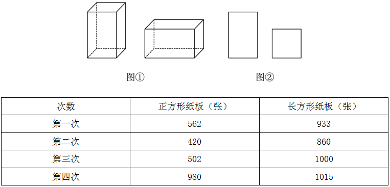{width="3.9902777777777776in"
height="1.575in"}

----------------------- ------------------------- -------------------------

       [次数]{.mark}       [正方形纸板(张)]{.mark}   [长方形纸板(张)]{.mark}
    
      [第一次]{.mark}           [562]{.mark}              [933]{.mark}
    
      [第二次]{.mark}           [420]{.mark}              [860]{.mark}
    
      [第三次]{.mark}           [500]{.mark}              [1000]{.mark}
    
      [第四次]{.mark}           [980]{.mark}              [1015]{.mark}

----------------------- ------------------------- -------------------------

[A．一 B．二]{.mark}

[C．三 D．四]{.mark}

**[例题10（2016联考）]{.mark}**

[某高校艺术学院分音乐系和美术系两个系别，已知学院男生人数占总人数的30%，且音乐系男女生人数之比为1∶3，美术系男女生人数之比为2∶3，问音乐系和美术系的总人数之比为多少？]{.mark}

[A．5∶2 B．5∶1]{.mark}

[C．3∶1 D．2∶1]{.mark}

**[\
]{.mark}**

# [第七讲　经济利润问题]{.mark}

-----------------------------------------------------------------------

  **[✎基础题型：]{.mark}**

-----------------------------------------------------------------------

**[例题1（2023北京）]{.mark}**

[一件商品售价100元/件时，卖出4件的利润与售价80元/件时卖6件的利润相同。则这种商品的成本是多少元/件？]{.mark}

[A．30 B．40]{.mark}

[C．50 D．60]{.mark}

**[例题2（2022国考）]{.mark}**

[某地引进新的杂交水稻品种，今年每亩稻谷产量比上年增加了20%，且由于口感改善，每斤稻谷的售价从1.5元提升到1.65元。以此计算，今年每亩稻谷的销售收入比上年高660元。问今年的稻谷亩产是多少斤？]{.mark}

[A．2200 B．1980]{.mark}

[C．1650 D．1375]{.mark}

**[例题3（2023浙江）]{.mark}**

[某商品上月售价为进价的1.4倍，销售m件。本月该商品进价下降20%，售价不变，销售利润为上月的1.8倍。那么本月的销量为多少件？]{.mark}

[A．1.3m B．1.25m]{.mark}

[C．1.2m D．1.15m]{.mark}

**[例题4（2021北京）]{.mark}**

[一种设备打九折出售，销售12件与原价出售销售10件时的获利相同。已知这种设备的进价为50元/件，其它成本为10元/件，问如打八折出售，1万元最多可以买多少件？]{.mark}

[A．80 B．83]{.mark}

[C．86 D．90]{.mark}

**[例题5（2023吉林）]{.mark}**

[某商场柜台出售一款小家电，如果按定价打九折出售可获得利润70元，如果按定价打九五折出售可获得利润100元，这款小家电进货价格所在区间是？]{.mark}

[A．400～450元 B．450～500元]{.mark}

[C．500～550元 D．550～600元]{.mark}

**[例题6（2024江苏省考）]{.mark}**

[某商店购进一款无线路由器，进价100元/个，加价30%出售，半年后将剩下的打7折全部售出，共盈利7410元，若成本利润率为19%，则打7折售出的路由器共有多少个？]{.mark}

[A．90个 B．100个]{.mark}

[C．105个 D．110个]{.mark}

-----------------------------------------------------------------------

  **[✎阶梯计费：]{.mark}**

-----------------------------------------------------------------------

**[例题7（2023安徽）]{.mark}**

[某智慧公共停车场的收费标准如下：停车不超过15分钟，不收费；超过15分钟但不超过60分钟，按1小时计，收费5元；超过1小时后，超过的部分按每30分钟4元收费（不足30分钟，按30分钟计）。若李先生支付停车费17元，则他停车的时长可能为？]{.mark}

[A．2小时 B．2小时15分钟]{.mark}

[C．2小时45分钟 D．3小时]{.mark}

**[例题8（2022深圳）]{.mark}**

[某商城停车场实行按时长阶梯式收费，收费规则如下：不超出某一基础时长的，按5元/小时收费。超出该基础时长的，超出的部分每小时收费增加3元；停车时长达基础时长3倍以上时，则超出基础时长3倍的部分，每小时收费再增加3元。若甲某次停车离场时超出基础时长11小时，共交费116元，则基础时长为多少小时？（该基础时长为整数，停车时长不满1小时的按1小时计）]{.mark}

[A．6 B．5]{.mark}

[C．4 D．3]{.mark}

-----------------------------------------------------------------------

  **[✎分批销售：]{.mark}**

-----------------------------------------------------------------------

**[例题9（2021广东）]{.mark}**

[某帮扶项目以每公斤9元的价格从农民手中收购了一批苹果，并以每公斤12元（包邮）的价格在网上销售。售出总量的80%后，价格下调为每公斤10元（包邮）。运费成本为每公斤0.1元。全部售完后，扣除收购成本和运费的总收益为2.5万元，则这批苹果为多少吨？]{.mark}

[A．5 B．10]{.mark}

[C．15 D．20]{.mark}

**[例题10（2022北京）]{.mark}**

[商店销售某种商品，先按定价卖了300件，打七五折卖了200件，后在此基础上再打八折卖完了剩下的100件，总利润为总成本的2/3。单件成本相当于单件定价的多少？]{.mark}

[A．57% B．54%]{.mark}

[C．51% D．48%]{.mark}

**[例题11（2021事业单位）]{.mark}**

[某鲜花店购进一批玫瑰，已知单支玫瑰进价1元，按定价5元销售了70%后，再以定价的4折销售剩余玫瑰，全部售完后共盈利3100元，问该花店共购进玫瑰多少支？]{.mark}

[A．900 B．1000]{.mark}

[C．1200 D．1500]{.mark}

**[例题12（2024江苏事业单位）]{.mark}**

[龙年到了，小王以每个6元的价格从批发市场购进若干印章摆地摊，销售完30个之后，销售金额达到300元，余下每个降价2元，很快售罄，销售金额总计380元。小王这次销售活动中获得的利润是多少元？]{.mark}

[A．152 B．140]{.mark}

[C．130 D．125]{.mark}

**[例题13（2021江苏）]{.mark}**

[超市销售某种水果，第一天按原价售出总量的60%，第二天原价打8折售出剩下的一半，第三天按成本价全部售出。若销售全部该水果的利润率为34%，则该水果按原价销售的利润率为多少？]{.mark}

[A．68% B．51%]{.mark}

[C．50% D．36%]{.mark}

**[例题14（2018国考）]{.mark}**

[甲商店购入400件同款夏装。7月以进价的1.6倍出售，共售出200件；8月以进价的1.3倍出售，共售出100件；9月以进价的0.7倍将剩余的100件全部售出，总共获利15000元。问这批夏装的单件进价为多少元？]{.mark}

[A．125 B．144]{.mark}

[C．100 D．120]{.mark}

**[例题15（2018浙江事业单位）]{.mark}**

[商场以120元/套的价格购进了N套某款服装，又以135元/套的价格购进了2N套，商场以定价售完1.5N套后，以定价的七折又销售了N套，最后以定价四折售完剩余所有服装，利润总计为330N元。问最初定价是多少元？]{.mark}

[A．200 B．240]{.mark}

[C．280 D．300]{.mark}

**[\
]{.mark}**

# [第八讲　经济利润之函数最值、增长相关]{.mark}

-----------------------------------------------------------------------

  **[✎函数最值：]{.mark}**

-----------------------------------------------------------------------

**[例题1（2022联考）]{.mark}**

[某地的一种特色纪念品在旅游旺季十分畅销，有商家发现，进价为每个40元的纪念品，当售价定为44元时，每天可售出300个，售价每上涨1元，每天销量减少10个。现商家决定提价销售，若要使销售利润达到最大，则售价应为多少？]{.mark}

[A．51 B．52]{.mark}

[C．54 D．57]{.mark}

**[例题2（2020江苏）]{.mark}**

[某商品的进货单价为80元，销售单价为100元，每天可售出120件。已知销售单价每降低1元，每天可多售出20件。若要实现该商品的销售利润最大化，则销售单价应降低的金额是多少？]{.mark}

[A．5元 B．6元]{.mark}

[C．7元 D．8元]{.mark}

**[例题3（2023四川事业单位）]{.mark}**

[某电脑制造厂商生产销售一批电脑。每台电脑成本价格为4499元，销售价格为5699元。某单位计划以销售原价购买20台电脑，在此基础上，若销售价格每降低100元，就多购买2台。则该电脑制造厂商可在该笔交易中可获得的最大利润为多少元？]{.mark}

[A．24200 B．24000]{.mark}

[C．36000 D．31200]{.mark}

**[例题4（2024山东）]{.mark}**

[某线上店铺将进货单价为8元的商品按每件10元出售，每天可销售100件。店铺计划提高售价增加利润，若每件商品售价提高1元，每天销售量就要减少10件，为保证每天至少获利350元，问该商品售价应为多少？]{.mark}

[A．不到13元 B．13～15元之间]{.mark}

[C．15～17元之间 D．17元以上]{.mark}

**[例题5（2022安徽）]{.mark}**

[北京冬奥会期间，冬奥会吉祥物"冰墩墩"纪念品十分畅销。销售期间某商家发现，进价为每个40元的"冰墩墩"，当售价定为44元时，每天可售出300个，售价每上涨1元，每天销量减少10个。现商家决定提价销售，若要使销售利润达到最大，则售价应为多少？]{.mark}

[A．51元 B．52元]{.mark}

[C．54元 D．57元]{.mark}

-----------------------------------------------------------------------

  **[✎增长率相关：]{.mark}**

-----------------------------------------------------------------------

**[例题6（2023辽宁）]{.mark}**

[某高校今年共有231名本科毕业生被录取为硕士研究生。其中推荐录取人数比上年度减少]{.mark}$\frac{1}{6}$[，而考试录取人数比上年度增加]{.mark}$\frac{31}{150}$[，总体录取人数比上年度高10%，那么，这所高校今年推荐录取的研究生人数为多少？]{.mark}

[A．40人 B．45人]{.mark}

[C．50人 D．55人]{.mark}

**[例题7（2023黑龙江）]{.mark}**

[某口罩生产车间一月份生产口罩100万包，以后每个月都比前一个月按相同增长率增长，四月份生产口罩133.1万包，这个增长率是多少？]{.mark}

[A．10% B．8%]{.mark}

[C．6% D．5%]{.mark}

**[例题8（2024联考）]{.mark}**

[某商家购进一批商品，每件成本为27元，最初将商品定价为每件40元，该商家经过百分率相等的连续两次降价后，每件商品的利润率不超过20%。问每次降价的百分率至少是多少？]{.mark}

[A．20% B．15%]{.mark}

[C．10% D．5%]{.mark}

**[例题9（2023上海）]{.mark}**

[某公司生产A、B两种产品，其中B是A的升级产品。经过调研，预判2022年市场对A产品的需求比2021年下降30%（A产品的价格不变）。因此公司决定增加对B产品营销，使B产品在2022年的销售收入比2021年增长70%，这样恰好使公司2022年的总销售收入比2021年增长10%。则2021年B产品的销售额占总销售额的比例是多少？]{.mark}

[A．40% B．50%]{.mark}

[C．60% D．70%]{.mark}

**[例题10（2023深圳）]{.mark}**

[有甲、乙两种咖啡豆，按照质量比a：b相混合制成一种拼配豆，已知甲咖啡豆每公斤60元，乙咖啡豆每公斤80元，现因产量变化，甲咖啡豆单价上涨15%，乙咖啡豆单价下降15%，以致该拼配咖啡豆的成本上调了5%，则a∶b为多少？]{.mark}

[A．1∶1 B．5∶3]{.mark}

[C．8∶3 D．2∶1]{.mark}

**[例题11（2023山东）]{.mark}**

[某企业花费3456万元改造了一条自动化生产线，单位产品人工成本降低了50%，非人工成本降低了10%，单日产量扩大了一倍，已知改造前的单位产品人工成本是非人工成本的3倍，改造后每天的人工成本比非人工成本高3.6万元。问多少天后新生产线降低的成本可与花费的改造成本相抵？]{.mark}

[A．480 B．300]{.mark}

[C．360 D．540]{.mark}

**[\
]{.mark}**

# [第九讲　和定最值与最不利极限题]{.mark}

-----------------------------------------------------------------------

  **[✎和定最值：]{.mark}**

-----------------------------------------------------------------------

**[例题1（2023安徽）]{.mark}**

[某小区物业准备了230盒口罩免费派发给10栋楼，要求任意两栋楼派发的口罩数量都不相同，但最多相差不超过1倍。假设口罩不拆盒发放，那么派发口罩数量最少的那栋楼最少可派发多少口罩？]{.mark}

[A．18盒 B．15盒]{.mark}

[C．14盒 D．12盒]{.mark}

**[例题2（2021广东县级）]{.mark}**

[某街道服务中心的80名职工通过相互投票选出6名年度优秀职工，每人都只投一票，最终A、B、C、D、E、F这6人当选。已知A票数最多，共获得20张选票；B、C两人的票数相同，并列第2；D、E两人票数也相同，并列第3；F获得10张选票，排在第4。那么B、C获得的选票最多为多少张？]{.mark}

[A．11 B．12]{.mark}

[C．13 D．14]{.mark}

**[例题3（2022上海）]{.mark}**

[某单位进行了一次绩效考评打分，满分为100分。有5位员工的平均分为90分，而且他们的分数各不相同，其中分数最低的员工得分为77分，那么排第二名的员工至少得多少分？（员工分数取整数）]{.mark}

[A．90 B．92]{.mark}

[C．94 D．96]{.mark}

**[例题4（2021上海）]{.mark}**

[有一座13.2万人口的城市，需要划分为11个投票区，任何一个区的人口不得超过其他区人口的10%，那么人口最少的地区可能有多少人？]{.mark}

[A．9800 B．10500]{.mark}

[C．10700 D．11000]{.mark}

**[例题5（2019江西法检）]{.mark}**

[某高校计划招聘81名博士,拟分配到13个不同的院系,假定院系A分得的博士人数比其他院系都多,那么院系A分得的博士人数至少有多少名？]{.mark}

[A．6 B．7]{.mark}

[C．8 D．9]{.mark}

**[例题6（2023浙江事业单位）]{.mark}**

[总公司选派110多名员工到5家分公司进行基层锻炼，每个分公司分到的人数均不同。已知选派人数第二多的分公司人数比第四多的多10人，选派人数最多的分公司的人数占总选派人数的]{.mark}$\frac{1}{3}$[，但未超过最少人数的3倍。那么选派人数最少的分公司的选派人数至多可能是多少人？]{.mark}

[A．13 B．14]{.mark}

[C．15 D．16]{.mark}

-----------------------------------------------------------------------

  **[✎最不利极限题：]{.mark}**

-----------------------------------------------------------------------

**[例题7（2023山东）]{.mark}**

[一个袋子里装了50个苹果，5个香蕉，30个橘子和50个梨，若每次从袋子里随机取出1个水果，问至少需要取多少次能肯定拿出10个相同种类的水果？]{.mark}

[A．10 B．35]{.mark}

[C．33 D．32]{.mark}

**[例题8（2022河北）]{.mark}**

[有200人参加招聘会，其中法学70人，经济学60人，工业设计50人，统计学20人，至少有多少人找到工作才能保证一定有50人的专业相同？]{.mark}

[A．167 B．168]{.mark}

[C．170 D．175]{.mark}

**[例题9（2021河北）]{.mark}**

[某草莓经销商有201箱的草莓要分配给若干个水果店，要求无论选用怎样的分配方式，都要有水果店至少分到8箱，则水果店至多有多少个？]{.mark}

[A．20个 B．21个]{.mark}

[C．28个 D．29个]{.mark}

**[例题10（2018浙江事业单位）]{.mark}**

[某放映行有80名观众观看电影，已知有5名未成年人，观众年龄最大的69岁，问至少有多少名观众有同龄人？]{.mark}

[A．23 B．24]{.mark}

[C．25 D．26]{.mark}

**[例题11（2023浙江）]{.mark}**

[某部门举行年会抽奖活动。抽奖箱里有80个抽奖券，共20个不同的数字，每个数字均出现4次，且分别对应一份礼品，不同的数字对应的礼品不同。每人当天限抽1次。那么最少多少人当天参加抽奖活动，才能保证至少有3人领取的礼品相同？]{.mark}

[A．41 B．42]{.mark}

[C．61 D．62]{.mark}

-----------------------------------------------------------------------

  **[✎反向构造：]{.mark}**

-----------------------------------------------------------------------

**[例题12（2022江苏）]{.mark}**

[某机构对全运会收视情况进行调查，在1000名受访者中，观看过乒乓球比赛的占87%，观看过跳水比赛的占75%，观看过田径比赛的占69%。这1000名受访者中，乒乓球、跳水和田径比赛都观看过的至少有：]{.mark}

[A．310人 B．440人]{.mark}

[C．620人 D．690人]{.mark}

**[例题13（2021广东）]{.mark}**

[某单位在网上办公系统传阅了15份文件，甲阅读了9份，乙阅读了12份，丙阅读了10份，则甲、乙、丙三人共同阅读过的文件至少有多少份？]{.mark}

[A．0 B．1]{.mark}

[C．2 D．3]{.mark}

[\
]{.mark}

# [第十讲　周期循环与日期星期问题]{.mark}

-----------------------------------------------------------------------

  **[✎周期循环：]{.mark}**

-----------------------------------------------------------------------

**[例题1（2022江苏）]{.mark}**

[某学者认为，人类的体力、情绪、智力自出生日起分别以22天、28天、33天为周期开始往复循环变化，前半个周期是"高潮期"，后半个周期是"低潮期"。根据该学者的观点，我们过公历生日时，体力、情绪和智力同时处于"高潮期"的最小年龄是多少？]{.mark}

[A．4周岁 B．3周岁]{.mark}

[C．2周岁 D．1周岁]{.mark}

**[例题2（2022河北）]{.mark}**

[两个信号灯分别以30秒和36秒的固定间隔闪亮一次，若他们10点第一次同时闪亮，则第七次同时闪亮的时间为多少？]{.mark}

[A．10:15 B．10:16]{.mark}

[C．10:18 D．10:21]{.mark}

**[例题3（2023上海）]{.mark}**

[某班有48位同学，教室里有6排，每排8个座位。若在每个周一早上班里同学按照如下要求换座位：①第一排同学换到最后一排，其他每排同学向前换一排；②最左边一列的同学换到最右边一列，其他每列同学向左换一列。那么坐在第一排最左边的同学经过多少周后首次回到第一排最左边？]{.mark}

[A．12周 B．24周]{.mark}

[C．36周 D．48周]{.mark}

-----------------------------------------------------------------------

  **[✎日期星期问题：]{.mark}**

-----------------------------------------------------------------------

**[例题4（2022青海）]{.mark}**

[2021年7月1日是中国共产党建党100周年的纪念日，这一天是星期四，那么建党110周年纪念日是？]{.mark}

[A．星期一 B．星期二]{.mark}

[C．星期三 D．星期四]{.mark}

**[例题5（2024事业单位联考）]{.mark}**

[某大学学生会发起了一项"给未来的自己的一封信"的活动，提议大一新生在2023年3月1日星期三这天写下对大学生活的期待和目标，并且由班主任保管，约定在3年后的这天交还给学生，则3年后的3月1日是哪天？]{.mark}

[A．星期四 B．星期五]{.mark}

[C．星期六 D．星期日]{.mark}

**[例题6（2021新疆）]{.mark}**

[已知2021年7月1日星期四，那么2021年12月10日是星期几？]{.mark}

[A．星期二 B．星期三]{.mark}

[C．星期四 D．星期五]{.mark}

**[例题7（2021新疆）]{.mark}**

[甲、乙、丙三人都报名去摄影馆学习摄影技术，甲每隔4天去一次，乙每隔5天去一次，丙每隔6天去一次，三人在星期四第一次相遇，下次相遇的日期为？]{.mark}

[A．星期一 B．星期三]{.mark}

[C．星期四 D．星期五]{.mark}

**[例题8（2021黑龙江）]{.mark}**

[甲乙丙三个志愿者共同照顾李奶奶，甲每4天去一次，乙每5天去一次，丙每6天去一次。如果他们三个于5月5日在李奶奶家同时见面，则他们三人下次在李奶奶家同时见面的时间是？]{.mark}

[A．7月4日 B．7月5日]{.mark}

[C．9月1日 D．9月2日]{.mark}

-----------------------------------------------------------------------

  **[✎利用"唯一性"确定星期日期：]{.mark}**

-----------------------------------------------------------------------

**[例题9（2025国考）]{.mark}**

[某门店星期一至星期五的日营业额均为1万元，星期六和星期日的日营业额均为2万元。某月1～16日的总营业额为22万元，问该月8日为？]{.mark}

[A．星期三 B．星期四]{.mark}

[C．星期五 D．星期六]{.mark}

**[例题10（2024事业编联考）]{.mark}**

[网管员小王每隔一周的周一、周三、周五对机房进行检修，某年7月31日，小王进行了当月第7次机房检修。问当年7月1日是星期几？]{.mark}

[A．星期一 B．星期三]{.mark}

[C．星期四 D．星期六]{.mark}

**[例题11（2023深圳）]{.mark}**

[博物馆员工周二至周六上班，周日、周一休息。某月有31天，员工小王工作了22天，则该月的4号是周几？]{.mark}

[A．周一 B．周二]{.mark}

[C．周一或周四 D．周四或周日]{.mark}

**[例题12（2024国考行政执法）]{.mark}**

[小张每周二、周五和周日固定参加骑行社团活动。某年9月和10月，小张分别参加了13次和14次活动。问当年他最后一次参加活动是在哪一天？]{.mark}

[A．12月28日 B．12月29日]{.mark}

[C．12月30日 D．12月31日]{.mark}

**[例题13（2024事业单位联考）]{.mark}**

[刚刚过去的4月份共有5个周六和5个周日。据此推算，谷雨（4月20日）是哪天？]{.mark}

[A．周五 B．周四]{.mark}

[C．周三 D．周二]{.mark}

**[\
]{.mark}**

# [第十一讲　平面几何问题]{.mark}

**[几何问题常见公式]{.mark}**

**[1、平面图形]{.mark}**

+:-----------------------:+:----------------------------------------------------------------------:+:-----------------------------------------------------------------:+:---------------------------------------------------------------------------------------------------------------:+
| **[平面图形]{.mark}**   | **[图示]{.mark}**                                                      | **[周长]{.mark}**                                                 | **[面积]{.mark}**                                                                                               |
+-------------------------+------------------------------------------------------------------------+-------------------------------------------------------------------+-----------------------------------------------------------------------------------------------------------------+
| **[正方形]{.mark}**     | 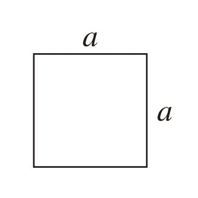{width="1.492361111111111in"    | $$4a$$                                                            | $$S_{正方形} = a^{2}$$                                                                                          |
|                         | height="1.1194444444444445in"}                                         |                                                                   |                                                                                                                 |
+-------------------------+------------------------------------------------------------------------+-------------------------------------------------------------------+-----------------------------------------------------------------------------------------------------------------+
| **[长方形]{.mark}**     | 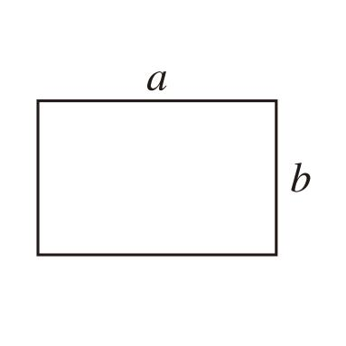{width="1.5569444444444445in"  | $$2(a + b)$$                                                      | $$S_{长方形} = \text{ab}$$                                                                                      |
|                         | height="1.273611111111111in"}                                          |                                                                   |                                                                                                                 |
+-------------------------+------------------------------------------------------------------------+-------------------------------------------------------------------+-----------------------------------------------------------------------------------------------------------------+
| **[三角形]{.mark}**     | 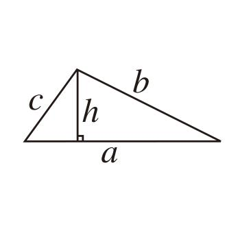{width="1.575in"               | $$a + b + c$$                                                     | $$S_{三角形} = \frac{1}{2}a \times h$$                                                                          |
|                         | height="0.8284722222222223in"}                                         |                                                                   |                                                                                                                 |
+-------------------------+------------------------------------------------------------------------+-------------------------------------------------------------------+-----------------------------------------------------------------------------------------------------------------+
| **[正三角形]{.mark}**   | 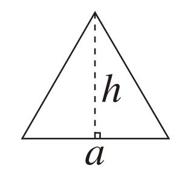{width="1.3708333333333333in" | $$3a$$                                                            | $$S_{正三角形} = \frac{\sqrt{3}}{4}边长 \times 边长$$                                                           |
|                         | height="1.2965277777777777in"}                                         |                                                                   |                                                                                                                 |
+-------------------------+------------------------------------------------------------------------+-------------------------------------------------------------------+-----------------------------------------------------------------------------------------------------------------+
| **[圆形]{.mark}**       | 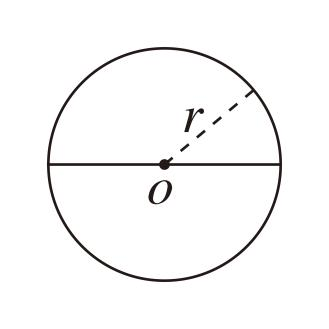{width="1.4333333333333333in" | [2]{.mark}$\pi$[r]{.mark}                                         | $$S_{圆形} = \pi\text{ }\text{r}^{2}$$                                                                          |
|                         | height="1.1833333333333333in"}                                         |                                                                   |                                                                                                                 |
+-------------------------+------------------------------------------------------------------------+-------------------------------------------------------------------+-----------------------------------------------------------------------------------------------------------------+
| **[扇形]{.mark}**       | 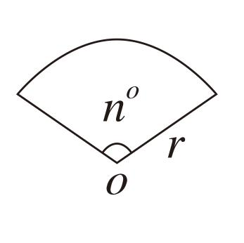{width="1.538888888888889in"  | $弧长 = \frac{n}{360^{o}} \times 圆周长 = \frac{n\pi r}{180^{o}}$ | $$S_{扇形} = \frac{n}{360^{o}} \times 圆面积 = \frac{n\pi\text{ }\text{r}^{2}}{360^{o}} = \frac{\text{lr}}{2}$$ |
|                         | height="1.1618055555555555in"}                                         | []{.mark}                                                         |                                                                                                                 |
|                         |                                                                        |                                                                   | $$l为弧长$$                                                                                                     |
|                         |                                                                        | [n为圆心角]{.mark}                                                |                                                                                                                 |
+-------------------------+------------------------------------------------------------------------+-------------------------------------------------------------------+-----------------------------------------------------------------------------------------------------------------+
| **[梯形]{.mark}**       | 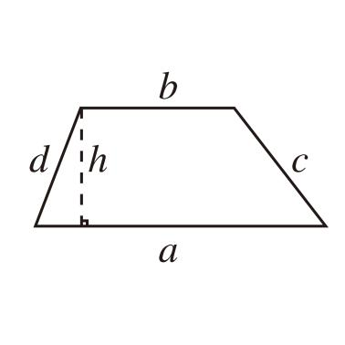{width="1.59375in"            | $$a + b + c + d$$                                                 | $$S_{梯形} = \frac{（上底 + 下底） \times 高}{2}$$                                                              |
|                         | height="1.0895833333333333in"}                                         |                                                                   |                                                                                                                 |
+-------------------------+------------------------------------------------------------------------+-------------------------------------------------------------------+-----------------------------------------------------------------------------------------------------------------+
| **[平行四边形]{.mark}** | 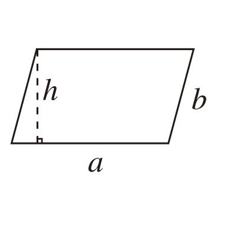{width="1.70625in"            | $$2a + 2b$$                                                       | $$S_{平行四边形} = ah$$                                                                                         |
|                         | height="1.0930555555555554in"}                                         |                                                                   |                                                                                                                 |
+-------------------------+------------------------------------------------------------------------+-------------------------------------------------------------------+-----------------------------------------------------------------------------------------------------------------+
| **[菱形]{.mark}**       | 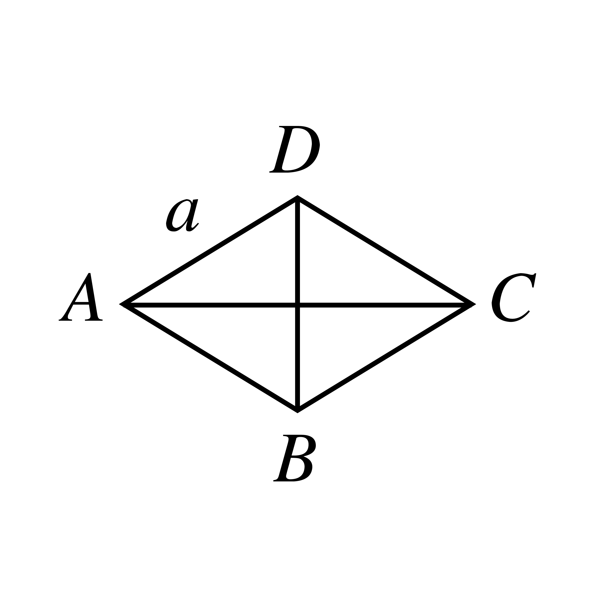{width="1.4652777777777777in"      | $$4a$$                                                            | $$S_{菱形} = \frac{对角线 \times 对角线}{2}$$                                                                   |
|                         | height="1.0625in"}                                                     |                                                                   |                                                                                                                 |
+-------------------------+------------------------------------------------------------------------+-------------------------------------------------------------------+-----------------------------------------------------------------------------------------------------------------+

**[2、立体图形]{.mark}**

+:---------------------:+:-----------------------------------------------------------------------:+:-----------------------------------------------------------------------------------------------------------------------:+:----------------------------------------:+
| **[立体图形]{.mark}** | **[图示]{.mark}**                                                       | **[表面积]{.mark}**                                                                                                     | **[体积]{.mark}**                        |
+-----------------------+-------------------------------------------------------------------------+-------------------------------------------------------------------------------------------------------------------------+------------------------------------------+
| **[正方体]{.mark}**   | 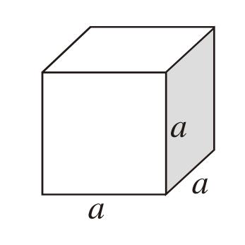{width="1.3138888888888889in" | $$6a^{2}$$                                                                                                              | $$a^{3}$$                                |
|                       | height="1.3645833333333333in"}                                          |                                                                                                                         |                                          |
+-----------------------+-------------------------------------------------------------------------+-------------------------------------------------------------------------------------------------------------------------+------------------------------------------+
| **[长方体]{.mark}**   | 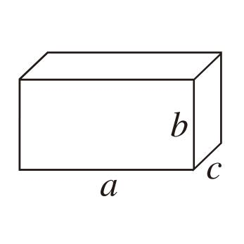{width="1.575in"              | $$2(ab + ac + bc)$$                                                                                                     | $$abc$$                                  |
|                       | height="1.1402777777777777in"}                                          |                                                                                                                         |                                          |
+-----------------------+-------------------------------------------------------------------------+-------------------------------------------------------------------------------------------------------------------------+------------------------------------------+
| **[球体]{.mark}**     | 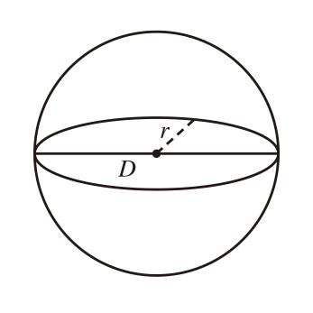{width="1.5159722222222223in" | $$4\pi\text{ }\text{r}^{2} = \pi\text{ }\text{D}^{2}$$                                                                  | $$\frac{4}{3}\text{π}\text{r}^{3}$$      |
|                       | height="1.575in"}                                                       |                                                                                                                         |                                          |
|                       |                                                                         | [（D是直径）]{.mark}                                                                                                    |                                          |
+-----------------------+-------------------------------------------------------------------------+-------------------------------------------------------------------------------------------------------------------------+------------------------------------------+
| **[圆柱体]{.mark}**   | 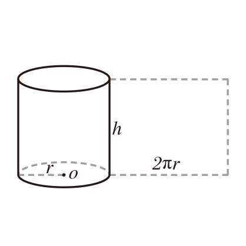{width="1.8118055555555554in" | $$2\pi\text{ }\text{r}^{2} + 2\pi\text{rh}$$                                                                            | $$\pi r^{2}h$$                           |
|                       | height="1.1680555555555556in"}                                          |                                                                                                                         |                                          |
+-----------------------+-------------------------------------------------------------------------+-------------------------------------------------------------------------------------------------------------------------+------------------------------------------+
| **[圆台]{.mark}**     | 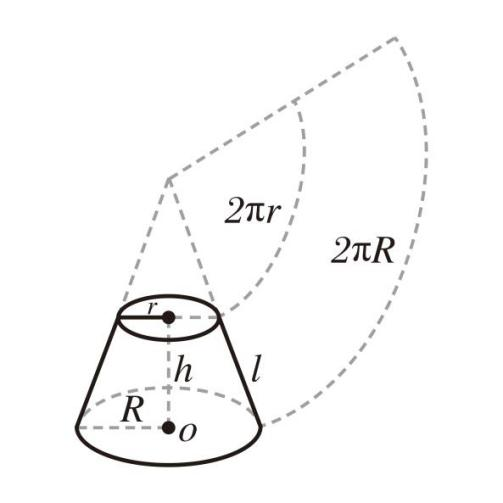{width="1.7236111111111112in" | $\pi\text{ }\text{r}^{2} + \pi\text{ }\text{R}^{2} + \pi\text{rl} + \pi\text{Rl} = \pi(r^{2} + R^{2} + rl + \text{Rl)}$ | $$\frac{1}{3}\pi h(r^{2} + Rr + R^{2})$$ |
|                       | height="2.0597222222222222in"}                                          | []{.mark}                                                                                                               |                                          |
|                       |                                                                         |                                                                                                                         | [r是小圆半径，R是大圆半径]{.mark}        |
|                       |                                                                         | $$l为母线$$                                                                                                             |                                          |
|                       |                                                                         |                                                                                                                         |                                          |
|                       |                                                                         | $$l = \sqrt{（R - r）^{2} + h^{2}}$$                                                                                    |                                          |
|                       |                                                                         |                                                                                                                         |                                          |
|                       |                                                                         | [h为圆台高]{.mark}                                                                                                      |                                          |
+-----------------------+-------------------------------------------------------------------------+-------------------------------------------------------------------------------------------------------------------------+------------------------------------------+
| **[圆锥]{.mark}**     | 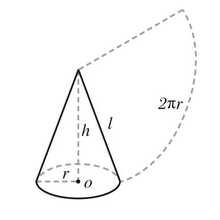{width="1.6652777777777779in"       | $$\text{π}\text{r}^{2} + \pi rl$$                                                                                       | $$\frac{1}{3}\text{Sh}$$                 |
|                       | height="1.8465277777777778in"}                                          |                                                                                                                         |                                          |
|                       |                                                                         |                                                                                                                         | [S为底面积]{.mark}                       |
+-----------------------+-------------------------------------------------------------------------+-------------------------------------------------------------------------------------------------------------------------+------------------------------------------+
| **[棱锥]{.mark}**     | 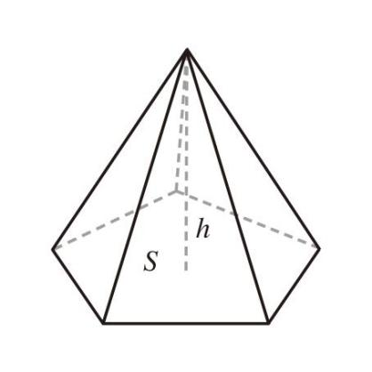{width="1.511111111111111in"  | [侧面积＋底面积]{.mark}                                                                                                 | $$\frac{1}{3}\text{Sh}$$                 |
|                       | height="1.5479166666666666in"}                                          |                                                                                                                         |                                          |
|                       |                                                                         |                                                                                                                         | [S为底面积]{.mark}                       |
+-----------------------+-------------------------------------------------------------------------+-------------------------------------------------------------------------------------------------------------------------+------------------------------------------+

----------------------------------------------------------------------------------------------

  **[✎平面几何之三角形：特殊直角三角形、勾股定理、特殊勾股数、相似三角形、等底等高等]{.mark}**

----------------------------------------------------------------------------------------------

**[例题1（2024国考）]{.mark}**

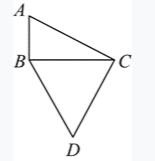{width="1.457638888888889in"
height="1.7715277777777778in"}[某公园内的道路如下图所示，其中AB，BC分别为正南北向和正东西向道路，AB，AC分别长100米和200米。且BCD为正三角形，如要用直线道路连接AD，则该道路的长度为多少米？]{.mark}

[A．]{.mark}$150\sqrt{3}$ [B．]{.mark}$50\left( \sqrt{3} + 1 \right)$

[C．]{.mark}$100\sqrt{7}$ [D．]{.mark}$200\sqrt{2}$

**[例题2（2023湖北）]{.mark}**

[厦门鼓浪屿海滨覆鼎岩上屹立着一尊郑成功雕像。为了测量石像的高度，某测量小组选取的测量点A与覆鼎岩底部D在同一水平线上，如下图所示。已知覆鼎岩高CD为24米，在A处测得石像头顶部B的仰角为45°，石像底部C的仰角为31°（参考数据：sin31°≈0.52，cos31°≈0.86，tan31°≈0.60），则石像BC的高度约为多少？]{.mark}

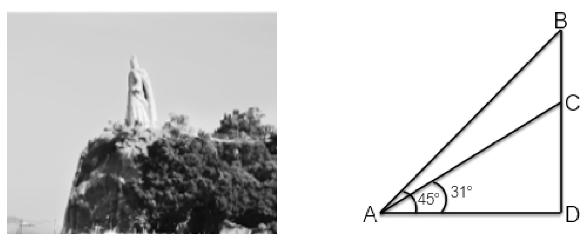{width="5.044116360454943in"
height="2.0975656167979in"}

[A．20米 B．18米]{.mark}

[C．16米 D．14米]{.mark}

**[例题3（2024山东省考）]{.mark}**

[某巡逻艇在海域A点发现正南方30千米处的B点有一艘可疑船只正匀速向正西方行驶，巡逻艇以比该可疑船只快]{.mark}$\frac{1}{3}$[的速度沿某一方向直线追击，两船恰好在C点相遇。问B、C两点之间的距离约多少千米？]{.mark}

[A．26 B．28]{.mark}

[C．30 D．34]{.mark}

**[例题4（2024事业单位联考）]{.mark}**

[一条东西向的河流宽50米，如下图所示，甲划船从北岸的A点出发，直线航行130米后到达南岸的B点，然后向左转向90度继续直线行驶，到达河流北岸的C点，问A、C两点的距离在以下哪个范围内？]{.mark}

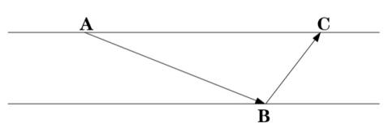{width="4.670138888888889in"
height="1.3777777777777778in"}

[A．不到150米 B．150～160米之间]{.mark}

[C．160～170米之间 D．超过170米]{.mark}

**[例题5（2022国考）]{.mark}**

[甲地在丙地正西17千米，乙地在丙地正北8千米。张从甲地、李从乙地同时出发，分别向正东和正南方向匀速行走。两人速度均为整数千米/小时，且1小时后两人的直线距离为13千米，又经过3小时后两人均经过了丙地且直线距离为5千米。已知李的速度是张的60%，则张经过丙地的时间比李？]{.mark}

[A．早不到10分钟 B．早10分钟以上]{.mark}

[C．晚不到10分钟 D．晚10分钟以上]{.mark}

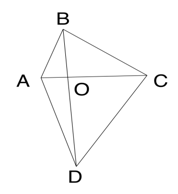{width="1.8069444444444445in"
height="1.96875in"}**[例题6（2023国考执法）]{.mark}**

[公园里有一片四边形草坪，沿对角线修建的小道相交于O点，O到四个顶点A、B、C、D的距离之比正好为1∶2∶3∶4，一名工人花费1天正好完成AOB区域的修剪，问第二天至少需要额外增加多少名效率相同的工人一起工作，才能在当天内完成剩余草坪的修剪？]{.mark}

[A．8 B．10]{.mark}

[C．11 D．12]{.mark}

**[例题7（2023吉林）]{.mark}**

[为推动产业园和产业集聚区加快转型，某地计划在三角形ABC区域内建设新能源产业园区（如下图所示），三角形DEF是中央工厂区，已知BD∶DE∶EC＝1∶2∶3，F为AE的中点，则新能源产业园区总面积是中央工厂区面积的多少倍？]{.mark}

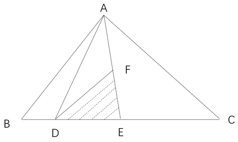{width="2.9604166666666667in"
height="1.7715277777777778in"}

[A．7倍 B．6倍]{.mark}

[C．5倍 D．4倍]{.mark}

-----------------------------------------------------------------------

  **[✎平面几何之其他：圆形、扇形、正方形长方形等]{.mark}**

-----------------------------------------------------------------------

**[例题8（2023浙江）]{.mark}**

[某地打算在绿地上建两个圆形花坛，如下图所示，大圆的直径为6米，小圆的直径为2米，修建期间暂时在外围设置围栏。已知围栏呈矩形，大圆与围栏的三条边相切，小圆与围栏的两条边相切，且两圆相切，那么矩形围栏的面积是多少平方米？]{.mark}

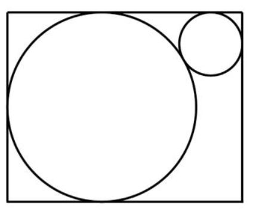{width="2.316666666666667in"
height="1.9708333333333334in"}

[A．]{.mark}$12\left( 2 + \sqrt{3} \right)$
[B．]{.mark}$12\left( 1 + 2\sqrt{3} \right)$

[C．]{.mark}$12\sqrt{13}$ [D．]{.mark}$6\left( 3 + \sqrt{13} \right)$

**[例题9（2024湖北）]{.mark}**

[某单面圆形交通禁停标志牌如图所示，标志牌直径为60cm，牌中各处红色区域宽度均为5cm，某工厂]{.mark}

[承接30个该种标志牌的喷绘业务，已知每个标志牌的蓝色区域喷绘价格是112.5元，红蓝区域喷绘单价相同（价格仅按面积计算），那么30个标志牌喷绘共需多少元？]{.mark}

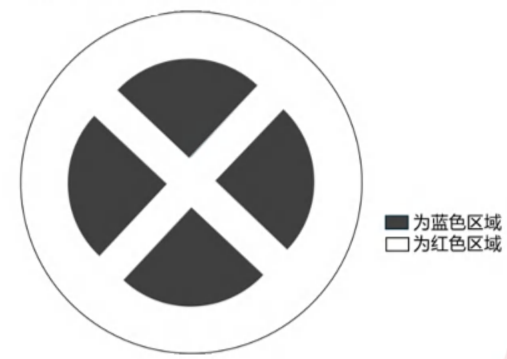{width="3.058333333333333in"
height="2.165277777777778in"}

[A．3375元 B．6000元]{.mark}

[C．6750元 D．8437.5元]{.mark}

**[例题10（2022四川）]{.mark}**

[在一块边长为8米的正方形草坪上架设了5个自动洒水器，洒水器的洒水半径为2米（如图所示）。问草坪上同时被两个洒水器洒到水的区域（灰色）面积比没有洒到水的区域（黑色）面积？]{.mark}

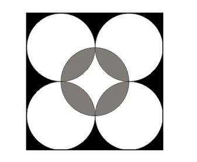{width="2.2090277777777776in"
height="2.165277777777778in"}

[A．小不到5平方米 B．小5平方米以上]{.mark}

[C．大不到5平方米 D．大5平方米以上]{.mark}

**[例题11（2019广东）]{.mark}**

[如图所示，市政部门在一块周长为260米的长方形草地旁边铺设宽为10米的L形道路。已知铺好道路后，道路和草地面积之和为草地面积的1.5倍，则草地的面积为多少平方米？]{.mark}

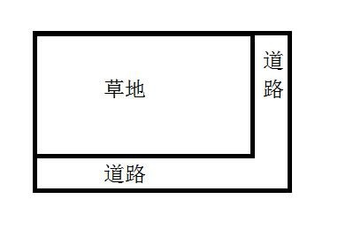{width="2.1951388888888888in"
height="1.3777777777777778in"}

[A．4200 B．4000]{.mark}

[C．3000 D．2800]{.mark}

**[例题12（2023浙江）]{.mark}**

[一只闹钟的秒针顶点距离表盘圆心4厘米，分针顶点距离表盘圆心3厘米。小王烧开一壶水的时间内，秒针顶点累计移动了40π厘米。那么这一时间段内，分针顶点与表盘圆心的连线扫过的扇形面积为多少平方厘米？]{.mark}

[A．0.5π B．0.75π]{.mark}

[C．π D．1.5π]{.mark}

**[\
]{.mark}**

# [第十二讲　立体几何与特殊几何问题]{.mark}

-----------------------------------------------------------------------

  **[✎立体几何之表面积：]{.mark}**

-----------------------------------------------------------------------

**[例题1（2022国考）]{.mark}**

[一个圆柱体零件的高为1，其圆形底面上的内接正方形边长正好也为1。现将圆柱体零件切割4次，得到棱长为1的正方体，则切去部分的总表面积为多少？]{.mark}

[A．]{.mark}$\sqrt{2}(\pi + 2)\ $ [B．]{.mark}$2\sqrt{2}(\pi - 2)\ $

[C．]{.mark}$\left( \sqrt{2} + 1 \right)\pi + 2$
[D．]{.mark}$2\sqrt{2}\pi - 2$

**[例题2（2024福建）]{.mark}**

[一个白色圆柱体零件的底面半径是高的1.5倍，现将其表面涂上黑漆之后，沿下图所示虚线方向切割为4个完全相同的部分。问单个部分的黑色面积是白色面积的多少倍？(π≈3.14)]{.mark}

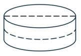{width="1.8520833333333333in"
height="1.3777777777777778in"}

[A．不到1.1倍 B．1.1～1.2倍之间]{.mark}

[C．1.2～1.3倍之间 D．1.3倍以上]{.mark}

-----------------------------------------------------------------------

  **[✎立体几何之体积：]{.mark}**

-----------------------------------------------------------------------

**[例题3（2021辽宁）]{.mark}**

[如下图1所示，在一个金字塔造型（底面为正方形，侧面为四个全等的等腰三角形）的铸造件内部挖空一个圆柱。现沿铸造件顶点A且垂直底面的方向切开，切开后的截面如下图2所示，已知DE、GF为圆柱的高，BC＝4]{.mark}$\sqrt{2}$[分米，DE＝2分米，AO＝4分米，那么挖后铸造件的体积是多少？]{.mark}

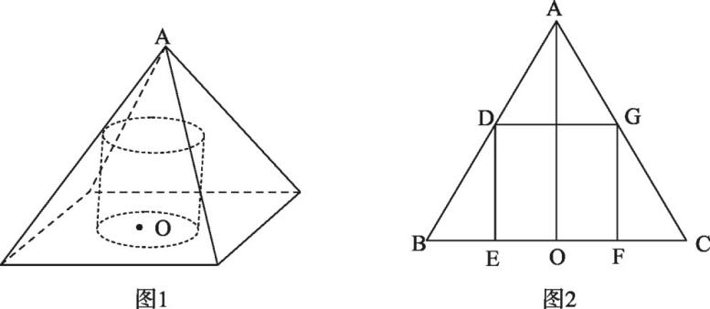{width="3.615972222222222in"
height="1.575in"}

[A．]{.mark}$128 - 4\pi$[立方分米
B．]{.mark}$\frac{128}{3} - 4\pi$[立方分米]{.mark}

[C．]{.mark}$\frac{64}{3} - 4\pi$[立方分米
D．]{.mark}$64 - 4\pi$[立方分米]{.mark}

**[例题4（2023湖北）]{.mark}**

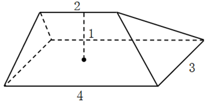{width="2.3743055555555554in"
height="1.18125in"}[下图所示是一种帐篷屋顶的示意图，底面是一个长4米宽3米的长方形，屋顶高1米，上棱长2米且平行于底面，那么该帐篷屋顶的体积是多少？]{.mark}

[A．5立方米 B．11立方米]{.mark}

[C．12立方米 D．24立方米]{.mark}

-----------------------------------------------------------------------

  **[✎等比放缩：]{.mark}**

-----------------------------------------------------------------------

**[例题5（2020新疆）]{.mark}**

[某演播大厅的地面形状是边长为100米的正三角形，现要用边长为2米的正三角形砖铺满（如图所示）。问，需要用多少块砖？]{.mark}

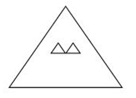{width="2.1944444444444446in"
height="1.575in"}

[A．2763 B．2500]{.mark}

[C．2340 D．2300]{.mark}

**[例题6（2023安徽）]{.mark}**

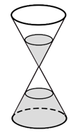{width="1.1875in"
height="1.9895833333333333in"}[某餐馆承诺25分钟内上齐一桌菜，若超时则未上的菜品免单。每张餐桌上都有一个装满后正好25分钟漏完的圆锥形沙漏（如下图所示）。某位顾客在等待的过程中发现沙漏内上方沙子的高度为原先的一半，此时还差一道菜未上，则再过多久还未上菜，这位顾客将享受免单服务？]{.mark}

[A．不到3分钟 B．3～4分钟之间]{.mark}

[C．4～5分钟之间 D．超过6分钟]{.mark}

**[例题7（2022安徽）]{.mark}**

[商家门口摆放了一把正四棱锥形（底面为正方形，侧面为四个全等的等腰三角形）的遮阳伞，第一次伞撑开到图1所示的位置，伞柄与伞骨成角]{.mark}$\angle CPQ$[为30°，继续撑开到如图2所示的位置，伞柄与伞骨成角]{.mark}$\angle C'PQ'$[变为60°，那么第二次伞撑开后形成的正方形]{.mark}$A'B'C'D'$[是第一次撑开后正方形ABCD面积的多少倍？]{.mark}

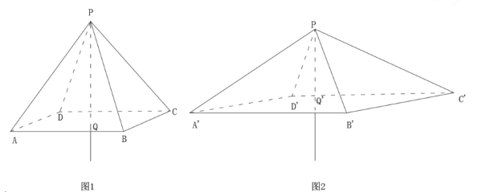{width="4.942361111111111in"
height="1.96875in"}

[A．]{.mark}$3\sqrt{2}$[倍 B．]{.mark}$\sqrt{3}$[倍]{.mark}

[C．2倍 D．3倍]{.mark}

**[例题8（2021国考）]{.mark}**

[一个人工湖的湖面上有一个露出水面3米的圆锥体人工景观（底面朝下）。如人工湖水深减少20%，则该景观露出水面部分的体积将增加61/64。问原来的人工湖水深为多少米？]{.mark}

[A．3.5 B．3.75]{.mark}

[C．4.25 D．4.5]{.mark}

-----------------------------------------------------------------------

  **[✎几何最值：]{.mark}**

-----------------------------------------------------------------------

**[例题9（2024联考）]{.mark}**

[某公园绿化管理部门采购100片围栏，每片长1米且不可弯折。现拆分拟围成5块周长相等且互不相邻的矩形花卉区域。若不考虑拼接间隙，那么这5块区域的最大与最小面积最多可相差多少平方米？]{.mark}

[A．10 B．12]{.mark}

[C．16 D．25]{.mark}

**[例题10（2023安徽）]{.mark}**

[某村拟建造一个容积为144立方米，深度为4米的长方体无盖蓄水池。为节约成本，侧面积最小为多少平方米？]{.mark}

[A．24 B．36]{.mark}

[C．96 D．132]{.mark}

**[例题11（2018四川）]{.mark}**

[在美化城市活动中，某街道工作人员想借助如图所示的直角墙角，用28米长的篱笆围成一个矩形花园ABCD，篱笆只围AB、BC两边。图中的P为一棵直径为1米的树，其与墙CD、AD的最短距离分别是14米和5米，若要将这棵树围在花园内，则花园的最大面积为多少平方米？]{.mark}

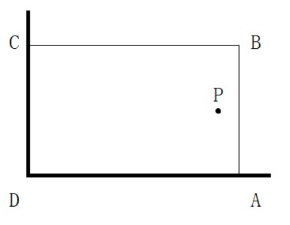{width="2.2875in"
height="1.7715277777777778in"}

[A．187 B．192]{.mark}

[C．195 D．196]{.mark}

-----------------------------------------------------------------------

  **[✎最短路径：]{.mark}**

-----------------------------------------------------------------------

**[例题12（2023北京）]{.mark}**

[一个半径为120米的圆形人工湖正中有一个半径为60米的圆形人工岛。甲从岛的正北岸边出发，以1米/秒的速度匀速划船前往湖的正南岸边，则最少需要多长时间？]{.mark}

[A．不到3分45秒 B．3分45秒～4分之间]{.mark}

[C．4分～4分15秒之间 D．超过4分15秒]{.mark}

**[例题13（2023湖北）]{.mark}**

[A、B两村在一条笔直公路的同侧，到公路的垂直距离分别是3公里和7公里，两村相距8.5公里，现需在公路边建一个物资集散中心，为节约物资配送成本，集散中心到两个村的直线路程之和应尽可能小，若货车的速度约为60公里/小时，那么货车从集散中心出发，到两村送货后返回中心，路途所花费的最少时间为多少？]{.mark}

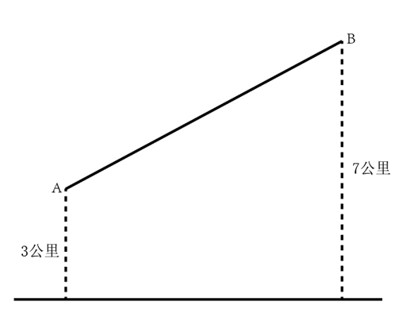{width="2.8555555555555556in"
height="2.046527777777778in"}

[A．18分钟 B．21分钟]{.mark}

[C．24分钟 D．27分钟]{.mark}

**[例题14（2022安徽）]{.mark}**

[A、B两个乡镇分布于山谷两侧，山谷间有一条宽为2km的河道（如下图所示）。当地政府决定在两个乡镇间修建一条跨河公路促进旅游发展。由于架桥费用高昂，所以要求跨河公路中的桥梁路段长度最短。那么根据图中数据，从A镇前往B镇的最短距离为多少？]{.mark}

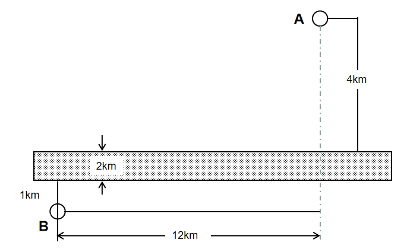{width="3.6951388888888888in"
height="2.2930555555555556in"}

[A．17km B．15km]{.mark}

[C．19km D．20km]{.mark}

[\
]{.mark}

# [第十三讲　基础排列组合]{.mark}

+-------------------------------------------------------------------------------------+
| **[✎基础排列组合：]{.mark}**                                                        |
|                                                                                     |
| **[有序为排列，无序为组合；分类用加法，分步用乘法；从特殊入手，全部减不符]{.mark}** |
+-------------------------------------------------------------------------------------+

**[例题1（2023吉林）]{.mark}**

[教育平台的网络课程由阅读资料、观看视频、论坛交流、练习作业和问卷考试五部分学习内容组成。学员需先后完成这五部分学习内容，其中论坛交流与练习作业均不能在最先和最后完成，则学员安排学习的顺序共有多少种？]{.mark}

[A．120种 B．72种]{.mark}

[C．36种 D．24种]{.mark}

**[例题2（2023吉林）]{.mark}**

[在一次"互联网+现代农业"培训会后，为了交流拓展农村电商产业路径，要求各地参会代表一周内每两人互通一次电话，已知他们一周内共打了120次电话，这次参与培训交流的人数是多少？]{.mark}

[A．20 B．18]{.mark}

[C．16 D．15]{.mark}

**[例题3（2023联考吉林）]{.mark}**

[像中国的回文联"洞帘水挂水帘洞，山果花开花果山"一样，如果将一个数的数字倒排后所得的数仍是这个数，这样的数称为回文数，例如11，22，343，565，1881，20102等，在所有三位数中回文数共有多少个？]{.mark}

[A．81个 B．90个]{.mark}

[C．99个 D．100个]{.mark}

**[例题4（2024联考）]{.mark}**

[企业将12个技术培训名额分配给甲、乙、丙三个研发团队。要求乙团队分配的培训名额比甲团队少，但比丙团队多，且每个团队至少分配1个名额。问有多少种**不同**的分配方式？]{.mark}

[A．6 B．7]{.mark}

[C．36 D．42]{.mark}

**[例题5（2024江苏）]{.mark}**

[某公司派出5名人力资源专员去2个一线城市和2个二线城市参加秋季招聘会。若每名专员只去其中一个城市，每个一线城市至少派一名专员，每个二线城市只派1名专员，则**不同**的派出方法共有多少？]{.mark}

[A．110种 B．130种]{.mark}

[C．120种 D．140种]{.mark}

-----------------------------------------------------------------------

  **[✎简单枚举：]{.mark}**

-----------------------------------------------------------------------

**[例题6（2025国考）]{.mark}**

[某竞赛由5道次序固定的判断题组成，参赛者起始为0分，每答对1题加1分，每答错1题扣1分。小王作答了所有试题，答完每道题时当前的得分都不低于1分。问他的答题情况有多少种**不同**的可能？]{.mark}

[A．7 B．6]{.mark}

[C．4 D．3]{.mark}

**[例题7（2025甘肃省考）]{.mark}**

[甲乙丙三个科室分别有3名、5名和2名党员。现有4个去党校学习的名额，要求至少分配给2个科室。问有多少种**不同**的分配方式？]{.mark}

[A．9 B．10]{.mark}

[C．11 D．12]{.mark}

-----------------------------------------------------------------------

  **[✎分情况讨论：]{.mark}**

-----------------------------------------------------------------------

**[例题8（2024国考副省）]{.mark}**

[公司有六个编号依次为1～6的研发团队，现安排这6个团队参与甲、乙两个科研课题，要求每个团队参与一个课题。每个课题最少安排2个团队，每个课题安排一个团队负责，且负责团队不能是该课题所有参与团队中编号最小的团队。问有多少种**不同**的安排方式？]{.mark}

[A．300 B．340]{.mark}

[C．150 D．170]{.mark}

**[例题9（2024联考）]{.mark}**

[安排A、B、C、D共4个研发团队参与甲、乙、丙3个课题的研究，要求每个课题至少有1个团队参与，每个团队必须且只能参与1个课题，如甲课题参与的团队数超过1个，则A、B都不参与甲课题，问共有多少种**不同**的安排方式？]{.mark}

[A．24 B．26]{.mark}

[C．36 D．42]{.mark}

**[例题10（2022北京）]{.mark}**

[将张、王、李、陈、赵五名应届毕业生分配到甲、乙、丙3个不同的科室，要求每个科室至少分配1人，甲科室分配的人数多于乙科室，且张和王不能去丙科室。则有多少种**不同**的分法？]{.mark}

[A．12 B．21]{.mark}

[C．35 D．72]{.mark}

**[例题11（2022青海）]{.mark}**

[某市举办世界遗产大会，开幕式会场需要从6组志愿者中选出4组分别从事防疫协助、嘉宾引导、英语翻译、物资发放四项不同的工作，其中甲、乙组不能从事英语翻译工作，丙组只能从事防疫协助工作，则派选方案有多少种？]{.mark}

[A．36种 B．72种]{.mark}

[C．108种 D．144种]{.mark}

-----------------------------------------------------------------------

  **[✎全部减不符：]{.mark}**

-----------------------------------------------------------------------

**[例题12（2021安徽）]{.mark}**

[某高校开设A类选修课四门，B类选修课三门。小刘从中共选取四门课程，若要求两类课程各至少选一门，则选法有多少种？]{.mark}

[A．18种 B．22种]{.mark}

[C．26种 D．34种]{.mark}

**[例题13（2023黑龙江）]{.mark}**

[在一个3×3的表格（如下图所示）中，分别填入5个数字0和4个数字1，若要求灰色方格中不能同时填入数字1，问有多少种填法？]{.mark}

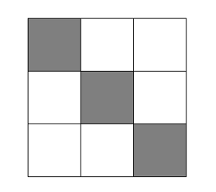{width="2.203472222222222in"
height="2.1777777777777776in"}

[A．98 B．100]{.mark}

[C．120 D．126]{.mark}

**[例题14（2022安徽）]{.mark}**

[滑雪和滑冰是冬奥会的两大项赛事，其中高山滑雪、自由式滑雪、单板滑雪、跳台滑雪、越野滑雪和北欧两项是滑雪大项中的6个分项，短道速滑、速度滑冰和花样滑冰是滑冰大项中的3个分项。小林打算去现场观看比赛，共选择6个项目，并且每个大项不少于1个，若所有项目比赛时间均不交叉，则**不同**的观赛方式有多少种？]{.mark}

[A．83种 B．84种]{.mark}

[C．92种 D．102种]{.mark}

**[\
]{.mark}**

# [第十四讲　基础概率问题]{.mark}

-----------------------------------------------------------------------

  **[✎基础概率问题：]{.mark}**

-----------------------------------------------------------------------

**[例题1（2023黑龙江）]{.mark}**

[如果3个学生一起报名，且3个学生都通过科目一考试，那么就可以减免1个学生的报名费。他们3人不能通过科目一考试的概率分别为]{.mark}$\frac{1}{2}$[、]{.mark}$\frac{1}{3}$[、]{.mark}$\frac{1}{4}$[，则减免1个学生报名费资格的概率为多少？]{.mark}

[A．]{.mark}$\frac{3}{4}$ [B．]{.mark}$\frac{2}{3}$

[C．]{.mark}$\frac{1}{3}$ [D．]{.mark}$\frac{1}{4}$

**[例题2（2024联考）]{.mark}**

[某社区服务中心拟引入优质资源为本社区45名老人提供居家养老服务。已知老人的年龄构成如下（设老人的年龄为x）：60≤x＜70有17人，70≤x＜80有12人，80≤x＜90有11人，90岁及以上有5人。现从该社区中随机抽取两名老人了解居家养老服务情况，那么这两名老人恰好都在80岁以上（含80岁）的概率是？]{.mark}

[A．]{.mark}$\frac{4}{33}$ [B．]{.mark}$\frac{11}{45}$

[C．]{.mark}$\frac{16}{45}$ [D．]{.mark}$\frac{1}{3}$

**[例题3（2023北京）]{.mark}**

[甲和乙两个办公室分别选出2人听一个讲座。如每个办公室均随机选择，则甲办公室员工小刘和小陈同时被选中的概率正好为10%。乙办公室员工小吴被选中的概率为20%，则两个办公室共有多少名员工？]{.mark}

[A．11 B．15]{.mark}

[C．16 D．20]{.mark}

**[例题4（2020山东）]{.mark}**

[在ATM机上输入银行卡密码时，若连续三次输入错误则会吞卡，老李忘了银行卡密码的末两位数，只记得是两个不相同的奇数，若他在末两位上随意输入两个不同奇数，能在吞卡前猜中正确密码的概率是多少？]{.mark}

[A．]{.mark}$\frac{3}{20}$ [B．]{.mark}$\frac{1}{5}$

[C．]{.mark}$\frac{1}{9}$ [D．]{.mark}$\frac{2}{9}$

-----------------------------------------------------------------------

  **[✎分情况讨论与全部减不符：]{.mark}**

-----------------------------------------------------------------------

**[例题5（2022江苏C）]{.mark}**

["双减"政策实施后，某小学下午5：30放学，小李5:00下班去接孩子回家，当不堵车时，5:30之前到校；当堵车时，5:30之前到校的概率为0.6。若5:00～5:30堵车的概率为0.3，则小李5:30之前到校的概率是多少？]{.mark}

[A．0.78 B．0.80]{.mark}

[C．0.88 D．0.91]{.mark}

**[例题6（2023安徽）]{.mark}**

[某学习平台收到的征文，将通过两轮评审决定能否采用。先由两位编辑进行初审，若两位编辑评审都通过，则予以采用；若两位编辑都未予通过，则不予采用；若仅有一位编辑初审通过，则再由主编进行复审，若复审通过，则予以采用，否则不予采用。设稿件能通过各初审编辑评审的概率均为0.4，复审的稿件能通过的概率为0.2，各编辑独立评审，则每篇征文被采用的概率为多少？]{.mark}

[A．0.32 B．0.256]{.mark}

[C．0.24 D．0.208]{.mark}

**[例题7（2022国考）]{.mark}**

[某企业将5台不同的笔记本电脑和5台不同的平板电脑捐赠给甲、乙两所小学，每所学校分配5台电脑。如在所有可能的分配方式中随机选取一种，两所学校分得的平板电脑数量均**不超过**3台的概率为多少？]{.mark}

[A．]{.mark}$\frac{50}{63}$ [B．]{.mark}$\frac{125}{126}$

[C．]{.mark}$\frac{25}{63}$ [D．]{.mark}$\frac{125}{252}$

**[例题8（2022天津）]{.mark}**

[某部门共7人，其中有2人博士毕业，5人硕士毕业。某日，该部门随机分成3个小组参加3项不同的活动，3个小组人数各不相同。问其中2位博士毕业人员分在同一小组的概率在以下哪个范围内？]{.mark}

[A．不到25% B．在25%到35%之间]{.mark}

[C．在35%到45%之间 D．45%以上]{.mark}

**[例题9（2022广东）]{.mark}**

[某街道对辖内6个社区的垃圾分类情况进行考核评估，结果显示，有2个社区的垃圾分类考核不通过。如果从6个社区中随机抽取3个进行现场检查，则抽取的社区中，既有考核通过的又有考核**不通过**的社区的概率为多少？]{.mark}

[A．]{.mark}$\frac{1}{5}$ [B．]{.mark}$\frac{1}{2}$

[C．]{.mark}$\frac{2}{3}$ [D．]{.mark}$\frac{4}{5}$

**[例题10（2022安徽）]{.mark}**

[为了加强环境治理和生态修复，某市派出4位专家（甲、乙、丙、丁）前往某山区3个勘探点进行环境检测，要求每个勘探点至少安排一名专家。那么甲、乙两名专家去了**不同**勘探点的概率是多少？]{.mark}

[A．]{.mark}$\frac{3}{4}$ [B．]{.mark}$\frac{1}{6}$

[C．]{.mark}$\frac{5}{6}$ [D．]{.mark}$\frac{1}{4}$

**[例题11（2024山东）]{.mark}**

[山东手造精品众多，某展览会有叶雕、皮影、风筝、麦秸画、柳编、葫芦画、锡雕、鲁班枕8个展厅。因时间原因，一名参观者决定从8个展厅中随机选取3个进行参观。问叶雕和皮影展厅至少一个被选中的概率是多少？]{.mark}

[A．]{.mark}$\frac{5}{14}$ [B．]{.mark}$\frac{15}{28}$

[C．]{.mark}$\frac{9}{14}$ [D．]{.mark}$\frac{19}{28}$

**[例题12（2024江苏）]{.mark}**

[小张所在单位共有4个科室，现以科室为单位组织文艺演出，每个科室出2个节目。演出结束后，因8个节目都非常精彩，决定从中随机选3个节目参加上级组织的汇演。则小张所在科室出的节目至少有一个被选送参加汇演的概率为？]{.mark}

[A．]{.mark}$\frac{7}{10}$ [B．]{.mark}$\frac{11}{14}$

[C．]{.mark}$\frac{11}{20}$ [D．]{.mark}$\frac{9}{14}$

-----------------------------------------------------------------------

  **[✎分子分母同时简化：]{.mark}**

-----------------------------------------------------------------------

**[例题13（2024国考副省）]{.mark}**

[甲、乙等36人分为6个小组参加某项活动，要求任意2组人数不同，每个组都不少于3人，且任何一组人数不得超过另一组的3倍。问甲和乙至少有1人分到人数第二多的小组的概率为？]{.mark}

[A．35% B．40%]{.mark}

[C．25% D．30%]{.mark}

**[例题14（2024事业单位联考）]{.mark}**

[一次学术会议安排3名教授和2名副教授作报告，要求第一个和最后一个作报告的都是教授。如在满足此要求的安排中随机选择一种，则2名副教授的发言次序相邻的概率为多少？]{.mark}

[A．]{.mark}$\frac{1}{4}$ [B．]{.mark}$\frac{1}{3}$

[C．]{.mark}$\frac{2}{3}$ [D．]{.mark}$\frac{3}{４}$

[\
]{.mark}

# [第十五讲　特殊情境之相邻/不相邻问题与环形排列]{.mark}

-----------------------------------------------------------------------

  **[✎相邻问题：]{.mark}**

-----------------------------------------------------------------------

**[例题1（2020新疆）]{.mark}**

[某美术馆计划展出12幅不同的画，其中有3幅油画、4幅国画、5幅水彩画，排成一行陈列，要求同一种类的画必须连在一起，并且油画不放在两端，问有多少种**不同**的陈列方式？]{.mark}

[A．不到1万种 B．1万～2万种之间]{.mark}

[C．2万～3万种之间 D．超过3万种]{.mark}

**[例题2（2025国考）]{.mark}**

[小王计划在7天假期自学甲、乙两门在线课程，每门课程需要连学2整天。如在所有可能的安排中随机选择1种，不用学习的3天均**不相邻**的概率为？]{.mark}

[A．]{.mark}$\frac{1}{7}$ [B．]{.mark}$\frac{1}{8}$

[C．]{.mark}$\frac{1}{9}$ [D．]{.mark}$\frac{1}{10}$

**[例题3（2022青海）]{.mark}**

[某单位拟于下周周一至周六期间举办"人人学党史，人人讲党史"和"我为群众办实事"实践活动，每个活动均需连续开展两天，那么这两个活动的时间完全**不重叠**的概率为多少？]{.mark}

[A．40% B．48%]{.mark}

[C．52% D．60%]{.mark}

**[例题4（2022湖北选调）]{.mark}**

[某单位组织员工参加业务培训，小王和小李所在部门员工10人在同一排就坐，一排正好10个座位，假设座位是随机安排的。问小王和小李之间相隔人数小于等于3人的概率为多少？]{.mark}

[A．]{.mark}$\frac{1}{3}$ [B．]{.mark}$\frac{1}{2}$

[C．]{.mark}$\frac{8}{15}$ [D．]{.mark}$\frac{2}{3}$

**[例题5（2024联考）]{.mark}**

[某公司开展迎新春三分球投篮比赛。3个部门分别派出2、4、4个选手共计10人参加。规则要求同一个部门的选手顺序相连、全部投完再安排另一个部门的人员，则这10人**不同**的投篮顺序种数的范围是？]{.mark}

[A．小于1000 B．1000～5000]{.mark}

[C．5001～10000 D．10000以上]{.mark}

**[例题6（2023浙江）]{.mark}**

[12个人排成1列纵队，从前到后编为1\~12号。现要将他们排成另一个与原来不同的纵队并从前到后重新编号，要求每个人的新号码与原始号码相差不超过1。那么有多少种重新编队的方法？]{.mark}

[A．155 B．227]{.mark}

[C．232 D．239]{.mark}

-----------------------------------------------------------------------

  **[✎不相邻问题：]{.mark}**

-----------------------------------------------------------------------

**[例题7（2020联考）]{.mark}**

[某学习平台的学习内容由观看视频、阅读文章、收藏分享、论坛交流、考试答题五个部分组成。某学员要先后学完这五个部分，若观看视频和阅读文章不能连续进行，该学员学习顺序的选择有多少种？]{.mark}

[A．24种 B．72种]{.mark}

[C．96种 D．120种]{.mark}

**[例题8（2018广东）]{.mark}**

[某条道路一侧共有20盏路灯。为了节约用电，计划只打开其中的10盏。但为了不影响行路安全，要求相邻的两盏路灯中至少有一盏是打开的，则共有多少种开灯方案？]{.mark}

[A．2 B．6]{.mark}

[C．11 D．13]{.mark}

**[例题9（2023北京）]{.mark}**

[某车库有10个并排的车位，有3辆不同的车要停进这10个车位之中，而且彼此不能相邻，则有多少种**不同**的停放方法？]{.mark}

[A．336 B．246]{.mark}

[C．156 D．66]{.mark}

**[例题10（2023浙江）]{.mark}**

[某停车场有7个连成一排的空车位。现有3辆车随机停在这排车位中，则任意两辆车之间至少间隔一个车位的概率为多少？]{.mark}

[A．]{.mark}$\frac{1}{5}$ [B．]{.mark}$\frac{2}{7}$

[C．]{.mark}$\frac{6}{35}$ [D．]{.mark}$\frac{9}{35}$

**[例题11（2023安徽）]{.mark}**

[某空军基地举行飞行训练，有8架歼击机、3架预警直升机、2架反潜直升机参与训练，每架飞机编号不同。训练时，需派出3架歼击机、2架预警直升机、1架反潜直升机进行起降飞行。若每次只能起飞1架飞机，其中3架歼击机必须相邻起飞，2架预警直升机不能相邻起飞，那么**不同**的起飞方式有多少种？]{.mark}

[A．504 B．4032]{.mark}

[C．8064 D．24192]{.mark}

-----------------------------------------------------------------------

  **[✎环形排列：]{.mark}**

-----------------------------------------------------------------------

**[例题12（2021云南）]{.mark}**

[两个大人带四个孩子去坐只有六个位置的圆型旋转木马，那么两个大人**不相邻**的概率为多少？]{.mark}

[A．]{.mark}$\frac{2}{5}$ [B．]{.mark}$\frac{3}{5}$

[C．]{.mark}$\frac{1}{3}$ [D．]{.mark}$\frac{2}{3}$

**[例题13（2012年国考）]{.mark}**

[有5对夫妇参加一场婚宴，他们被安排在一张10个座位的圆桌就餐，但是婚礼操办者并不知道他们彼此之间的关系，只是随机安排座位。问5对夫妇恰好都被安排在一起相邻而坐的概率是多少？]{.mark}

[A．在1‰到5‰之间 B．在5‰到1%之间]{.mark}

[C．超过1% D．不超过1‰]{.mark}

[\
]{.mark}

# [第十六讲　特殊情境之定序、相同元素分配、错位与重复排列]{.mark}

-----------------------------------------------------------------------

  **[✎定序问题：]{.mark}**

-----------------------------------------------------------------------

**[例题1（2008国考）]{.mark}**

[一张节目表上原有3个节目，如果保持这3个节目的相对顺序不变，再添进去2个新节目，有多少种安排方法？]{.mark}

[A．20 B．12]{.mark}

[C．6 D．4]{.mark}

**[例题2（练习题）]{.mark}**

[现有5个红球、3个篮球、2个黄球，排成一列，共有多少种安排方式？]{.mark}

[A．2520 B．4200]{.mark}

[C．2860 D．3640]{.mark}

**[例题3（2020国家）]{.mark}**

[扶贫干部某日需要走访村内6个贫困户甲、乙、丙、丁、戊和己。已知甲和乙的走访次序要相邻，丙要在丁之前走访，戊要在丙之前走访，己只能在第一个或最后一个走访。问走访顺序有多少种**不同**的安排方式？]{.mark}

[A．24 B．16]{.mark}

[C．48 D．32]{.mark}

**[例题4（2023辽宁）]{.mark}**

[712934856是一个包含1至9每个数字恰好一次的九位数，它具有以下特征：数字1至6在其中是从小到大排列的，但是数字1至7不是从小到大排列的。则符合这种特征的九位数共有多少个？]{.mark}

[A．12 B．336]{.mark}

[C．432 D．504]{.mark}

-----------------------------------------------------------------------

  **[✎相同元素分配：]{.mark}**

-----------------------------------------------------------------------

**[例题5（2020联考）]{.mark}**

[某城市一条道路上有4个十字路口，每个十字路口至少有1名交通协管员，现将8个协管员名额分配到这4个路口，则每个路口协管员名额的分配方案有多少种？]{.mark}

[A．35种 B．70种]{.mark}

[C．96种 D．114种]{.mark}

**[例题6（2015年黑龙江省考）]{.mark}**

[某单位共有10个进修的名额分到下属科室，每个科室至少一个名额，若有36种不同分配方案，问该单位最多有多少个科室？]{.mark}

[A．7 B．8]{.mark}

[C．9 D．10]{.mark}

**[例题7（2023福建）]{.mark}**

[某高校学生会选拔乡村支教志愿者，初试合格者中，语文类5名，数学类6名，文体类4名，从中选取9名志愿者，但每类至少要选2名。问就9名志愿者的科目类别构成而言，共有几种选拔方式？]{.mark}

[A．6 B．7]{.mark}

[C．8 D．9]{.mark}

**[例题8（2020青海）]{.mark}**

[物业派出小王、小曾、小郭三名工作人员负责修剪小区内的6棵树，每名工作人员至少修剪1棵树（只考虑修剪的棵数），问小王至少修剪3棵树的概率为多少？]{.mark}

[A．]{.mark}$\frac{3}{10}$ [B．]{.mark}$\frac{3}{7}$

[C．]{.mark}$\frac{1}{4}$ [D．]{.mark}$\frac{3}{5}$

**[例题9（2024事业编联考）]{.mark}**

[某单位将11本《党员学习手册》分发给甲、乙、丙共3个党支部。甲支部至少分得3本，乙支部至少分得2本，丙支部至少分得4本，共有多少种**不同**的分配方式？]{.mark}

[A．3 B．4]{.mark}

[C．5 D．6]{.mark}

**[例题10（2023国考副省级）]{.mark}**

[某单位有甲和乙2个办公室，分别有职工5人和4人。每周从这9名职工中随机抽取1人下沉社区担任志愿者（同一人有可能被连续、重复选中）。问7月前2周的志愿者均来自甲办公室的概率在以下哪个范围内？]{.mark}

[A．不到25% B．25%～35%之间]{.mark}

[C．35%～45%之间 D．超过45%]{.mark}

**[例题11（2019联考）]{.mark}**

[某小学组织6个年级的学生外出参观包括A科技馆在内的6个科技馆，每个年级任选一个科技馆参观，则有且只有两个年级选择A科技馆的方案有多少种？]{.mark}

[A．1800种 B．18750种]{.mark}

[C．3800种 D．9375种]{.mark}

-----------------------------------------------------------------------

  **[✎错位排序：]{.mark}**

-----------------------------------------------------------------------

**[例题12（2015山东）]{.mark}**

[某单位从下属的5个科室各抽调了一名工作人员，交流到其他科室，如每个科室只能接收一个人的话，有多少种**不同**的人员安排方式？]{.mark}

[A．120 B．78]{.mark}

[C．44 D．24]{.mark}

**[例题13（2022下四川）]{.mark}**

[4个车间各抽一名检测员组成一个检查组，对4个车间进行常规检查。要求每个检测员只检查一个车间，但不能检查自己所在的车间。则**不同**的检查方法有多少种？]{.mark}

[A．8 B．9]{.mark}

[C．10 D．11]{.mark}

**[例题14（2017年国考）]{.mark}**

[某集团企业5个分公司分别派出1人去集团总部参加培训。培训后再将5人随机分配到这5个分公司，每个分公司只分配1人。问5个参加培训的人中，有且仅有1人在培训后返回原分公司的概率？]{.mark}

[A．低于20% B．在20%～30%之间]{.mark}

[C．在30%～35%之间 D．大于35%]{.mark}

**[例题15（2024浙江）]{.mark}**

[某班级有6名学生坐在一排，上课铃响后慌乱中回到座位上，结果只有2人坐到了自己的位置，只有2个相邻的同学坐到了对方的位置。问有多少种这样的情况？]{.mark}

[A．12 B．18]{.mark}

[C．24 D．36]{.mark}

[\
]{.mark}

# [第十七讲　特殊情境之平均分堆与特殊概率问题]{.mark}

-----------------------------------------------------------------------

  **[✎平均分堆：]{.mark}**

-----------------------------------------------------------------------

**[例题1（2015四川）]{.mark}**

[将10名运动员平均分成两组进行对抗赛，问有多少种**不同**的分法？]{.mark}

[A．120 B．126]{.mark}

[C．240 D．252]{.mark}

**[例题2（2018浙江）]{.mark}**

[某班共有8名战士，现在从中挑出4人平均分成两个战斗小组分别参加射击和格斗考核，问共有多少种**不同**的方案？]{.mark}

[A．210 B．420]{.mark}

[C．630 D．840]{.mark}

**[例题3（2021上海）]{.mark}**

[安排4名护士护理3个病房，每个病房至少一名护士，每名护士固定护理一个病房，则共有多少种安排方法？]{.mark}

[A．24 B．36]{.mark}

[C．48 D．72]{.mark}

-----------------------------------------------------------------------

  **[✎二人同组：]{.mark}**

-----------------------------------------------------------------------

**[例题4（2018联考）]{.mark}**

[某单位工会组织桥牌比赛，共有8人报名，随机组成4队，每队2人。那么，小王和小李恰好被分在同一队的概率是多少？]{.mark}

[A．]{.mark}$\frac{1}{7}$ [B．]{.mark}$\frac{1}{14}$

[C．]{.mark}$\frac{1}{21}$ [D．]{.mark}$\frac{1}{28}$

**[例题5（2019联考）]{.mark}**

[某学校举行迎新篝火晚会，100名新生随机围坐在篝火四周。其中，小张与小李是同桌，他俩坐在一起的概率为多少？]{.mark}

[A．]{.mark}$\frac{2}{97}$ [B．]{.mark}$\frac{2}{98}$

[C．]{.mark}$\frac{2}{99}$ [D．]{.mark}$\frac{2}{100}$

**[例题6（2021江苏）]{.mark}**

[某次圆桌会议共设8个座位，有4个部门参加，每个部门2人，排座位时，要求同一部门的两人相邻，若小李和小王代表不同部门参加会议，则他们座位相邻的概率是多少？]{.mark}

[A．]{.mark}$\frac{1}{48}$ [B．]{.mark}$\frac{1}{24}$

[C．]{.mark}$\frac{1}{12}$ [D．]{.mark}$\frac{1}{6}$

**[例题7（2021江苏）]{.mark}**

[某市举办足球邀请赛，共有9个球队报名参加，其中包含上届比赛的前3名球队。现将这9个球队通过抽签的方式平均分成3组进行单循环比赛，则上届比赛的前3名球队被分在同一组的概率是？]{.mark}

[A．]{.mark}$\frac{1}{21}$ [B．]{.mark}$\frac{1}{28}$

[C．]{.mark}$\frac{1}{63}$ [D．]{.mark}$\frac{1}{84}$

**[例题8（2024浙江）]{.mark}**

[某公司组织面试，每位考生都要回答甲、乙、丙、丁、戊5道试题，作答顺序随机安排。已知小张第二题是甲题、第四题是丁题，小王第三题是乙题，那么两人作答顺序完全相同的概率是多少？]{.mark}

[A．]{.mark}$\frac{1}{72}$ [B．]{.mark}$\frac{1}{48}$

[C．]{.mark}$\frac{1}{36}$ [D．]{.mark}$\frac{1}{24}$

**[例题9（2019国考）]{.mark}**

[小张和小王在同一个学校读研究生，每天早上从宿舍到学校有6:40、7:00、7:20和7:40发车的4班校车。某星期周一到周三，小张和小王都坐班车去学校，且每个人在3天中乘坐的班车发车时间都不同。问这3天小张和小王每天都乘坐同一趟班车的概率在？]{.mark}

[A．3%以下 B．3%～4%之间]{.mark}

[C．4%～5%之间 D．5%以上]{.mark}

-----------------------------------------------------------------------

  **[✎比赛概型：]{.mark}**

-----------------------------------------------------------------------

**[例题10（2020安徽事业单位）]{.mark}**

[某场羽毛球单打比赛采取三局两胜制。假设甲选手在每局都有80%的概率赢乙选手，那么这场单打比赛甲有多大概率战胜乙选手？]{.mark}

[A．0.768 B．0.800]{.mark}

[C．0.896 D．0.924]{.mark}

**[例题11（2014年浙江省考）]{.mark}**

[两支篮球队打一个系列赛，三场两胜制，第一场和第三场在甲队的主场，第二场在乙队的主场。已知甲队主场赢球概率为0.7，客场赢球概率为0.5。问甲队赢得这个系列赛的概率为多少？]{.mark}

[A．0.3 B．0.595]{.mark}

[C．0.7 D．0.795]{.mark}

**[例题12（2021福建事业单位）]{.mark}**

[某场乒乓球单打比赛采取5局3胜制。假设甲选手在每局都有70%的概率赢乙选手，若要打满5局，那么这场单打比赛甲有多大概率战胜乙选手？]{.mark}

[A．0.031 B．0.103]{.mark}

[C．0.185 D．0.343]{.mark}

**[例题13（2023湖北选调）]{.mark}**

[某市职工篮球赛甲、乙两队决赛，采取7场4胜制（先赢4场者胜，每场没有平局）。若两队水平相当，现在已经比了3场，甲赢了2场，乙赢了1场。问甲获得最后胜利的概率有多少？]{.mark}

[A．]{.mark}$\frac{2}{3}$ [B．]{.mark}$\frac{3}{4}$

[C．]{.mark}$\frac{5}{8}$ [D．]{.mark}$\frac{11}{16}$

**[例题14（2024四川）]{.mark}**

[甲和乙进行乒乓球比赛。第一局甲胜乙的概率为70%。往后每局如甲上局取胜，则当局甲的胜率为50%；如乙上局取胜，则当局甲的胜率为70%。问第三局甲取胜的概率在以下哪个范围内？]{.mark}

[A．不到55% B．在55%～57%之间]{.mark}

[C．在57%～59%之间 D．高于59%]{.mark}

[\
]{.mark}

# [第十八讲　行程问题（一）]{.mark}

-----------------------------------------------------------------------

  **[✎基础行程：]{.mark}**

-----------------------------------------------------------------------

**[例题1（2021广东）]{.mark}**

[上午7点，A、B市干部同时乘车前往省城参观学习，汽车时速均为每小时80公里。但由于突发状况，B市干部在路上停留了2个小时。最终，A市干部于当天上午9点到达省城；B市干部于当天下午3点到达。则如果从A市出发，途经省城到达B市，总路程为多少公里？]{.mark}

[A．720 B．640]{.mark}

[C．320 D．280]{.mark}

**[例题2（2024广东）]{.mark}**

[小李从山脚开始登顶，匀速走了1小时后到达一个凉亭，并在凉亭休息了半小时。继续走500米后，恰好完成登顶路程的一半。从山顶沿原路匀速返回时，他走了1小时又到了这个凉亭，继续走半小时回到了山脚。则登顶路程为多少米？]{.mark}

[A．2000 B．3000]{.mark}

[C．3600 D．4000]{.mark}

**[例题3（2023广东）]{.mark}**

[某地举办了"铁人三项"体育活动，先进行蛙跳，后游泳，最后竞走到达终点。一位选手在上午7点出发，9点到达了终点，全程未休息，其蛙跳、游泳和竞走的速度分别为每小时2千米、3千米和6千米。如果蛙跳和竞走的路程相同，则所有的总路程是多少？]{.mark}

[A．无法计算 B．6千米]{.mark}

[C．8千米 D．12千米]{.mark}

-----------------------------------------------------------------------

  **[✎比例法运用：]{.mark}**

-----------------------------------------------------------------------

**[例题4（2023广东乡镇）]{.mark}**

[小明骑车从甲镇前往乙镇。如果骑车的速度为每小时20千米，那么将准时到达。如果骑车的速度为每小时24千米，那么将提早5分钟到达。则甲镇到乙镇的距离为多少千米？]{.mark}

[A．8 B．10]{.mark}

[C．12 D．16]{.mark}

**[例题5（2022天津）]{.mark}**

[冬奥会男子短道速滑1500米比赛中，A、B两位运动员同时出发，已知本次比赛需要绕场地滑13.5圈，假设每位运动员滑完全程的速度是不变的，A运动员滑完全程需要2分15秒，B运动员滑一圈比A运动员少用时1秒，则A开始滑第几圈时，B运动员正好领先A运动员一整圈？]{.mark}

[A．9 B．10]{.mark}

[C．11 D．12]{.mark}

**[例题6（2019浙江）]{.mark}**

[小王从单位开车去省城，如果他把车速提高20%，可以比原定时间提前15分钟到达；如果按原速行驶30千米后再将车速提高25%，也比原定时间提前15分钟到达。问小王单位距离省城多少千米？]{.mark}

[A．60 B．120]{.mark}

[C．180 D．240]{.mark}

-----------------------------------------------------------------------

  **[✎相遇追及问题：]{.mark}**

-----------------------------------------------------------------------

**[例题7（2023湖北事业单位）]{.mark}**

[小谢下班后，以2米/秒的速度在家附近公园的圆形跑道上慢跑。他发现邻居小钟和小崔也在该跑道上跑步，且某一时刻，他们三人在该跑道上的某处相遇，此后小钟每6分钟与小谢迎面擦身而过，小崔每12分钟从小谢身后跑过，假设小钟和小崔跑步的速度大小相同且恒定，则该圆形跑道的长度为多少米？]{.mark}

[A．2380 B．2880]{.mark}

[C．4760 D．6480]{.mark}

**[例题8（2023吉林）]{.mark}**

[为加快推进县域交通基础设施内畅外联、互联互通，A、B两地新修建了一条高速公路。甲、乙两辆汽车在这条高速公路上同时从A、B两地相向开出，甲车每小时行驶74千米，乙车每小时行驶65千米，两车在距中点18千米处相遇。这条连通A、B两地的高速公路全长是多少千米？]{.mark}

[A．139千米 B．256千米]{.mark}

[C．278千米 D．556千米]{.mark}

**[例题9（2024广西）]{.mark}**

[c地为a、b两地直线道路上的一点，甲、乙两人9:00分别自a、b两地同时出发匀速相向而行，甲的速度是乙的1.5倍，甲9:40到达c地休息10分钟后继续向b地前进；乙全程不休息，在10:40到达c地，问甲、乙相遇的时间为？]{.mark}

[A．10:00 B．10:10]{.mark}

[C．10:20 D．10:30]{.mark}

**[例题10（2022北京）]{.mark}**

[甲和乙同时出发，在长360米的环形道路上沿同一方向各自匀速散步。甲出发2圈后第一次追上乙，又走了4圈半第二次追上乙。则甲出发后走了多少米第一次到达乙的出发点？]{.mark}

[A．160 B．200]{.mark}

[C．240 D．280]{.mark}

**[例题11（2022河北）]{.mark}**

[甲乙两人顺时针方向沿圆形跑道跑步。甲跑完一圈要10min，乙跑完一圈要12min，如果他们分别从圆形跑道直径两端同时出发，甲第一次追上乙需要多少分钟？]{.mark}

[A．30 B．60]{.mark}

[C．15 D．45]{.mark}

**[例题12（2024福建）]{.mark}**

[某校园围墙外的道路形成一个边长为300米的正方形（如图所示），甲、乙两人分别从正方形的两个对角沿逆时针方向同时出发，甲、乙的步行速度比为9∶7。问甲、乙两人第一次处于同一条边是在哪一条边上？]{.mark}

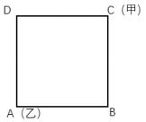{width="1.8270833333333334in"
height="1.575in"}

[A．AB B．BC]{.mark}

[C．CD D．DA]{.mark}

[\
]{.mark}

# [第十九讲　行程问题（二）]{.mark}

-----------------------------------------------------------------------

  **[✎多次相遇问题：]{.mark}**

-----------------------------------------------------------------------

**[例题1（2020天津选调）]{.mark}**

[小王在甲医院，小赵在乙医院。两人从所在医院同时骑车出发，来回往返于两个医院之间。已知小王骑车速度为205米/分钟，小赵骑车速度为225米/分钟，且经过12分钟后两人第二次相遇。问两家医院相距多少米？]{.mark}

[A．1290 B．1720]{.mark}

[C．2150 D．2580]{.mark}

**[例题2（2011国考）]{.mark}**

[甲、乙两人在长30米的泳池内游泳，甲每分钟游37.5米，乙每分钟游52.5米。两人同时分别从泳池的两端出发，触壁后原路返回，如是往返。如果不计转向的时间，则从出发开始计算的1分50秒内两人共相遇了多少次？]{.mark}

[A．5 B．2]{.mark}

[C．4 D．3]{.mark}

**[例题3（2021新疆）]{.mark}**

[甲乙两人同时沿直线跑道两端匀速相向而行，两人第一次迎面相遇时距跑道中点50米，两人到达跑道尽头时立即掉头重新出发，重新出发后两人第二次相遇，第二次两人相遇也为迎面相遇，且距跑道中点150米。则此时两人中速度较快一人比速度较慢一人多行走多少米？]{.mark}

[A．150 B．400]{.mark}

[C．200 D．300]{.mark}

-----------------------------------------------------------------------

  **[✎流水问题：]{.mark}**

-----------------------------------------------------------------------

**[例题4（2021新疆）]{.mark}**

[甲、乙两地分别为一条河流的上下游，两地相距360千米，A船往返需要35小时，其中从甲地到乙地的时间比从乙地到甲地的时间短5小时。B船在静水中的速度为12千米每小时。问其从甲地开往乙地需要多少小时？]{.mark}

[A．12 B．20]{.mark}

[C．24 D．40]{.mark}

**[例题5（2022下四川）]{.mark}**

[甲、乙两名游泳运动员同时从下游A点出发，游向900米外的上游B点并立刻原路返回。甲游了200米时，乙游了120米。已知甲顺流游泳的速度是逆流的1.8倍，问两人迎面相遇的地点距离A点多少米？]{.mark}

[A．270 B．390]{.mark}

[C．510 D．630]{.mark}

**[例题6（2021广东选调）]{.mark}**

[一艘维修快艇沿着河流逆流而上执行维修任务，快艇航行到途中某处时工具包掉进了河里，10分钟后，驾驶员到达目的地时发现工具包丢失后立即返回追寻。已知水的流速为每秒1米，如果工具包会浮在水面上漂流，那么驾驶员将在距离丢失处多少米的地方找回工具包？]{.mark}

[A．640 B．900]{.mark}

[C．1080 D．1200]{.mark}

**[例题7（2023浙江）]{.mark}**

[水文工作人员小张和小刘同时乘坐相同的船，分别从下游的A码头和上游的B码头出发前往对方所在码头，并沿途采集水样。两人出发时各采集第一份水样，往后每行驶1.31千米采集一份水样。两船相遇时，小张正好采集第16份水样。已知船在静水中的速度是水流速度的5倍，那么两人全程一共采集了多少份水样？]{.mark}

[A．38 B．39]{.mark}

[C．76 D．78]{.mark}

-----------------------------------------------------------------------

  **[✎火车过桥问题：]{.mark}**

-----------------------------------------------------------------------

**[例题8（2020天津选调）]{.mark}**

[某铁路桥长1440米，一列动车从桥上通过，测得动车从开始上桥到完全下桥用了21秒，动车的速度为288km/h，则整列动车完全在桥上的时间为多少秒？]{.mark}

[A．18 B．16]{.mark}

[C．15 D．12]{.mark}

**[例题9（2023辽宁）]{.mark}**

[某公路隧道长1500米，一辆公共汽车匀速从隧道通过，测得公共汽车从开始进入隧道到车身完全驶出隧道用时151秒，整辆公共汽车完全在隧道里的时间为149秒，则公共汽车的车身长度和行驶速度分别为？]{.mark}

[A．8米；5米/秒 B．10米；10米/秒]{.mark}

[C．10米；15米/秒 D．12米；20米/秒]{.mark}

**[例题10（2024江苏）]{.mark}**

[一列长为210米的动车以180千米/小时的速度行驶。某乘客拍窗外风景时，恰好拍到平行铁轨上一列420米、相向而行的高速列车，该列车进过窗户的时间是3.6秒。若不计窗户长度，则该高速列车的速度为多少？]{.mark}

[A．210千米/小时 B．240千米/小时]{.mark}

[C．450千米/小时 D．630千米/小时]{.mark}

-----------------------------------------------------------------------

  **[✎匀加速问题：]{.mark}**

-----------------------------------------------------------------------

**[例题11（2024四川）]{.mark}**

[甲、乙两辆车同时从A地出发驶向B地，甲车匀速行驶，乙车出发的速度与甲车相同且均匀加速，1小时后其行驶距离是甲车的1.5倍，然后乙车开始均匀减速，又过了1小时到达B地时，其速度为A地出发时的0.5倍。问甲车还要多长时间到达B地？]{.mark}

[A．30分钟 B．40分钟]{.mark}

[C．45分钟 D．60分钟]{.mark}

**[例题12（2022国考）]{.mark}**

[李某骑车从甲地出发前往乙地，出发时的速度为15千米/小时，此后均匀加速，骑行25%的路程后速度达到21千米/小时。剩余路段保持此速度骑行，总路程前半段比后半段多用时3分钟。问甲、乙两地之间的距离在以下哪个范围内？]{.mark}

[A．不到23千米 B．在23～24千米之间]{.mark}

[C．在24～25千米之间 D．超过25千米]{.mark}

-----------------------------------------------------------------------

  **[✎等距离平均速度问题：]{.mark}**

-----------------------------------------------------------------------

**[例题13（2023国考）]{.mark}**

[一辆汽车从甲地开往乙地，先以40千米/小时的速度匀速行驶一半的路程，然后均匀加速；行驶完剩下路程的一半时，速度达到80千米/小时；此后均匀减速，到达乙地时的速度正好降为0。问其全程的平均速度在以下哪个范围内？]{.mark}

[A．不到44千米/小时 B．在44～45千米/小时之间]{.mark}

[C．在45～46千米/小时之间 D．超过46千米/小时]{.mark}

**[例题14（2022国考）]{.mark}**

[李某骑车从甲地出发前往乙地，出发时的速度为15千米/小时，此后均匀加速，骑行25%的路程后速度达到21千米/小时。剩余路段保持此速度骑行，总路程前半段比后半段多用时3分钟。问甲、乙两地之间的距离在以下哪个范围内？]{.mark}

[A．不到23千米 B．在23～24千米之间]{.mark}

[C．在24～25千米之间 D．超过25千米]{.mark}

**[\
]{.mark}**

# [第二十讲　趣味杂题（一）]{.mark}

-----------------------------------------------------------------------

  **[✎牛吃草问题：]{.mark}**

-----------------------------------------------------------------------

**[例题1（2023河北事业单位）]{.mark}**

[某蓄水池存有一定量的水，河水均匀流入蓄水池。用5台抽水机10天可将水抽完，用6台抽水机8天可将水抽完。若要求4天抽完，需要同样的抽水机多少台？]{.mark}

[A．14 B．13]{.mark}

[C．12 D．11]{.mark}

**[例题2（2019联考）]{.mark}**

[某河道由于淤泥堆积影响到船只航行安全，现由工程队使用挖沙机进行清淤工作，清淤时上游河水又会带来新的泥沙。若使用1台挖沙机300天可完成清淤工作，使用2台挖沙机100天可完成清淤工作。为了尽快让河道恢复使用，上级部门要求工程队25天内完成河道的全部清淤工作，那么工程队至少要有多少台挖沙机同时工作？]{.mark}

[A．4 B．5]{.mark}

[C．6 D．7]{.mark}

**[例题3（2020广东）]{.mark}**

[某政务服务大厅开始办理业务前，已经有部分人在排队等候领取证书，且每分钟新增的人数一样多。从开始办理业务到排队等候的人全部领到证书，若同时开5个发证窗口就需要1个小时，若同时开6个发证窗口就需要40分钟。按照每个窗口给每个人发证书需要1分钟计算，如果想要在20分钟内将排队等候的人的证书全部发完，则需同时开多少个发证窗口？]{.mark}

[A．7 B．8]{.mark}

[C．9 D．10]{.mark}

**[例题4（2023广东）]{.mark}**

[某牧场的草匀速生长。如果20头牛来吃，20天可将草吃光；如果10头牛和10只羊来吃，30天可以恰好吃光。已知一头牛每天的吃草量是一只羊的2倍，则30只羊吃该牧场的草，多少天可以吃光？]{.mark}

[A.10 B.20]{.mark}

[C.30 D.40]{.mark}

**[例题5（2022江苏B）]{.mark}**

[某疫苗接种点市民正在有序排队等候接种。假设之后每小时新增前来接种疫苗的市民人数相同，且每个接种台的效率相同，经测算：若开8个接种台，6小时后不再有人排队；若开12个接种台，3小时后不再有人排队。如果每小时新增的市民人数比假设的多25%，那么为保证2小时后不再有人排队，需开接种台的数量至少为多少个？]{.mark}

[A．14个 B．15个]{.mark}

[C．16个 D．17个]{.mark}

-----------------------------------------------------------------------

  **[✎鸡兔同笼：]{.mark}**

-----------------------------------------------------------------------

**[例题6（2022北京）]{.mark}**

[某测试共有100道题，答对一道题得3分，不答或答错一道题扣2分，小张测试成绩为285分，则他一共答对了多少道题？]{.mark}

[A．85 B．90]{.mark}

[C．95 D．97]{.mark}

**[例题7（2023北京）]{.mark}**

[28名运动员在羽毛球馆打比赛，馆内共有10块羽毛球场地，所有运动员都要上场比赛，或者参加单打比赛，或者参加双打比赛。如果保证每名运动员都在打比赛，且每块羽毛球场地上都有运动员在打比赛，则有多少名运动员参加双打比赛？]{.mark}

[A．20 B．24]{.mark}

[C．12 D．16]{.mark}

-----------------------------------------------------------------------

  **[✎方阵问题：]{.mark}**

-----------------------------------------------------------------------

**[例题8（2022福建事业单位）]{.mark}**

[用原味和海鲜味两种口味的罐装薯片组成一个实心方阵（所有罐装薯片大小完全相同），最外层都是原味罐装薯片，从外往内每层按原味罐装薯片、海鲜味罐装薯片相间摆放。如果最外一圈的正方形有原味罐装薯片44罐，那么摆成这个实心方阵共需海鲜味罐装薯片多少罐？]{.mark}

[A．60 B．62]{.mark}

[C．64 D．70]{.mark}

**[例题9（2023福建）]{.mark}**

[某学院有新生两百多人，将学生从1开始依次编号，选取编号为3的倍数的学生，正好构成新生运动会开幕式方队，选取编号为m（3＜m＜10，且m为整数）的倍数的学生，恰好构成闭幕式方队，问该学院新生人数有多少人？]{.mark}

[A．242 B．243]{.mark}

[C．245 D．246]{.mark}

**[例题10（2024深圳）]{.mark}**

[某灯光秀表演中，无人机群先排列成红、绿两个正方形实心方阵，然后融合并变换灯光，形成一个黄色的正方框形空心方阵。原红方阵最外侧每边有8架无人机，且原红方阵恰好可填满黄方阵的空心，原绿方阵最外侧每边的无人机数量比黄方阵少4架。则参加灯光秀表演的无人机共有多少架？]{.mark}

[A．260 B．233]{.mark}

[C．196 D．185]{.mark}

-----------------------------------------------------------------------

  **[✎植树问题：]{.mark}**

-----------------------------------------------------------------------

**[例题11（2023福建事业单位）]{.mark}**

[在一片长20米宽10米的长方形的地上植树，每两棵树之间的行距和列距均为2米，则在这片长方形的地上最多可以植多好棵树？]{.mark}

[A．50 B．55]{.mark}

[C．60 D．66]{.mark}

**[例题12（2023联考）]{.mark}**

[某地计划在连接甲镇和乙镇的长度为60公里的公路上安装限速标志和测速仪器。具体方案是：从距离甲镇3公里处开始安装限速标志，然后每隔4公里再设置一个限速标志；从8公里处开始安装测速仪器，然后每隔9公里再设置一个测速仪器。假设单独安装一个限速标志费用为500元，单独安装一个测速仪器费用为800元，如果限速标志和测速仪刚好在同一个地点安装，则可以节约安装费用，此时安装两种设备总共只需要1000元。问最终安装总费用是多少元？]{.mark}

[A．10600 B．11200]{.mark}

[C．12000 D．12300]{.mark}

**[例题13（2024联考）]{.mark}**

[某个障碍跑项目需要在100米长的跑道上布置障碍（起点和终点均不布置）。如果从起点开始，每隔4米布置一个甲障碍，每隔6米布置一个乙障碍，甲、乙障碍的重合点则不布置甲障碍。则跑道上总共布置多少个甲障碍？]{.mark}

[A．16 B．17]{.mark}

[C．24 D．25]{.mark}

[\
]{.mark}

# [第二十一讲　趣味杂题（二）]{.mark}

-----------------------------------------------------------------------

  **[✎比赛类问题：]{.mark}**

-----------------------------------------------------------------------

**[例题1（2017河南）]{.mark}**

[140支社区足球队参加全市社区足球淘汰赛，每一轮都要在未失败过的球队中抽签决定比赛对手，如上一轮未失败过的球队是奇数，则有一队不用比赛直接进入下一轮。问夺冠的球队至少要参加几场比赛？]{.mark}

[A．3 B．4]{.mark}

[C．5 D．6]{.mark}

**[例题2（2014国考）]{.mark}**

[某羽毛球赛共有23支队伍报名参赛，赛事安排23支队伍抽签两两争夺下一轮的出线权,没有抽到对手的队伍轮空，直接进入下一轮。那么，本次羽毛球赛最后共会遇到多少次轮空的情况？]{.mark}

[A．1 B．2]{.mark}

[C．3 D．4]{.mark}

**[例题3（2023山东）]{.mark}**

[某工会组织了一次乒乓球单打比赛，由54名职工参加，比赛规则如下：每轮比赛所有参赛人抽签捉对厮杀，胜者和轮空者进入下一轮，直至决出冠军，问总共要进行多少轮比赛？]{.mark}

[A．4 B．5]{.mark}

[C．6 D．7]{.mark}

**[例题4（2015山东）]{.mark}**

[乒乓球世界杯锦标赛上，中国队、丹麦队、日本队和德国队分在一个小组，每两个队之间都要比赛1场，已知日本队已比赛了1场，德国队已比赛了2场，中国队已比赛了3场，则丹麦队还有几场比赛**未比**？]{.mark}

[A．0 B．1]{.mark}

[C．2 D．3]{.mark}

**[例题5（2019联考）]{.mark}**

[小张、小李和小王三人以擂台形式打乒乓球，每局2人对打，输的人下一局轮空。半天下来，小张共打了6局，小王共打了9局，而小李轮空了4局。那么，小李一共打了多少局？]{.mark}

[A．5局 B．7局]{.mark}

[C．9局 D．11局]{.mark}

**[例题6（2022江苏）]{.mark}**

[有5支足球队进行单循环比赛，每场比赛胜者得3分，负者不得分，平局双方各得1分。比赛结束后，若5支球队的总得分为25分，冠军得12分，则亚军得多少分？]{.mark}

[A．5分 B．6分]{.mark}

[C．7分 D．8分]{.mark}

-----------------------------------------------------------------------

  **[✎钟表类问题：]{.mark}**

-----------------------------------------------------------------------

**[例题7（2019辽宁）]{.mark}**

[两只机械手表，一只每天快18分钟，一只每天慢15分钟。现在将两只手表同时调整到标准时间，则它们再次同时显示标准时间要经过多少天？]{.mark}

[A．40 B．88]{.mark}

[C．178 D．240]{.mark}

**[例题8（2020浙江事业单位）]{.mark}**

[小刚的手表出现了故障，每小时快3分钟。为了第二天早上六点上课不迟到，他在当晚十一点调好了表，第二天小刚按照自己手表上六点的时间准时到达教室，则实际上他提前了多少分钟？]{.mark}

[A．19 B．20]{.mark}

[C．21 D．22]{.mark}

-----------------------------------------------------------------------

  **[✎统筹类问题：]{.mark}**

-----------------------------------------------------------------------

**[例题9（2023北京）]{.mark}**

[小王去医院看病，上午要看3个科室的门诊（已提前完成了挂号取号）。]{.mark}

[以下是当天小王在医院发生的所有诊疗相关活动和相应的时间（单位：分钟）。已知同一科室靠左的项目完成后才能进行靠右的项目且每个项目只进行1次，等待化验结果时可以进行其他科室的项目，且多个科室的交费环节或多个科室的取药环节可以合并一次完成。则小王完成所有诊疗活动最少需要多少分钟？]{.mark}

+---------------:+:-----------------------------:+:-----------------------:+:--------------:+:---------------------:+:-----------------:+
| [项目]{.mark}  | [问诊、开检查单、开药]{.mark} | [检查（药费）单]{.mark} | [检查]{.mark}  | [等待化验结果]{.mark} | [药房取药]{.mark} |
|                |                               |                         |                |                       |                   |
| [科室]{.mark}  |                               | [交费]{.mark}           | [/治疗]{.mark} |                       |                   |
+----------------+-------------------------------+-------------------------+----------------+-----------------------+-------------------+
| [科室1]{.mark} | [5]{.mark}                    | [3]{.mark}              | [10]{.mark}    | [20]{.mark}           | [/]{.mark}        |
+----------------+-------------------------------+-------------------------+----------------+-----------------------+-------------------+
| [科室2]{.mark} | [10]{.mark}                   | [3]{.mark}              | [/]{.mark}     | [/]{.mark}            | [5]{.mark}        |
+----------------+-------------------------------+-------------------------+----------------+-----------------------+-------------------+
| [科室3]{.mark} | [10]{.mark}                   | [3]{.mark}              | [/]{.mark}     | [/]{.mark}            | [5]{.mark}        |
+----------------+-------------------------------+-------------------------+----------------+-----------------------+-------------------+

[A．74 B．63]{.mark}

[C．54 D．46]{.mark}

**[例题10（2023湖北选调）]{.mark}**

[汽修厂有两个车间（每个车间不能同时维修2辆车），现有并排的5台车等待进入车间维修，它们的修复时间分别为18、30、17、25、20分钟，且每台车等待一分钟会造成该汽修厂服务体验值下降0.1（维修时间也计入等待时间）。问修理完这5台车服务体验值最少下降多少？]{.mark}

[A．16.2 B．16.3]{.mark}

[C．18.2 D．18.3]{.mark}

**[例题11（2021江苏）]{.mark}**

[为发展乡村旅游，某地需建设一条游览线路，甲工程队施工，工期为60天，费用为144万元；若由乙工程队施工，工期为40天，费用为158万元。为在旅游旺季到来前完工，工期不能超过30天，为此需要甲、乙两工程队合作施工，则完成此项工程的费用最少是多少？]{.mark}

[A．156万元 B．154万元]{.mark}

[C．151万元 D．149万元]{.mark}

**[例题12（2022联考）]{.mark}**

[A、B两地医院分别有库存呼吸设备10台和6台，现需要支援C地医院9台、D地医院7台。已知从A地调运一台设备到C地和D地的运费分别为400元和600元，从B地调运一台设备到C地和D地的运费分别为300元和700元。如果总运费不能超过7800元，共有多少种调运方案？]{.mark}

[A．3 B．4]{.mark}

[C．5 D．6]{.mark}

**[例题13（2025国考）]{.mark}**

[某种机械由3个A模块和2个B模块组成。甲车间每天可生产6个A模块或3个B模块，乙车间每天可生产1个A模块或2个B模块。现两车间合作生产40台该机械所需模块，问至少需要多少天？]{.mark}

[A．24 B．26]{.mark}

[C．28 D．30]{.mark}

**[例题14（2023深圳）]{.mark}**

[小孟有58枚硬币，其中1枚为假，目前已知道真币重量相同，假币重量偏轻。如果小孟手中只有一个天平，则至少称多少次一定能找出假币？]{.mark}

[A．4 B．5]{.mark}

[C．6 D．7]{.mark}

**[\
]{.mark}**

# [第二十二讲　考场提速蒙猜技巧]{.mark}

-----------------------------------------------------------------------

  **[✎代入排除：]{.mark}**

-----------------------------------------------------------------------

**[例题1（2023广东县级）]{.mark}**

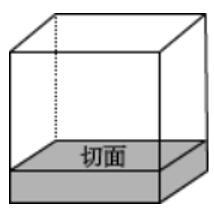{width="1.6611111111111112in"
height="1.6145833333333333in"}[某工厂加工出一批正方体奶酪，抽检时质检员从奶酪中切下了一个厚度为2厘米的长方体（如图所示）。如果剩余奶酪的体积为144立方厘米，则奶酪原本的边长为多少厘米？]{.mark}

[A．4 B．6]{.mark}

[C．8 D．10]{.mark}

**[例题2（2022云南）]{.mark}**

[一件工作由甲、乙、丙三人完成，若甲、乙合作先干10小时，丙再单干1小时可以完成。已知乙单干用的时间比甲多4小时，丙单干用的时间是甲的1/2还多2小时，问甲单干需多少小时？]{.mark}

[A．20 B．25]{.mark}

[C．30 D．35]{.mark}

**[例题3（2023山东）]{.mark}**

[某科研团队中男性占比高于50%，低于60%，问这一团队最少有几人？]{.mark}

[A．5 B．6]{.mark}

[C．7 D．8]{.mark}

-----------------------------------------------------------------------

  **[✎赋值法：]{.mark}**

-----------------------------------------------------------------------

**[例题4（2021山东）]{.mark}**

[X千克甲盐水和Y千克乙盐水中的含盐量相同。将X千克乙盐水与X千克甲盐水混合，并蒸发掉X千克水之后，得到的溶液浓度是乙盐水的Z倍。问乙盐水的浓度是甲盐水的多少倍？]{.mark}

[A．]{.mark}$\frac{1}{Z + 1}$ [B．]{.mark}$\frac{1}{Z - 1}$

[C．]{.mark}$\frac{1}{Z + \frac{X}{Y}}$
[D．]{.mark}$\frac{1}{Z + \frac{Y}{X}}$

**[例题5（2021黑龙江）]{.mark}**

[幼儿园需采购春联、窗花、小狗玩偶三种新年用品，已知大班采购春联7幅，窗花12对，小狗玩偶5个，共花费200元。中班采购对联9幅，窗花19对，小狗玩偶5个，共花费224元。问小班采购春联10幅，窗花10对，小狗玩偶10个需花费多少元？]{.mark}

[A．170 B．176]{.mark}

[C．340 D．352]{.mark}

**[例题6（2023河北）]{.mark}**

[某商品的利润率是20%。如果进货价降低20%，售价保持不变，此时利润率是多少？]{.mark}

[A．40% B．30%]{.mark}

[C．60% D．50%]{.mark}

**[例题7（2018北京）]{.mark}**

[一家电影院的电影票收费标准为50元/次，若购买会员年卡，可享受如下优惠：]{.mark}

----------------------- ------------------------- -------------------------------

   [会员年卡类型]{.mark}   [办卡费用（元）]{.mark}   [每张电影票收费（元）]{.mark}

       [A类]{.mark}              [50]{.mark}                  [40]{.mark}
    
       [B类]{.mark}             [100]{.mark}                  [35]{.mark}
    
       [C类]{.mark}             [200]{.mark}                  [30]{.mark}

----------------------- ------------------------- -------------------------------

[若小李一年内在该电影院观影次数介于10～20次之间，则对于他来说最省钱的方式为哪种？]{.mark}

[A．购买A类会员年卡 B．不购买会员年卡]{.mark}

[C．购买C类会员年卡 D．购买B类会员年卡]{.mark}

**[例题8（2022安徽）]{.mark}**

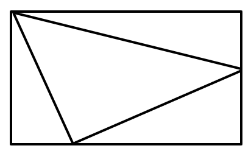{width="2.4090277777777778in"
height="1.479861111111111in"}[某商场为庆祝开业三周年，制作了一个长方形大蛋糕，并切成四块，如图所示。假设这个蛋糕可供350人享用，左下角那块蛋糕平均可供50人享用，右上角那块蛋糕平均可供70人，则中间最大块蛋糕平均可供多少人享用？]{.mark}

[A．150 B．155]{.mark}

[C．175 D．180]{.mark}

-----------------------------------------------------------------------

  **[✎倍数特性：]{.mark}**

-----------------------------------------------------------------------

**[例题9（2017吉林甲级）]{.mark}**

[古希腊数学家丢番图（D.iophA.ntus）的墓志铭：过路人，这儿埋葬着丢番图，他生命的六分之一是童年；再过了一生的十二分之一后，他开始长胡须，又过了一生的七分之一后他结了婚；婚后五年他有了儿子，但可惜儿子的寿命只有父亲的一半，儿子死后，老人在活了四年就结束了余生。根据这个墓志铭，丢番图的寿命为多少？]{.mark}

[A．60 B．84]{.mark}

[C．77 D．63]{.mark}

**[例题10（2017联考）]{.mark}**

[某地举办铁人三项比赛，全程为51.5千米，游泳、自行车、长跑的路程之比为3︰80︰20。小陈在这三个项目花费的时间之比为3︰8︰4，比赛中他长跑的平均速度是15千米/小时，且两次换项共耗时4分钟，那么他完成比赛共耗时多少？]{.mark}

[A．2小时14分钟 B．2小时24分钟]{.mark}

[C．2小时34分钟 D．2小时44分钟]{.mark}

**[例题11（2024浙江）]{.mark}**

[某公司招聘员工，来应聘的男女人数比是18∶17，最后被录取的有280人，其中男女人数比是3∶4，未被录取的男女人数比是6∶5。问同来应聘的共有多少人？]{.mark}

[A．630 B．720]{.mark}

[C．1050 D．1400]{.mark}

-----------------------------------------------------------------------

  **[✎符合常识或图例：]{.mark}**

-----------------------------------------------------------------------

**[例题12（2023安徽）]{.mark}**

[某大型商场的地下停车场入口处横截面如下图所示，入口处斜坡的坡角为30度，下坡起点至入口顶部水平距离为6米，楼板厚为0.6米。商场管理处需在入口处张贴限高标志，以便告知车辆能否安全驶入。若停车场内部的高度均高于入口处汽车可通过的最低高度，则下列限高最为合理的是多少？]{.mark}

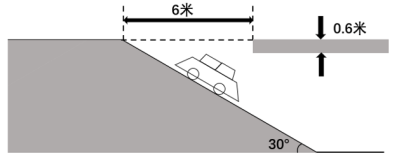{width="3.8680555555555554in"
height="1.575in"}

[A．1.8米 B．2.3米]{.mark}

[C．2.6米 D．3.2米]{.mark}

**[例题13（2022江苏B）]{.mark}**

[小王和小李进行七局四胜的乒乓球比赛，两人水平相当，每局胜对方的概率都是]{.mark}$\frac{1}{2}$[。若前三局过后小王获胜的概率是]{.mark}$\frac{11}{16}$[，则她前三局的胜负情况是？]{.mark}

[A．胜3局 B．胜2局、负1局]{.mark}

[C．负3局 D．胜1局、负2局]{.mark}

**[例题14（2018江苏）]{.mark}**

[如图，在长方形ABCD中，已知三角形ABE、三角形ADF与四边形AECF的面积相等，则三角形AEF与三角形CEF的面积之比是多少？]{.mark}

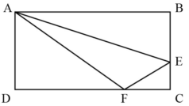{width="2.4472222222222224in"
height="1.3777777777777778in"}

[A．5∶1 B．5∶2]{.mark}

[C．5∶3 D．2∶1]{.mark}

-----------------------------------------------------------------------

  **[✎抓住关键点：]{.mark}**

-----------------------------------------------------------------------

**[例题15（2023国考）]{.mark}**

[在一块正方形土地中，画一条经过某个顶点的规划线，将其分割为三角形和梯形两块土地，且梯形土地的面积正好是三角形土地的2倍。问三角形和梯形土地的周长之比是多少？]{.mark}

[A．]{.mark}$1 : 2$ [B．]{.mark}$5 : 7$

[C．]{.mark}$\left( 1 + \sqrt{5} \right) : \left( 2 + \sqrt{5} \right)$
[D．]{.mark}$\left( 5 + \sqrt{13} \right) : \left( 7 + \sqrt{13} \right)$

**[例题16（2022国考）]{.mark}**

[甲、乙等16人参加乒乓球淘汰赛。每轮对所有未被淘汰选手进行抽签分组两两比赛，胜者进入下一轮。已知除甲以外，其余任意两人比赛时双方胜率均为50%。甲对乙的胜率为0%，对其他14人的胜率均为100%。则甲夺冠的概率为多少？]{.mark}

[A．]{.mark}$\frac{3}{4}$ [B．]{.mark}$\frac{8}{11}$

[C．]{.mark}$\frac{11}{15}$ [D．]{.mark}$\frac{225}{256}$
