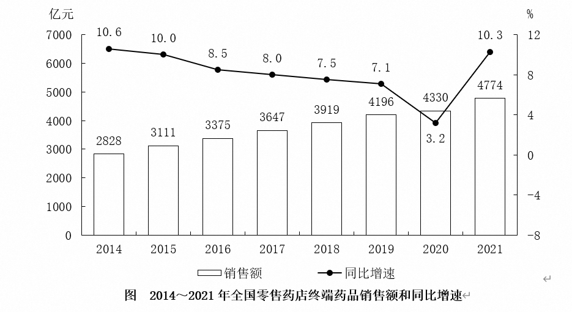
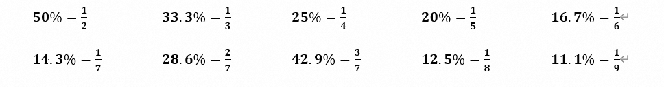
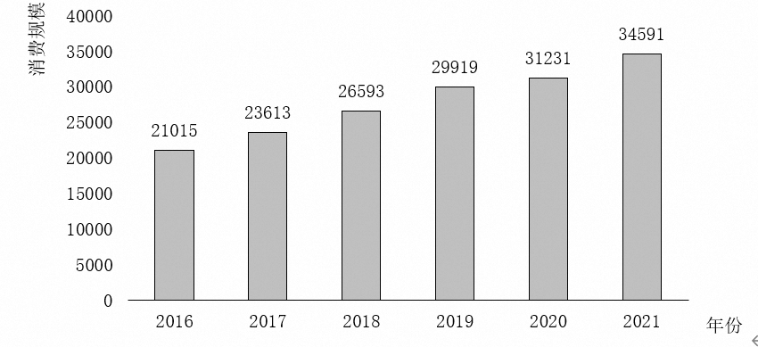
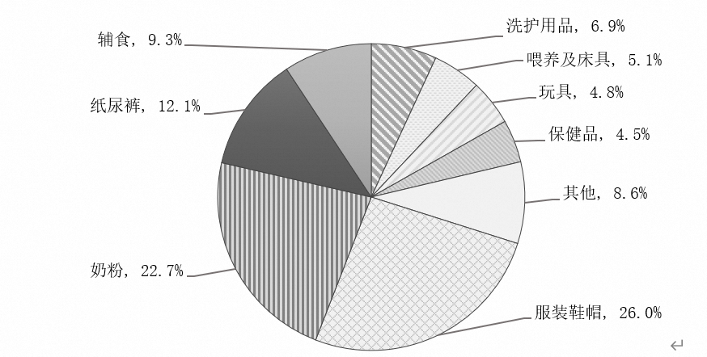

# 第一章　实用速算技巧

## 1.1　加法技巧--尾数法、高位叠加法

**1.1.1**　**尾数法**

在多个数字精确求和或求差时，从“尾数”处入手，为保证精确与速度，一般可观察两位。

**【例1】**

求出2014～2017年全国残疾人康复机构数量之和：

A．29576               B．30217

C．33418               D．36439

**【例2】（2019年安徽特岗）**

2011年，商标局共受理商标注册申请1416785件，同比增长32.1%，再创历史新高，连续十年位居世界第一。其中商标注册网上申请达804926件。

外国来华申请量（包括马德里商标国际注册领土延伸申请）排名前10位的国家或地区分别是美国、日本、韩国、英国、德国、英属维尔京群岛、法国、意大利、瑞士、澳大利亚，申请量分别为26060件、19715件、6318件、5588件、3796件、3461件、3243件、2865件、2124件、2085件，这10个国家或地区的申请量之和占外国在华申请总数的78.5%。

问题：2011年，外国来华商标申请量排名前10位的国家或地区的申请量之和为：

A．75255件              B．75525件

C．76215件              D．79585件

**1.1.2**　**高位叠加**

和我们记忆中的列竖式做加法顺序正相反，高位叠加是从高位加起，抓住问题的主要矛盾。非精确求和或没有选项可以参考时，可以选用高位叠加法。

**图　2014～2021年全国零售药店终端药品销售额和同比增速**

**【例1】**

求出十三五时期全国零售药店终端药品销售额：

**【例2】（2025年湖北选调）**

**图　2023年11月～2024年11月证券期货经营机构资管产品月度备案数量及规模趋势**

问题：2024年上半年，证券期货经营机构共备案私募资管产品:

A．不到4400支            	  B．4400～4500支之间

C．4500～4600支之间          D．超过4600支

## 1.2　减法技巧--分段法

将多位数（三位、四位）的减法分成两段，尽可能保证不用借位；若无法保证不借位，可以用负数代替借位。

**【例题】**

512－481          532－328                721－688

745－372          938－776                822－484

1723－494         245－177                622－478

 **【例1】（2023年国考）**

**表　2021年2～12月各月末固定互联网宽带接入用户数**

| 万户     |                  |          |                             |       |
| -------- | ---------------- | -------- | --------------------------- | ----- |
|          |                  |          |                             |       |
| 接入用户 | 其中：  xDSL用户 | 光纤用户 | 其中：  100Mbps速率以上用户 |       |
| 2月      | 49222            | 296      | 46274                       | 44516 |
| 3月      | 49726            | 295      | 46707                       | 45072 |
| 4月      | 50061            | 293      | 47053                       | 45517 |
| 5月      | 50516            | 292      | 47515                       | 46104 |
| 6月      | 50961            | 290      | 47968                       | 46649 |
| 7月      | 51374            | 290      | 48416                       | 47173 |
| 8月      | 51865            | 290      | 48921                       | 47710 |
| 9月      | 52629            | 291      | 49643                       | 48450 |
| 10月     | 53146            | 290      | 50077                       | 49026 |
| 11月     | 53540            | 288      | 50466                       | 49557 |
| 12月     | 53579            | 283      | 50551                       | 49848 |

问题：2021年下半年，我国固定互联网宽带接入用户中，光纤用户数增量超过500万户的月份有几个：

A．2                 B．3

C．4                 D．5

**【例2】（2022年联考）**

**表　2011～2020年全国城市生活垃圾无害化处理状况**

|        | 总清运量  （万吨） | 无害化处理场  （座） | 无害化处理能力  （万吨/日） | 无害化处理量  （万吨） |
| ------ | ------------------ | -------------------- | --------------------------- | ---------------------- |
| 2011年 | 16395              | 677                  | 40.91                       | 13090                  |
| 2012年 | 17081              | 701                  | 44.63                       | 14490                  |
| 2013年 | 17239              | 765                  | 49.23                       | 15394                  |
| 2014年 | 17860              | 818                  | 53.35                       | 16394                  |
| 2015年 | 19142              | 890                  | 57.69                       | 18013                  |
| 2016年 | 20362              | 940                  | 62.14                       | 19674                  |
| 2017年 | 21521              | 1013                 | 67.99                       | 21034                  |
| 2018年 | 22802              | 1091                 | 76.62                       | 22565                  |
| 2019年 | 24206              | 1183                 | 86.99                       | 24013                  |
| 2020年 | 23512              | 1287                 | 96.35                       | 23452                  |

问题：2012～2020年间，全国城市生活垃圾无害化处理量同比增长超过1200万吨的年份有几个：

A．4                 B．5

C．6                 D．7

## 1.3　乘法技巧--小分互换法、拆分法、放缩法

**1.3.1**　**小分互换**

若乘法中有某个乘数可以近似的转化为某个常见分数，我们可以将多位数乘法转化为简单除法计算;

一个数字乘以5、25、125，可转化为除2、4、8.

 

**需记忆的常用小数如下：**

**【例题】**

784×25%          632×12.5%                20%×455

727×16.7%         981×33.3%                50%×472

**1.3.2**　**乘法拆分**

若乘法中有某个乘数为百分数且能拆成两个简单数值（50%、10%、5%等），我们可以将该百分数拆成两部分相乘，要擅用“1%”（“一个包子”）。

**常用的小数拆分如下：**

45%＝50%－5%	55%＝50%＋5% 	15%＝10%＋5%  

60%＝50%＋10% 	95%＝1－5% 	90%＝1－10%   

及所有50%、100%附近的数等。

 

**【例题】**

382×55%          492×48%                936×45%

592×97%          1228×95%                766×103%

**【例1】**

62851×97.2%＝？

A．60671               B．61091

C．61692               D．62052

**【例2】**

42815×93.1%＝？

A．41481               B．40819

C．39861               D．39012

**【例3】（2023年青海）**

**图1　中国母婴商品消费规模（单位：亿元）**

问题：2021年，我国消费最多的母婴商品金额约为：

A．9638亿元              B．8994亿元

C．7852亿元              D．4186亿元

**1.3.3**　**乘法放缩**

若乘法中有某个乘数可以拆分为整百×（1）时，可使用乘法结果放缩简化运算。

 

**【例题】**

212×332          315×571           428×325

 

 

 

782×617           865×408           568×330

 

 

 

 

 

 

## 1.4　除法技巧--拆分法、放缩法

**1.4.1**　**拆分法**

拆分法是对直除的“优化”，可借助选项“猜”出答案，**尤其适合分子位数小于等于分母的除法计算**。

**拆分法具体应用：**

一、如果分子在分母的50%附近，先拆出50%；

二、如果分数大小约等于1（分子分母相差不大），可先拆出100%；

三、如果分子很小，可根据实际情况拆出10%或5%或1%；

**【例1】50%左右**

250÷484          333÷642                488÷912

 

 

 

143÷247          200÷384                121÷292

 

 

 

**【例2】100%左右**

450÷484          633÷642                888÷912

 

 

 

252÷247          360÷344                261÷292

 

 

 

**【例3】1%-20%左右**

50÷484          33÷642                88÷912

 

 

 

 

36÷242          30÷384                41÷292

 

 

 

**【例4】实战演练**

47598÷89894＝？

A．54.9%             B．56.5%

C．52.9%             D．51.2%

 

 

 

43256÷357951＝？

A．8.5%              B．10.9%

C．12.1%             D．13.6%

 

 

 

32503÷33546＝？

A．94.1%             B．95.5%

C．96.9%             D．98.5%

 

 

 

**1.4.2**　**除法放缩**

除法放缩的原理：分子分母同时扩大或缩小相同的幅度，分式不变。

除法放缩的适用范围：

①分母接近整百；

②多个数乘除中分子分母接近整数倍。

   

**【例1】**
$$
\frac{858}{981}
$$

 

 

 

 
