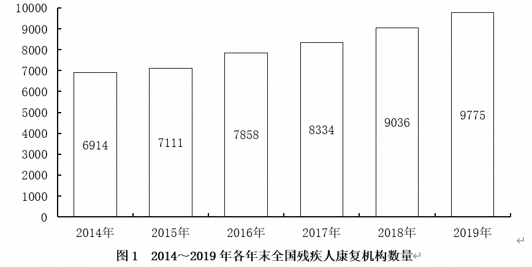

# 第一章　实用速算技巧

## 1.1　加法技巧--尾数法、高位叠加法

**1.1.1**　**尾数法**

在多个数字精确求和或求差时，从“尾数”处入手，为保证精确与速度，一般可观察两位。



**【例1】**

求出2014～2017年全国残疾人康复机构数量之和：

A．29576               B．30217

C．33418               D．36439

**【例2】（2019年安徽特岗）**

​	2011年，商标局共受理商标注册申请1416785件，同比增长32.1%，再创历史新高，连续十年位居世界第一。其中商标注册网上申请达804926件。

​	外国来华申请量（包括马德里商标国际注册领土延伸申请）排名前10位的国家或地区分别是美国、日本、韩国、英国、德国、英属维尔京群岛、法国、意大利、瑞士、澳大利亚，申请量分别为26060件、19715件、6318件、5588件、3796件、3461件、3243件、2865件、2124件、2085件，这10个国家或地区的申请量之和占外国在华申请总数的78.5%。

问题：2011年，外国来华商标申请量排名前10位的国家或地区的申请量之和为：

A．75255件              B．75525件

C．76215件              D．79585件

**1.1.2**　**高位叠加**

和我们记忆中的列竖式做加法顺序正相反，高位叠加是从高位加起，抓住问题的主要矛盾。非精确求和或没有选项可以参考时，可以选用高位叠加法。


**图　2014～2021年全国零售药店终端药品销售额和同比增速**

**【例1】**

求出十三五时期全国零售药店终端药品销售额：

**【例2】（2025年湖北选调）**


**图　2023年11月～2024年11月证券期货经营机构资管产品月度备案数量及规模趋势**

问题：2024年上半年，证券期货经营机构共备案私募资管产品:

A．不到4400支            	  B．4400～4500支之间

C．4500～4600支之间          D．超过4600支


## 1.2　减法技巧--分段法

将多位数（三位、四位）的减法分成两段，尽可能保证不用借位；若无法保证不借位，可以用负数代替借位。

**【例题】**

512－481          532－328                721－688

745－372          938－776                822－484

1723－494         245－177                622－478


 **【例1】（2023年国考）**

**表　2021年2～12月各月末固定互联网宽带接入用户数**

| 万户     |                  |          |                             |       |
| -------- | ---------------- | -------- | --------------------------- | ----- |
|          |                  |          |                             |       |
| 接入用户 | 其中：  xDSL用户 | 光纤用户 | 其中：  100Mbps速率以上用户 |       |
| 2月      | 49222            | 296      | 46274                       | 44516 |
| 3月      | 49726            | 295      | 46707                       | 45072 |
| 4月      | 50061            | 293      | 47053                       | 45517 |
| 5月      | 50516            | 292      | 47515                       | 46104 |
| 6月      | 50961            | 290      | 47968                       | 46649 |
| 7月      | 51374            | 290      | 48416                       | 47173 |
| 8月      | 51865            | 290      | 48921                       | 47710 |
| 9月      | 52629            | 291      | 49643                       | 48450 |
| 10月     | 53146            | 290      | 50077                       | 49026 |
| 11月     | 53540            | 288      | 50466                       | 49557 |
| 12月     | 53579            | 283      | 50551                       | 49848 |

问题：2021年下半年，我国固定互联网宽带接入用户中，光纤用户数增量超过500万户的月份有几个：

A．2                 B．3

C．4                 D．5

**【例2】（2022年联考）**

**表　2011～2020年全国城市生活垃圾无害化处理状况**

|        | 总清运量  （万吨） | 无害化处理场  （座） | 无害化处理能力  （万吨/日） | 无害化处理量  （万吨） |
| ------ | ------------------ | -------------------- | --------------------------- | ---------------------- |
| 2011年 | 16395              | 677                  | 40.91                       | 13090                  |
| 2012年 | 17081              | 701                  | 44.63                       | 14490                  |
| 2013年 | 17239              | 765                  | 49.23                       | 15394                  |
| 2014年 | 17860              | 818                  | 53.35                       | 16394                  |
| 2015年 | 19142              | 890                  | 57.69                       | 18013                  |
| 2016年 | 20362              | 940                  | 62.14                       | 19674                  |
| 2017年 | 21521              | 1013                 | 67.99                       | 21034                  |
| 2018年 | 22802              | 1091                 | 76.62                       | 22565                  |
| 2019年 | 24206              | 1183                 | 86.99                       | 24013                  |
| 2020年 | 23512              | 1287                 | 96.35                       | 23452                  |

问题：2012～2020年间，全国城市生活垃圾无害化处理量同比增长超过1200万吨的年份有几个：

A．4                 B．5

C．6                 D．7


## 1.3　乘法技巧--小分互换法、拆分法、放缩法

**1.3.1**　**小分互换**

若乘法中有某个乘数可以近似的转化为某个常见分数，我们可以将多位数乘法转化为简单除法计算;

一个数字乘以5、25、125，可转化为除2、4、8.

 

**需记忆的常用小数如下：**


**【例题】**

784×25%          632×12.5%                20%×455

727×16.7%         981×33.3%                50%×472


**1.3.2**　**乘法拆分**

若乘法中有某个乘数为百分数且能拆成两个简单数值（50%、10%、5%等），我们可以将该百分数拆成两部分相乘，要擅用“1%”（“一个包子”）。

**常用的小数拆分如下：**

45%＝50%－5%	55%＝50%＋5% 	15%＝10%＋5%  

60%＝50%＋10% 	95%＝1－5% 	90%＝1－10%   

及所有50%、100%附近的数等。

 

**【例题】**

382×55%          492×48%                936×45%

592×97%          1228×95%                766×103%


**【例1】**

62851×97.2%＝？

A．60671               B．61091

C．61692               D．62052


**【例2】**

42815×93.1%＝？

A．41481               B．40819

C．39861               D．39012


**【例3】（2023年青海）**


**图1　中国母婴商品消费规模（单位：亿元）**


问题：2021年，我国消费最多的母婴商品金额约为：

A．9638亿元              B．8994亿元

C．7852亿元              D．4186亿元


**1.3.3**　**乘法放缩**

若乘法中有某个乘数可以拆分为整百×（1）时，可使用乘法结果放缩简化运算。

 

**【例题】**

212×332          315×571           428×325

 

 

 

782×617           865×408           568×330

 

 

 

 

 

 

## 1.4　除法技巧--拆分法、放缩法

**1.4.1**　**拆分法**

拆分法是对直除的“优化”，可借助选项“猜”出答案，**尤其适合分子位数小于等于分母的除法计算**。

**拆分法具体应用：**

一、如果分子在分母的50%附近，先拆出50%；

二、如果分数大小约等于1（分子分母相差不大），可先拆出100%；

三、如果分子很小，可根据实际情况拆出10%或5%或1%；

**【例1】50%左右**

250÷484          333÷642                488÷912

 

 

 

143÷247          200÷384                121÷292

 

 

 

**【例2】100%左右**

450÷484          633÷642                888÷912

 

 

 

252÷247          360÷344                261÷292

 

 

 

**【例3】1%-20%左右**

50÷484          33÷642                88÷912

 

 

 

 

36÷242          30÷384                41÷292

 

 

 

**【例4】实战演练**

47598÷89894＝？

A．54.9%             B．56.5%

C．52.9%             D．51.2%


43256÷357951＝？

A．8.5%              B．10.9%

C．12.1%             D．13.6%

32503÷33546＝？

A．94.1%             B．95.5%

C．96.9%             D．98.5%


**1.4.2**　**除法放缩**

除法放缩的原理：分子分母同时扩大或缩小相同的幅度，分式不变。

除法放缩的适用范围：

①分母接近整百；

②多个数乘除中分子分母接近整数倍。

   

**【例1】**


 

 

##  1.5　基础概念介绍--ABRX四量关系

**1.5.1**　**名词解释**

**基期和现期：**

基期（A）：表示的是在比较两个时期的变化时，用来做比较值（基准值）的时期；

现期（B）：相对于基期而言，是当前所处的时期。

 

**※【注】与谁相比，谁为基期。**

 

**增长量和增长率：**

增长量（X）：表示的是现期与基期之间的绝对差值，是一绝对量。

增长率（R）：表示的是现期与基期之间的相对差异，是一相对量。

在一般情况下，“增长率”等价于“增长速度（增速）”等价于“增长幅度（增幅）”。

**【例】**

2019年11月份，社会消费品零售总额38094亿元，比2018年11月份增长8.0%。其中，城镇消费品零售额32345亿元，比2018年11月份增长2355亿元。

问题：指出上述材料中的现期、基期、增长量、增长率。


**1.5.2**　**ABRX四量之间的关系**

一、已知：基期A现期B


二、已知：基期A增长量X


三、已知：现期B增长量X


四、已知：现期B增长率R


五、已知：基期A增长率R


六、已知：增长量X增长率R


## 1.6　速算技巧--415份数法

**1.6.1**　**方法介绍**

415份数法是将数量关系转化为份数比例关系，从而简化计算。

415份数法中“415”分别代表基期、变化量、现期的份数。

 

**【例】**若增长率为25%（25%＝1/4），为方便计算我们可以将基期设为4份，变化量X＝AR＝1份，现期为基期和变化量的和，即为5份。则基期、变化量、现期的份数分别为4、1、5。这也是415份数法名字的由来。

 

 

**需记忆的常用小数如下：**

```
50%=1/2	
33.3%=1/3 
25%=1/4 
20%=1/5 
16.7%=1/6 
14.3%=1/7 
28.6%=2/7	
42.9%=3/7 
12.5%=1/8	
11.1%=1/9
9.1%=1/11 
```

 

 **需注意：**

①需要特别注意的是，增长率为负数时变化量a也为负数，此时“415份数法”即变成“4（－1）3份数法”。

②很多时候增长率R并不与某个分数完全相等，而是将R近似的看成某个分数。估算必然会产生误差，对于估算出的一份量，规则为“估大则一份变大、估小则一份变小”（把23%估算成1/4，即是估大了，则求出的一份量比实际量要大：把23%估算成1/5，即是估小了，则求出的一份量比实际量要小）。

 

**1.6.2**　**方法演练**

现期B＝780，增长率R＝25.1%，请求出基期A和变化量X。

 

 

 

现期B＝844，增长率R＝-20%，请求出基期A和变化量X。

 

 

 

现期B＝455，增长率R＝16.7%，请求出基期A和变化量X。

 

 

 

现期B＝954，增长率R＝-14.4%，请求出基期A和变化量X。

 

 现期B＝4567，增长率R＝11.1%，请求出基期A和变化量X。

 

 

 

现期B＝144，增长率R＝-9.1%，请求出基期A和变化量X。

 

 

 

**1.6.3**　**误差修正**

在415份数法的基础上进行修正求出变化量或基期A。

**使用时机：**增长率大于10%，选项差距在2%以上最为适用。

**核心结论：**修正幅度表。（此结论有严谨的推导过程，由于比较复杂便不介绍）


**使用步骤**：X=X'·（）。当＞时用加法，当时用减法。

 

 

```
：X=X'·（1±R_修）。当R_原式＞R_百化分时用加法，当R_原式＜R_百化分时用减法。
```

 

现期B＝7432，增长率R＝17.5%，请求出变化量X。

 

现期B＝5649，增长率R＝22.4%，请求出变化量X。

 

 

 

现期B＝6874，增长率R＝35.6%，请求出变化量X。

 

 

 

现期B＝2468，增长率R＝53.6%，请求出变化量X。

 

 

 

现期B＝1842，增长率R＝63.5%，请求出变化量X。

 

 

 

现期B＝4982，增长率R＝97.8%，请求出变化量X。

 

 

 

**【例1】（2020年云南）**

2019年6月，全国发行地方政府债券8996亿元，同比增长68.37%，环比增长195.63%。其中，发行一般债券3178亿元，同比减少28.33%，环比增长117.08%，发行专项债券5818亿元，……。

问题：2019年6月，全国发行的地方政府债券比2018年6月多约：

A．6151亿元              B．5953亿元

C．3653亿元              D．3043亿元

 

 

 

 

 

 

**【例2】（2017年联考）**

按经营单位所在地分，2016年6月份，城镇消费品零售额23082亿元，同比增长10.5%；乡村消费品零售额3775亿元，同比增长11.2%。1～6月份，城镇消费品零售额134249亿元，同比增长10.2%；乡村消费品零售额21889亿元，同比增长11%。

问题：2016年6月份，城镇消费品零售额比上年同期增加：

A．380亿元              B．2169亿元

C．1193亿元              D．2193亿元

 

 

 

 

## 1.7　速算技巧--假设分配法

**1.7.1**　**方法介绍**

假设分配的核心思想和拆分一样，都是“抓大放小”，将“大数”分完，“小数”有误差也不影响结果了。

 

**核心公式：**X＝AR；使用步骤：确定分配数，画出分配树。

 

 

**假设分配最后一步分配方法：**

| **R****的大小** | **方法**                         |
| --------------- | -------------------------------- |
| R在30%以下      | 用此时被分配数的10%、20%上下修正 |
| R在33%左右      | X=B/4                            |
| R=42.9%左右     | X=0.3B                           |
| R在50%左右      | X=B/3                            |
| R在66%左右      | X=0.4B                           |
| R在80%-100%以上 | X=B/2                            |

**1.7.2**　**方法演练**

现期B＝128/138/148，增长率R＝4.2%，请求出基期A和变化量X。

 

 

 

现期B＝702/802/902，增长率R＝8.2%，请求出基期A和变化量X。

 

 

 

现期B＝522/622/722，增长率R＝12.3%，请求出基期A和变化量X。

 

 

 

现期B＝572/672/772，增长率R＝16.4%，请求出基期A和变化量X。

 

 

 

现期B＝585/685/785，增长率R＝22.2%，请求出基期A和变化量X。

 

 

 

现期B＝536/636/736，增长率R＝26.1%，请求出基期A和变化量X。

 

 

 

现期B＝445/545/645，增长率R＝34.2%，请求出基期A和变化量X。

 

 

 

现期B＝362/462/562，增长率R＝54.2%，请求出基期A和变化量X。

 

现期B＝685/785/885，增长率R＝67%，请求出基期A和变化量X。

 

 

 

现期B＝375/475/575，增长率R＝86%，请求出基期A和变化量X。

 

 

 

**【例1】（2023年联考）**

2021年，全国城市供水总量673.34亿立方米，同比增长6.96%；城市供水管道长度105.99万公里，同比增长5.26%；……

问题1：2021年全国城市供水管道长度比2020年增长约：

A．5万公里              B．5.3万公里

C．5.6万公里             D．6万公里


问题2：2020年，全国城市供水总量约为：

A．600亿立方米            B．620亿立方米

C．630亿立方米            D．724亿立方米


**【例2】（2023年联考）**

2022年1～7月，全社会用电量累计49303亿千瓦时，同比增长3.4%。分产业看，……。7月份，全社会用电量8324亿千瓦时，同比增长6.3%。……。

问题：2021年1～6月全社会用电量累计约多少亿千瓦时：

A．38258               B．39851

C．40472               D．41279

 

 

**1.7.3**　**选项极近时的假设思维**

选项极其相近时，反而可利用选项进行计算。

**【例1】（2018年重庆市考）**


问：2018年1～5月，粮油、食品类商品零售额同比增加多少亿元：

A．70                 B．70.6

C．463.8               D．465

**【例2】（2018年陕西省考）**


问：2017年全国规模以上文化及相关产业企业营业收入合计数比2016年增加了大约(  )亿元。

A．8936                B．8963

C．9836                D．9863

 

**【例3】（2015年深圳市考）**

城镇居民生活质量提高。城镇居民人均可支配收入为14265元，比上年增长17.0%，扣除物价上涨因素后，实际增长12.1%。其中......

问：2007年城镇居民人均可支配收入比上年增加了( )元。

A．2072.7               B．2065.7

C．2425.1               D．2467.9

 

**【例4】（2024年河北省考）**

2022年，我国废钢铁、废有色金属等十个品种（详见表格）再生资源回收总重量约为37067.7万吨，同比下降2.62%，回收总金额约为13140.6亿元，同比下降4.05%.

问：相比2021年，2022年我国十个品种再生资源回收总金额同比下降了约：

A．511亿元            B．532亿元

C．555亿元            D．578亿元
